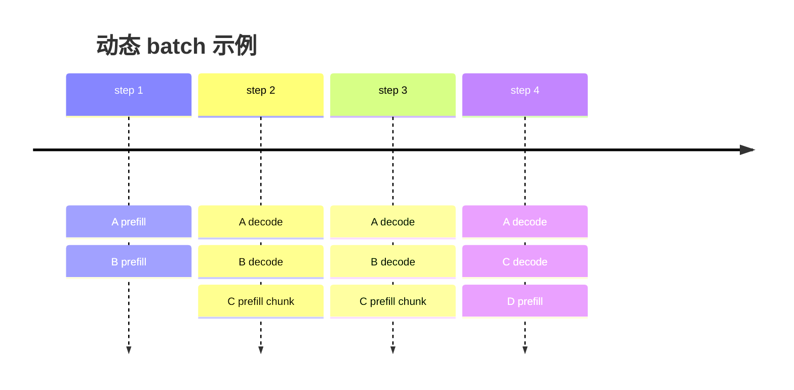
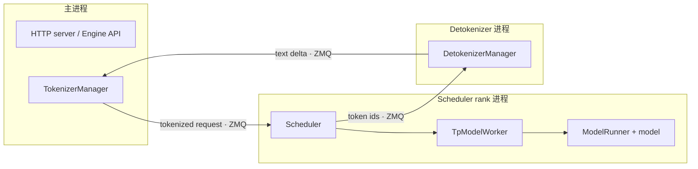

# SGLang Runtime：推理循环与进程边界

语言模型一次 forward 只为给定位置计算 hidden state 和 logits。长 prompt 可以并行计算很多位置；输出却依赖刚刚采样的 token，必须一轮轮继续。SGLang 的 Runtime 就是持续组织这些轮次的系统。

## Prefill 与 decode

给 prompt token (x_{1:L})，模型先计算：

$$
p(x_{L+1}\mid x_{1:L})
$$

并为 prompt 各层写入 K/V。随后采样出 (x_{L+1})，下一轮才可计算 (x_{L+2})。

| 阶段 | 本轮新算位置 | 复用历史 | 常见系统特性 |
| --- | ---: | --- | --- |
| prefill / extend | 多个 prompt 或未缓存后缀 token | 可命中 radix prefix | 计算量大，影响 TTFT |
| decode | 通常每请求 1 个新位置 | 读取整段历史 KV | 小矩阵、带宽和 launch 敏感 |

SGLang 源码常用 `extend`，因为一次 forward 不只用于“全新 prompt”：prefix cache 已命中前半段时，它只扩展未缓存后缀；chunked prefill 时也只扩展本 chunk。

## 为什么不能每个请求独占一次生成循环

若请求 A 输出 200 token、B 输出 20 token，静态 batch 会让 B 完成后留下空位。连续批处理每个 step 重新选择活跃请求：



这里的 batch 是一次 forward 的临时集合，不是请求永久归属。Scheduler 持有跨 step 的 `Req`，`ScheduleBatch` 只描述当前轮。

## 三个核心进程为什么分开

固定提交中 [`Engine`](https://github.com/sgl-project/sglang/blob/c879f3da5ceaaef3cb197c4e59ce683d420ce96c/python/sglang/srt/entrypoints/engine.py#L183) 的说明直接给出基本拓扑：



- **TokenizerManager**：输入校验、chat template/tokenization、请求异步状态、结果路由和 abort。
- **Scheduler**：请求队列、调度、RadixCache、内存池和一个 GPU rank 的模型 worker。
- **DetokenizerManager**：增量 detokenization，避免 Scheduler 用 CPU 文本处理阻塞 GPU 控制循环。

关键点：SGLang 的 Scheduler 不只是“发命令的 CPU 服务”。每个 scheduler rank 进程还构造 `TpModelWorker → ModelRunner → model`，通常拥有一张 GPU。

## 一个普通 step 做什么

[`Scheduler.run_event_loop()`](https://github.com/sgl-project/sglang/blob/c879f3da5ceaaef3cb197c4e59ce683d420ce96c/python/sglang/srt/managers/scheduler.py#L1457) 最小化后是：

```text
接收进程间消息
→ 把新请求/控制消息变成内部状态
→ get_next_batch_to_run()
→ run_batch()
→ process_batch_result()
→ 输出 token 或清理完成请求
```

`get_next_batch_to_run()` 通常先尝试组成新的 prefill batch；没有合适 prefill 时，再更新并运行 decode batch。实际代码还要处理 chunk、speculative、PD 和各种模型模式，但第一遍先保留这个骨架。

## Overlap scheduling 重叠了什么

默认配置通常启用 overlap scheduler。普通循环必须先等本轮 GPU 结果，再处理结果并准备下一轮；overlap 路径利用独立 stream、future/result queue，让 CPU 处理上轮结果时，下一轮 GPU forward 已经提交。

```mermaid
gantt
    title 普通与 overlap 的概念时间线
    dateFormat X
    axisFormat %L
    section 普通
    GPU step n       :a1, 0, 4
    CPU result n     :a2, after a1, 2
    GPU step n+1     :a3, after a2, 4
    section overlap
    GPU step n       :b1, 0, 4
    CPU result n     :b2, after b1, 2
    GPU step n+1     :b3, 4, 4
```



它不是让有数据依赖的 decode step 随意并行，也不是保证所有 CPU 开销被隐藏。batch 形态、采样结果依赖、stream 同步和某些高级特性都会限制重叠。

## Token budget 比 batch size 更准确

prefill 请求可能一次新增几千 token，decode 请求通常只新增一个。仅说“batch size=32”无法表达工作量。调度器需要同时约束：

- 本轮可计算 token 数；
- KV cache 可分配 slot；
- 请求与输入长度限制；
- chunked prefill 的 chunk；
- CUDA Graph/attention backend 支持的 shape；
- speculative token 数和模型特例。

因此性能分析必须记录输入与输出长度分布，而不能只记录并发请求数。

## API、Runtime 与模型不是一层

| 层 | 可替换内容 | 不能据此推断 |
| --- | --- | --- |
| API | OpenAI、native `/generate`、offline `Engine` | handler 决定 GPU batch |
| Runtime | 调度策略、cache、内存池、并行部署 | 所有模型共享同一 kernel |
| Model execution | attention/sampling backend、量化、CUDA Graph | backend 改变请求语义 |

这也是读源码时应先走 SRT 主线、最后再下钻 kernel 的理由。

## 手工练习

假设本轮预算 8 个 token：

- A：已完成 prefill，decode 需要 1；
- B：未缓存后缀 6；
- C：未缓存后缀 5。

不要直接给唯一答案。分别讨论：先 prefill、保持 decode ITL、公平性、chunked prefill 启用时会怎样。调度策略的价值正是在多个合理目标之间选择。

## 通关检查

你应能解释：

1. 为什么 `extend_len` 不总等于完整 prompt 长度；
2. 为什么同一 `Req` 会进入许多不同 `ScheduleBatch`；
3. Scheduler 与 ModelRunner 为什么在同一 rank 进程；
4. detokenization 为什么不放在 GPU 调度循环中；
5. overlap scheduling 隐藏的是哪一段时间。

下一步用[RadixAttention](./radix-attention)理解 SGLang 最有辨识度的缓存模型。
