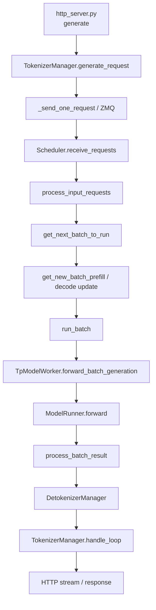

# SGLang 源码地图：沿一个请求走，不按目录背类名

SGLang 的一个 `Scheduler` 文件就包含数千行，并且混合了普通生成、embedding、speculative、PD、DP attention 等路径。有效的第一遍不是从头读完，而是只追一个普通文本请求，再按问题向外扩。

## 目录不是阅读顺序

```text
python/sglang/srt/
├── entrypoints/
│   ├── http_server.py           # FastAPI/native/OpenAI 路由与服务启动
│   └── engine.py                # Engine API、进程启动和握手
├── managers/
│   ├── tokenizer_manager.py     # 输入处理、请求异步状态、结果路由
│   ├── scheduler.py             # 调度循环、缓存和 GPU worker 的主人
│   ├── schedule_batch.py        # Req / ScheduleBatch 数据结构
│   ├── schedule_policy.py       # LPM、FCFS 等优先级和 PrefillAdder
│   ├── detokenizer_manager.py   # token ids → 文本增量
│   ├── tp_worker.py             # Scheduler 到 ModelRunner 的桥
│   └── io_struct.py             # 进程间消息契约
├── mem_cache/
│   ├── radix_cache.py           # 压缩 radix tree
│   ├── memory_pool.py           # request slot → token KV index
│   └── allocator/token.py       # 物理 KV slot 分配
├── model_executor/model_runner.py
└── layers/radix_attention.py    # attention layer wrapper，不是 radix tree
```

## 最短请求调用链



固定源码入口：

- [`/generate` route`](https://github.com/sgl-project/sglang/blob/c879f3da5ceaaef3cb197c4e59ce683d420ce96c/python/sglang/srt/entrypoints/http_server.py#L814)
- [`TokenizerManager.generate_request()`](https://github.com/sgl-project/sglang/blob/c879f3da5ceaaef3cb197c4e59ce683d420ce96c/python/sglang/srt/managers/tokenizer_manager.py#L612)
- [`Scheduler`](https://github.com/sgl-project/sglang/blob/c879f3da5ceaaef3cb197c4e59ce683d420ce96c/python/sglang/srt/managers/scheduler.py#L301)
- [`get_next_batch_to_run()`](https://github.com/sgl-project/sglang/blob/c879f3da5ceaaef3cb197c4e59ce683d420ce96c/python/sglang/srt/managers/scheduler.py#L2618)
- [`run_batch()`](https://github.com/sgl-project/sglang/blob/c879f3da5ceaaef3cb197c4e59ce683d420ce96c/python/sglang/srt/managers/scheduler.py#L3220)
- [`ModelRunner.forward()`](https://github.com/sgl-project/sglang/blob/c879f3da5ceaaef3cb197c4e59ce683d420ce96c/python/sglang/srt/model_executor/model_runner.py#L1135)

## 第一遍：只追进程和消息

记录当前代码在哪个进程执行，以及跨边界的数据类型：

| 边界 | 常见消息 | 通道 |
| --- | --- | --- |
| TokenizerManager → Scheduler | tokenized generate/embedding/control request | ZMQ |
| Scheduler → DetokenizerManager | token ids、rid、完成状态、可选 logprob | ZMQ |
| DetokenizerManager → TokenizerManager | 文本增量与 metadata | ZMQ |
| Scheduler → ModelRunner | `ScheduleBatch` 转 `ForwardBatch` | 同进程 Python 调用 |
| TP ranks 之间 | 参数切片、attention/MLP collective | torch distributed / backend |

第一遍不要展开具体 attention backend。你只需证明 Scheduler 和 ModelRunner 在同一 scheduler rank 进程中，而 tokenizer/detokenizer 在其他进程。

## 第二遍：只追一个 `rid`

围绕 [`Req`](https://github.com/sgl-project/sglang/blob/c879f3da5ceaaef3cb197c4e59ce683d420ce96c/python/sglang/srt/managers/schedule_batch.py#L677) 记录：

- 原始与 token 化输入；
- `output_ids` 怎样逐轮增长；
- `prefix_indices` 与 `last_node` 何时由 cache match 填入；
- `req_pool_idx` 何时分配和释放；
- finished condition 由谁判断；
- abort 时哪些队列、pool 与 lock 必须清理。

只追一个 `rid`，不要把动态 batch 误认为请求身份丢失。batch 是暂时的执行容器，`Req` 才是跨 step 状态。

## 第三遍：只追三种索引

| 索引 | 含义 | 所在对象 |
| --- | --- | --- |
| 请求内 token position | 逻辑序列的第几个 token | `Req` / `seq_lens` |
| request pool row | 哪一行保存该请求的映射 | `req_pool_idx` |
| token/KV slot | 实际 KV tensor 的物理位置 | `prefix_indices`、`out_cache_loc` |

把这三种索引画成箭头，才进入 [`RadixCache`](https://github.com/sgl-project/sglang/blob/c879f3da5ceaaef3cb197c4e59ce683d420ce96c/python/sglang/srt/mem_cache/radix_cache.py#L280)、[`ReqToTokenPool`](https://github.com/sgl-project/sglang/blob/c879f3da5ceaaef3cb197c4e59ce683d420ce96c/python/sglang/srt/mem_cache/memory_pool.py#L238) 和 [`TokenToKVPoolAllocator`](https://github.com/sgl-project/sglang/blob/c879f3da5ceaaef3cb197c4e59ce683d420ce96c/python/sglang/srt/mem_cache/allocator/token.py#L28)。

## 问题到文件的索引

| 你要回答的问题 | 首要文件 | 关键对象/函数 |
| --- | --- | --- |
| 服务创建哪些进程？ | `entrypoints/engine.py` | `_launch_subprocesses` |
| 输入怎样变成 `Req`？ | `tokenizer_manager.py`、`scheduler.py` | `generate_request`、input dispatcher |
| 谁先被调度？ | `schedule_policy.py` | `SchedulePolicy.calc_priority` |
| 新 prefill 能否进 batch？ | `schedule_policy.py` | `PrefillAdder.add_one_req` |
| 前缀怎样命中和分裂？ | `radix_cache.py` | `match_prefix`、`_match_prefix_helper` |
| KV slot 怎样分配？ | `memory_pool.py`、`allocator/token.py` | pool allocate/free |
| 本轮张量如何准备？ | `schedule_batch.py`、`forward_batch_info.py` | `ScheduleBatch`、`ForwardBatch` |
| 模型在哪里 forward？ | `model_runner.py` | `ModelRunner.forward` |
| overlap 做了什么？ | `scheduler.py` | `event_loop_overlap` |
| DP 请求怎么路由？ | `data_parallel_controller.py` | `DataParallelController` |

## 推荐的本地搜索

```bash
rg -n "def generate_request|def get_next_batch_to_run|def run_batch" python/sglang/srt
rg -n "class Req|class ScheduleBatch|class ForwardBatch" python/sglang/srt
rg -n "match_prefix|cache_finished_req|cache_unfinished_req" python/sglang/srt/mem_cache
```

搜索是为了建立调用链，不是统计匹配数量。每找到一个函数，写下“输入对象、输出对象、当前进程、可变状态”四列。

## 本课产出

画一张不超过 14 个节点的调用链，必须包含：

```text
/generate → generate_request → Scheduler → prefix match
→ ScheduleBatch → ModelRunner.forward → process result
→ DetokenizerManager → TokenizerManager → client
```

再选择一个 `rid`，写出它的 request slot 与前三个 KV slot。下一节进入[推理循环与进程边界](../fundamentals/runtime)。
