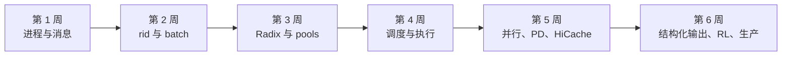

# SGLang 六周源码实战计划

这份计划的终点不是背出类名，而是完成六件可以被别人复查的作品：进程图、请求 trace、缓存账本、调度实验、分布式部署记录和 RL 权重切换演练。所有源码结论固定到提交 [`c879f3d`](https://github.com/sgl-project/sglang/tree/c879f3da5ceaaef3cb197c4e59ce683d420ce96c)，命令则先用本机 `--help` 对照实际安装版本。

## 开始前：建立证据目录

在自己的实验目录保存以下内容；课程仓库无需复制 SGLang 源码：

```text
sglang-lab/
├── ENVIRONMENT.md       # GPU、driver、CUDA、PyTorch、镜像/包/commit
├── commands/            # 每次完整启动与 benchmark 命令
├── logs/                # server、client、NCCL/Ray 日志
├── results/             # bench JSONL、Prometheus 快照
├── traces/              # profiler trace
└── notes/               # rid trace、状态表、结论与反例
```

固定源码准备：

```bash
git clone https://github.com/sgl-project/sglang.git
cd sglang
git checkout c879f3da5ceaaef3cb197c4e59ce683d420ce96c
git status --short
git rev-parse HEAD
```

验收：最后一条必须输出完整固定 commit，`git status --short` 必须为空。若为当前 wheel 做实验，另存 wheel 版本与 `inspect.getsourcefile(Scheduler)`；不能用固定源码解释另一版本的默认行为。

## 总体路线



每周都遵守同一循环：

1. 先写出当前假设；
2. 从入口追到状态变更点；
3. 找一个相反分支；
4. 运行最小实验；
5. 保存原始证据；
6. 写出什么证据能推翻结论。

## 第 1 周：进程、所有权和消息契约

### 阅读顺序

1. [Runtime 地基](../fundamentals/runtime)
2. [进程与通信架构](../internals/architecture)
3. [进程与消息逐行追踪](../internals/message-flow)

源码入口：

- [`Engine._launch_scheduler_processes()`](https://github.com/sgl-project/sglang/blob/c879f3da5ceaaef3cb197c4e59ce683d420ce96c/python/sglang/srt/entrypoints/engine.py#L592)
- [`Engine._launch_subprocesses()`](https://github.com/sgl-project/sglang/blob/c879f3da5ceaaef3cb197c4e59ce683d420ce96c/python/sglang/srt/entrypoints/engine.py#L763)
- [`SchedulerRequestReceiver.recv_requests()`](https://github.com/sgl-project/sglang/blob/c879f3da5ceaaef3cb197c4e59ce683d420ce96c/python/sglang/srt/managers/scheduler_components/request_receiver.py#L73)

### 必交作品

画三张图：单卡、TP=2、DP=2/TP=2。每个方框必须写清：PID/actor、GPU、持有的可变状态、入站消息、出站消息。至少区分 ZMQ、同进程 Python 调用、torch distributed collective 和可选 Ray RPC。

### 失败判定

- 把 `ModelRunner` 画成独立服务进程；
- 把 Ray object store 画成普通请求数据面；
- 只标组件名，没有状态所有权；
- 用 `DP×TP×PP` 算卡数，却没有核对 DP attention 的 rank 重组分支。

## 第 2 周：沿一个 `rid` 追完请求生命周期

### 阅读顺序

1. [请求生命周期](../internals/request-lifecycle)
2. [源码地图](./source-map)
3. 固定源码中的 `GenerateReqInput → TokenizedGenerateReqInput → Req → ScheduleBatch → Batch*Output`

### 必交作品

维护一张逐时刻 trace：

| 时刻 | 进程 | 对象/消息 | 关键字段变化 | 释放条件 |
| --- | --- | --- | --- | --- |
| 请求规范化 | main | `GenerateReqInput` | single/batch、rid | 异常时清 `rid_to_state` |
| token 化 | main | `TokenizedGenerateReqInput` | `input_ids` 可发送 | Scheduler 接收 |
| 入队 | scheduler | `Req` | `output_ids=[]`、waiting | finish/abort |
| prefill | scheduler | `ScheduleBatch` | `extend_range`、pool row | 合并到 running |
| decode | scheduler | `Req.output_ids` | 每步追加 token | stop/eos/length |
| 返回 | detok/main | `BatchStrOutput`/`ReqState` | 文本与 metadata | 最终通知后删除 |

再做一次客户端中断实验：请求长输出，收到几个 token 后断开；证明 abort 到达 Scheduler，并观察 running request 与 KV 使用量最终下降。只看到 HTTP coroutine 结束不算通过。

## 第 3 周：Radix tree 与两级 pool 的账本

### 阅读顺序

1. [RadixAttention 原理](../fundamentals/radix-attention)
2. [RadixCache 与内存池](../internals/cache-pools)
3. `radix_cache.py` 的 `match_prefix/insert/cache_*_req/evict`

### 手工账本

对三个请求手算：

```text
A = [1,2,3,4,5]
B = [1,2,3,8]
C = [1,2,9]
page_size = 1，然后再算 page_size = 4
```

每一步都记录：radix edge、node `value` 中的 KV indices、`lock_ref`、`req_pool_idx`、request row 内容、allocator free pages。然后回答：

- 相同 token 但不同 `extra_key` 为什么不共享；
- `page_size=4` 时为什么 3-token 前缀不能产生可复用页；
- finished request 的 KV 为什么可能继续占用；
- unfinished chunk 写入树后为什么要重新 match 并改写 request row；
- eviction 为什么只能释放未锁定叶子路径。

### 实验验收

运行共享前缀 workload，分别启用/禁用 radix cache。必须保存相同请求顺序、实际输入 token 数、TTFT、cache hit 指标和结果正确性；只比较吞吐不通过。

## 第 4 周：prefill/decode 调度到 GPU forward

### 阅读顺序

1. [Scheduler](../internals/scheduler)
2. [chunked prefill 深读](../internals/chunked-prefill)
3. [ModelRunner](../internals/model-execution)

### 两张状态机

第一张画请求：

```text
grammar_queue? → waiting_queue → prefill admission
→ chunked_req? → running_batch → finished/retracted/aborted
```

第二张画执行对象：

```text
Req[] → ScheduleBatch → prepare_for_extend/decode
→ ForwardBatch.init_new → TpModelWorker
→ ModelRunner graph/eager → sample → GenerationBatchResult
```

### 必做 A/B

构造“一个长 prompt + 持续短请求”负载，比较至少三个 chunk size。验收表：

| 配置 | 长请求 TTFT | 短请求 TTFT p99 | ITL p99 | prefill tok/s | retraction/OOM |
| --- | ---: | ---: | ---: | ---: | ---: |
| disabled (`-1`) | | | | | |
| small | | | | | |
| medium | | | | | |

结论必须同时解释公平性与额外调度/graph 开销，不能把“更小 chunk”直接写成更快。

## 第 5 周：TP/DP/多节点、PD 与 HiCache

### 阅读顺序

1. [分布式总览](../advanced/distributed)
2. [PD 与 HiCache 源码](../advanced/pd-hicache)
3. 固定版本官方 [multi-node 文档](https://github.com/sgl-project/sglang/blob/c879f3da5ceaaef3cb197c4e59ce683d420ce96c/docs_new/docs/references/multi_node_deployment/multi_node.mdx)

### 三个逐级实验

1. TP：同模型单卡/TP=2，记录单请求延迟、吞吐、显存和 collective；
2. DP：同总卡数比较 TP=2 与 DP=2，记录逐 replica queue/token/cache hit；
3. 多节点或 PD：记录 rank mapping、网络、transfer 延迟和失败恢复。

没有对应硬件时，使用 `--help`、源码和官方命令完成启动审查，但把结果标为“静态核验”，不可声称实际跑通。

HiCache 实验必须拆出 L1/L2/L3 命中和 restore latency。若只有总 cache hit，无法判断收益来自 GPU radix、host restore 还是远端存储。

## 第 6 周：结构化输出、RL 与生产处置

### 阅读顺序

1. [高级能力](../advanced/features)
2. [RL rollout 生命周期](../advanced/rl-lifecycle)
3. [生产诊断](../advanced/production)
4. [完整实验手册](../practice/lab-workbook)

### 必交作品 A：grammar 状态证据

用一个小 JSON schema 验证：首次编译、同 schema 缓存后、无约束对照。记录 grammar queue、TTFT、ITL、最终 JSON schema validation；再加一个跨字段业务规则，证明语法正确不等于业务正确。

### 必交作品 B：权重切换事务

为 policy `v` 与 `v+1` 设计 probe，执行：暂停/排空或 retract → 更新 → cache flush → rank checksum/版本核验 → 恢复 → probe。每条 rollout 必须能关联唯一 `weight_version`；任何 rank 失败时不得继续提供“部分更新成功”的样本。

### 必交作品 C：事故演练

至少选两项：KV 紧张引发 retraction、NCCL rank 卡死、PD bootstrap/transfer 超时、grammar 编译排队、客户端断连未取消。报告必须包含时间线、首个异常证据、根因、恢复操作和防复发监控。

## 毕业答辩清单

最终随机抽一道题，必须同时给原理、代码和验证：

- 为什么该 commit 默认 FCFS，但 RadixCache 仍可能命中？
- `ReqToTokenPool` 与 `TokenToKVPoolAllocator` 各解决哪个索引问题？
- chunked prefill 为什么要保留 `req_pool_idx`，何时把中间 chunk 写入树？
- `Scheduler` 与 `ModelRunner` 是否跨进程，消息还是函数调用？
- DP Controller 怎样选择 replica，为什么 request count 不是可靠负载？
- PD decode 收到 KV 后为何还要构造 `prebuilt` batch？
- 更新权重后为什么默认必须 flush prefix cache？

答题格式固定为：一句结论 → 固定 commit 符号 → 分支条件 → 状态变化 → 最小验证。能完成这套闭环，才算真正读过 SGLang，而不是浏览过文档。
