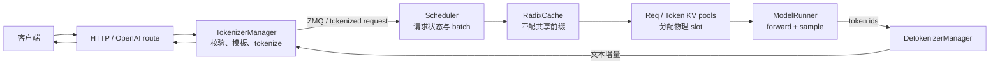

# 从这里开始：把 SGLang Runtime 看成一台有记忆的调度器

SGLang 不只是一个 OpenAI 兼容 API，也不只是 RadixAttention。更准确的心智模型是：**SGLang Runtime（SRT）是一台长期运行的推理系统；它把请求拆成 token 工作，在连续批处理中调度，并用 RadixCache 记住多个请求共享过的前缀 KV。**

本站绑定 SGLang 提交 [`c879f3d`](https://github.com/sgl-project/sglang/tree/c879f3da5ceaaef3cb197c4e59ce683d420ce96c)，以文本生成服务的 SRT 主线为准。扩散模型、所有硬件后端和每一种模型特例不在第一遍阅读范围内。

## 先回答四个问题

| 问题 | 真正考察的概念 | 答不上从哪里开始 |
| --- | --- | --- |
| 为什么两个请求共享 system prompt 时，第二个可能少做大量 prefill？ | Radix tree 上的 longest-prefix match | [RadixAttention](./fundamentals/radix-attention) |
| 为什么长 prompt 不一定一次塞进 GPU？ | token budget 与 chunked prefill | [调度、缓存与性能](./fundamentals/performance) |
| `ReqToTokenPool` 与 `TokenToKVPoolAllocator` 为什么必须同时存在？ | 请求逻辑位置与物理 KV slot 的两级映射 | [RadixCache 与内存池](./internals/cache-pools) |
| 谁 tokenize、谁决定 batch、谁真正持有模型？ | TokenizerManager / Scheduler / ModelRunner | [进程与通信架构](./internals/architecture) |

如果这些都模糊，不要先追 FlashInfer 或 Triton kernel。kernel 回答“怎么算”，而 Scheduler 与 cache 回答“这一轮为什么算这些 token、历史 KV 在哪里”。

## 一条请求的全局闭环

这不是一次从左到右结束的流水线。未完成请求会留在 Scheduler 中，每个 decode step 再进入一个新的动态 batch。TokenizerManager 同时维护每个请求的异步状态，把 DetokenizerManager 返回的增量结果送回正确的 HTTP coroutine。

## 三个名字必须分开

| 名字 | 它是什么 | 它不是什么 |
| --- | --- | --- |
| RadixAttention（论文思想） | 用 radix tree 组织跨请求前缀 KV，并让调度器感知复用收益 | 某个 CUDA attention 公式 |
| `RadixCache` | Scheduler 侧的压缩 radix tree，保存 token 前缀到物理 KV 索引的映射 | 实际 KV tensor 本身 |
| `RadixAttention` 类 | 模型层中的 attention wrapper，把 forward metadata 交给具体 attention backend | radix tree 的实现 |

初学者最常见的误解，是打开 `layers/radix_attention.py` 就期待看到前缀树。真正的树在 [`mem_cache/radix_cache.py`](https://github.com/sgl-project/sglang/blob/c879f3da5ceaaef3cb197c4e59ce683d420ce96c/python/sglang/srt/mem_cache/radix_cache.py#L280)。

## SGLang 真正优化了什么

1. **前缀复用**：RadixCache 把公共 token 前缀映射到已存在的 KV slot。
2. **缓存感知调度**：LPM 等策略可优先安排共享前缀更多的请求。
3. **连续批处理**：prefill 与 decode 请求按每轮资源重新组合。
4. **CPU/GPU 重叠**：默认 overlap scheduler 尽量让上一轮结果处理与下一轮 GPU forward 并行。
5. **分层内存**：请求槽、设备 KV、可选 HiCache host/storage 层分别管理。
6. **多执行后端**：attention、sampling、quantization、speculative 与并行路径按模型和硬件组合。

这些优化都不改变自回归模型的条件概率定义。相同模型、输入、精度与采样随机性下，它们优化的是重复计算、排队、内存和执行开销。

## 五个学习站点

| 站点 | 学习任务 | 必须留下的证据 |
| --- | --- | --- |
| 00 定位 | 固定版本，画出全局闭环 | 一张进程与消息图 |
| 01 地基 | prefill/decode、radix tree、指标 | 手算一次 prefix match 与 KV 节省 |
| 02 实验 | 启服务、发请求、做基准 | 命令、环境、负载、原始结果 |
| 03 源码 | 沿一个 `rid` 追到采样结果 | 文件、函数、对象字段与进程边界 |
| 04 生产 | 并行、PD、HiCache 与诊断 | SLO、容量边界、证据与回退条件 |

完整安排见[学习地图与版本边界](./guide/learning-path)。

## 第一遍只追六个对象

- `GenerateReqInput`：HTTP/native API 的请求契约；
- `TokenizedGenerateReqInput`：TokenizerManager 交给后端的 token 化请求；
- `Req`：Scheduler 内一条请求的可变状态；
- `ScheduleBatch`：本轮要执行的一组请求及其张量元数据；
- `ForwardBatch`：ModelRunner 能消费的设备执行描述；
- `BatchTokenIDOutput`：Scheduler 发给 detokenizer 的 token 增量。

对每个对象只问：谁创建、谁修改、在哪个进程、什么时候失效。比背几十个 server args 更容易形成可迁移的源码能力。

## 通关检查

完成本站后，你应能解释：

- radix tree 的边为什么可以存一段 token，而不只是一个 token；
- prefix hit 为什么只减少 prefill，不会免掉新 token 的 decode；
- Scheduler 为什么既负责排队，也持有 model worker；
- 请求槽、KV 物理槽和 radix tree 节点如何连接；
- overlap scheduling 重叠了什么，为什么不是“GPU 同时跑两个模型 step”；
- TP、DP、PP、PD disaggregation 和 HiCache 分别切的是哪一维；
- TTFT、ITL 或吞吐恶化时，应先查哪个阶段。

现在先读[推理循环与进程边界](./fundamentals/runtime)，把每一轮计算放到正确进程中。
