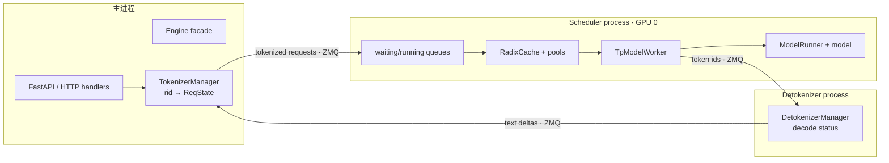
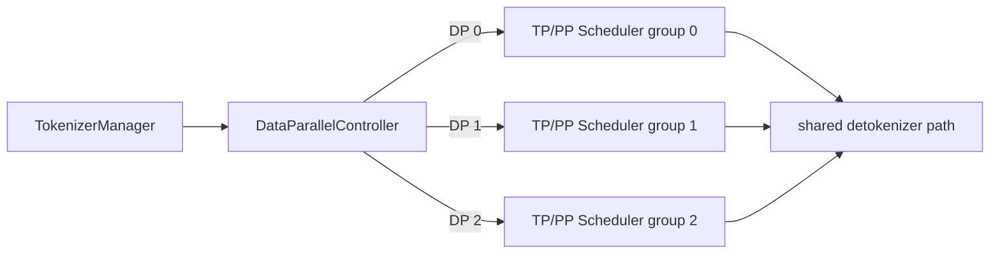
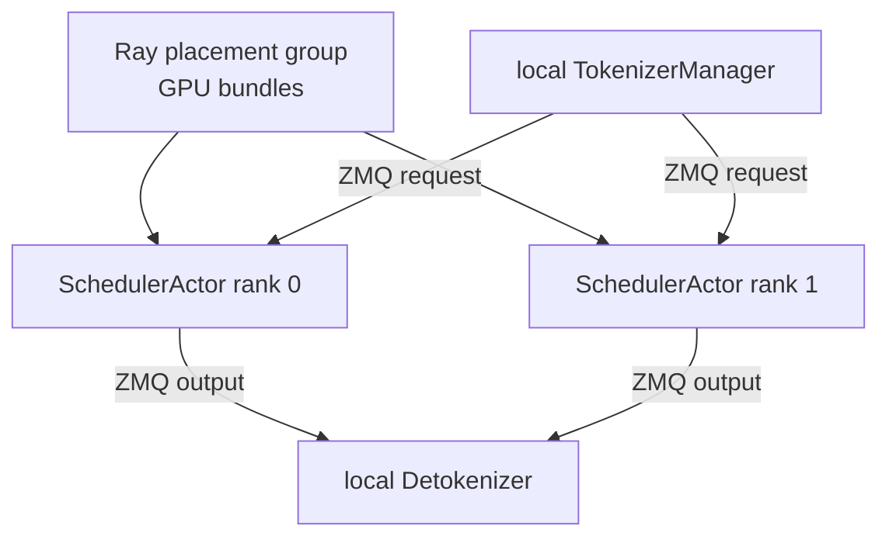
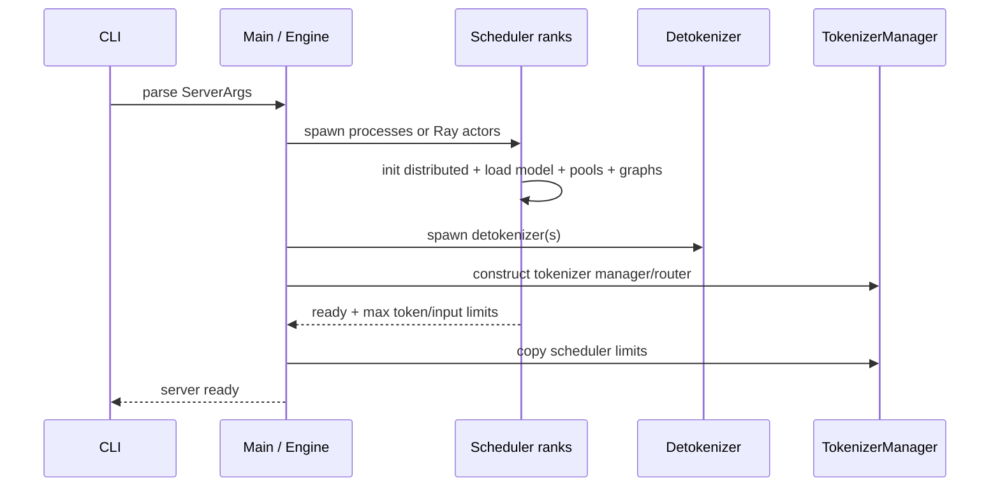

# SGLang 进程与通信架构

SGLang 把 CPU 输入输出与 GPU 调度分开，但它的 Scheduler 与一些框架不同：**每个 Scheduler rank 同时拥有调度状态、cache/pool 元数据和该 rank 的模型执行器。** 先把所有权放对，再研究 ZMQ、Ray 或 NCCL。

## 默认单卡拓扑

`HTTP server`、`Engine` 和 `TokenizerManager` 在主进程；Scheduler 与 DetokenizerManager 是子进程。源码说明与启动逻辑见 [`Engine`](https://github.com/sgl-project/sglang/blob/c879f3da5ceaaef3cb197c4e59ce683d420ce96c/python/sglang/srt/entrypoints/engine.py#L183) 和 [`_launch_subprocesses()`](https://github.com/sgl-project/sglang/blob/c879f3da5ceaaef3cb197c4e59ce683d420ce96c/python/sglang/srt/entrypoints/engine.py#L763)。

## 角色与所有权

| 角色 | 持有的状态 | 不负责 | 源码入口 |
| --- | --- | --- | --- |
| HTTP/OpenAI route | schema、连接、SSE 生命周期 | GPU batch | [`http_server.py`](https://github.com/sgl-project/sglang/blob/c879f3da5ceaaef3cb197c4e59ce683d420ce96c/python/sglang/srt/entrypoints/http_server.py#L814) |
| `TokenizerManager` | tokenizer、`rid → ReqState`、异步等待、abort、结果路由 | KV 分配 | [`tokenizer_manager.py`](https://github.com/sgl-project/sglang/blob/c879f3da5ceaaef3cb197c4e59ce683d420ce96c/python/sglang/srt/managers/tokenizer_manager.py#L262) |
| `Scheduler` | waiting/running batch、`Req`、RadixCache、pool、model worker | HTTP 文本协议 | [`scheduler.py`](https://github.com/sgl-project/sglang/blob/c879f3da5ceaaef3cb197c4e59ce683d420ce96c/python/sglang/srt/managers/scheduler.py#L301) |
| `TpModelWorker` | `ScheduleBatch → ForwardBatch`、forward 与 sample 桥接 | 跨请求排队策略 | [`tp_worker.py`](https://github.com/sgl-project/sglang/blob/c879f3da5ceaaef3cb197c4e59ce683d420ce96c/python/sglang/srt/managers/tp_worker.py#L242) |
| `ModelRunner` | 权重、设备、KV tensor、attention backend、graph、forward | detokenize | [`model_runner.py`](https://github.com/sgl-project/sglang/blob/c879f3da5ceaaef3cb197c4e59ce683d420ce96c/python/sglang/srt/model_executor/model_runner.py#L228) |
| `DetokenizerManager` | 增量 decode 状态、token ids → text | 调度与模型执行 | [`detokenizer_manager.py`](https://github.com/sgl-project/sglang/blob/c879f3da5ceaaef3cb197c4e59ce683d420ce96c/python/sglang/srt/managers/detokenizer_manager.py#L91) |

`TokenizerManager` 中的 `ReqState` 与 Scheduler 中的 `Req` 不是同一个对象。前者服务 HTTP coroutine 和文本累计，后者服务 token 调度、cache 与完成判断；它们通过同一个 `rid` 关联。

## TP 与 PP 怎样增加 Scheduler ranks

当 `dp_size=1`，启动代码遍历本节点负责的 PP rank 与 TP rank，每个组合创建一个 Scheduler 进程，并传入 `gpu_id`、`tp_rank`、`pp_rank` 等。单节点、默认单 detokenizer 时：

$$
N_{proc}=1_{main}+T\times P+1_{detok}
$$

| 配置 | 主进程 | Scheduler ranks | Detokenizer | 合计 |
| --- | ---: | ---: | ---: | ---: |
| TP=1, PP=1 | 1 | 1 | 1 | 3 |
| TP=4, PP=1 | 1 | 4 | 1 | 6 |
| TP=2, PP=2 | 1 | 4 | 1 | 6 |

这里每个 Scheduler rank 通常绑定一张 GPU。TP ranks 在 CPU 上也可能执行相同调度逻辑，模型内部再通过 distributed groups 协作。

## DP 为什么多一个 Controller

普通 `dp_size > 1` 时，Engine 先启动 [`DataParallelController`](https://github.com/sgl-project/sglang/blob/c879f3da5ceaaef3cb197c4e59ce683d420ce96c/python/sglang/srt/managers/data_parallel_controller.py#L136)。Controller 从 TokenizerManager 收请求，按 round-robin、总请求数、总 token 等策略选择 DP replica，再把请求发送到对应 Scheduler group。

单节点、普通 DP 的概念进程数为：

$$
N_{proc}=1_{main}+1_{DP\ controller}+DTP+1_{detok}
$$

若开启 DP attention，DP 被折叠进全局 TP 拓扑，GPU/Scheduler rank 数不再简单是 (DTP)，应按实际 `tp_size × pp_size` 与 attention group 划分核算。不能只看 `dp_size` 猜卡数。

每个 DP replica 有独立 Scheduler 与 RadixCache。相同前缀若被随机分散，缓存命中也会分散；上游路由策略因此可能影响 TTFT。

## 多 tokenizer / detokenizer 是可选扩展

默认各一个。固定提交还支持：

- `tokenizer_worker_num > 1`：主侧使用 `MultiTokenizerRouter` 和多个 tokenizer workers；
- `detokenizer_worker_num > 1`：多个 DetokenizerManager 前增加 `MultiDetokenizerRouter`；
- `node_rank > 0`：多机的非零节点不运行 tokenizer/detokenizer，只启动本节点 Scheduler ranks 并等待。

所以生产排障必须看 resolved `ServerArgs` 与实际 PID，不能把默认三进程图当成所有配置的固定答案。

## Ray 模式精确地替换了什么

`--use-ray` 或 `RayEngine` 把 Scheduler rank 的进程生命周期和 GPU 放置交给 Ray actor。每个 [`SchedulerActor`](https://github.com/sgl-project/sglang/blob/c879f3da5ceaaef3cb197c4e59ce683d420ce96c/python/sglang/srt/ray/scheduler_actor.py#L29) 管理一张 GPU，内部仍创建 `Scheduler + TpModelWorker`。

源码注释明确：**Ray 用于 process lifecycle，ZMQ 仍处理 request/response communication。** 模型内部 collective 仍由 torch/distributed backend 负责。不要把 `use_ray` 理解成请求数据改走 Ray object store。

Ray path 还会使用或自动创建 placement group，为多 GPU ranks 原子预留资源；跨节点时负责 actor 放置和 rank0 地址协调。它适合需要 Ray 集群管理/共置的场景，不是单机必开的性能开关。

## 启动时序

Scheduler ready 之前，模型权重、distributed groups、KV pools 和常用 graph 可能都在初始化。启动慢不能仅归因于“下载模型”。

## 五种通信不要混在一起

| 通道 | 用途 |
| --- | --- |
| ZMQ | tokenizer/controller/scheduler/detokenizer 的控制与请求消息 |
| Python 同进程调用 | Scheduler → TpModelWorker → ModelRunner |
| torch distributed / NCCL 等 | TP/PP/EP ranks 的 tensor collective |
| Ray RPC | Ray 模式 actor 创建、ready、event loop 生命周期 |
| HTTP/SSE | 客户端请求与流式文本输出 |

## 故障按所有权定位

| 现象 | 先查 |
| --- | --- |
| 4xx / chat template | HTTP / TokenizerManager |
| 请求一直无首 token | DP Controller、Scheduler queue、prefill/cache |
| scheduler child died | 对应 rank 的第一条 traceback |
| detokenize 文本错位 | rid/output ids 与 Detokenizer 状态 |
| NCCL timeout | Scheduler ranks 的 rank/address/group |
| Ray actor pending | placement group 与 logical resources |
| Ray actor alive 但请求超时 | ZMQ、Scheduler event loop、模型执行，不是只看 actor 状态 |

## 通关标准

给 `DP=2, TP=4, PP=1` 画出：主进程、DP Controller、8 个普通 Scheduler ranks、detokenizer 和通信边。再解释开启 Ray 后哪些方框变成 actor、哪些数据仍走 ZMQ。

下一节沿[一条请求的生命周期](./request-lifecycle)把这些进程连成实际时序。
