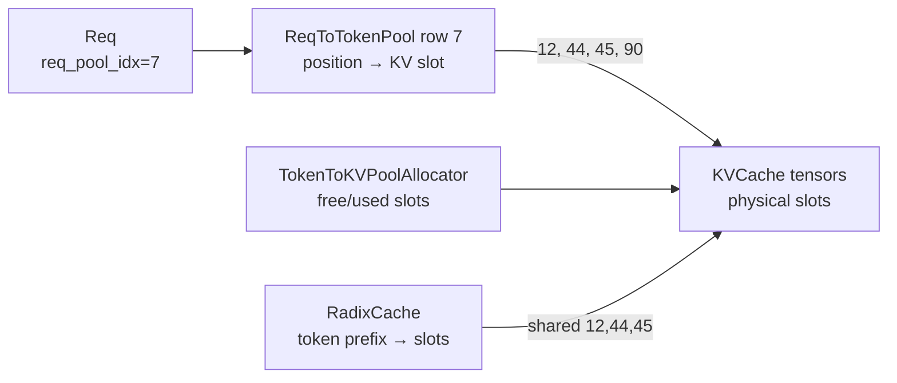
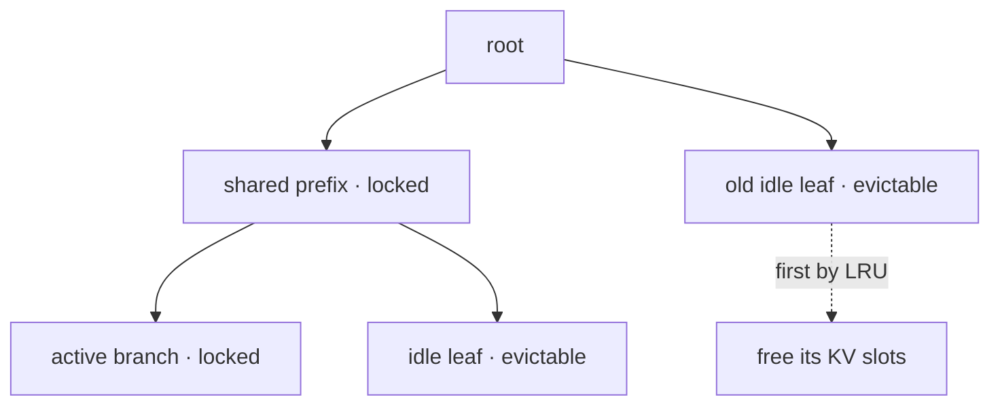

# RadixCache 与内存池：三层索引如何接到真实 KV

SGLang 的 KV 管理不是一张表。最小正确模型有三层：**请求映射表、物理 KV allocator、跨请求前缀树。** 它们分别回答“这条请求每个位置在哪”“哪些物理位置空闲”“哪些位置可以被其他请求复用”。

## 三层所有权



| 层 | 主要结构 | 存什么 | 不存什么 |
| --- | --- | --- | --- |
| 请求映射 | `ReqToTokenPool.req_to_token` | `[request slot, sequence position] → KV slot` | KV tensor 值 |
| 物理分配 | `TokenToKVPoolAllocator` | free/used physical slot ids | token 语义 |
| 前缀索引 | `RadixCache` | token segment → reusable KV slot ids | 完整设备 KV tensor |

## `ReqToTokenPool`：每条活跃序列的页表

[`ReqToTokenPool`](https://github.com/sgl-project/sglang/blob/c879f3da5ceaaef3cb197c4e59ce683d420ce96c/python/sglang/srt/mem_cache/memory_pool.py#L238) 分配二维 int32 tensor：

```text
shape = [max_running_requests + padding_row, max_context_len]
```

第 0 行留给 CUDA Graph padding/dummy 访问，真实请求从 1 开始。`alloc(reqs)` 为新请求选择空闲行，把行号写入 `req.req_pool_idx`；chunked prefill 可复用已有行；`free(req)` 只归还请求行，不自动释放该行指向的所有 KV。

这类似进程页表：逻辑位置连续，物理 slot 可以离散。

## `TokenToKVPoolAllocator`：物理地址的空闲表

[`TokenToKVPoolAllocator`](https://github.com/sgl-project/sglang/blob/c879f3da5ceaaef3cb197c4e59ce683d420ce96c/python/sglang/srt/mem_cache/allocator/token.py#L28) 管理 `free_pages`：

```text
alloc(n) → n 个物理 slot ids
free(indices) → 归还 slots
available_size() → 当前可分配量
```

名称里是 Token，但 `page_size > 1` 时一个 allocator 单元可代表一页 token。slot id 会被 attention backend 用来在每层 KV tensor 中定位同一逻辑 token/page 的 K/V。

slot 0 同样是 padding/dummy，避免 padded CUDA Graph batch 错写真实请求。

## 一个完整数值例子

假设请求 R 的 token ids 为 `[10,11,12,13]`，前缀 `[10,11]` 已命中物理 slots `[5,9]`：

1. `ReqToTokenPool.alloc(R)` 返回 row 7；
2. RadixCache 返回 `prefix_indices=[5,9]`；
3. allocator 为未命中 `[12,13]` 分配 `[20,21]`；
4. row 7 写成：

```text
position: 0  1  2   3
slot:     5  9  20  21
```

5. `ScheduleBatch.out_cache_loc=[20,21]` 告诉 ModelRunner 新 K/V 写哪里；
6. attention 根据 row 7 的映射读取 `[5,9,20,21]` 形成上下文。

逻辑序列连续并不要求设备内存连续，这正是 pool 映射的价值。

## RadixCache 如何接入

[`match_prefix()`](https://github.com/sgl-project/sglang/blob/c879f3da5ceaaef3cb197c4e59ce683d420ce96c/python/sglang/srt/mem_cache/radix_cache.py#L355) 返回：

- `device_indices`：最长命中的 KV slots；
- `last_device_node`：命中终点，用于 lock 与后续插入；
- host/HiCache 相关节点信息。

Scheduler 把这些 indices 写进请求映射表前缀，并仅为 extend 后缀分配新 slots。

## 为什么完成请求后不一定释放 KV

完成时 [`cache_finished_req()`](https://github.com/sgl-project/sglang/blob/c879f3da5ceaaef3cb197c4e59ce683d420ce96c/python/sglang/srt/mem_cache/radix_cache.py#L437)：

1. 从 request row 读取 token 对应 KV indices；
2. 将 token prefix → indices 插入树；
3. 若树中已有重复前缀，释放这次请求的重复 slots；
4. 处理 page 未对齐尾部；
5. 降低活跃路径 lock；
6. request row 最终可归还。

缓存保留的是可复用 KV，因此请求结束不等于它的全部 KV 立即 free。只有 cache 淘汰或禁用时，物理 slots 才回 allocator。

## 未完成请求为何也会 cache

[`cache_unfinished_req()`](https://github.com/sgl-project/sglang/blob/c879f3da5ceaaef3cb197c4e59ce683d420ce96c/python/sglang/srt/mem_cache/radix_cache.py#L489) 可把已计算部分插入树，重新 match 后将 request row 改指向规范的共享 slots，并更新 lock refs。

这对 chunked prefill 和运行中前缀共享重要，但必须避免：

- 自己重复引用自己导致 hit/lock 统计膨胀；
- 新旧 slots 都保留造成泄漏；
- 映射在 forward 仍读取时被并发重写。

## Eviction 与锁

Radix tree 节点有 `lock_ref`。活跃请求持有某节点时，`inc_lock_ref()` 会保护该节点和祖先；结束、retract 或切换前缀时必须对称 `dec_lock_ref()`。

[`evict()`](https://github.com/sgl-project/sglang/blob/c879f3da5ceaaef3cb197c4e59ce683d420ce96c/python/sglang/srt/mem_cache/radix_cache.py#L564) 从可淘汰 leaves 中按 LRU/配置策略选择节点，释放 `node.value` 指向的 KV slots，删除叶子；父节点变为无锁叶后才继续候选。



## Page alignment 为什么改变命中

若 `page_size=4`，查询命中 10 个 token，实际可共享边界可能只到 8。`RadixKey.page_aligned()` 会截到整页；完成请求的未对齐尾部也需单独释放或保留给活跃状态。

因此：

- cache hit token 数可能小于文本上共同 token 数；
- page 越大，metadata/allocator 开销可能更低，但细粒度复用可能下降；
- benchmark 必须记录 page size 和实际 cached tokens。

## OOM 的三种不同原因

| 耗尽对象 | 现象 | 处理方向 |
| --- | --- | --- |
| request rows | 活跃请求数太多，即使 token 很短 | 限制 running requests / 扩大映射表 |
| KV slots | 上下文与输出总 token 太多 | evict/retract、降低并发/长度、扩 KV pool |
| graph/workspace/weights | allocator 仍有 slot 但设备分配失败 | 调静态比例、graph/backend/model 精度 |

不要把三者都叫“KV OOM”。先看哪个 allocator/阶段失败。

## 必须守住的不变量

```text
每个活跃 Req 有合法 request row
row 中每个已计算位置指向合法 KV slot
同一物理 slot 的所有共享引用受 cache/lock 生命周期保护
free slot 不得仍被任何活跃 row 或 radix node 引用
完成/abort/retract 的所有分支都对称归还 row 与非缓存 KV
page-aligned cache key 与 value 长度一致
```

## 手工练习

建立 6 个物理 slots、2 个 request rows：

1. R1 插入 `[1,2,3]`；
2. R2 命中 `[1,2]` 并扩展 `[4]`；
3. R1 完成并 cache；
4. R2 decode 一个 token；
5. 只剩 1 个 free slot 时执行 eviction；
6. 画出每一步的 rows、free list、radix nodes 与 locks。

能做到这一点，才算真正理解了 SGLang 的 KV 地址。下一节进入[ModelRunner 与执行后端](./model-execution)。
