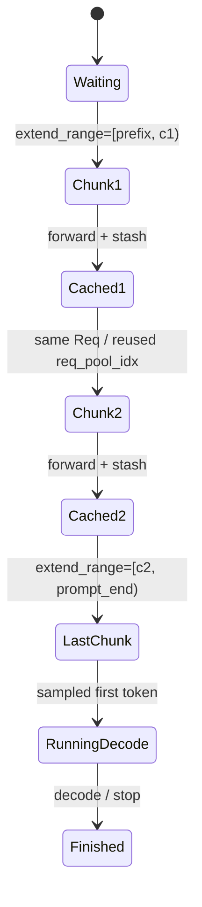
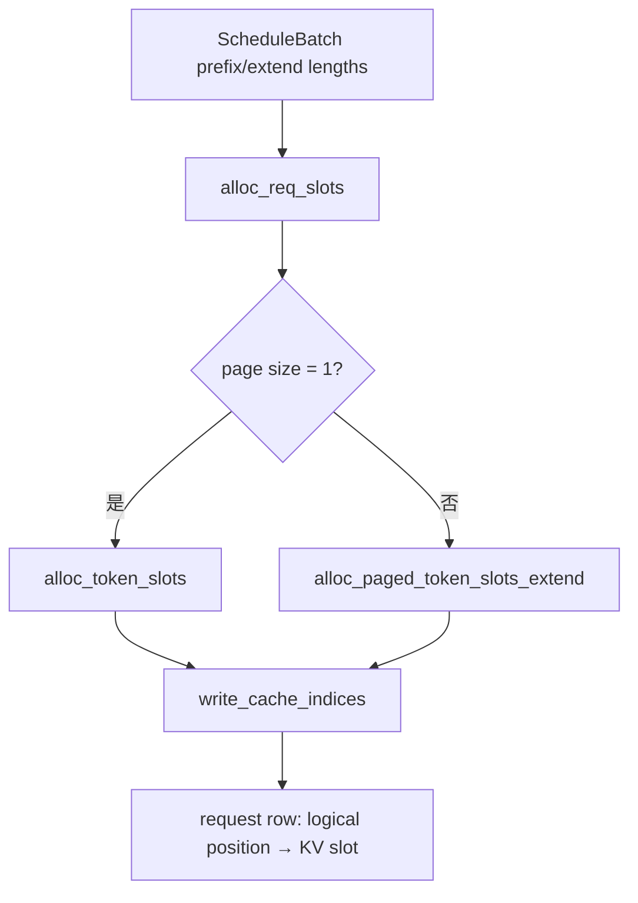

# Chunked Prefill：从准入预算到中间 chunk 回收

Chunked prefill 不是在 tokenizer 里把文本切成多个独立请求。SGLang 保留同一个 `Req`，只让本轮 `extend_range` 覆盖 prompt 的一段；中间结果写入 request/KV pools，并在下一轮继续同一个请求。它解决长 prefill 独占执行窗口的问题，但增加调度、缓存和 page 对齐约束。

## 三个经常混淆的上限

固定提交的三个参数连续定义在 [`server_args.py`](https://github.com/sgl-project/sglang/blob/c879f3da5ceaaef3cb197c4e59ce683d420ce96c/python/sglang/srt/server_args.py#L679)：

| 参数 | 控制对象 | 固定提交初始值/语义 |
| --- | --- | --- |
| `chunked_prefill_size` | 单个 chunk 最多多少 token | `None` 先由硬件/模型解析；CLI `-1` 表示禁用 |
| `max_prefill_tokens` | 一个 prefill batch 总 token 预算 | 16384，但解析阶段会结合模型上下文 |
| `max_running_requests` | 活跃 request rows/batch 上限 | `None`，由内存/graph 等解析 |

[`Scheduler.init_chunked_prefill()`](https://github.com/sgl-project/sglang/blob/c879f3da5ceaaef3cb197c4e59ce683d420ce96c/python/sglang/srt/managers/scheduler.py#L978) 将解析后的非正 chunk size 映射成内部 `None`，并在 Transformers backend 的 multimodal 特例中关闭 chunking。不要只读 dataclass 默认值就声称运行时 chunk size 是某个固定数字；启动日志中的 resolved `ServerArgs` 才是本次运行证据。

## 一个请求的状态怎样跨 chunk 保留



关键字段在 [`Req`](https://github.com/sgl-project/sglang/blob/c879f3da5ceaaef3cb197c4e59ce683d420ce96c/python/sglang/srt/managers/schedule_batch.py#L677)：

| 字段 | 跨 chunk 含义 |
| --- | --- |
| `full_untruncated_fill_ids` | 完整 prompt + 已生成 token，不因本轮截断而缩短 |
| `extend_range` | 本轮允许计算的 `[start,end)`；admission 改它而不改完整序列 |
| `prefix_indices` | 之前已计算、可复用的 KV slot indices |
| `req_pool_idx` | request→KV 映射表的一行；中间 chunk 可继续复用 |
| `kv_committed_len` | 已真正提交到 KV/request row 的长度 |
| `inflight_middle_chunks` | overlap 下仍在途的中间 chunk 数，避免过早清理 |
| `cache_protected_len` | radix tree 真正保护的 page-aligned KV 长度 |

## 选择顺序与资源准入是两件事

[`Scheduler._get_new_batch_prefill_raw()`](https://github.com/sgl-project/sglang/blob/c879f3da5ceaaef3cb197c4e59ce683d420ce96c/python/sglang/srt/managers/scheduler.py#L2780) 先让 `SchedulePolicy.calc_priority()` 排 waiting queue，再构造 [`PrefillAdder`](https://github.com/sgl-project/sglang/blob/c879f3da5ceaaef3cb197c4e59ce683d420ce96c/python/sglang/srt/managers/schedule_policy.py#L441) 做资源账。

固定提交默认 `schedule_policy="fcfs"`，见 [`ServerArgs.schedule_policy`](https://github.com/sgl-project/sglang/blob/c879f3da5ceaaef3cb197c4e59ce683d420ce96c/python/sglang/srt/server_args.py#L722)。RadixCache 仍然可以命中：**是否复用 cache**与**是否按最长命中排序**是两个开关。切到 `lpm` 才改变等待队列优先级，不是启用 cache 的前提。

## PrefillAdder 的四本账

简化到普通 dense Transformer 时，准入同时看：

1. `rem_input_tokens`：本 prefill batch 还容纳多少输入 token；
2. `rem_chunk_tokens`：当前 chunk budget 还剩多少；
3. `rem_total_tokens`：allocator 可用 + radix 可淘汰，减去 running requests 未来输出预留；
4. request slot：`ReqToTokenPool` 是否还有行。

实际源码还处理 SWA、Mamba/SSM、HiCache、LoRA、priority preemption、PP dynamic chunk、DP attention 与 DLLM。学习时先用普通路径建模，但不能把简化公式写成全部实现。

普通路径近似预算可写为：

$$
B_{req}=\operatorname{pageceil}(L_{uncached})+
\min(L_{max\_new},4096)+page\_overhead
$$

其中 4096 来自 [`CLIP_MAX_NEW_TOKENS`](https://github.com/sgl-project/sglang/blob/c879f3da5ceaaef3cb197c4e59ce683d420ce96c/python/sglang/srt/managers/schedule_policy.py#L69) 的默认环境变量值。它只裁剪**调度估算**，不会把真实 `max_new_tokens` 改为 4096。

[`PrefillAdder.add_one_req()`](https://github.com/sgl-project/sglang/blob/c879f3da5ceaaef3cb197c4e59ce683d420ce96c/python/sglang/srt/managers/schedule_policy.py#L976) 的重要分支：

- 总 token 预算不足：`NO_TOKEN`；
- 没开 chunk 且已有可运行请求时，本 batch 输入预算满：`OTHER`，保留请求等待下轮；
- 剩余输入能放进 chunk：设置完整剩余 `extend_range`，预留未来输出；
- 剩余输入超过 chunk：按 page/alignment 截断，`new_chunked_req=req`，本轮不预留尚未到来的生成 token；
- `trunc_len<=0`：本轮不准入，而不是强行产生非对齐 chunk。

::: warning 边界比较
源码对多个预算使用 `>=` 拒绝，而不总是 `>`。做数值推演时，刚好等于剩余量也可能因为 page overhead 和并发安全余量被拒绝。
:::

## 一个具体数值例子

假设：

```text
prompt = 10,000 tokens
prefix hit = 2,000
chunked_prefill_size = 4,096
page_size = 1
max_new_tokens = 256
其他资源充足
```

主路径是：

| 轮次 | 进入前 `prefix_indices` | 本轮 `extend_range` | 是否最后 chunk | 输出 |
| --- | ---: | --- | --- | --- |
| 1 | 2000 | `[2000,6096)` | 否 | 只提交中间 KV，不把伪 sampled token 当输出 |
| 2 | 6096 左右 | `[6096,10000)` | 是 | 完成 prompt，产生首个真实生成 token |
| decode | 10000 KV + pending token | 每请求 1 token/step | — | `output_ids` 逐步增长 |

真实 `prefix_indices` 长度还受 page alignment、EAGLE bigram、host load-back 等影响，所以表中的“6096 左右”必须用实际 trace 验证，不能当跨配置恒等式。

## 中间 chunk 为什么要 stash

下一轮 `get_next_batch_to_run()` 看到 `self.chunked_req` 时，会在确实产生新 KV 后调用 [`stash_chunked_request()`](https://github.com/sgl-project/sglang/blob/c879f3da5ceaaef3cb197c4e59ce683d420ce96c/python/sglang/srt/managers/scheduler.py#L2529)，其核心是 `maybe_cache_unfinished_req(..., chunked=True)`。

[`RadixCache.cache_unfinished_req()`](https://github.com/sgl-project/sglang/blob/c879f3da5ceaaef3cb197c4e59ce683d420ce96c/python/sglang/srt/mem_cache/radix_cache.py#L489) 会：

1. 从 request row 取本次 fill 对应 KV indices；
2. page-align token key/value 后插入 radix tree；
3. 释放与树中已有前缀重复的 KV；
4. 重新 `match_prefix()` 得到 canonical indices；
5. 把 request row 的前缀改写为 canonical indices；
6. 从旧 `last_node` 降 lock，在新节点升 lock；
7. 更新 `prefix_indices`、`last_node`、`cache_protected_len`。

这不是“为了让别的请求马上命中”这么简单；它也把当前请求的中间 KV 交给统一 cache 所有权，并确保下一个 chunk 使用树中的 canonical mapping。

## request row 与 KV slots 何时真正分配

Scheduler 准入后构造 `ScheduleBatch` 并调用 [`prepare_for_extend()`](https://github.com/sgl-project/sglang/blob/c879f3da5ceaaef3cb197c4e59ce683d420ce96c/python/sglang/srt/managers/schedule_batch.py#L2105)。它根据本轮 `extend_range` 生成：

- `prefix_lens`、`extend_lens`、`seq_lens`；
- pinned CPU input IDs，H2D 可延后到 forward stream；
- sampling/logprob/multimodal metadata；
- `req_pool_indices` 与 `out_cache_loc`。

真实分配在 [`alloc_for_extend()`](https://github.com/sgl-project/sglang/blob/c879f3da5ceaaef3cb197c4e59ce683d420ce96c/python/sglang/srt/mem_cache/allocation.py#L303)：



`ReqToTokenPool.alloc()` 会复用已有 `req_pool_idx`，但断言该请求确实是 in-flight chunk 或已有 committed KV。若 admission 误判导致 row/KV 分配失败，allocation 路径选择 fail-loud `RuntimeError`，而不是悄悄少算 token。

## 最后 chunk 怎样转入 decode

非最后 chunk 不应向客户端暴露普通生成 token；batch result processor 通过 `chunked_req`、`contains_last_prefill_chunk` 和 `inflight_middle_chunks` 区分中间与最终结果。最后一个 extend 完成后，请求合并进 `running_batch`，下一轮若没有新 prefill 优先执行，则 `update_running_batch()` 准备 decode。

decode 每步仍要为每个活跃请求分配新 KV。[`alloc_for_decode()`](https://github.com/sgl-project/sglang/blob/c879f3da5ceaaef3cb197c4e59ce683d420ce96c/python/sglang/srt/mem_cache/allocation.py#L440) 在 page 模式可能按“每请求需要新 page”保守估算。prefill 能成功不代表 decode 永远不会 OOM；`ScheduleBatch.check_decode_mem()` 失败会触发 retraction 路径。

## Mixed chunk 改变什么

当 `chunked_prefill_size` 有效且开启 `--enable-mixed-chunk`，Scheduler 可以把 running decode 请求与新 chunk 合进同一个 batch。源码只在满足限制时混合，例如 logprob 和 input embeds 的某些组合会跳过。它可能减少 decode 被 prefill 完全打断的时间，但会增加 batch 形态与 attention backend 压力。

实验必须比较：

- chunked 但不 mixed；
- chunked + mixed；
- 相同长/短混合 workload；
- 短请求 ITL p99、长请求 TTFT、总吞吐、graph hit 与正确性。

## Abort 为什么延后到安全点

正在执行的 chunk 不能从另一个 coroutine 直接释放 KV。[`process_pending_chunked_abort()`](https://github.com/sgl-project/sglang/blob/c879f3da5ceaaef3cb197c4e59ce683d420ce96c/python/sglang/srt/managers/scheduler.py#L2532) 在下一调度 step 顶部处理 pending abort：停止后续 chunk，已发出的 forward 仍被 drain；overlap 下结果可能晚一轮到达。

若启用 PD/HiCache，还要终止 sender、释放 metadata buffer 或 storage prefetch state。只从 waiting queue 删除对象会留下更深层资源。

## 可执行实验

先以当前安装的 `--help` 确认参数，再运行三组服务：

```bash
# A：禁用 chunked prefill
python3 -m sglang.launch_server --model-path "$MODEL" \
  --chunked-prefill-size -1 --port 30000

# B：小 chunk
python3 -m sglang.launch_server --model-path "$MODEL" \
  --chunked-prefill-size 1024 --port 30000

# C：较大 chunk
python3 -m sglang.launch_server --model-path "$MODEL" \
  --chunked-prefill-size 4096 --port 30000
```

每组先保存 resolved args 和启动时的 token capacity，再用相同请求顺序发送：一个 8K/16K 长 prompt，以及稳定到达的 128-token 短 prompts。预期不是固定数字，而是可检验关系：

- 禁用 chunk 时，单个长 prefill 更容易形成明显 ITL/TTFT 阻塞窗口；
- 小 chunk 通常改善短请求被阻塞上界，但可能增加 forward/调度次数；
- 大 chunk 减少切片开销，但公平性接近未切片；
- 若负载只有同长度长请求，公平性收益可能不明显。

### 必须保存

```text
server args / commit / model revision
实际 prompt 和 output token 长度
每请求 TTFT、ITL、E2E
prefill/input throughput
chunked request / retraction / OOM 日志
KV available/used、request rows
输出一致性或允许的数值差异
```

### 常见失败与定位

| 现象 | 优先证据 | 可能原因 |
| --- | --- | --- |
| `alloc_req_slots runs out of memory` | request pool available、running count | `max_running_requests`/admission 账不一致 |
| `Prefill out of memory` | requested extend tokens、可用+可淘汰 KV | chunk/page/未来输出预留过大 |
| chunk size 没生效 | resolved ServerArgs、模型/backend warning | 被自动解析或兼容分支关闭 |
| 短请求仍有长停顿 | mixed 开关、实际 batch、GPU trace | chunk 太大、到达时机、kernel/collective 阻塞 |
| 中断后 KV 不降 | pending chunk abort、inflight count | 只取消 HTTP，或已发 forward 未 drain |

## 本课验收

给定 prompt=9000、命中=1000、chunk=2048、page=64，手画每轮 `extend_range`，并在每轮标：request row 是否复用、哪些 KV 是 tree-owned、何时预留输出 token、最后 chunk 如何进入 decode。然后指出你的手算在哪些实现分支（SWA、Mamba、HiCache、PP dynamic chunk、DP attention）不再成立。

下一课进入[PD 与 HiCache](../advanced/pd-hicache)，观察同一套 prefix/KV 状态怎样跨实例或跨存储层移动。
