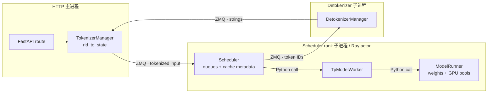
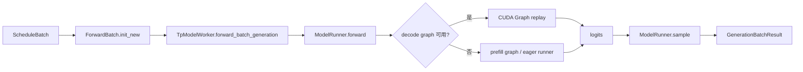

# SGLang 进程与消息流：逐行追一个 `rid`

本课只追最普通的单条文本生成，不展开 multimodal、speculative、PD 和 PP 特例。目的不是声称系统只有这一条路径，而是先建立一条能逐行验证的主干，再理解分支在哪里替换它。

## 先把五个角色放进正确进程



固定源码直接证明：

- [`Engine._launch_subprocesses()`](https://github.com/sgl-project/sglang/blob/c879f3da5ceaaef3cb197c4e59ce683d420ce96c/python/sglang/srt/entrypoints/engine.py#L763) 先启动 scheduler，再启动 detokenizer，最后在主进程构造 TokenizerManager；非零 `node_rank` 只启动本节点 scheduler ranks。
- [`SchedulerActor`](https://github.com/sgl-project/sglang/blob/c879f3da5ceaaef3cb197c4e59ce683d420ce96c/python/sglang/srt/ray/scheduler_actor.py#L31) 明确写着每个 Ray actor 管一张 GPU，并在 actor 内构造 `Scheduler`；Ray 管进程生命周期，普通请求/响应仍走 ZMQ。
- [`Scheduler.run_batch()`](https://github.com/sgl-project/sglang/blob/c879f3da5ceaaef3cb197c4e59ce683d420ce96c/python/sglang/srt/managers/scheduler.py#L3220) 直接调用 `self.model_worker.forward_batch_generation(batch)`，所以 Scheduler → worker 不是网络 RPC。
- [`TpModelWorker.forward_batch_generation()`](https://github.com/sgl-project/sglang/blob/c879f3da5ceaaef3cb197c4e59ce683d420ce96c/python/sglang/srt/managers/tp_worker.py#L494) 构造 `ForwardBatch` 后直接调用 `self.model_runner.forward()`。

## 消息不是共享对象

主干消息类型定义在 [`io_struct.py`](https://github.com/sgl-project/sglang/blob/c879f3da5ceaaef3cb197c4e59ce683d420ce96c/python/sglang/srt/managers/io_struct.py)：

| 阶段 | 数据类型 | 创建者 | 消费者 | 是否继续被创建者修改 |
| --- | --- | --- | --- | --- |
| HTTP 边界 | [`GenerateReqInput`](https://github.com/sgl-project/sglang/blob/c879f3da5ceaaef3cb197c4e59ce683d420ce96c/python/sglang/srt/managers/io_struct.py#L155) | route/Pydantic | TokenizerManager | 会规范化 single/batch 字段 |
| token 后 | [`TokenizedGenerateReqInput`](https://github.com/sgl-project/sglang/blob/c879f3da5ceaaef3cb197c4e59ce683d420ce96c/python/sglang/srt/managers/io_struct.py#L788) | TokenizerManager | Scheduler/DP Controller | 发送后不作为 GPU 状态 |
| 调度中 | [`Req`](https://github.com/sgl-project/sglang/blob/c879f3da5ceaaef3cb197c4e59ce683d420ce96c/python/sglang/srt/managers/schedule_batch.py#L677) | Scheduler | Scheduler/cache/batch | 跨 step 持续修改 |
| 执行中 | [`ScheduleBatch`](https://github.com/sgl-project/sglang/blob/c879f3da5ceaaef3cb197c4e59ce683d420ce96c/python/sglang/srt/managers/schedule_batch.py#L1760) | Scheduler | worker | 本轮调度容器 |
| 模型输入 | [`ForwardBatch`](https://github.com/sgl-project/sglang/blob/c879f3da5ceaaef3cb197c4e59ce683d420ce96c/python/sglang/srt/model_executor/forward_batch_info.py#L333) | TpModelWorker | ModelRunner/backend | 本轮 forward snapshot |
| token 输出 | [`BatchTokenIDOutput`](https://github.com/sgl-project/sglang/blob/c879f3da5ceaaef3cb197c4e59ce683d420ce96c/python/sglang/srt/managers/io_struct.py#L1209) | Scheduler | Detokenizer/Tokenizer | batch 消息 |
| 文本输出 | [`BatchStrOutput`](https://github.com/sgl-project/sglang/blob/c879f3da5ceaaef3cb197c4e59ce683d420ce96c/python/sglang/srt/managers/io_struct.py#L1300) | Detokenizer | TokenizerManager | batch 消息 |

同一个 `rid` 关联这些对象，但它们不是跨进程共享引用。修改 Scheduler 的 `Req.output_ids` 不会神奇地修改主进程 `ReqState`；输出消息必须经过 detokenizer/TokenizerManager 处理。

## 第 1 段：HTTP 到 TokenizerManager

native `/generate` route 在 [`http_server.py#L814`](https://github.com/sgl-project/sglang/blob/c879f3da5ceaaef3cb197c4e59ce683d420ce96c/python/sglang/srt/entrypoints/http_server.py#L814)。它把协议对象交给 [`TokenizerManager.generate_request()`](https://github.com/sgl-project/sglang/blob/c879f3da5ceaaef3cb197c4e59ce683d420ce96c/python/sglang/srt/managers/tokenizer_manager.py#L612)。后者的普通单请求顺序是：

```text
normalize_batch_and_arguments()
→ _set_default_priority()
→ _init_req_state()
→ 等待 pause condition
→ 获取 model_update_lock.reader_lock
→ _tokenize_one_request()
→ _send_one_request()
→ _wait_one_response()
```

关键调用条件：

- 如果 `routed_dp_rank` 越界，在 token 化前报错；
- pause 时新请求停在 `is_pause_cond`，不会偷偷进入 Scheduler；
- weight update 未暂停引擎时使用 writer lock，因此生成拿 reader lock，防止 token 化/发送与模型更新交错；
- token 化或发送前异常时，`except` 会调用 `_discard_pending_req_states()`，避免前端状态泄漏。

[`_init_req_state()`](https://github.com/sgl-project/sglang/blob/c879f3da5ceaaef3cb197c4e59ce683d420ce96c/python/sglang/srt/managers/tokenizer_manager.py#L2916) 在 `rid_to_state` 中建的是前端 `ReqState`。它的职责是让 async waiter 等待结果、累计文本/ids/metadata；没有 request pool row，也没有 KV indices。

## 第 2 段：ZMQ 输入与 rank 广播

[`_send_one_request()`](https://github.com/sgl-project/sglang/blob/c879f3da5ceaaef3cb197c4e59ce683d420ce96c/python/sglang/srt/managers/tokenizer_manager.py#L1355) 发送 tokenized input。Scheduler 侧 [`SchedulerRequestReceiver.recv_requests()`](https://github.com/sgl-project/sglang/blob/c879f3da5ceaaef3cb197c4e59ce683d420ce96c/python/sglang/srt/managers/scheduler_components/request_receiver.py#L73) 执行三步：

1. `_pull_raw_reqs()`：PP rank 0 且 attention TP/CP leader 从 ZMQ 非阻塞收消息；PP 后续 stage 从上一个 stage 点对点接收；
2. `_broadcast_reqs_across_ranks()`：普通 TP 在 CPU group 广播；DP attention 会拆 work/control，再在 attention TP/CP group 广播；
3. 解包 pickle/shared-memory multimodal 字段。

所以“TokenizerManager 把请求发给每个 TP rank”不是准确描述。它发给入口 rank，入口再让参与调度的 ranks 获得一致消息。修改 TP/CP/PP 后，要重新核对 leader 与广播 group。

## 第 3 段：tokenized input 变成 Scheduler `Req`

[`Scheduler.process_input_requests()`](https://github.com/sgl-project/sglang/blob/c879f3da5ceaaef3cb197c4e59ce683d420ce96c/python/sglang/srt/managers/scheduler.py#L1638) 按消息类型分派。普通生成进入 [`handle_generate_request()`](https://github.com/sgl-project/sglang/blob/c879f3da5ceaaef3cb197c4e59ce683d420ce96c/python/sglang/srt/managers/scheduler.py#L2006)，这里才创建可变 `Req`。

初始状态可概括为：

```text
origin_input_ids = tokenized input
output_ids = []
req_pool_idx = None
prefix_indices = empty/unset
last_node = root/unset
finished_reason = None
sampling/grammar/LoRA/PD metadata = copied or resolved
```

然后 `_add_request_to_queue()` 还会处理 grammar：若 grammar 编译 future 尚未 ready，请求先进入 `grammar_queue`；否则进入普通 waiting queue。结构化输出请求因此不保证立刻出现在 `waiting_queue`。

PD 模式还有显式前置条件：缺少 bootstrap room 且 transfer backend 不是 fake 时，`handle_generate_request()` 直接构造 abort 输出，不进入普通 prefill。

## 第 4 段：waiting → ScheduleBatch

普通事件循环见 [`event_loop_normal()`](https://github.com/sgl-project/sglang/blob/c879f3da5ceaaef3cb197c4e59ce683d420ce96c/python/sglang/srt/managers/scheduler.py#L1495)：

```text
receive/process inputs
→ get_next_batch_to_run(running_batch, last_batch)
→ run_batch(batch)
→ process_batch_result(batch, result)
→ last_batch = batch
```

[`get_next_batch_to_run()`](https://github.com/sgl-project/sglang/blob/c879f3da5ceaaef3cb197c4e59ce683d420ce96c/python/sglang/srt/managers/scheduler.py#L2618) 的优先级不是简单的“decode 永远先于 prefill”：

1. 先处理上一轮 chunk/extend 与 running batch 的合并；
2. 尝试 `get_new_batch_prefill()`；
3. 有新 prefill batch 时先返回它；
4. 否则更新 running batch 并运行 decode；
5. DP attention/MLP sync 等分支还可能插入 idle/sync batch。

prefill 详情在[chunked prefill 深读](./chunked-prefill)。此处只记住：`SchedulePolicy` 负责排序，`PrefillAdder` 负责能否准入；排在第一不等于资源足够。

## 第 5 段：ScheduleBatch → ModelRunner

[`Scheduler.run_batch()`](https://github.com/sgl-project/sglang/blob/c879f3da5ceaaef3cb197c4e59ce683d420ce96c/python/sglang/srt/managers/scheduler.py#L3220) 根据 generation/embedding、overlap、speculative、PD/PP 分支选择 worker 路径。普通 generation 主干是：



`ForwardBatch` 补齐执行期信息：positions、extend lengths/prefix lengths、request pool rows、out-cache locations、sampling info、attention planning metadata。它不是把 `Req` 原样传给模型。

[`ModelRunner._forward_raw()`](https://github.com/sgl-project/sglang/blob/c879f3da5ceaaef3cb197c4e59ce683d420ce96c/python/sglang/srt/model_executor/model_runner.py#L1285) 的主分支：decode shape 可命中 graph 就 replay；否则做 DP/MLP padding、attention metadata 准备，再选 split prefill、prefill graph 或 eager runner。最后一个 PP rank 才采样；非末 rank 返回 PP hidden-state proxy。

## 第 6 段：采样结果如何回到客户端

[`process_batch_result()`](https://github.com/sgl-project/sglang/blob/c879f3da5ceaaef3cb197c4e59ce683d420ce96c/python/sglang/srt/managers/scheduler.py#L3482) 先按 forward mode 分派：decode、extend/prefill、prebuilt、idle。结果处理会：

- 把 sampled id 追加到对应 `Req.output_ids`；
- 推进 grammar/spec state；
- 设置 EOS/stop/length/abort finish reason；
- cache 或释放 KV 与 request row；
- 构造带 `rids` 的 batch output。

输出可能先到 DetokenizerManager，把 token IDs 增量 decode 为 [`BatchStrOutput`](https://github.com/sgl-project/sglang/blob/c879f3da5ceaaef3cb197c4e59ce683d420ce96c/python/sglang/srt/managers/io_struct.py#L1300)；跳过 tokenizer 的模式也可能直接返回 token output。主进程 [`TokenizerManager.handle_loop()`](https://github.com/sgl-project/sglang/blob/c879f3da5ceaaef3cb197c4e59ce683d420ce96c/python/sglang/srt/managers/tokenizer_manager.py#L1870) 收到消息并调用 `_handle_batch_output()`：

1. 按 `rid` 查 `ReqState`；
2. 组合文本、finish reason、token/logprob/时间 metadata；
3. 唤醒 `_wait_one_response()`；
4. 最终结果后删除前端 state。

这解释了为什么一个 output batch 可以同时服务多个 HTTP coroutine：batch 带 `rids`，主进程逐元素路由。

## Abort 的反向消息流

[`AbortReq`](https://github.com/sgl-project/sglang/blob/c879f3da5ceaaef3cb197c4e59ce683d420ce96c/python/sglang/srt/managers/io_struct.py#L1763) 也沿控制消息进入 Scheduler。状态位置决定清理动作：

| 请求位置 | 最小安全动作 |
| --- | --- |
| grammar queue | 移除 future/queue state，生成终止结果 |
| waiting queue | 移除请求，释放已持有 prefix lock/临时资源 |
| running/in-flight | 标记 `to_finish`，让结果路径统一回收 pool/cache |
| PD prealloc/transfer | 还要清 sender/receiver、metadata buffer 与 transfer queue |

源码注释说明 running request 的 abort 可能仍执行一次 decode forward，再复用普通完成清理路径。这不是“取消没有生效”，而是避免在 forward 中途破坏 batch 与分布式 rank 一致性。

## 用日志验证这条链

启动时加明确日志级别和 metrics，发送带自定义 `rid` 的 native 请求；参数先用当前版本 `--help` 核对：

```bash
RID=trace-$(date +%s)
curl -sS http://127.0.0.1:30000/generate \
  -H 'Content-Type: application/json' \
  -d "{\"text\":\"Explain radix trees in one sentence.\",\"sampling_params\":{\"temperature\":0,\"max_new_tokens\":24},\"rid\":\"$RID\"}"
```

验证顺序：

1. HTTP 返回的 id/rid 与发送值一致；
2. scheduler 日志能关联该 rid 的 queue/finish；
3. metrics 中 running/waiting 最终回落；
4. 重复相同 prompt 时 prefix hit 变化符合预期；
5. 中断 streaming 请求时，没有持续增长的 output 与 KV 占用。

若默认日志不打印 rid，不要立刻修改生产代码；先使用已有 tracing/metrics、debug 日志或最小本地 instrumentation。任何 instrumentation 都要同时标进程/rank，否则同一 rid 的多份日志会被误认为重复执行。

## 本课验收

闭卷写出以下主链，并在每个箭头标“消息”还是“调用”：

```text
/generate → TokenizerManager.generate_request
→ TokenizedGenerateReqInput → SchedulerRequestReceiver
→ Scheduler Req → ScheduleBatch → ForwardBatch
→ TpModelWorker → ModelRunner → sampled ids
→ batch output → Detokenizer → ReqState → HTTP/SSE
```

再任选一个分支（DP、PP、grammar、abort、Ray）指出它替换或插入主链的哪一段、启动条件是什么、增加了哪份状态与哪种失败模式。下一课深入[chunked prefill 的准入账本](./chunked-prefill)。
