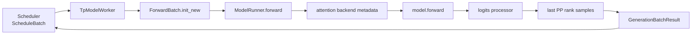
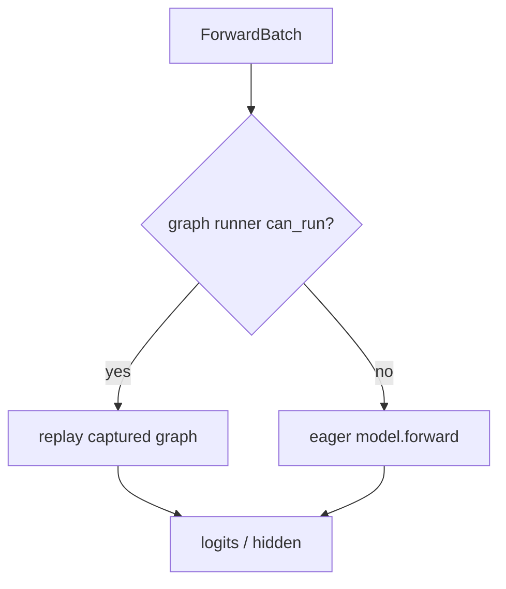

# ModelRunner 与执行后端：一次 batch 怎样落到 GPU

Scheduler 决定“算谁”，ModelRunner 决定“怎样在这张设备上算”。中间不是直接传 Python prompt，而是把 `ScheduleBatch` 规范化成带位置、KV 地址、attention metadata 和采样信息的 `ForwardBatch`。

## 执行链

固定入口：[`TpModelWorker.forward_batch_generation()`](https://github.com/sgl-project/sglang/blob/c879f3da5ceaaef3cb197c4e59ce683d420ce96c/python/sglang/srt/managers/tp_worker.py#L494) 与 [`ModelRunner.forward()`](https://github.com/sgl-project/sglang/blob/c879f3da5ceaaef3cb197c4e59ce683d420ce96c/python/sglang/srt/model_executor/model_runner.py#L1135)。

## 初始化时 ModelRunner 拥有什么

[`ModelRunner.__init__`](https://github.com/sgl-project/sglang/blob/c879f3da5ceaaef3cb197c4e59ce683d420ce96c/python/sglang/srt/model_executor/model_runner.py#L228) 接收模型配置、GPU id、parallel state、显存比例和 ServerArgs，并大致完成：

1. 初始化 distributed groups 与设备；
2. 加载模型和量化权重；
3. 解析本 rank 的 layer/TP/PP/EP 信息；
4. 选择 attention 与 sampling backend；
5. 配置 request/KV pools；
6. 初始化 LoRA、weight updater、offload 等可选模块；
7. 捕获支持的 CUDA Graph；
8. 准备 forward stream 与 overlap 同步状态。

所以启动期 OOM 可能发生在权重、pool、workspace 或 graph capture，不是单一阶段。

## `ForwardBatch` 补上模型真正需要的东西

`ScheduleBatch` 仍包含 Scheduler 状态；`ForwardBatch.init_new()` 将其转换为执行视图，典型字段包括：

- `input_ids` / positions；
- `forward_mode`；
- `seq_lens`、prefix/extend lens；
- `req_pool_indices`、`out_cache_loc`；
- attention backend 所需 metadata；
- sampling/grammar/LoRA/multimodal 信息；
- PP proxy、speculative 或 graph 标记。

这个边界是排查 shape 的好位置：Scheduler 状态正确但 `ForwardBatch` 错，问题通常在 prepare/转换；`ForwardBatch` 正确而 kernel 错，才继续向 backend 下钻。

## `RadixAttention` 类到底做什么

模型层中的 [`RadixAttention.forward()`](https://github.com/sgl-project/sglang/blob/c879f3da5ceaaef3cb197c4e59ce683d420ce96c/python/sglang/srt/layers/radix_attention.py#L125)：

1. reshape 本 rank 的 Q/K/V；
2. 根据 forward mode 和特殊模型路径处理 metadata；
3. 调用当前 attention backend；
4. backend 根据 `ForwardBatch` 的 pool/位置数据写新 KV、读历史 KV；
5. 返回 attention output。

它是统一模型层接口，不实现前缀树。RadixCache 已在 Scheduler 阶段把命中结果转换成 indices。

## Attention backend 为什么可以替换

ModelRunner 的 backend setup 根据硬件、模型 attention 架构、dtype、page size、prefill/decode 模式和显式参数选择实现。不同 backend 必须遵守同一类输入/输出与 KV pool 契约，但支持矩阵并不相同。

| 层级 | 可切换项 | 需验证 |
| --- | --- | --- |
| attention | FlashInfer、Triton、FA3 等 | GPU、dtype、head dim、page、模型特例 |
| sampling | PyTorch/其他 sampler backend | top-k/p、grammar、determinism |
| model impl | native/transformers/其他 | 权重映射、forward signature |
| quantization | FP8/INT4/AWQ 等 | kernel 与模型支持、精度 |

“能启动”只证明初始化兼容；还要验证输出正确性、数值误差、稳定 shape 与性能。

## Eager 与 CUDA Graph

decode 的 batch shape 重复，适合 CUDA Graph 降低 Python/launch 开销。ModelRunner 判断当前 `ForwardBatch` 是否匹配已捕获 graph：

Graph 需要静态 buffer、padding 与同步规则；捕获更多 batch sizes 会增加启动时间和显存。动态/特殊路径回退 eager 是正确行为，不一定是 bug。

排查 graph 问题时做 eager 对照：若 eager 正确、graph 错，再查 captured buffers、shape 与 backend；若二者都错，问题更可能在 batch/model/backend 共同路径。

## Prefill 与 decode 的执行形态

| 模式 | 输入 token 数 | attention 特性 | 常见优化 |
| --- | ---: | --- | --- |
| extend/prefill | 每请求多个新 token | 新 token 间也有 causal attention | variable-length kernel、chunk、prefill graph |
| decode | 每请求通常 1 个 | query 少、历史 KV 长 | decode graph、paged KV、large batch |
| mixed | decode + chunked prefill | 两种形态同 batch | backend 必须明确支持 |
| spec verify | 每请求多个 draft token | 验证树/序列 | 专用 metadata 与采样逻辑 |

同一个模型层会根据 `forward_mode` 走不同 backend 路径。只 profile 一次 prefill 不能解释 decode ITL。

## TP、PP 与采样位置

- **TP**：权重/head/hidden 切到多个 ranks，层内需要 collective；各 rank 执行同一 batch 的分片。
- **PP**：layers 分阶段，非最后 PP rank 返回 proxy hidden tensors，最后 rank 才得到 logits。
- **EP/MoE**：experts 分布到 ranks，token routing 引入 all-to-all 等通信。

`TpModelWorker.forward_batch_generation()` 只有在 PP last rank 才执行正常 sampling；其他 PP rank 把 hidden proxy 传给下一 stage。Scheduler 所见的 token 结果必须再在参与 ranks 间保持一致。

## Sampling 不是模型 forward 的附赠品

模型输出 logits 后，sampler 还要应用：

- temperature、top-k、top-p、min-p；
- repetition/min-new-token/stop 约束；
- grammar/structured output mask；
- custom logit processor；
- speculative accept/reject；
- 随机数与 batch invariance 语义。

因此 logits kernel 很快但 ITL 仍高时，也要看 sampling、grammar 和 CPU/GPU 同步。

## 从症状向下钻

| 现象 | 边界检查 |
| --- | --- |
| token 串线/错位 | `ScheduleBatch.reqs`、`req_pool_indices`、output rid 顺序 |
| attention illegal access | `out_cache_loc`、seq lens、page size、backend support |
| eager 正常 graph 错 | captured shape、padding row、staging buffer、stream barrier |
| TP=1 正常 TP>1 错 | rank groups、权重 shard、collective shape |
| prefill 快 decode 慢 | decode backend/graph、batch、KV bandwidth |
| logits 正常输出不合法 | sampler、grammar、stop/detokenizer |
| 启动 OOM | 权重/pool/graph/workspace 分阶段记录 |

## 最小源码练习

1. 在 `ScheduleBatch.prepare_for_decode()` 记录 `input_ids` 与 `out_cache_loc`。
2. 在 `ForwardBatch.init_new()` 标出从 batch 复制/派生的字段。
3. 在 `TpModelWorker.forward_batch_generation()` 标出 PP last rank 分支。
4. 在 `ModelRunner._forward_raw()` 标出 graph 与 eager 选择。
5. 在 `RadixAttention.forward()` 找到 backend 调用，记录 K/V 如何拿到 location metadata。

## 通关标准

你应能画出 `Req → ScheduleBatch → ForwardBatch → model → sampler → Req` 的闭环，并说明 RadixCache 不在模型层、CUDA Graph 不改变 batch 语义、非最后 PP rank 为什么不采样。

下一阶段进入[并行、PD 与 HiCache](../advanced/distributed)。
