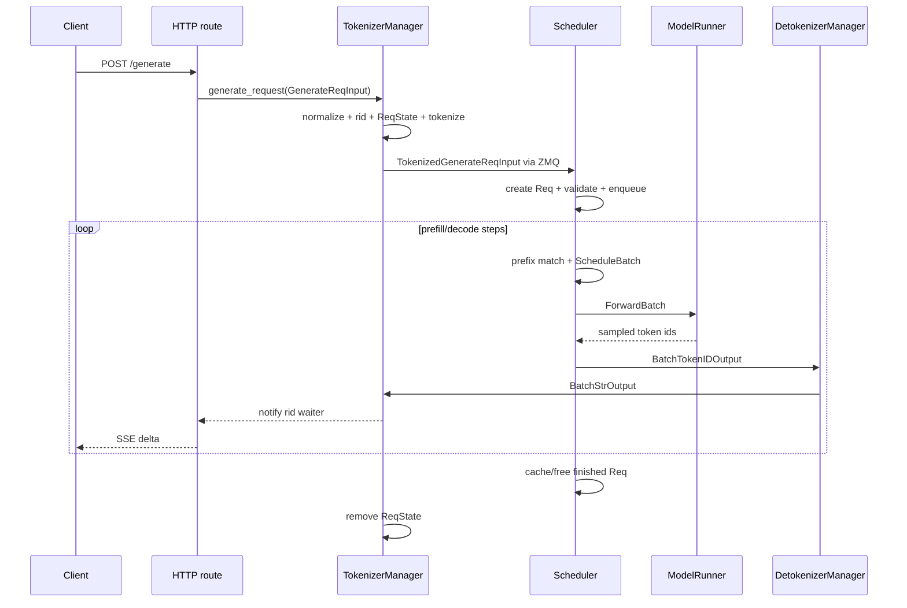

# 一条 SGLang 请求的生命周期

沿请求读源码时，最重要的不是函数数量，而是同一个 `rid` 在不同进程中的状态：主进程有 `ReqState`，Scheduler 有 `Req`，Detokenizer 有增量 decode 状态。三者生命周期必须一致，但对象不会跨进程共享内存。

## 全路径时序



## 1. HTTP route 只负责协议边界

native [`/generate`](https://github.com/sgl-project/sglang/blob/c879f3da5ceaaef3cb197c4e59ce683d420ce96c/python/sglang/srt/entrypoints/http_server.py#L814) 接收 `GenerateReqInput`，调用 TokenizerManager 的 async generator：

```text
HTTP body
→ Pydantic/dataclass request
→ tokenizer_manager.generate_request(obj, request)
→ 非流式 JSON 或流式 SSE
```

OpenAI chat route 会先做 messages、chat template、tool/reasoning 等协议转换，之后仍进入 Runtime 的生成接口。API 差异不意味着后端有两套 Scheduler。

## 2. TokenizerManager 建立前端状态

[`generate_request()`](https://github.com/sgl-project/sglang/blob/c879f3da5ceaaef3cb197c4e59ce683d420ce96c/python/sglang/srt/managers/tokenizer_manager.py#L612) 主要完成：

1. 规范化单条、batch 与 parallel sampling；
2. 分配或验证 `rid`，创建 `rid_to_state[rid]`；
3. 检查暂停、权重更新锁与 LoRA；
4. 把文本/多模态输入转成 token ids；
5. 构造 `TokenizedGenerateReqInput`；
6. `_send_one_request()` 发往 Scheduler；
7. `_wait_one_response()` 等待对应 `ReqState` 被通知。

`ReqState` 典型持有累计文本、output ids、完成标记、异步 event/queue 和请求原对象。它服务前端等待者，不负责 GPU KV。

## 3. 消息进入哪个 Scheduler

`dp_size=1` 时 TokenizerManager 直接把 tokenized request 发给 Scheduler group 的入口。普通 DP 时先到 DataParallelController，Controller 选择一个 replica；控制消息则可能广播。

TP ranks 通常都维护一致的调度视图，但入口/leader 负责接收或广播具体消息。最终每个参与 rank 都需要为同一次 forward 准备一致的 batch shape 和 distributed metadata。

## 4. Scheduler 创建真正的 `Req`

Scheduler 的类型 dispatcher 把 `TokenizedGenerateReqInput` 交给 [`handle_generate_request()`](https://github.com/sgl-project/sglang/blob/c879f3da5ceaaef3cb197c4e59ce683d420ce96c/python/sglang/srt/managers/scheduler.py#L2006)。这里才创建 [`Req`](https://github.com/sgl-project/sglang/blob/c879f3da5ceaaef3cb197c4e59ce683d420ce96c/python/sglang/srt/managers/schedule_batch.py#L677)。

`Req` 包含：

- `origin_input_ids`、`output_ids`、sampling params；
- `prefix_indices`、`last_node`、`req_pool_idx`；
- stream/logprob/grammar/LoRA/multimodal metadata；
- finished reason、时间统计和 priority；
- `extra_key` 等缓存身份。

Scheduler 校验长度和特性组合，初始化最大生成 token，再把请求加入 waiting queue。配置段存在不代表每个高级路径都兼容；很多组合在这里或更早被明确拒绝。

## 5. 从 waiting 到 running

新请求第一次被选择时：

```text
SchedulePolicy 计算优先级
→ RadixCache.match_prefix(req)
→ PrefillAdder 检查 token/KV/request-slot 预算
→ ScheduleBatch.init_new(reqs)
→ prepare_for_extend()
```

若 prompt 太长，可只调度一个 chunk；若完全命中前缀，也仍需为生成位置准备状态。prefill 完成后，请求并入 `running_batch`，之后通常每个 decode step 新增 token。

## 6. 一次 forward 后发生什么

`TpModelWorker` 把 `ScheduleBatch` 转为 `ForwardBatch`，`ModelRunner.forward()` 执行模型，最后一个 PP rank 执行 sampling。Scheduler 的 [`process_batch_result()`](https://github.com/sgl-project/sglang/blob/c879f3da5ceaaef3cb197c4e59ce683d420ce96c/python/sglang/srt/managers/scheduler.py#L3482) 根据 forward mode 更新每条请求：

- 追加 sampled token；
- 更新 logprob/grammar/speculative 状态；
- 检查 EOS、stop、长度或 abort；
- 流式发送 token ids；
- 完成时 cache/free KV 与 request slot。

输出是 batch 结构，但带 `rids`。下游依靠 `rid` 将每个元素路由回独立前端请求。

## 7. Detokenizer 与 TokenizerManager 如何接力

DetokenizerManager 维护每个 `rid` 的增量 decode 状态，避免每轮从头 decode 全序列。它返回 `BatchStrOutput`；TokenizerManager 的 [`handle_loop()`](https://github.com/sgl-project/sglang/blob/c879f3da5ceaaef3cb197c4e59ce683d420ce96c/python/sglang/srt/managers/tokenizer_manager.py#L1869) 再：

1. 按 `rid` 查 `ReqState`；
2. 累计文本或 output ids；
3. 合并 cached tokens、finish reason、logprob 等 metadata；
4. 唤醒 `_wait_one_response()`；
5. 完成后删除 `rid_to_state`。

流式模式可返回增量文本；某些配置返回累计文本。客户端若自己拼接输出，必须先理解 API 的 incremental 语义。

## 三份状态的分工

| 状态 | 进程 | 生命周期 | 关键清理 |
| --- | --- | --- | --- |
| `ReqState` | TokenizerManager | HTTP 请求开始到最后结果/异常 | 从 `rid_to_state` 删除、通知 waiter |
| `Req` | Scheduler | tokenized request 入队到完成/abort | cache/free KV、释放 request slot、移出队列 |
| decode status | DetokenizerManager | 第一批 token 到最后文本 | 删除增量 tokenizer 状态 |

任意一份泄漏都会表现为不同问题：前端内存增长、KV slot 不归还，或 detokenizer 状态达到上限。

## Abort 不是关掉 HTTP coroutine 就结束

客户端断开后，HTTP 层要触发 `AbortReq`，经 TokenizerManager 发给 Scheduler。Scheduler 可能需要：

- 从 waiting queue 移除；
- 标记 running `Req` 完成；
- 回收未共享 KV；
- 降低 radix lock refs；
- 释放 request pool row；
- 通知输出链路终止。

只取消前端 await 而不传播 abort，会让 GPU 继续为无人接收的请求生成。

## 关键不变量

```text
同一活跃 rid 在前端最多一个 ReqState
同一 Scheduler replica 中同一 rid 最多一个活跃 Req
Req 的逻辑 token 数与 request-pool 映射一致
finished/aborted Req 最终释放 request slot
共享 KV 只能在引用/锁语义允许时回收
最终输出必须路由回原 rid
```

## 源码练习

1. 在 TokenizerManager 的 `_tokenize_one_request()` 找到 `TokenizedGenerateReqInput` 的构造。
2. 在 Scheduler `handle_generate_request()` 记录哪些字段复制到 `Req`。
3. 在 `process_batch_result()` 找出普通 decode 的 finished 判断和 output streamer。
4. 在 TokenizerManager `_handle_batch_output()` 找出 `ReqState` 何时完成和删除。
5. 从 HTTP disconnect 反向追 `AbortReq` 到 KV 清理。

## 通关标准

不看图，解释一个 `rid` 为什么同时存在于三个进程、每份状态各存什么；再说明 stream 中断为何必须穿过 Scheduler 才算真正取消。

下一节进入[Scheduler 与 ScheduleBatch](./scheduler)，解释请求何时获准执行。
