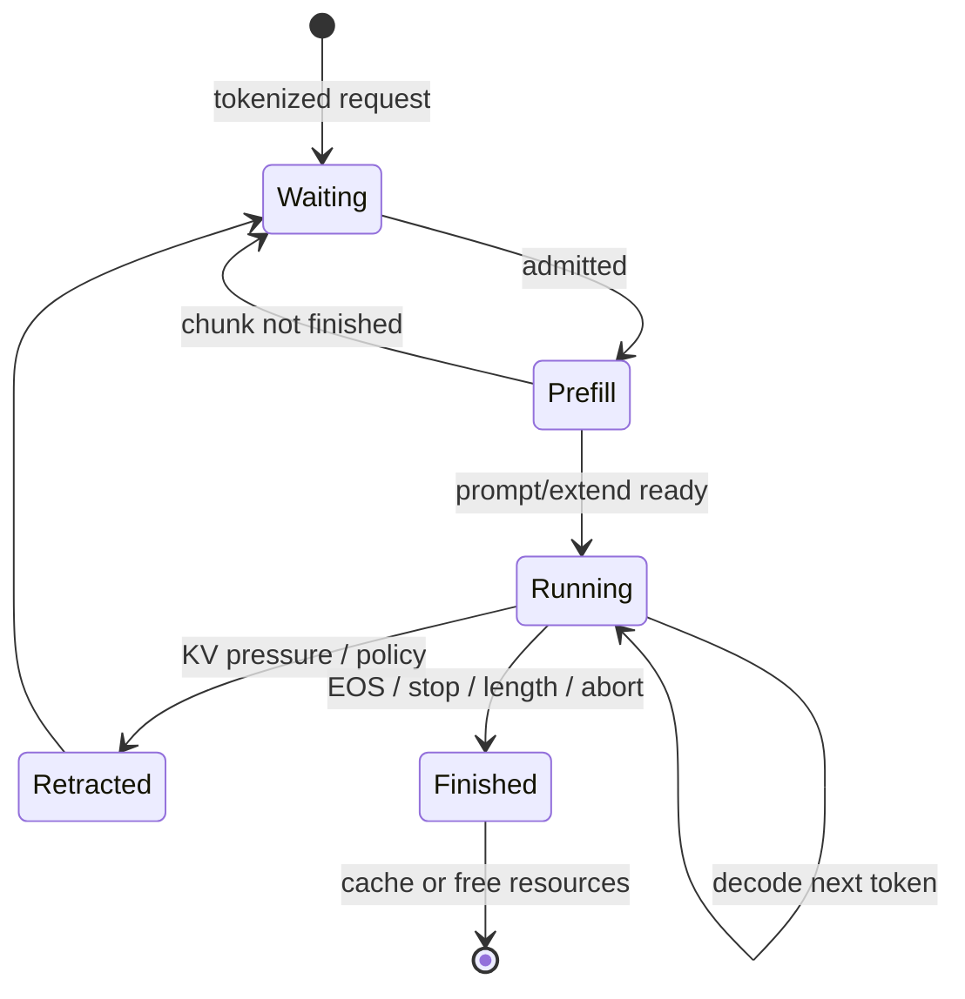
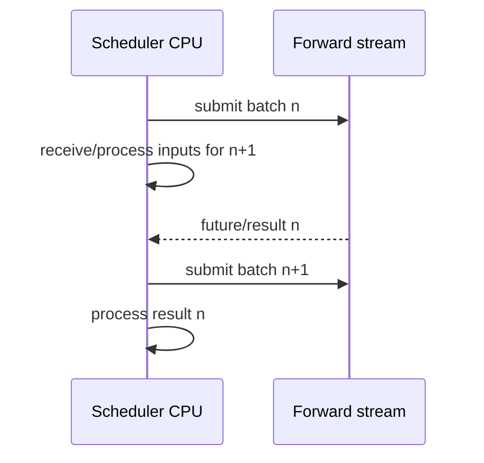

# Scheduler 与 ScheduleBatch：谁在下一轮获得 token

Scheduler 的工作不是“把所有 waiting 请求拼成 batch”。它要保证当前 running 请求能继续，选择新的 prefill，匹配/锁定前缀，检查 request slot 与 KV slot，并把本轮状态转换成 ModelRunner 可消费的张量。

## 四类核心状态



对应成员可概括为：

- `waiting_queue`：还未获准完成 prefill 的请求；
- `running_batch`：已进入 decode 或可继续运行的请求；
- `chunked_req`：长 prefill 尚未完成的请求；
- `last_batch` / result queue：overlap 路径中上一轮尚待处理的结果。

## 普通事件循环

[`event_loop_normal()`](https://github.com/sgl-project/sglang/blob/c879f3da5ceaaef3cb197c4e59ce683d420ce96c/python/sglang/srt/managers/scheduler.py#L1495) 的骨架：

```text
recv requests
→ process_input_requests
→ get_next_batch_to_run(running_batch, last_batch)
→ run_batch(plan.batch)
→ process_batch_result(batch, result)
```

每轮先吸收控制消息和新请求，再决定下一 batch。Scheduler 是单线程主循环时，昂贵的 CPU 工作、同步或日志也可能延迟 kernel launch。

## `get_next_batch_to_run()` 的优先顺序

固定源码中的 [`get_next_batch_to_run()`](https://github.com/sgl-project/sglang/blob/c879f3da5ceaaef3cb197c4e59ce683d420ce96c/python/sglang/srt/managers/scheduler.py#L2618) 大致：

1. 合并上一轮完成 prefill 的请求到 running batch；
2. 若条件允许，尝试 `get_new_batch_prefill()`；
3. 有新 prefill batch 就优先执行它；
4. 否则更新 running decode batch；
5. 内存不足时 retract、evict 或进入 idle/特殊路径；
6. speculative、DP attention、PP、PD 等可改写计划。

“prefill 优先”不表示 decode 永远饿死。PrefillAdder 的预算、running batch 状态、chunking 与策略共同限制新请求；具体公平性仍需用真实负载测。

## SchedulePolicy 决定顺序，不决定可执行性

[`SchedulePolicy.calc_priority()`](https://github.com/sgl-project/sglang/blob/c879f3da5ceaaef3cb197c4e59ce683d420ce96c/python/sglang/srt/managers/schedule_policy.py#L184) 可采用：

| 策略类 | 例子 | 倾向 |
| --- | --- | --- |
| cache-aware | LPM、DFS-weight | 优先更长命中或树局部性 |
| cache-agnostic | FCFS、LOF、random、routing key | 到达顺序、长度或外部路由 |

策略先对 waiting queue 排序并进行 prefix match，但排在第一不等于一定能进入 batch。内存、token、request slots、grammar/LoRA/模型限制仍由 admission 逻辑检查。

## PrefillAdder 是准入裁判

[`PrefillAdder`](https://github.com/sgl-project/sglang/blob/c879f3da5ceaaef3cb197c4e59ce683d420ce96c/python/sglang/srt/managers/schedule_policy.py#L441) 维护本轮预算，逐个尝试 `add_one_req()`。它必须考虑：

- 请求未缓存 extend 长度；
- 本轮 `max_prefill_tokens` 等 token 预算；
- 现有 running 请求未来 decode 所需空间；
- token/KV allocator 可用量；
- request pool row 数；
- chunked prefill、page alignment 与特殊模式。

准入失败可能表示“本轮放不下”，也可能表示请求永远不合法。调用者必须区分并防止一个不可运行请求永久卡住队列。

`PrefillAdder` 实际同时维护 input、chunk、KV、request row 四类预算；中间 chunk 怎样缓存并在最后一段转入 decode，见[Chunked Prefill 源码状态机](./chunked-prefill)。

## `ScheduleBatch` 不是请求列表那么简单

[`ScheduleBatch`](https://github.com/sgl-project/sglang/blob/c879f3da5ceaaef3cb197c4e59ce683d420ce96c/python/sglang/srt/managers/schedule_batch.py#L1760) 连接控制面与设备执行：

| 字段 | 含义 |
| --- | --- |
| `reqs` | 本轮请求对象 |
| `forward_mode` | extend/decode/verify/idle 等执行模式 |
| `input_ids` | 本轮要输入模型的新 token |
| `req_pool_indices` | 每请求映射表行号 |
| `seq_lens` | 当前逻辑序列长度 |
| `out_cache_loc` | 本轮新 K/V 写到的物理 slot |
| `prefix_lens` / `extend_lens` | 已复用与本轮新增长度 |
| `sampling_info` | temperature/top-k/top-p/grammar 等 batch 数据 |
| `spec_info` | speculative metadata |

`prepare_for_extend()` 和 `prepare_for_decode()` 会分配 slots、写 request→token 映射并构造 tensor。此后 `ForwardBatch.init_new()` 再补齐 position、attention metadata 等模型执行信息。

## 一个数值例子

本轮有：

```text
A: seq_len=100, decode 新增 1
B: prompt=80, radix 命中 60, extend 20
C: prompt=50, 命中 0, extend 50
token budget=40
```

可能的选择是保持 A decode，并接纳 B 的 20；C 留在 waiting。若策略先考虑 C，也可能把 C chunk 成 39 左右再与 A 协作，具体取决于 mixed chunk、预算定义和配置。

重点不是猜当前实现的精确数字，而是明确每个候选消耗的是**未缓存 token 和新 KV slot**，不是完整 prompt 长度。

## Decode 为什么也会内存不足

每个活跃序列每接受一个新 token，通常需要新的 KV slot。running batch 越大、输出越长，未来增长越多。`ScheduleBatch.check_decode_mem()` 会检查空间；不足时可能 evict 未锁缓存或 retract 某些请求回 waiting。

retraction 是吞吐与进度的保底机制，但会带来重复计算或尾延迟。生产中频繁 retraction 通常说明容量、长度分布或并发设置不匹配。

## Overlap loop 如何改变时序

[`event_loop_overlap()`](https://github.com/sgl-project/sglang/blob/c879f3da5ceaaef3cb197c4e59ce683d420ce96c/python/sglang/srt/managers/scheduler.py#L1529) 使用 result queue、future map、schedule/forward/copy streams：



为了避免 Scheduler 重写共享 staging buffers，而上一 forward 仍在读取，代码还维护 stream/event 的 WAR（write-after-read）barrier。Overlap 优化不是简单“删 synchronize”；错误同步会产生难以复现的数据竞争。

## `run_batch()` 与结果分派

[`run_batch()`](https://github.com/sgl-project/sglang/blob/c879f3da5ceaaef3cb197c4e59ce683d420ce96c/python/sglang/srt/managers/scheduler.py#L3220) 根据 forward mode 调用 model worker。[`process_batch_result()`](https://github.com/sgl-project/sglang/blob/c879f3da5ceaaef3cb197c4e59ce683d420ce96c/python/sglang/srt/managers/scheduler.py#L3482) 再分派到 decode、extend、embedding、idle 或 speculative 对应处理。

这条边界很适合调试：batch 选择错查 `get_next_batch...`；输入/slot 错查 prepare；kernel/采样错查 ModelRunner；结果状态错查 process result。

## 修改 Scheduler 前的四个不变量

1. 所有 TP/PP 参与 rank 对 batch shape 与顺序达成一致；
2. 每个新计算 token 有唯一合法的 `out_cache_loc`；
3. 活跃请求引用的 radix 节点不可被逐出；
4. 无论正常、abort、retract 或异常，request/KV slots 最终不泄漏。

## 通关练习

手工维护 `waiting_queue`、`running_batch`、free KV slots 和 token budget，模拟 5 个 step。每一步写：选了谁、forward mode、每条请求新增 token、分配的 slot、完成/重排动作。

能完成后进入[RadixCache 与内存池](./cache-pools)，把 `out_cache_loc` 接到真实地址模型。
