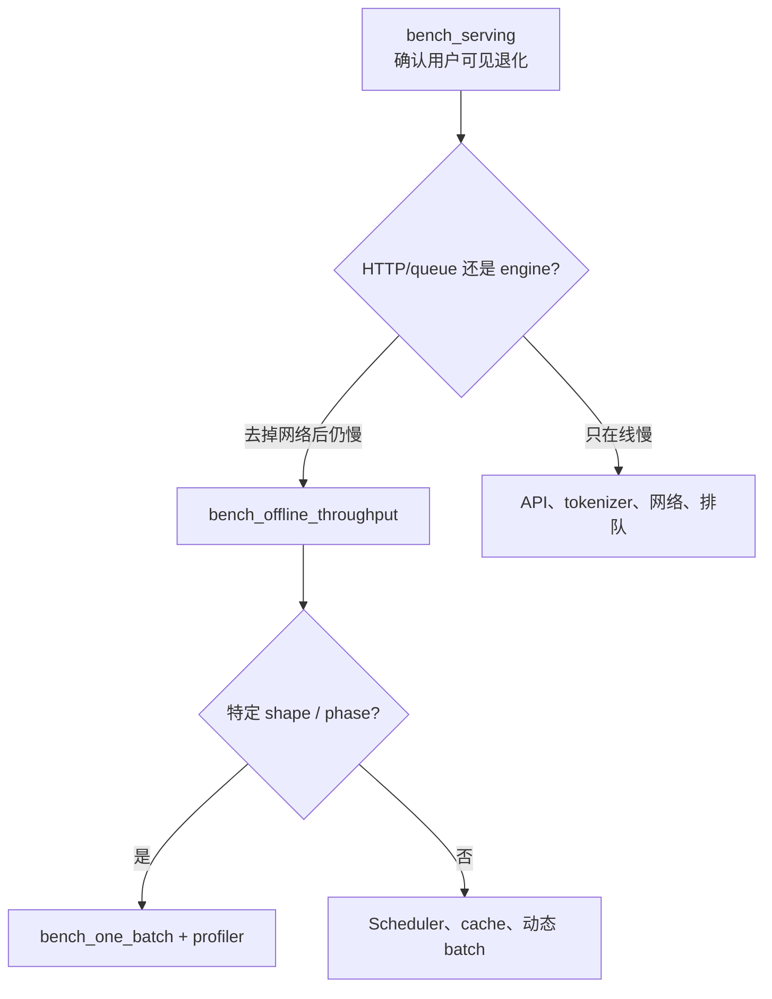

# SGLang 基准测试：负载、指标与单变量调参

一个随机 prompt 跑出很高 tokens/s，不代表生产服务快。有效基准必须固定模型与硬件，描述输入/输出长度和到达过程，同时报告延迟分位数、吞吐、失败和缓存状态。

## 先选对工具

SGLang 当前提供不同层级的 benchmark：

| 工具 | HTTP | Scheduler | 适合回答 |
| --- | --- | --- | --- |
| `bench_serving` | 有 | 有 | 真实在线 TTFT/ITL/吞吐，默认选它 |
| `bench_one_batch_server` | 有 | 有 | 单个固定 batch 的端到端延迟 |
| `bench_offline_throughput` | 无 | 有 | 去掉 HTTP 后的 engine 最大吞吐 |
| `bench_one_batch` | 无 | 无 | 固定 shape 的 ModelRunner/kernel microbenchmark |

越往下越容易控制变量，也越不像真实服务。不要用 `bench_one_batch` 的结果承诺在线 p99。

## 第一条稳态基线

先启动服务，再运行：

```bash
MODEL=Qwen/Qwen2.5-0.5B-Instruct

python3 -m sglang.bench_serving \
  --backend sglang \
  --host 127.0.0.1 \
  --port 30000 \
  --model "$MODEL" \
  --dataset-name random \
  --random-input-len 256 \
  --random-output-len 64 \
  --random-range-ratio 0.2 \
  --max-concurrency 16 \
  --num-prompts 160 \
  --warmup-requests 4 \
  --output-file baseline.jsonl \
  --output-details
```

`num_prompts` 至少取并发的约 5 倍，避免启动和最后排空阶段主导结果；这里取 10 倍。保存 `--output-details` 可在异常时检查每请求长度、TTFT、ITL 与错误。

## 到达率和并发不是一回事

- `--request-rate inf`：突发地尽快提交；适合测饱和吞吐，但不像平稳线上流量。
- 有限 `--request-rate R`：按随机到达过程发送，观察排队随负载变化。
- `--max-concurrency C`：限制同时在途请求，即使到达率更高也会在 client 侧受限。

用 Little's Law 建立直觉：

$$
L=\lambda W
$$

平均并发 (L) 约等于到达率 (lambda) 乘平均系统时间 (W)。接近服务容量时，吞吐可能只小幅增加，排队和尾延迟却急剧上升。

## 并发扫描

保持请求数据、服务配置和随机种子不变，分别测试：

```text
max_concurrency = 1, 4, 8, 16, 32, 64
num_prompts      = max(100, 10 × concurrency)
```

记录：

| 并发 | req/s | output tok/s | TTFT p50/p99 | ITL p50/p99 | E2E p99 | 成功率 |
| ---: | ---: | ---: | ---: | ---: | ---: | ---: |
| 1 | | | | | | |
| 4 | | | | | | |
| 8 | | | | | | |
| 16 | | | | | | |

目标不是最大 throughput 数字，而是找到满足 SLO 的最高负载和尾延迟拐点。

## 专门验证 RadixCache

使用当前 benchmark 的 shared-prefix 数据集：

```bash
python3 -m sglang.bench_serving \
  --backend sglang \
  --model "$MODEL" \
  --dataset-name generated-shared-prefix \
  --gsp-num-groups 8 \
  --gsp-prompts-per-group 16 \
  --gsp-system-prompt-len 512 \
  --gsp-question-len 32 \
  --gsp-output-len 32 \
  --max-concurrency 16 \
  --flush-cache \
  --output-file radix-on.jsonl \
  --output-details
```

然后以完全相同模型和负载，另启一个带 `--disable-radix-cache` 的服务，写入 `radix-off.jsonl`。比较 TTFT、input throughput 和总吞吐；ITL 不一定有同等幅度改善。

不要在同一运行中一边改变请求顺序一边比较 cache。prefix 热度、arrival order 和 DP 路由都会影响命中。

## 区分 TTFT、TPOT 与 ITL

`bench_serving` 会报告：

- TTFT：到首 token；
- ITL：相邻流式 token 事件间隔；
- TPOT：首 token 后平均每个 output token 的处理时间；
- E2E：整个请求完成时间；
- input/output/total token throughput；
- concurrency 与成功/失败详情。

TPOT 是整段平均，ITL 分布能暴露局部停顿；两者不要混称“每 token 延迟”。非流式请求的 TTFT 也会失去原本意义。

## 四个单变量实验

### A. Chunked prefill

负载用长输入、短输出。改变一个 prefill/token budget 参数，观察长请求 TTFT、短请求 p99 ITL 和 prefill throughput。若只跑同长度长请求，看不到公平性取舍。

### B. Overlap scheduler

同一 workload 比较默认与 `--disable-overlap-schedule`。同时采 GPU timeline 或至少查看 util 与 scheduler 日志，验证是否真的减少 CPU/GPU gap。

### C. 静态显存比例

小步调整 `--mem-fraction-static`，记录启动日志中的 token capacity、稳态吞吐与 OOM。每轮重启并确认 GPU 空闲状态一致。

### D. 调度策略

用共享前缀与普通请求混合负载比较 cache-aware 和 FCFS 等策略。除吞吐外必须检查低命中请求的等待与 p99，避免用平均收益掩盖饥饿。

## 结果不可信的信号

- warmup 与正式请求数量太少；
- 不保存失败请求，却用总提交数算吞吐；
- 两次运行的模型 revision、backend 或 GPU 时钟不同；
- 输入/输出长度只写目标值，不保存实际 token 数；
- 开启/关闭 cache 时请求顺序也变了；
- 只报告平均延迟；
- 用 burst throughput 代替目标 arrival rate 下的 SLO；
- client 与 server 跨网络，却不记录网络环境；
- 在同一 GPU 上留有其他任务。

## 从在线到 microbenchmark 的下钻顺序



这样才能把一个线上症状逐层缩小到可操作根因，而不是一开始就在 kernel trace 中寻找任何“看起来很长”的算子。

## 实验报告模板

```text
问题：
模型与 revision：
SGLang commit/package/image：
GPU / driver / CUDA：
服务命令：
benchmark 命令：
输入/输出长度分布：
前缀共享与 arrival 分布：
warmup / prompts / concurrency / request rate：
TTFT、ITL、E2E 分位数：
input/output throughput：
失败数与错误：
唯一自变量：
结果支持或推翻了什么：
下一步最小实验：
```

## 通关标准

你应能解释为什么 `concurrency=128` 与 `request_rate=128` 不是同一个实验，为什么 prefix cache A/B 要固定请求顺序，以及为什么 kernel microbenchmark 不能直接证明生产 p99。

下一节进入[进程与通信架构](../internals/architecture)，把指标对应到具体进程；需要可直接填写的命令、预期证据、失败分支与验收表时，使用[实验工作簿](./lab-workbook)。
