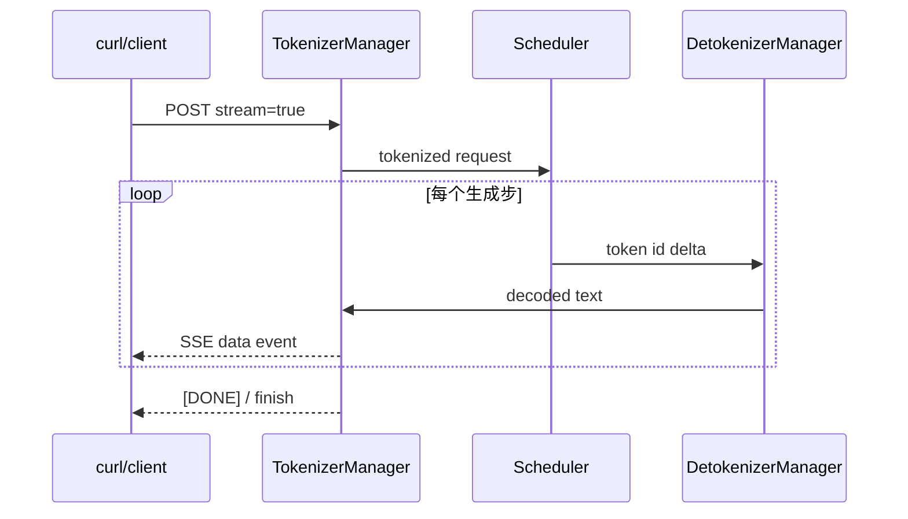

# 启动第一台 SGLang 服务：先证明链路正确

第一次实验的目标不是追求吞吐，而是留下证据：**版本明确、模型能加载、健康检查通过、两种 API 都返回、流式 token 能逐步到达、结果可解释。** 在这之前不要加量化、TP、speculative 或几十个调参项。

## 0. 先记录环境

```bash
nvidia-smi
python3 --version
python3 -m pip --version
```

至少记录 GPU 型号/数量、driver、CUDA runtime、操作系统和可用显存。SGLang、PyTorch、FlashInfer/其他 kernel backend 与驱动兼容性比 Python 命令本身更容易成为首个故障点。

## 1. 安装方式二选一

### 只想试用当前发行包

在独立虚拟环境中按[官方安装文档](https://docs.sglang.io/get_started/install.html)安装，并保存最终版本：

```bash
python3 -m venv .venv-sglang
source .venv-sglang/bin/activate
python3 -m pip install -U pip uv
uv pip install --prerelease=allow sglang
python3 - <<'PY'
import importlib.metadata
print(importlib.metadata.version("sglang"))
PY
```

### 要复查本站固定源码

```bash
git clone https://github.com/sgl-project/sglang.git
cd sglang
git checkout c879f3da5ceaaef3cb197c4e59ce683d420ce96c
python3 -m pip install -e python
git rev-parse HEAD
```

二者不要混用。若源码 checkout 正确但 Python 从另一份 site-packages 导入，阅读与运行会错位：

```bash
python3 - <<'PY'
import inspect, sglang
print(inspect.getfile(sglang))
PY
```

::: warning 可复现部署不要依赖可变标签
`latest`、nightly 和未锁定的预发布 wheel 会变化。探索可以用，生产实验必须保存 image digest 或完整包锁定信息。
:::

## 2. 用最少参数启动

以下模型小，适合验证链路；并不保证适配每种 GPU/后端：

```bash
MODEL=qwen/qwen2.5-0.5b-instruct

python3 -m sglang.launch_server \
  --model-path "$MODEL" \
  --host 127.0.0.1 \
  --port 30000 \
  --log-level info
```

等待日志出现 ready 信息。`127.0.0.1` 只允许本机访问，适合第一次实验；只有需要容器/远程访问并已配置防火墙、认证或反向代理时才绑定 `0.0.0.0`。

不要先加 `--mem-fraction-static`。让默认路径暴露真实的模型加载和显存探测结果；只有看见证据后再调。

## 3. 健康检查不等于生成检查

```bash
curl -fsS http://127.0.0.1:30000/health
curl -fsS http://127.0.0.1:30000/get_model_info
curl -fsS http://127.0.0.1:30000/server_info > server-info.json
```

- `/health` 证明服务能响应基本探测；
- `/get_model_info` 验证模型身份；
- `/server_info` 保存解析后的运行配置；
- `/health_generate` 或真实生成才会走更完整的模型路径。

固定源码中的路由见 [`http_server.py`](https://github.com/sgl-project/sglang/blob/c879f3da5ceaaef3cb197c4e59ce683d420ce96c/python/sglang/srt/entrypoints/http_server.py#L602)。

## 4. 先测 native `/generate`

```bash
curl -sS http://127.0.0.1:30000/generate \
  -H 'Content-Type: application/json' \
  -d '{
    "text": "The capital of France is",
    "sampling_params": {
      "temperature": 0,
      "max_new_tokens": 16
    }
  }' | tee native-response.json
```

检查：HTTP 200、返回非空文本、生成 token 数未超限制、finish reason 可解释。`temperature=0` 只是让 smoke test 更稳定，不代表生产采样配置。

native route 最终调用 [`TokenizerManager.generate_request()`](https://github.com/sgl-project/sglang/blob/c879f3da5ceaaef3cb197c4e59ce683d420ce96c/python/sglang/srt/managers/tokenizer_manager.py#L612)。

## 5. 再测 OpenAI chat API

```bash
curl -sS http://127.0.0.1:30000/v1/chat/completions \
  -H 'Content-Type: application/json' \
  -d '{
    "model": "qwen/qwen2.5-0.5b-instruct",
    "messages": [
      {"role": "user", "content": "只回答一个数字：1+1=?"}
    ],
    "temperature": 0,
    "max_tokens": 16
  }' | tee chat-response.json
```

这条路径还会验证 chat template 和 OpenAI schema。若 native API 正常而 chat API 报错，优先检查模型 tokenizer 的 chat template、模型 ID 和 route 转换，不要先怀疑 GPU kernel。

服务启动后还可访问：

```text
http://127.0.0.1:30000/docs
http://127.0.0.1:30000/openapi.json
```

## 6. 证明流式输出是真的流式

```bash
curl -N -sS http://127.0.0.1:30000/generate \
  -H 'Content-Type: application/json' \
  -d '{
    "text": "Count from one to five:",
    "sampling_params": {"temperature": 0, "max_new_tokens": 32},
    "stream": true
  }' | tee stream.txt
```

`-N` 禁用 curl 输出缓冲。你应看到多个 SSE `data:` 事件，而不是完成后一次性打印。若最后只收到一个事件，检查请求是否真的带 `stream`、代理是否缓冲，以及模型是否立即结束。



## 7. 最小并发正确性检查

不要直接上千请求。先并发四个不同 prompt，确认 request id 与输出没有串线：

```bash
for i in 1 2 3 4; do
  curl -sS http://127.0.0.1:30000/generate \
    -H 'Content-Type: application/json' \
    -d "{\"text\":\"Return exactly ID-$i\",\"sampling_params\":{\"temperature\":0,\"max_new_tokens\":16}}" \
    > "response-$i.json" &
done
wait
```

这不是性能测试，只验证并发请求的生命周期和输出路由。

## 常见首轮故障

| 现象 | 首要证据 | 下一步 |
| --- | --- | --- |
| import error | `inspect.getfile(sglang)`、包版本 | 清理环境混装，不先改源码 |
| 模型下载/权限失败 | 首个 traceback、HF cache/token | 验证模型路径和凭据 |
| attention backend 初始化失败 | GPU capability、backend 日志 | 按官方兼容说明换已支持 backend |
| 启动期 OOM | 加载、profile、graph 的具体阶段 | 减模型/精度，确认无其他 GPU 进程 |
| `/health` 成功但生成失败 | scheduler rank 的第一条异常 | 看子进程日志，不只看 HTTP 500 |
| chat 失败、native 成功 | chat template 与 schema | 修 API 层配置 |
| 远程无法连接 | bind 地址、防火墙、容器端口 | 先本机 curl，再逐层排网络 |

## 必须保存的证据包

```text
environment.txt        GPU / driver / OS / Python
revision.txt           SGLang、模型 revision、镜像 digest
launch.sh              完整启动命令
server-info.json       resolved server args
native-response.json   native smoke response
chat-response.json     OpenAI smoke response
stream.txt             SSE 原始事件
server.log             从启动到请求结束的日志
```

## 通关标准

你应能证明：主进程收到请求、Scheduler rank 完成至少一次 forward、DetokenizerManager 返回增量文本；并能解释为什么 `/health` 200 不能单独证明 GPU 生成链路健康。

下一步用[基准、指标与调参](./benchmark)从“能跑”进入“能测”。
