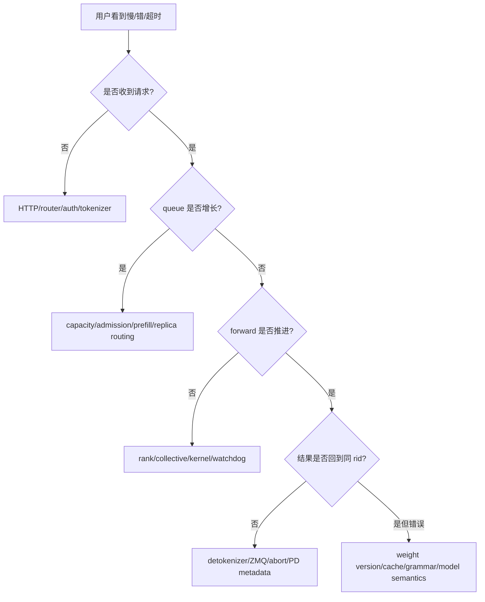

# SGLang 完整实验手册：从单卡到 PD 与 RL

本手册按风险逐级增加变量。每个实验先通过上一关，再进入下一关；没有多卡/IB/训练 checkpoint 时可以完成静态源码审查，但必须标“未运行”，不能把预期当实测。

## 统一实验约定

```bash
export MODEL='Qwen/Qwen2.5-0.5B-Instruct'   # 换成你有权限且显存可容纳的模型
export BASE_URL='http://127.0.0.1:30000'

python3 --version
python3 -m sglang.launch_server --help > sglang-launch-help.txt
python3 -m sglang.bench_serving --help > sglang-bench-help.txt
nvidia-smi > nvidia-smi.txt
python3 -m pip freeze > pip-freeze.txt
```

固定源码课程的 commit 是 `c879f3da5ceaaef3cb197c4e59ce683d420ce96c`。若运行 wheel/容器不是该 commit，命令以实际 `--help` 为准，并在报告中分开“课程源码结论”与“当前运行验证”。

每次实验保存：

```text
完整服务命令与 resolved ServerArgs
模型和 tokenizer revision
server/client 原始日志
输入、输出的实际 token 长度
benchmark JSONL 与失败请求
Prometheus /metrics 前后快照
GPU/CPU/网络采样
唯一自变量、结论、反例和回退条件
```

## 实验 1：最小服务与三层健康检查

### 启动

```bash
python3 -m sglang.launch_server \
  --model-path "$MODEL" \
  --host 127.0.0.1 \
  --port 30000 \
  --enable-metrics 2>&1 | tee server-minimal.log
```

不要第一轮就改 `mem_fraction_static`、attention backend、quantization 和 parallelism。先让自动解析结果成为基线。

### 检查

```bash
# 1. 进程活着
curl -fsS "$BASE_URL/health"

# 2. 模型元数据/协议可用
curl -fsS "$BASE_URL/v1/models"

# 3. 真正完成一次 GPU 生成
curl -fsS "$BASE_URL/generate" \
  -H 'Content-Type: application/json' \
  -d '{"text":"Reply with exactly: ready","sampling_params":{"temperature":0,"max_new_tokens":8},"rid":"lab1-generate"}'

# 4. metrics 能反映请求
curl -fsS "$BASE_URL/metrics" > metrics-lab1.txt
```

### 预期证据

- 日志显示模型加载、KV capacity、Scheduler ready，且没有 child traceback；
- `/health` 成功，但真正验收依赖 `/generate`；
- response 有非空 text、finish reason/metadata，并关联 rid；
- `sglang:prompt_tokens_total`、`sglang:generation_tokens_total` 增长；
- 请求结束后 `sglang:num_running_reqs` 与 `sglang:num_queue_reqs` 回落。

### 常见失败

| 现象 | 优先检查 | 不要先做 |
| --- | --- | --- |
| 下载/鉴权失败 | 模型路径、token、离线 cache | 调 KV 参数 |
| load 时 OOM | 权重精度、空闲显存、模型大小 | 降低 max concurrency（尚未运行请求） |
| ready 后首请求 OOM | resolved KV/graph/activation、输入长度 | 随意换 kernel |
| health 成功但 generate 卡住 | Scheduler child、tokenizer、GPU forward | 宣称服务可用 |

### 通过标准

连续 20 次短请求全部成功；无后台 traceback；最终 queue/running 回落；保存了完整 resolved args。完成后读[进程与消息流](../internals/message-flow)，把日志对应到实际角色。

## 实验 2：流式输出、并发和取消传播

### 流式请求

```bash
curl -N "$BASE_URL/generate" \
  -H 'Content-Type: application/json' \
  -d '{"text":"Count from 1 to 30, one number per line.","sampling_params":{"temperature":0,"max_new_tokens":100},"stream":true,"rid":"lab2-stream"}'
```

预期：不是等完整生成后一次返回；每个 chunk 仍能映射到相同 rid，最后有 finish reason。

### 并发正确性

用标准 shell 启动 16 个带不同 rid 的请求；这里只测正确性，不冒充 benchmark：

```bash
seq 1 16 | xargs -P 16 -I{} sh -c '
  curl -fsS http://127.0.0.1:30000/generate \
    -H "Content-Type: application/json" \
    -d "{\"text\":\"Return request number {}\",\"sampling_params\":{\"temperature\":0,\"max_new_tokens\":16},\"rid\":\"lab2-{}\"}" \
    > "lab2-{}.json"
'
```

检查 16 个文件都可解析且 rid/输出没有串线。然后发长 streaming 请求，在收到数个 chunk 后 Ctrl-C；等待几秒查看 queue、running 和 used tokens 是否回落。

失败模式：HTTP 断开但 Scheduler 仍持续生成，说明 abort 未传播或尚在安全 drain 窗口。结合 [`AbortReq`](https://github.com/sgl-project/sglang/blob/c879f3da5ceaaef3cb197c4e59ce683d420ce96c/python/sglang/srt/managers/io_struct.py#L1763) 与 chunked/PD queue 定位，不能只看 client PID。

通过标准：并发结果不串 rid；stream 真增量；取消后最终释放调度/KV 状态。

## 实验 3：结构化输出不是后处理

### 请求

固定版本官方 [`structured_outputs.mdx`](https://github.com/sgl-project/sglang/blob/c879f3da5ceaaef3cb197c4e59ce683d420ce96c/docs_new/docs/advanced_features/structured_outputs.mdx) 使用 `sampling_params.json_schema`。shell 中传 JSON 字符串：

```bash
python3 - <<'PY'
import json, urllib.request

schema = {
    "type": "object",
    "properties": {
        "city": {"type": "string", "enum": ["Paris", "Berlin"]},
        "population": {"type": "integer"},
    },
    "required": ["city", "population"],
    "additionalProperties": False,
}
body = json.dumps({
    "text": "Return information about the capital of France as JSON.",
    "sampling_params": {
        "temperature": 0,
        "max_new_tokens": 64,
        "json_schema": json.dumps(schema),
    },
    "rid": "lab3-json",
}).encode()
req = urllib.request.Request(
    "http://127.0.0.1:30000/generate", body,
    {"Content-Type": "application/json"}, method="POST"
)
result = json.load(urllib.request.urlopen(req))
parsed = json.loads(result["text"])
assert parsed["city"] in {"Paris", "Berlin"}
assert isinstance(parsed["population"], int)
print(result)
PY
```

### A/B

运行三组各 50 请求：无 schema、首次使用 50 个不同 schema、重复同一个 schema。记录 TTFT/ITL、grammar queue 与成功解析率。

预期关系：同 schema 可利用 grammar backend cache；首次 schema 编译可能增加 TTFT；每步 token mask 可能影响 ITL。具体数值取决于 backend 和 schema，不预设百分比。

失败模式：

- 400/unsupported：先查实际 `grammar_backend` 与 schema 字段；
- 首次慢：查 grammar compile/queue；
- JSON 可解析但事实错误：这是模型/业务校验，不是 grammar bug；
- overlap 下显存增长：查 sampling mask/closure 生命周期与固定提交对应修复，不要关掉校验掩盖。

通过标准：100% schema validation；能用指标区分 compile wait 与逐 token mask；额外业务规则仍由应用层验证。

## 实验 4：RadixCache 与 chunked prefill 的因果实验

### 共享前缀 A/B

```bash
python3 -m sglang.bench_serving \
  --backend sglang \
  --model "$MODEL" \
  --dataset-name generated-shared-prefix \
  --gsp-num-groups 8 \
  --gsp-prompts-per-group 16 \
  --gsp-system-prompt-len 512 \
  --gsp-question-len 32 \
  --gsp-output-len 32 \
  --max-concurrency 16 \
  --flush-cache \
  --output-file radix-on.jsonl \
  --output-details
```

以相同请求顺序另启 `--disable-radix-cache` 服务，写 `radix-off.jsonl`。如果 benchmark generator 未提供固定 seed/导出输入，先生成并保存 dataset，确保 A/B 完全一致。

观察：cache hit、input throughput、TTFT、ITL、结果与 p99。预期 Radix 主要减少重复 prefix prefill；ITL 不必同比改善。

### Chunk A/B/C

按[chunked prefill 深读](../internals/chunked-prefill)分别使用 `-1/1024/4096`，混合一个长 prompt 与持续短 prompts。每组重新启动、warmup、保存 resolved args。

通过标准：能从 `extend_range → KV slots → stash → next chunk` 解释指标；没有只凭“chunk 越小越快”下结论；没有 retraction/OOM 被吞掉。

## 实验 5：在线容量曲线与单变量调优

### 基线命令

```bash
python3 -m sglang.bench_serving \
  --backend sglang \
  --host 127.0.0.1 \
  --port 30000 \
  --model "$MODEL" \
  --dataset-name random \
  --random-input-len 256 \
  --random-output-len 64 \
  --random-range-ratio 0.2 \
  --max-concurrency 16 \
  --num-prompts 160 \
  --warmup-requests 4 \
  --output-file baseline.jsonl \
  --output-details
```

固定版本官方 benchmark 文档要求 `num-prompts >= 5 × max-concurrency`；这里取 10 倍。扫描 `max_concurrency=1,4,8,16,32,64`，同时扫描有限 request rate，找到满足 SLO 的最高 goodput，而不是最大 burst tok/s。

### 调优顺序

1. 先确认错误率与 queue saturation；
2. TTFT 高、ITL 正常：查 queue/prefill/cache/tokenizer；
3. ITL 高：查 decode batch、memory bandwidth、prefill interruption/collective；
4. used token 接近上限/retraction：查 KV budget、输出长度、cache locks；
5. GPU 有空洞：再查 overlap、CPU scheduler、shape/graph；
6. 只有定位到 kernel shape 后才用 `bench_one_batch`/profiler。

每次只改一个主变量：chunk、overlap、memory fraction、schedule policy、backend 或 parallelism。若自动参数会连带变化，把 resolved diff 一起记为多个变量。

### 通过标准

报告 TTFT/ITL/E2E p50/p95/p99、input/output throughput、成功率、queue/running/used tokens、cache hit 和 GPU 利用；指出容量拐点与回退配置。

## 实验 6：TP、DP 与多节点

### TP=2

```bash
CUDA_VISIBLE_DEVICES=0,1 python3 -m sglang.launch_server \
  --model-path "$MODEL" --tp 2 --port 30000 \
  --enable-metrics 2>&1 | tee server-tp2.log
```

核对：两个 Scheduler ranks、各自 GPU assignment、distributed group ready；生成正确；没有 NCCL timeout。与单卡比较显存、单请求延迟和并发吞吐。小模型 TP=2 可能更慢，这是有效结论。

### DP=2

```bash
CUDA_VISIBLE_DEVICES=0,1 python3 -m sglang.launch_server \
  --model-path "$MODEL" --dp-size 2 --port 30000 \
  --enable-metrics 2>&1 | tee server-dp2.log
```

核对 DataParallelController 与两个 replica；按 DP rank 看 queue/token/cache hit。请求数均衡不代表 token 工作量均衡。

### 两节点 TP

固定版本官方 [multi-node 示例](https://github.com/sgl-project/sglang/blob/c879f3da5ceaaef3cb197c4e59ce683d420ce96c/docs_new/docs/references/multi_node_deployment/multi_node.mdx) 使用全局 `--tp`：

```bash
# node 0
python3 -m sglang.launch_server --model-path "$MODEL" \
  --tp 16 --nnodes 2 --node-rank 0 \
  --dist-init-addr 10.0.0.10:20000

# node 1，模型/参数/环境必须一致
python3 -m sglang.launch_server --model-path "$MODEL" \
  --tp 16 --nnodes 2 --node-rank 1 \
  --dist-init-addr 10.0.0.10:20000
```

根据实际每节点 GPU 数调整全局 TP。非零 node rank 不运行 tokenizer/detokenizer/HTTP 主服务；不要对 node 1 的普通端口健康结果做错误推断。

### Ray actor 路径 A/B

先读[Ray 在 SGLang 中的源码边界](../advanced/distributed#ray-在-sglang-中到底做什么)。在单机两卡环境中，以完全相同的 `MODEL/TP=2/workload` 分别运行普通 multiprocessing 与 `--use-ray`：

```bash
ray start --head --num-gpus=2
RAY_ADDRESS=auto python3 -m sglang.launch_server \
  --model-path "$MODEL" --tp 2 --use-ray --port 30000 \
  --enable-metrics 2>&1 | tee server-ray-tp2.log

ray status
ray list actors --detail | rg 'sglang_scheduler|State|GPU'
ray list placement-groups --detail
```

预期 actor 数等于 `DP×TP×PP=2`，每个 actor 一张 logical GPU，名称包含 TP rank；再发真实生成并运行同一小型 benchmark。若 actor `PENDING`，先查 bundles/resources；若 actor `ALIVE` 但生成卡住，转查 ZMQ、NCCL 和 Scheduler 日志。实验结束只在自建单机执行 `ray stop`。

失败矩阵：

| 现象 | 证据 |
| --- | --- |
| init timeout | host/port、防火墙、rank/nnodes、时间同步 |
| 某 rank OOM | 每 rank shard/graph/KV、GPU 被占用 |
| 首轮 collective hang | NCCL topology/interface/P2P/IB logs |
| 只某 DP rank queue 高 | controller routing、请求 token/命中差异 |
| Ray actor pending | placement group/logical GPU，而非 SGLang queue |

通过标准：rank 映射与公式一致；每 rank 都有 ready 证据；真正生成和并发 benchmark 成功；杀掉一个 rank 时服务明确失败/恢复，不返回悄悄错误结果。

## 实验 7：PD 与 HiCache

按[PD/HiCache 深读](../advanced/pd-hicache)完成，顺序不能反：

1. unified single instance 基线；
2. P/D 两实例 + router，证明 handoff；
3. 记录 bootstrap、prealloc、transfer、prebuilt、decode；
4. 单独启用 L1/L2 HiCache；
5. 最后才组合 PD × HiCache 或 L3 backend。

### 故障注入

- 请求进行中停掉一个 prefill worker；
- 让 transfer backend 地址/设备错误；
- 限制 decode KV 使 prealloc 紧张；
- L3 storage 延迟/超时；
- 重启一侧但不重启另一侧。

验收：每次失败都能按同一 rid 解释；两侧 sender/receiver/metadata/KV 最终清理；没有 bootstrap-room mismatch 后继续生成；fallback 不牺牲输出正确性。

## 实验 8：RL pause、换权、验权与恢复

只在隔离环境使用两个可区分 checkpoint。管理接口必须启用独立 admin 鉴权。

```bash
export ADMIN_KEY='replace-with-a-test-only-secret'
# rollout server 启动参数需包含：--admin-api-key "$ADMIN_KEY"
```

### 基线 probe

使用 temperature=0 的固定 prompts，保存 token ids、text、logprobs、`weight_version=v0` 与每 rank checksum。

### 三种 pause 分别演练

1. `abort`：旧请求明确失败且资源回收；
2. `in_place`：同权重恢复后请求继续，期间不可 flush active KV；
3. `retract`：请求重新 prefill，允许换权/flush；PD 另做 rebootstrap 测试。

### 换权事务

```bash
curl -fsS -X POST "$BASE_URL/pause_generation" \
  -H "Authorization: Bearer $ADMIN_KEY" \
  -H 'Content-Type: application/json' -d '{"mode":"abort"}'

curl -fsS -X POST "$BASE_URL/update_weights_from_disk" \
  -H "Authorization: Bearer $ADMIN_KEY" \
  -H 'Content-Type: application/json' \
  -d '{"model_path":"/checkpoints/v1","weight_version":"v1","token_step":1,"flush_cache":true}'

curl -fsS -X POST "$BASE_URL/weights_checker" \
  -H "Authorization: Bearer $ADMIN_KEY" \
  -H 'Content-Type: application/json' -d '{"action":"checksum"}'

curl -fsS -X POST "$BASE_URL/continue_generation" \
  -H "Authorization: Bearer $ADMIN_KEY" \
  -H 'Content-Type: application/json' -d '{"torch_empty_cache":true}'
```

### 验收

- 所有预期 ranks checksum/版本一致；
- v1 probe 与该 checkpoint 的离线参考在容差内；
- metrics/log 中 weight load duration 可定位；
- cache 已清，没有 v0 prefix 被 v1 命中；
- 并发换权时每条 rollout 只能标 v0 或 v1，不存在未知/混合版本；
- 任一 rank 更新失败时 group 保持下线并重建/回滚。

与 veRL 联调时，再把 trainer global step、SGLang `token_step/weight_version`、rollout sample id 对齐。veRL 的 Ray controller 成功不等于 SGLang 每个 scheduler rank 已换权；两层都要独立验收。

## 最终故障树



处置顺序：保护流量和数据 → 保存首个异常 rank/trace → 按所有权缩小层级 → 最小复现 → 修复后跑正确性、性能与故障恢复回归。不要通过无限加 timeout、关闭校验或吞掉失败请求制造“绿色”。

## 毕业证据包

提交一份目录或报告，至少包括：

- 单卡、TP/DP（有硬件时）的角色图和真实 PID/rank；
- 一个 rid 的输入、batch、pool/cache、forward、输出 trace；
- radix 与 chunked A/B；
- 一条带分位数和失败率的容量曲线；
- 一次取消/故障恢复；
- 一次结构化输出 schema + 业务校验；
- 有条件时完成 PD/HiCache 或 RL 换权事务；
- 每个结论的源码符号、运行证据与适用条件。

完成这些后回到[六周计划](../guide/study-plan)做闭卷答辩，并用[官方与源码索引](../appendix/references)检查版本边界。
