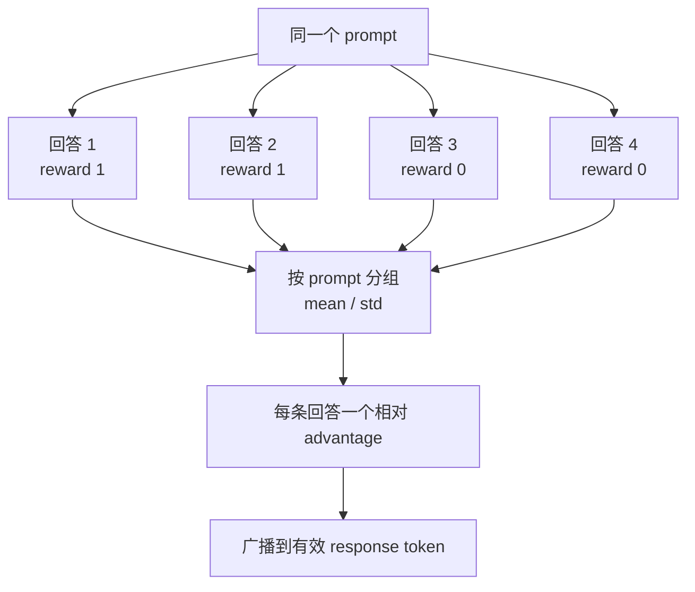
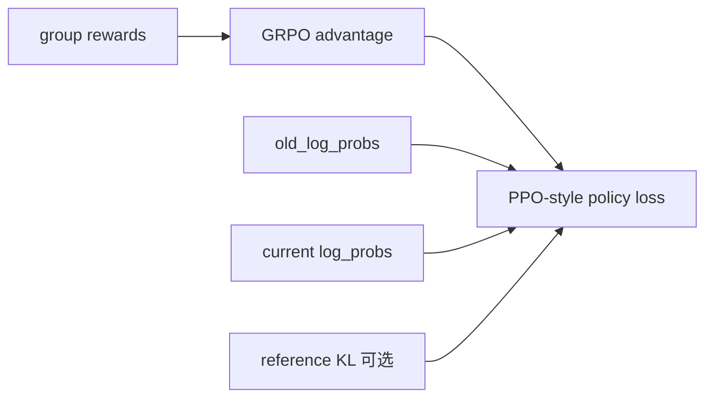

# GRPO、Dr.GRPO 与 DAPO：先拆层，再谈算法名

假设同一道数学题让模型答四次，reward 是：

```text
response A: 1
response B: 1
response C: 0
response D: 0
```

我们不训练 critic，也能比较：A/B 高于本组平均水平，C/D 低于平均水平。GRPO 的关键想法就是用**同一 prompt 的候选组**构造相对 baseline，从而省去独立 value model。

[DeepSeekMath](https://arxiv.org/abs/2402.03300)提出 GRPO；后续 [Understanding R1-Zero-Like Training](https://arxiv.org/abs/2503.20783)分析了标准化和长度相关偏差并提出 Dr.GRPO；[DAPO](https://arxiv.org/abs/2503.14476)则组合多项技术形成大规模训练 recipe。它们不是三个可以直接互换的单一开关。

## 先用人话：同题互评，而不是老师预测

PPO+GAE 的 critic 像“老师预估这一步通常能得多少分”；GRPO 更像让同一道题的多份答卷互相比较。



好处：不用为每个 token 训练 value critic，显存和系统角色更简单。代价：同题要生成多份回答，rollout 成本增加；组内没有差异时就没有相对学习信号。

## 专业模型：组内标准化

对 prompt 组 \(g\) 的 \(G\) 个 outcome reward：

$$
\mu_g=\frac1G\sum_{i=1}^{G}r_i,
\qquad
\sigma_g=\sqrt{\frac1{G-1}\sum_i(r_i-\mu_g)^2}.
$$

标准 GRPO 形式：

$$
A_i=\frac{r_i-\mu_g}{\sigma_g+\epsilon}.
$$

得到 `[B]` 的序列优势后，当前 veRL outcome estimator 将它扩展到 `[B,R]`：

$$
A_{i,t}=A_i\cdot\text{response\_mask}_{i,t}.
$$

这里所有有效 token 得到同一个序列级优势。它没有识别哪一步推理更关键；最终每条回答权重还会受到 policy loss aggregation 影响。

## 手算一组，先看正负和零信号

对 `[1,1,0,0]`，均值 0.5，减均值后：

```text
[+0.5, +0.5, -0.5, -0.5]
```

除标准差只改变尺度，不改变组内正负排序。若 reward 为 `[1,1,1,1]` 或 `[0,0,0,0]`，减均值后全为 0，这组基本不给策略梯度。

这解释了三个工程现象：

- `rollout.n > 1` 才具有通常的组内比较意义；
- 增加 n 可能提升发现差异的概率，但生成成本线性增加；
- 动态采样过滤全对/全错组可以提高“有效梯度密度”，同时也会改变训练数据分布。

## 当前 veRL 的准确落点

[`compute_grpo_outcome_advantage`](https://github.com/verl-project/verl/blob/e5687fce0516d31e1fdc4580499074a9bd94c751/verl/trainer/ppo/core_algos.py) 会：

1. 对 `token_level_rewards` 沿 response 求和，得到每条回答 score；
2. 用 `index`/样本身份聚合同一 prompt 的回答；
3. 计算组内 mean/std；
4. 标准化或只减均值；
5. 把标量乘 `response_mask` 广播回 token。

配置中的关键关系：

```yaml
algorithm:
  adv_estimator: grpo
  norm_adv_by_std_in_grpo: true

actor_rollout_ref:
  rollout:
    n: 8

critic:
  enable: false
```

这是意图片段，不是完整可运行配置。还要确认 ReplayBuffer 取到完整 prompt group、reward 有区分度、group identity 没在数据变换中丢失。

::: warning 组大小为 1 不是“小一点的 GRPO”
固定源码的非向量化实现对单元素组设 `mean=0, std=1`，输出接近原 score，而不是通常意义的组内中心化。实验应显式保证 `rollout.n>1` 和完整分组，不能依赖这个边界行为。
:::

## Dr.GRPO：一个 flag 只覆盖一部分思想

当前源码注释把：

```yaml
algorithm:
  adv_estimator: grpo
  norm_adv_by_std_in_grpo: false
```

对应到“不除组标准差”的 Dr.GRPO advantage 形式：

$$
A_i=r_i-\mu_g.
$$

但 Dr.GRPO 论文讨论的不只这一个分母，还包括 token/response 长度归一化导致的优化偏差。要声称复现完整 Dr.GRPO，必须同时核对 policy loss 的 `loss_agg_mode`、长度分母、采样和其他设置。**一个 advantage flag 只改变组内标准差，不能代表整套 recipe。**

## 把“算法”拆成五层

阅读论文或配置时，用这张表避免把名字混在一起：

| 层 | 关键问题 | veRL 中常见落点 |
| --- | --- | --- |
| Sampling | 每个 prompt 生成几份、是否过滤 | rollout `n`、ReplayBuffer/采样策略 |
| Reward | 正确性、格式、长度怎样评分 | reward function/manager、KL in reward |
| Advantage | 与哪个 baseline 比、怎样归一化 | `algorithm.adv_estimator` 与参数 |
| Policy loss | ratio 怎样约束、token 怎样聚合 | actor `policy_loss`、clip、`loss_agg_mode` |
| System | 同步/异步、角色如何放置 | trainer mode、资源池、TransferQueue |

论文名称常横跨前四层，系统实现还加入第五层。只搜索 `adv_estimator` 会漏掉 recipe 的大部分。

## DAPO 为什么不是 `adv_estimator=dapo`

DAPO 的核心技术横跨：

- **Clip-Higher / decoupled clipping**：正负方向可用不同 clip 边界；
- **Dynamic Sampling**：过滤组内全对/全错，保持有梯度的 prompt 数量；
- **Token-level Policy Gradient Loss**：改变长回答之间的 loss 聚合；
- **Overlong Reward Shaping**：对过长回答做平滑惩罚，而非只在硬截断处突变。

因此在当前 [`AdvantageEstimator`](https://github.com/verl-project/verl/blob/e5687fce0516d31e1fdc4580499074a9bd94c751/verl/trainer/ppo/core_algos.py) 中找不到一个代表整套 DAPO 的枚举是合理的。复现时要对照 recipe 的采样脚本、reward manager、clip 高低界和 loss aggregation，而不是发明 `adv_estimator: dapo`。

## 相关 estimator 应怎样理解

| 名称 | baseline / 信号核心 | 主要取舍 |
| --- | --- | --- |
| GAE | critic value + 多步 TD residual | 需要 critic，token 级 value 更细 |
| GRPO | 同 prompt 组均值/标准差 | 省 critic，需多候选，零方差组无信号 |
| Dr.GRPO 形式 | 组均值，不除组 std | 减少一类缩放偏差；完整 recipe 还看 loss |
| RLOO | 其余候选的 leave-one-out 均值 | 避免把自身 reward 放进 baseline |
| ReMax | 贪心回答 reward | 需额外 baseline rollout |
| GDPO | 多 reward 维度分别组内归一化再加权 | 防止强 reward 维度淹没弱维度 |
| REINFORCE++ 系列 | return/advantage 的不同归一化与 baseline | 具体看注册函数，不靠名称猜 |

固定源码还注册向量化变体、GPG、OPO、token baseline 等。选择时先写清任务需要的 baseline，再去找 estimator，而不是反过来按流行名称选。

## GRPO 与 PPO 的关系



GRPO 主要回答“优势怎样构造”；PPO-style loss 回答“当前策略怎样利用旧样本而不过度更新”。KL、rollout correction、length aggregation 仍是独立维度。

## 选择前先问四个问题

1. 同一 prompt 能否低成本生成多个候选？
2. reward 在组内是否常有差异，还是容易全对/全错？
3. 任务需要细粒度 token value，还是 outcome 相对比较够用？
4. 你的论文 recipe 对 loss 分母、长度、过滤和 clip 有什么明确要求？

如果答不出第 4 题，不要先跑“大规模复现”。先用四条人工 reward 手算 estimator，再写 tiny tensor 测试。

## 通关检查

你应该能解释：GRPO 省掉的是什么、没有省掉的是什么；全对组为什么无信号；`norm_adv_by_std_in_grpo=false` 具体改变哪一步；为什么 DAPO 不能由单个枚举表示；组内 advantage 广播到 token 后为什么仍可能有长度偏差。

理论地基到这里完成。下一站先不要继续读源码：去做[第一次可验证实验](/verl/practice/first-run)，让这些字段真正出现一次。
