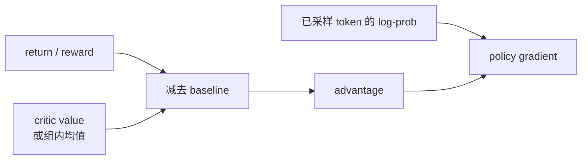
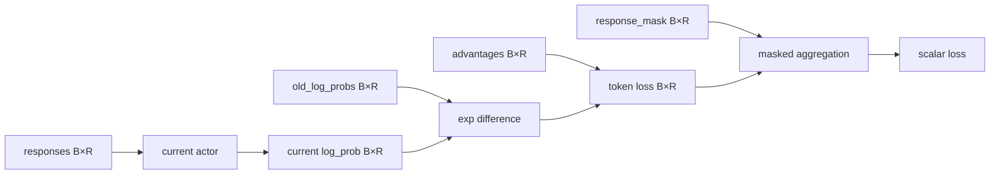

# 策略梯度：从奖励到参数更新的那座桥

这是整套课程最关键的一座桥。若这里不清楚，PPO 的 ratio、GRPO 的组内优势和 veRL 的 `old_log_probs` 都会变成要背的零件。

问题看起来很棘手：模型采样了 token `42`，评分器运行测试后给 1 分。token ID 不能求导，测试结果也不能对模型参数求导。怎样把这 1 分传回模型？

## 先用人话：不对结果求导，对“选择它的倾向”求导

模型虽然无法对离散选择本身求导，却能计算：参数稍微变化时，**这次已选 token 的 log-prob 会怎样变化**。

训练规则可以简化成：

```text
这次选择比基线好：提高做出同类选择的倾向
这次选择比基线差：降低做出同类选择的倾向
```

“提高倾向”的可微对象就是 \(\log\pi_\theta(a_t\mid s_t)\)；“好多少”由 advantage \(A_t\) 提供。

## 最小公式：log-prob 乘 advantage

策略梯度的采样估计具有下面的核心形式：

$$
\nabla_\theta J(\theta)
\approx\sum_t
\nabla_\theta\log\pi_\theta(a_t\mid s_t)\hat A_t.
$$

阅读它不需要先做证明：

- `log π` 指模型给**已采样动作**的 log-prob；
- `∇θ` 指改变参数后 log-prob 的方向；
- `Â` 的正负决定沿该方向走还是反方向走；
- 对 t 求和，把轨迹中有效 token 的信号合起来。

训练框架最小化 loss，所以最朴素的 policy loss 写成：

$$
L_{PG}=-\operatorname{mean}_{t\in response}
\left[\log\pi_\theta(a_t\mid s_t)\hat A_t\right].
$$

负号只是把“最大化目标”改写为“最小化损失”。

## 为什么 log 技巧成立（可选推导）

目标是策略下回报的期望：

$$
J(\theta)=\sum_\tau p_\theta(\tau)R(\tau).
$$

对参数求导，并使用 \(\nabla p=p\nabla\log p\)：

$$
\nabla_\theta J
=\sum_\tau p_\theta(\tau)
\nabla_\theta\log p_\theta(\tau)R(\tau)
=\mathbb E_{\tau\sim\pi_\theta}
[\nabla_\theta\log p_\theta(\tau)R(\tau)].
$$

轨迹概率是逐动作概率之积，所以 log 后变成逐 token 之和。减去不依赖当前动作的 baseline 不改变期望梯度，却能降低方差，于是 reward/return 被 advantage 替代。

原始 REINFORCE 思想可追溯到 Williams 1992；PPO 在此基础上处理重复使用一批采样数据时的稳定更新。[PPO 原论文](https://arxiv.org/abs/1707.06347)给出了 clipped surrogate 等形式。

## 一个两动作数值例子

在状态 s，模型对两个 token 的概率为：

```text
P("对") = 0.6
P("错") = 0.4
```

这次采样到“对”，advantage=+0.8。loss 中对应 `-log(0.6)×0.8`，梯度会提高“对”的 logit，相对降低另一个动作概率。

若采样到“错”，advantage=-0.8，方向反过来。注意我们没有告诉模型正确 token 是什么；只对它实际尝试过的动作做 credit assignment。因此探索分布与采样覆盖很重要。

## 为什么要减 baseline

如果所有成功轨迹都直接乘 reward，梯度估计方差可能很大。baseline 把“绝对得分”变成“超出预期的得分”。只要 baseline 在给定 state 时不依赖当前采样动作，减去它不会改变期望策略梯度。



GAE、GRPO、RLOO、ReMax 的重要差异之一，就是 baseline 和 advantage 怎样估计。

## 为什么旧样本需要概率比

采样数据来自旧策略 \(\pi_{old}\)，更新时参数已变成 \(\pi_\theta\)。对同一个动作定义：

$$
r_t(\theta)=\frac{\pi_\theta(a_t\mid s_t)}
{\pi_{old}(a_t\mid s_t)}
=\exp(\log\pi_\theta-\log\pi_{old}).
$$

ratio=1 表示当前与旧策略对该动作态度相同；大于 1 表示更偏爱；小于 1 表示更不偏爱。朴素重要性加权目标 \(r_t\hat A_t\) 可以利用旧策略样本，但 ratio 过大/过小会使更新不稳定。PPO 下一课要解决的正是“别让这一步走太远”。

## 从公式落到 `[B,R]`



三件事必须同时正确：

1. 当前与旧 log-prob 对齐同一批 token；
2. advantage 与 token 位置对齐，或按算法有意广播；
3. 聚合只统计 `response_mask=1` 的位置。

任何一个 shape 能 broadcast 并不代表语义正确。最危险的 bug 往往“不报错、loss 也会下降”。

## 熵与 KL 分别在防什么

- entropy 描述当前分布有多不确定；熵太低可能过早失去探索，但强行增熵也可能破坏质量；
- KL 描述当前策略与 reference/old 等分布的偏离；它可作为 penalty、loss 或监控量，具体方向与 estimator 要看实现。

它们都不是 reward 的替代品。只看 entropy 或 KL 单指标，无法判断任务是否学会。

## 三个必须能预测的场景

| 场景 | 应预测的更新倾向 |
| --- | --- |
| advantage 为正，ratio 从 1.0 升到 1.1 | 继续提高该动作概率通常有收益 |
| advantage 为负，ratio 从 1.0 降到 0.9 | 降低坏动作概率通常有收益 |
| advantage 为 0 | 无论 log-prob 多大，该样本的基本 PG 信号为 0 |

PPO clipping 会在 ratio 越过边界时改变前两行的收益，不是把 ratio 永远截回区间，也不是保证整体策略 KL 严格受限。

## 通关检查

用三句话完成：

1. 为什么离散 token 仍能训练？
2. advantage 正负分别怎样改变已采样 token 的概率？
3. `old_log_probs` 为什么出现在使用旧策略数据的更新中？

再画出 `responses → current log_prob + old_log_probs + advantages + mask → scalar loss`。如果能标注每项 shape，就可以进入[PPO 与 GAE](./ppo)。
