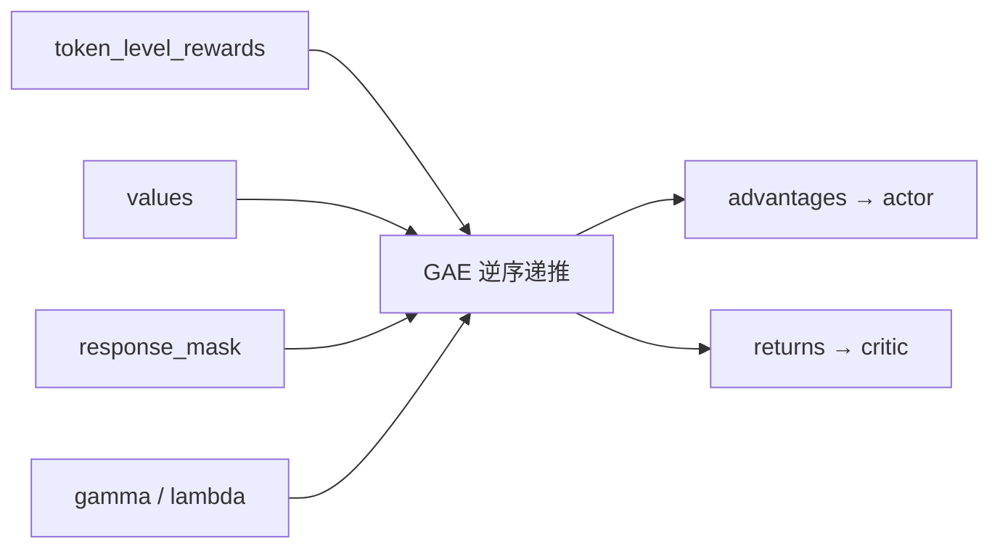
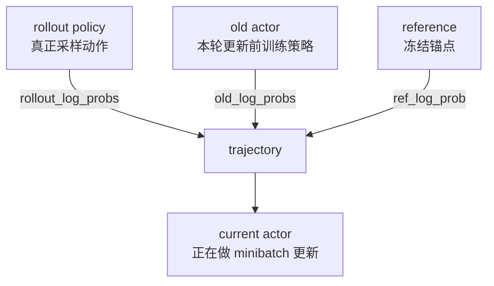

# PPO 与 GAE：把每一步走小一点

你已经知道：正 advantage 应提高已采样 token 的概率，负 advantage 应降低。但如果一次把“好答案”概率从 0.1 推到 0.99，会发生什么？

原来的 rollout 是在旧策略下收集的。策略大幅改变后，这批数据不再代表新策略会遇到的分布；少量偶然样本还可能把模型推向奇怪区域。PPO 的核心不是“奖励高就学习”，而是：**允许重复利用一批 rollout，但让每次更新保持保守。**

[PPO 原论文](https://arxiv.org/abs/1707.06347)把采样与多 epoch minibatch 优化结合起来；veRL 的实现还包含非对称 clipping、dual-clip、不同 loss aggregation 与 rollout correction 等工程选择。

## 先分清两个独立问题

很多教程把 PPO 和 GAE 连在一起讲，容易误以为它们是一件事：

| 组件 | 它回答的问题 | 可以替换成什么 |
| --- | --- | --- |
| GAE | reward/value 怎样变成低方差 advantage？ | GRPO、RLOO、ReMax、REINFORCE++ 等 |
| PPO clipped loss | 用旧策略样本更新时，怎样限制概率变化带来的收益？ | 其他 policy loss/约束形式 |

在 veRL 里，这两个选择分别落在 advantage estimator 与 policy loss。GRPO 也常搭配 PPO 风格 clipped loss；“用了 GRPO”不等于“没有 PPO 的更新约束”。

## 第一步：一批样本必须有什么

先只看一个 batch 的 response 区域。\(B\) 是回答条数，\(R\) 是补齐后的最大回答长度。

| 数学角色 | veRL 字段/计算量 | 典型 shape | 是否总需要 |
| --- | --- | --- | --- |
| 已采样动作 | `responses` | `[B,R]` | 是 |
| 有效动作 | `response_mask` | `[B,R]` | 是 |
| 训练侧旧策略 | `old_log_probs` | `[B,R]` | PPO-style loss 需要 |
| rollout 行为策略 | `rollout_log_probs` | `[B,R]` | 按后端/校正配置 |
| reference | `ref_log_prob` | `[B,R]` | 启用相应 KL 时 |
| critic 预测 | `values` | `[B,R]` | GAE 需要 |
| 奖励 | `token_level_rewards` | `[B,R]` | 是 |
| 优势/回报 | `advantages` / `returns` | `[B,R]` | 是 / critic 使用 return |

::: tip 阅读张量时的固定句式
“谁在什么时候、用哪版权重、对哪批 token 算出这个值？”如果答不出，就不要先把它代入公式。
:::

## 第二步：GAE 把终局奖励传回前面

### 直觉

critic 像赛前预测员：在每个 token 前估计接下来能得多少分。实际结果比预测好，当前动作得到正的“惊喜”；比预测差，得到负的“失望”。GAE 把未来多步惊喜按 \(\gamma\lambda\) 衰减累加。

### 专业表达

$$
\delta_t=r_t+\gamma V(s_{t+1})-V(s_t),
$$

$$
\hat A_t=\delta_t+\gamma\lambda\hat A_{t+1}.
$$

- \(\gamma\) 控制未来 reward 折扣；
- \(\lambda\) 控制多步实际信息与 value bootstrap 的折中；
- `response_mask` 防止 EOS 后 padding 进入递推；
- `returns = unwhitened_advantages + values` 用于训练 critic；actor 使用 mask 内 whiten 后的 advantage。

当前源码的 [`compute_gae_advantage_return`](https://github.com/verl-project/verl/blob/e5687fce0516d31e1fdc4580499074a9bd94c751/verl/trainer/ppo/core_algos.py) 从最后一个 response 位置逆序扫描。读循环时要观察 `nextvalues` 和 `lastgaelam` 如何被 mask 保持，而不是只找公式的两行。

## 第三步：ratio 测量策略变了多少

actor 在更新时，对同一批已采样 token 用当前参数重算 \(\log\pi_\theta\)。与更新前参数的比率：

$$
r_t(\theta)=
\frac{\pi_\theta(a_t\mid s_t)}{\pi_{old}(a_t\mid s_t)}
=\exp\left(\log\pi_\theta-\log\pi_{old}\right).
$$

- ratio=1：对该动作态度没变；
- ratio=1.2：当前概率是旧概率的 1.2 倍；
- ratio=0.8：当前概率是旧概率的 0.8 倍。

这只比较已采样动作，不是完整分布距离。ratio 靠近 1 也不能证明整个词表 KL 很小。

## 第四步：clipping 让越界更新不再继续获利

标准 PPO clipped surrogate：

$$
L^{clip}(\theta)=\mathbb E_t\left[
\min\left(
r_t\hat A_t,
\operatorname{clip}(r_t,1-\epsilon,1+\epsilon)\hat A_t
\right)\right].
$$

### 用两个数字理解

假设 \(\epsilon=0.2\)：

| advantage | ratio 变化 | 直觉 |
| --- | --- | --- |
| `+1` | 1.0 → 1.15 | 好动作概率提高，目标继续受益 |
| `+1` | 1.2 → 1.8 | 超过上界后不再因为更激进而获得额外收益 |
| `-1` | 1.0 → 0.9 | 坏动作概率降低，目标受益 |
| `-1` | 0.8 → 0.2 | 超过下界后不再因为更激进而获得额外收益 |

clipping **不是**：把模型参数裁剪、把 reward 裁剪、保证 ratio 最终一定在区间内，或严格满足某个 KL trust region。它只改变 surrogate objective 在某些区域的收益。

当前 [`compute_policy_loss_vanilla`](https://github.com/verl-project/verl/blob/e5687fce0516d31e1fdc4580499074a9bd94c751/verl/trainer/ppo/core_algos.py) 还支持：

- `clip_ratio_low` / `clip_ratio_high` 非对称上下界；
- 对负 advantage 的 `clip_ratio_c` dual-clip 保护；
- 可选 `rollout_is_weights`；
- 通过 registry 选择其他 policy loss。

因此“veRL 的 PPO loss”应以当前解析配置和 registry 函数为准，不要只对照教科书公式。

## 三种策略，四份概率

同步、同精度时 rollout 与 old actor 应接近；但推理/训练 kernel、权重版本和异步流水会造成差异。

- PPO ratio 通常比较 current 与 `old_log_probs`；
- rollout correction 关注行为策略与训练策略的偏差，可能使用 `rollout_log_probs`；
- reference 用于 KL 锚定，不是 PPO ratio 的默认分母。

名字都像“旧概率”，职责却不同。调试时同时记录来源、权重版本和计算后端。

## KL 有两条入口，不要无意识惩罚两次

### 放进 reward

`algorithm.use_kl_in_reward=true` 时，reference 偏离先改变 `token_level_rewards`，再经过 GAE/GRPO 影响 advantage。它会改变 critic/优势看到的回报定义。

### 放进 actor loss

`actor_rollout_ref.actor.use_kl_loss=true` 时，KL 项直接与 policy loss 组合，不改变原始 task reward。

两条路不是等价实现。比较实验时记录：KL estimator、系数、是否自适应、作用位置和日志指标。只写“KL=0.01”信息不够。

## 聚合方式会改变谁更有话语权

逐 token loss `[B,R]` 最终要变成标量：

- token mean：每个有效 token 等权，长回答有更多项；
- sequence mean：先让每条回答内部平均，再让回答等权；
- 其他归一化还可能按固定长度或全局 token 数处理。

这会影响长度偏好，也是理解 Dr.GRPO/DAPO recipe 时不能忽略的一层。任何论文复现都应同时核对 `loss_agg_mode`，不只核对 advantage 公式。

## 在 V1 源码中跟一次

当前 [`PPOTrainer._step_once()`](https://github.com/verl-project/verl/blob/e5687fce0516d31e1fdc4580499074a9bd94c751/verl/trainer/ppo/v1/trainer_base.py) 的核心顺序是：

顺序本身就是数据契约：在 advantage 之前必须已有 estimator 所需字段；actor 更新前必须已有 advantage 与 old probability。后面[从推理到训练](/verl/internals/rollout-to-update)会跟踪它们如何写入 TransferQueue。

## 训练是否健康，至少联看这些指标

| 指标 | 异常可能意味着什么 | 不能单独证明什么 |
| --- | --- | --- |
| reward / validation score | 任务结果是否改善 | 是否奖励黑客、数据漂移 |
| `pg_clipfrac` | 多少 token 触发 clipping | clip 越高/越低就一定越好 |
| approx KL / PPO KL | 更新偏离程度 | 与 reference KL 口径完全相同 |
| entropy | 分布探索性 | 任务质量 |
| response length | 长度策略变化 | 推理质量提升 |
| grad norm / finite check | 优化数值状态 | 算法语义正确 |

## 通关检查

不看页面回答：

1. GAE 与 PPO clipping 各自解决哪个问题？
2. advantage 为负时，为什么 ratio 下界也重要？
3. rollout、old、current、reference 四种策略分别由谁使用？
4. 为什么换 `loss_agg_mode` 可能改变长度偏好？
5. 在 `_step_once()` 中删掉 `old_log_prob` 阶段，最先缺什么输入？

完成后进入[GRPO、Dr.GRPO 与 DAPO](./grpo-family)，看不用 critic 时 baseline 怎样变化。
