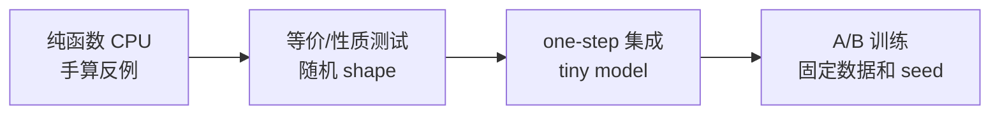

# 实现自定义算法：先写张量契约与反例测试

这一课不发明“效果更好的新算法”。我们实现一个简单的组内中心化 estimator，用它练习完整工程流程：公式 → 张量契约 → registry → CPU 反例测试 → Ray 进程加载 → one-step 集成 → 与基线对照。

真正研究新算法时，替换的是公式，验证阶梯不变。

## 先用人话：算法函数不是拿到整个 trainer 才能工作

优势估计器只需回答：给定 reward、有效 token mask 和可选分组信息，每个有效 token 应得到什么 advantage/return。它不应自行启动 rollout、读取全局变量或更新模型。

把它保持为纯张量函数，才能手工构造反例并快速验证。

## 1. 先写契约，不先写代码

我们定义 `group_center_no_scale`：对同一 `uid` 的回答 reward 求和，减组均值，不除标准差，再广播到有效 token。

$$
s_i=\sum_t r_{i,t},\qquad
A_i=s_i-\frac1{|g|}\sum_{j\in g}s_j,qquad
A_{i,t}=A_i m_{i,t}.
$$

契约：

| 项 | 约束 |
| --- | --- |
| `token_level_rewards` | float tensor `[B,R]` |
| `response_mask` | `[B,R]`，有效位置 1 |
| `index` | 长度 B，同一 prompt 使用相同可哈希 uid |
| 输出 | `(advantages, returns)`，两者 `[B,R]` |
| 单元素组 | 中心化后 0，不产生意外绝对 reward 信号 |
| padding | 输出必须精确为 0 |
| autograd | advantage 计算不建立梯度 |

这与当前 GRPO/Dr.GRPO 形式相近，故适合做验证练习；不要把它包装成新的研究贡献。

## 2. 用外部模块注册，不需要修改 Enum

建立可被所有节点导入的包 `my_verl_ext/advantage.py`：

```python
from collections import defaultdict

import torch

from verl.trainer.ppo.core_algos import register_adv_est


@register_adv_est("group_center_no_scale")
def group_center_no_scale(
    token_level_rewards: torch.Tensor,
    response_mask: torch.Tensor,
    index,
    config=None,
    **_,
) -> tuple[torch.Tensor, torch.Tensor]:
    if token_level_rewards.shape != response_mask.shape:
        raise ValueError("reward/mask shape mismatch")
    if len(index) != token_level_rewards.shape[0]:
        raise ValueError("group index length mismatch")

    with torch.no_grad():
        scores = (token_level_rewards * response_mask).sum(dim=-1)
        centered = torch.empty_like(scores)
        groups = defaultdict(list)
        for row, uid in enumerate(index):
            groups[uid].append(row)

        for rows in groups.values():
            positions = torch.tensor(rows, device=scores.device)
            group_scores = scores[positions]
            centered[positions] = group_scores - group_scores.mean()

        advantages = centered.unsqueeze(-1) * response_mask
        return advantages, advantages.clone()
```

`AdvantageEstimator` enum 是不可变的，但当前 registry 明确支持 string name；无需为了自定义 estimator 修改 enum。

## 3. 确保每个进程都执行注册

registry 是进程内 Python 状态。只在 driver notebook 里 import 一次，不代表 Ray TaskRunner 也注册了函数。固定源码的 `verl/__init__.py` 支持：

```bash
export VERL_USE_EXTERNAL_MODULES=my_verl_ext.advantage
```

在启动 Python/Ray **之前**设置。包必须安装在容器中或通过所有节点一致的 `PYTHONPATH` 可见。验证：

```bash
VERL_USE_EXTERNAL_MODULES=my_verl_ext.advantage python - <<'PY'
from verl.trainer.ppo.core_algos import get_adv_estimator_fn
print(get_adv_estimator_fn("group_center_no_scale"))
PY
```

然后在 Ray worker 环境中做同样的导入位置检查。`VERL_USE_EXTERNAL_MODULES` 也可用逗号分隔多个模块，但应避免模块导入产生除注册外的昂贵副作用。

## 4. 先写会推翻实现的 CPU 测试

```python
import numpy as np
import torch

from my_verl_ext.advantage import group_center_no_scale


def test_group_center_contract():
    rewards = torch.tensor([
        [0.0, 1.0, 9.0],  # 最后一格是 padding 噪声
        [0.0, 0.0, 9.0],
        [0.0, 2.0, 9.0],
    ])
    mask = torch.tensor([
        [1.0, 1.0, 0.0],
        [1.0, 1.0, 0.0],
        [1.0, 1.0, 0.0],
    ])
    uid = np.array(["a", "a", "b"], dtype=object)

    adv, returns = group_center_no_scale(rewards, mask, uid)

    assert adv.shape == rewards.shape
    assert torch.isfinite(adv).all()
    assert torch.equal(adv[:, 2], torch.zeros(3))
    assert torch.allclose(adv[0, :2], torch.tensor([0.5, 0.5]))
    assert torch.allclose(adv[1, :2], torch.tensor([-0.5, -0.5]))
    assert torch.equal(adv[2], torch.zeros(3))  # 单元素组
    assert torch.equal(adv, returns)
```

还应覆盖：

- 同组 reward 全相同 → 全零；
- 多个组不会相互污染；
- 空有效 token 明确报错或按你的契约处理；
- float16/bfloat16 是否需要转 float32 做统计；
- 极大/极小 reward 仍有限；
- 行顺序重排后，只要 uid 不变结果相同。

测试“正常输入有输出”远远不够；边界条件才定义算法。

## 5. 配置进入 V1 主链

```bash
export VERL_USE_EXTERNAL_MODULES=my_verl_ext.advantage

python -m verl.trainer.main_ppo \
  algorithm.adv_estimator=group_center_no_scale \
  critic.enable=false \
  actor_rollout_ref.rollout.n=4 \
  ...
```

V1 `_compute_advantage()` 会从 TQ 取字段、临时构造 DataProto，并由共享 `compute_advantage()` 对非 GAE/GRPO 名称查 registry。通用 custom estimator 会收到：

- `token_level_rewards`；
- `response_mask`；
- `config`；
- 若存在则有 `index=uid`、`reward_baselines`。

不要依赖尚未由 `_compute_advantage()` 传入的任意 batch 字段。若新算法必须使用额外字段，你需要明确扩展这一适配层并增加字段契约测试，而不是在函数中偷偷访问全局 TQ。

## 6. 自定义 policy loss 是另一条 registry

若 advantage 不变，只想改变 ratio 约束或 token 聚合，用 `register_policy_loss("name")`。函数签名应与当前 `PolicyLossFn` 对齐：

```python
def loss(
    old_log_prob,
    log_prob,
    advantages,
    response_mask,
    loss_agg_mode,
    config,
    rollout_is_weights=None,
) -> tuple[torch.Tensor, dict]:
    ...
```

通过 actor policy loss mode 选择。最低测试包括：标量 loss、mask 不变性、正负 advantage 梯度方向、ratio=1 基线、越界行为、全 padding 防护、返回指标可序列化。

不要在 policy loss 中重新计算 reward 或按 prompt 丢整组；那属于上游层。

## 7. 四级验证阶梯



### 纯函数

证明公式、shape、mask、finite 和边界。

### 性质/等价测试

若你是向量化旧实现，随机生成多组/多长度数据，与参考实现 `allclose`；若算法不同，测试平移不变性、组内零均值等预期性质。

### One-step 集成

证明 registry 在 TaskRunner 进程已加载、字段齐全、日志指标有限、actor 能 backward。dump 一批 advantage 与 uid 人工复算。

### A/B 训练

固定 commit、数据切片、采样 seed、batch、reward、policy loss 和硬件。除 estimator 外只允许为运行必需的联动，并明确记录。比较任务指标、长度、KL、entropy、clip fraction、group std、吞吐与显存。

## 8. 常见失败与真正根因

| 现象 | 常见根因 |
| --- | --- |
| driver 能找到 registry，Ray 中 unknown estimator | 外部模块未在 worker 启动前导入/不可见 |
| shape 正确但组间混合 | 用 batch 顺序或 session index 代替稳定 uid |
| padding 位置有大值 | reward 求和或输出未乘 response mask |
| GRPO-like 结果全零 | 组内 reward 无差异，或 sampler 拆散完整组 |
| 新算法似乎更好但回答更长 | loss aggregation/长度分母同时变化或未监控 |
| one-step 正常，异步崩坏 | estimator 假定 on-policy，未处理 staleness/rollout correction |

## 完成标准

你的改动应带着：一页公式与契约、CPU 反例测试、registry 加载检查、one-step dump、A/B resolved configs、任务与系统 guardrails，以及一个恢复旧 estimator 的单行开关。

下一步：[优化方法论](./optimization-playbook)，学习怎样在不改变这些语义的前提下优化系统。
