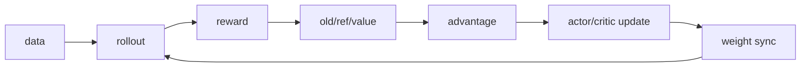
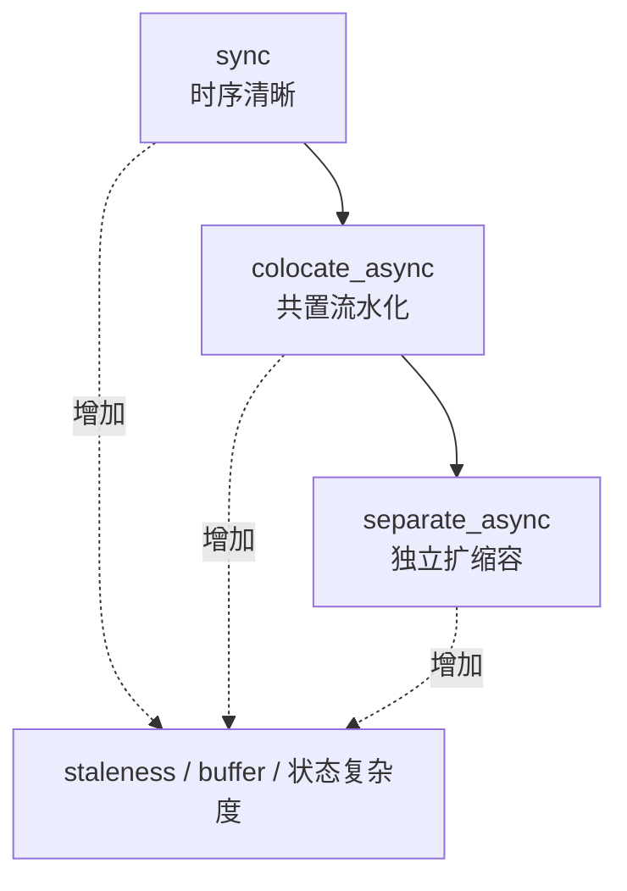

# 优化方法论：先守住语义，再缩短关键路径

veRL 优化最容易犯的错误，是把系统变快与实验变了混为一谈。减小 response length、降低 rollout.n、丢弃慢样本都可能让 step 更快，也同时改变任务、优势统计或数据分布。

真正的优化结论必须同时回答：快在哪里、为什么快、正确性是否保留、代价转移到哪里。

## 先用人话：你在平衡三本账

| 账本 | 典型量 | 欠账的表现 |
| --- | --- | --- |
| 时间 | step time、tokens/s、p95 长尾 | GPU 等待、生成/通信拖慢 |
| 显存 | weights、optimizer、activation、KV cache | OOM、batch 被迫过小 |
| 新鲜度/质量 | weight version、staleness、reward/length/KL | 异步更快但样本更旧、语义漂移 |

把一项成本搬走，常会增加另一本账：offload 省显存却增加 PCIe；更深异步提高利用率却增加 staleness；TP 能放下模型却减少 replica 数并增加通信。

## 0. 先写不允许退化的 guardrail

优化前固定：

```text
commit + dirty diff
resolved config
模型/checkpoint + dtype
固定数据切片、seed、长度分布
节点/GPU/网络与集群占用
预热区间和测量 step
primary metric：有效 response tokens/s 或 time-to-train-N-tokens
quality guardrails：reward/val、长度、KL、entropy、clipfrac
algorithm guardrails：组完整率、drop rate、staleness、非零 advantage 比例
```

只报告 samples/s 容易被短回答“优化”；只报告 GPU utilization 无法说明有效工作；只报告 reward 又可能漏掉吞吐退化。

## 1. 把一步拆成关键路径



V1 已记录 `gen`、`reward`、`old_log_prob`、`ref`、`values`、`adv`、`update_critic`、`update_actor` 等计时。先用多步中位数/p95 确定最大段，再分解该段。

判断规则：优化非关键路径的 2 倍加速，整体可能几乎不变；异步模式还要看并行重叠后的关键路径，不能简单相加阶段时间。

## 2. Rollout 慢：区分 prefill、decode、排队与最后一条长尾

### 先收证据

- prompt/response token 分布而非平均长度；
- request arrival/running/waiting、TTFT、inter-token latency；
- KV cache utilization、batch token 数、每 replica 吞吐；
- 最后完成的 prompt/group 是否显著更长；
- TP、DP/replica 数与通信占比。

### 常见旋钮与代价

| 旋钮 | 可能收益 | 必须监控的代价 |
| --- | --- | --- |
| 增加 rollout replicas / 减小 TP | 更多并发 | 单 replica 是否还能放下模型、权重同步量 |
| 增大 KV cache budget | 更大 batch | 与共置训练显存冲突 |
| chunked prefill | 减少长 prompt 阻塞 decode | 调度/kernels、版本兼容 |
| prefix caching | 共享前缀少重复计算 | 命中率、cache 占用与失效 |
| dynamic batching/token budget | 减少 padding、提高占用 | 长尾、公平性、峰值显存 |
| 调整 `n` / 长度 | 生成量减少 | 直接改变 GRPO 统计或任务，不是纯优化 |

[PagedAttention 论文](https://arxiv.org/abs/2309.06180)解释 KV cache 分页为何提高批处理容量；具体 vLLM/SGLang 行为要以你锁定的后端版本为准。

## 3. Actor/Critic 慢或 OOM：先确定内存所有者

训练显存大致由 weights、gradients、optimizer states、activations、临时 buffer 和通信 bucket 构成。不要拿 rollout 的 `gpu_memory_utilization` 修 actor backward OOM。

可按顺序验证：

1. `use_remove_padding` / dynamic token batch 是否减少无效 token；
2. micro batch 或 `ppo_max_token_len_per_gpu` 是否控制单次峰值；
3. gradient checkpointing 用计算换 activation；
4. FSDP/TP/SP/CP 等并行是否与序列/模型瓶颈匹配；
5. parameter/optimizer offload 是否值得通信代价；
6. fused kernel/compile 是否在当前 shape 与后端稳定；
7. mini-batch/ppo epochs 改动是否改变优化算法，而不只是切分。

比较时使用**有效训练 token/s**，同时看 MFU、peak allocated/reserved 和 step 内峰值阶段。micro batch 变小能运行但可能让吞吐下降；dynamic batch 能提高利用率但需验证全局 loss 分母一致。

## 4. 权重同步慢：它连接两种模型表示

训练引擎可能以 FSDP/Megatron 分片保存权重，推理引擎以另一种 TP/replica 布局消费。同步成本包含 gather/reshard、序列化/传输、server wake/sleep 和版本切换。

检查：

- `update_weights` 在整体关键路径占比；
- bucket 大小与峰值显存/链路带宽；
- 每个 rollout replica 是否重复接收；
- 同步频率与每次训练工作量；
- 新版本何时真正可服务，旧请求怎样结束。

降低同步频率可能提高吞吐，却会增加样本 staleness，属于算法-系统联合权衡。必须报告 trajectory version span、drop/correction 指标与质量 guardrail。

## 5. Reward/TQ/Data 慢：CPU 与外部服务也在关键路径上

### Reward

测单调用 p50/p95/p99、并发、超时率和重试。增加 worker 只在下游服务和 CPU 还有容量时有效。规则 reward 可向量化/批处理；沙箱/GenRM 需要限流与失败分数策略。

### TransferQueue/ReplayBuffer

观察 pending/running/finished/failure、storage 容量、poll wait、网络传输和清理。`SimpleStorage` 是开箱基线，`MooncakeStore` 在固定提交标为实验性；更换 backend 前先证明 TQ/网络是瓶颈。

### Data

区分 Parquet 读取、chat template/tokenizer、过长过滤和多机路径。离线可做的重预处理不要每 epoch 重复；但缓存 token 时要绑定 tokenizer/template 版本。

## 6. Sync → async 不是免费加速



只有同步基线正确且阶段等待明确时再进入异步。异步实验额外报告：

- prompt 生成 step 与训练 step 的版本跨度；
- dropped/filtered 轨迹及来源分布；
- ReplayBuffer 容量和反压位置；
- rollout correction/IS weight 分布；
- checkpoint、失败恢复和退出时未消费样本语义。

吞吐上升但 reward 下降，可能不是超参数偶然波动，而是样本策略分布已改变。

## 7. 一次可信 A/B 的写法

```text
hypothesis:
  rollout TP=2 限制 replica 数，TP=1 可提高 decode 吞吐

constants:
  commit/config except TP/data slice/seed/GPU/step 10-40

change:
  rollout.tensor_model_parallel_size: 2 -> 1

primary:
  valid response tokens/s, median and p95 step time

guardrails:
  reward, response length, KL, OOM, staleness, failed requests

mechanism evidence:
  per-replica decode throughput + selected timeline

result / decision / rollback:
```

若 TP=1 必须同时改变 memory utilization 或 batch 才能运行，诚实地把它写成组合改动，不把收益全归给 TP。

## 8. 优化顺序：从不改变语义的改动开始

建议次序：

1. 修复明显等待/错误配置，固定测量；
2. 减少 padding、重复预处理和无效传输；
3. 调 micro batch/token budget/cache/bucket 等执行参数；
4. 选择更合适的并行与角色放置；
5. 再考虑异步、过滤、长度/n 等会改变数据分布的联合优化；
6. 每一步保留单开关回退。

“语义不变”也需要测试：同一 tiny batch 的 reward、mask、advantage、loss 在容差内一致；同一权重的生成分布在允许范围内一致；分布式 rank 的分子/分母归约一致。

## 9. 什么时候值得写自定义优化

只有 profile 证明通用旋钮无法解决，并能明确接口不变量时，才动框架：

- 自定义 ReplayBuffer 解决真实的组等待/采样策略；
- 新 AgentLoopManager 对接已有高吞吐 agent 平台；
- 新 backend adapter 减少当前不必要的权重转换；
- 向量化 estimator/reward 时与参考实现做随机等价测试。

自定义代码的价值不以行数衡量，而以关键路径减少且 guardrail 不退化衡量。

## 完成标准

一项可以合并/长期保留的优化，应附：瓶颈证据、假设、最小 diff、正确性/算法不变量、无 profiler 的 A/B、峰值资源、失败回退，以及在哪些模型/长度/拓扑上结论不成立。

下一步打开[性能采集](/verl/practice/profiling)，只对已经定位的一个阶段抓 trace。
