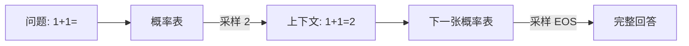
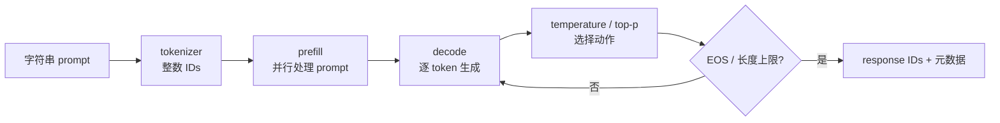
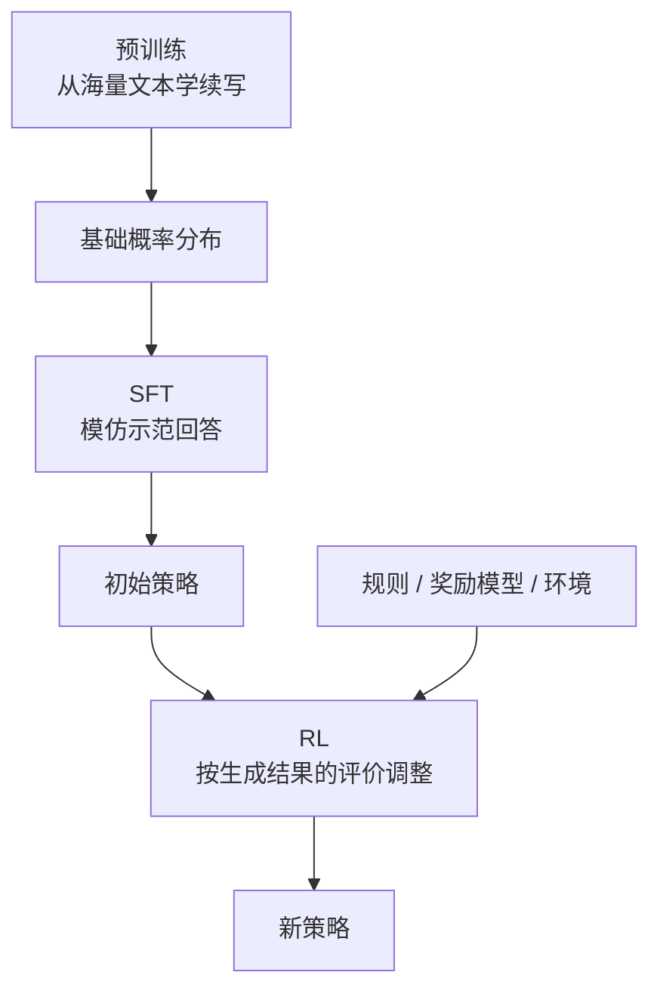

# LLM 如何成为一个“策略”

先忘掉 Transformer 内部有多少层。对 veRL 来说，语言模型最重要的能力只有一句话：**给定已经看到的 token，它为下一个 token 提供一张概率表。**

假设问题是“`1+1=`”，模型下一步只考虑三个候选：

| token | 模型分数 logits | softmax 后概率 |
| --- | ---: | ---: |
| `2` | 2.0 | 0.79 |
| `3` | 0.5 | 0.18 |
| `不知道` | -1.0 | 0.04 |

模型没有直接“输出答案”。它输出分布，生成器再从中选择一个 token。选中后把它接到上下文，模型再给下一张概率表。重复到 EOS 或长度上限，才得到完整回答。

这已经具备强化学习的两个关键要素：可选择的动作，以及控制动作概率的参数。

## 先用人话：模型像一个不断做局部选择的写作者

写作者每写一个词，都参考题目和已经写出的内容。他可以总选最有把握的词，也可以按概率偶尔尝试别的表达。

- **上下文**决定当前处境；
- **下一个 token**是当前动作；
- **整套概率习惯**是策略；
- **完整回答**是一条轨迹；
- **temperature/top-p**改变怎样从策略分布中选动作，但不等于改变模型参数。

强化学习不直接把“错误的 token”替换成标准答案。它观察模型自己写出的回答得到多少奖励，再提高或降低这条轨迹中已选 token 的概率。



## 专业模型：条件概率连成序列概率

给定 token 前缀 \(x_{1:t}\)，自回归模型产生 logits \(z_\theta\)，softmax 得到条件分布：

$$
\pi_\theta(x_{t+1}\mid x_{1:t})
=\operatorname{softmax}(z_\theta(x_{1:t})).
$$

一段 response \(y_{1:T}\) 的联合概率是逐 token 条件概率之积：

$$
\pi_\theta(y_{1:T}\mid x)
=\prod_{t=1}^{T}\pi_\theta(y_t\mid x,y_{<t}).
$$

乘很多小概率容易数值下溢，也不方便做比率，所以实现保存 log-prob：

$$
\log \pi_\theta(y_{1:T}\mid x)
=\sum_{t=1}^{T}\log \pi_\theta(y_t\mid x,y_{<t}).
$$

这里的 `log_prob` 不是所有词的 logits，而是**实际被采样 token 在分布中的对数概率**。在 veRL 的 policy loss 中，它通常是形状 `[B, R]` 的逐 response-token 张量。

## 生成究竟经历什么



### Tokenization：长度不是字符数

字符串必须先被 tokenizer 切成整数 ID。中文、代码、空格和不同模型的词表会让 token 数差异很大。`max_prompt_length=512` 限制的是 token 数，不是 512 个汉字。

第一次检查数据时，永远同时打印原文、token IDs 和 token 数。用 `len(text)` 估显存或截断边界会产生假结论。

### Prefill 与 decode：同是推理，计算形态不同

prefill 一次处理整个 prompt；decode 每轮只产生一个新 token。历史 token 的 attention key/value 可放入 **KV cache**，下一轮不用重复计算整段前缀。

KV cache 提高生成吞吐，也会随并发数和序列长度占用大量显存。它不是训练反向传播保存的 activation。veRL 共置训练/推理角色时，唤醒、休眠和释放 cache 的时机会直接影响能否放下模型。

### 采样参数：改变行为分布，不改变权重

- temperature 越高，分布通常越平，探索更多；
- top-k 只在概率最高的 k 个候选中采样；
- top-p 取累计概率达到阈值的最小候选集合；
- greedy 每次选最大概率 token，适合确定性评估，不适合需要组内多样性的 GRPO 采样。

同一权重配不同采样参数，会产生不同 rollout policy。记录实验时必须把采样参数与模型提交一起保存。

## 两张 mask：形状与语义要分开

设 batch 中最长 prompt 为 \(P\)，最长回答为 \(R\)。为组成矩形张量，短序列需要 padding。

```text
tokens:         [PAD PAD p1 p2 | r1 r2 EOS PAD]
attention_mask: [ 0   0   1  1 |  1  1  1   0 ]
response_mask:                    [1  1  1   0 ]
```

- `attention_mask` 通常描述 prompt+response 中哪些位置对模型有效；
- `response_mask` 描述哪些回答位置参与 reward、advantage 和 loss；
- shape 说“内存里有多少格”，mask 说“统计时哪些格算数”。

::: warning 一个常见的静默错误
直接对 `[B, R]` 求 `.mean()` 会把 padding 也算进去。程序不一定报错，但不同回答长度会改变损失分母。看到任何聚合，都应同时寻找 `response_mask`。
:::

## 为什么源码里有四种“概率”

在最理想的同步系统中，生成策略与更新前 actor 很接近。但真实系统有不同推理/训练 kernel、精度、权重同步和异步延迟，所以源码明确区分：

| 字段/概念 | 谁产生 | 用来回答什么 |
| --- | --- | --- |
| `rollout_log_probs` | 推理引擎采样时 | 动作实际由什么行为分布产生？ |
| `old_log_probs` | 训练侧更新前重算 | PPO 本轮稳定参照是什么？ |
| current `log_prob` | actor 每个 mini-batch 前向 | 当前参数把动作概率改到哪里？ |
| `ref_log_prob` | 冻结 reference | 当前策略离初始/参照策略多远？ |

它们理论相关，但不能因名字相似就假设逐位相等。本站固定源码的 V1 `_step_once()` 会显式重算 `old_log_prob`；rollout correction 还可能比较 rollout 与训练概率。

## 预训练、SFT 和 RL 改的是同一张概率表



三者都在改变参数 \(\theta\)，差别在训练信号：预训练/SFT 有目标 token；RL 先让策略自己采样，再根据结果评价构造梯度。veRL 主要组织后一条闭环，而不是重新实现 Transformer。

## 一个十分钟微实验

无需 GPU，用 PyTorch 观察 temperature 如何改变分布，但不改变 logits：

```python
import torch

logits = torch.tensor([2.0, 0.5, -1.0])
for temperature in (0.5, 1.0, 2.0):
    probs = torch.softmax(logits / temperature, dim=-1)
    print(temperature, probs, torch.log(probs))
```

预测后再运行：temperature 变大时，最高概率是否下降？被选 token 的 `log_prob` 为什么总不大于 0？如果一段回答有四个 token，它的 log-prob 是四项之和还是平均？

## 对照源码时只问五件事

1. 当前 tensor 覆盖 prompt+response，还是只有 response？
2. 有效位置由哪个 mask 决定，padding 在哪一侧？
3. log-prob 来自 rollout、old actor、current actor 还是 reference？
4. 这里在生成动作、只做前向，还是建立反向传播图？
5. 数据此刻在 Python 控制器、TransferQueue、训练 GPU 还是推理 GPU？

## 通关检查

不看上文，试着解释：

- “LLM 是策略”不意味着模型一次选择整段文本，而是什么意思？
- sampling parameter 与模型权重分别改变什么？
- 为什么 policy loss 需要逐 token log-prob 和 `response_mask`？
- rollout 与线上聊天推理为什么不能只按“都调用 generate”理解？

能用自己的例子回答后，进入[够用的数学工具](./math-toolkit)。
