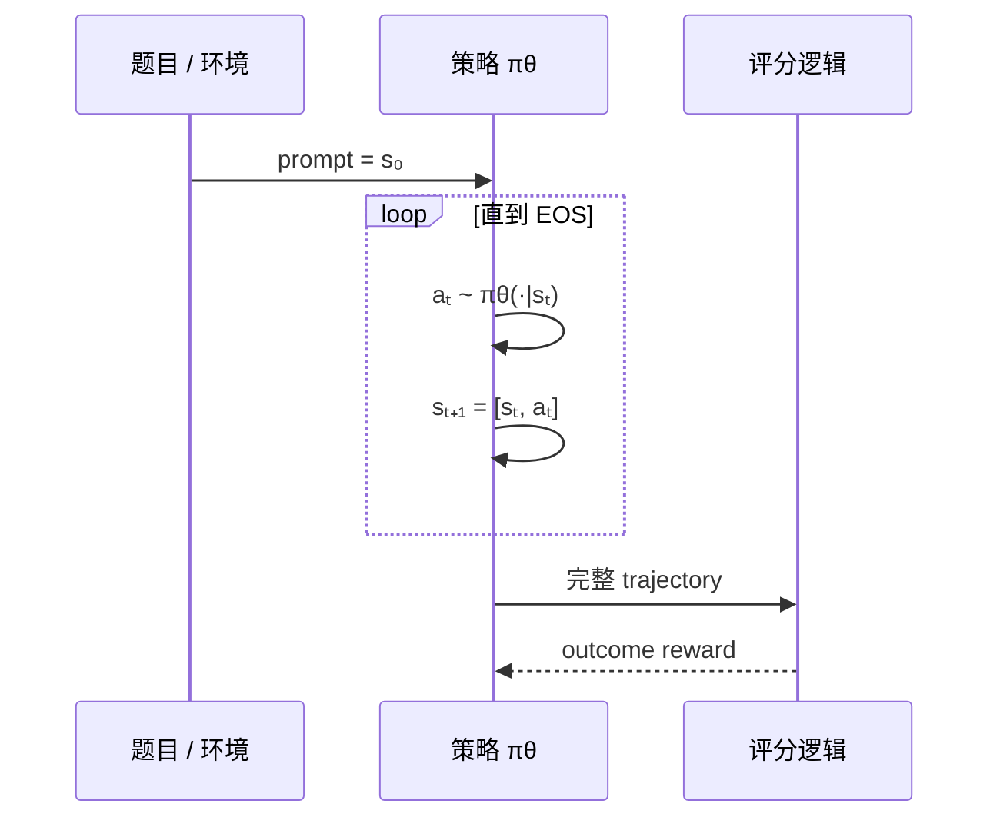
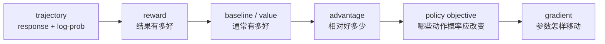

# 强化学习的完整闭环

想象模型参加一道数学题：“小明有 3 个苹果，又买 2 个，共几个？”它生成：

```text
小明原来有 3 个，又买 2 个，所以 3+2=5。答案是 5。
```

评分器只在结束时给 `reward=1`。问题来了：这 20 多个 token 中，哪些选择值得鼓励？奖励只有一个数，模型参数却有几十亿。强化学习的核心，不是“得到奖励”这么简单，而是把稀疏结果变成对采样动作概率的可学习信号。

## 先用人话看六个角色

| 概念 | 用人话问 | 在回答任务中 |
| --- | --- | --- |
| state \(s_t\) | 写到这里，我已经看见什么？ | prompt + 已生成 token |
| action \(a_t\) | 下一步选择什么？ | 下一个 response token |
| policy \(\pi_\theta\) | 我习惯以多大概率选每个动作？ | 语言模型分布 |
| trajectory \(\tau\) | 这次从头到尾经历了什么？ | 完整 token 序列与元数据 |
| reward \(r_t\) | 环境此刻给了什么反馈？ | 规则、模型或工具返回的分数 |
| episode | 这次尝试何时结束？ | EOS、长度上限或 agent 终止 |



## 专业模型：从 MDP 到 token 轨迹

传统强化学习常用马尔可夫决策过程 \((\mathcal S,\mathcal A,P,R,\gamma)\)。在纯文本单轮生成里，状态是完整前缀，因此下一状态基本由“拼接已选 token”确定；环境反馈常在结尾才出现。

从时刻 \(t\) 起的折扣回报：

$$
G_t=\sum_{l=0}^{T-t-1}\gamma^l r_{t+l}.
$$

LLM outcome reward 常只落在最终有效 response token。若 \(\gamma=1\)，同一轨迹前面的 token 可以看到相同的最终回报；但“看到同一个结果”并不等于知道哪个 token 真正负责。

## reward 为什么还不够

假设两道题：

- 简单题通常都得 1 分，这次也得 1；
- 难题通常得 0 分，这次意外得 1。

同样 `reward=1`，第二次相对表现更惊喜。我们需要一个基线回答“在这个状态通常能得多少”。

### Value：开局时的预期

$$
V^\pi(s_t)=\mathbb E_\pi[G_t\mid s_t].
$$

critic 学习预测 value。它不负责生成文本，而是估计从当前状态按策略继续走的预期回报。

### Advantage：实际动作比基线好多少

$$
A_t=Q(s_t,a_t)-V(s_t).
$$

直觉上可把它读成：

```text
advantage = 这次选择之后实际/估计能得到的回报 - 通常水平
```

- \(A_t>0\)：提高已选 token 的概率；
- \(A_t<0\)：降低已选 token 的概率；
- \(A_t\approx0\)：这次选择没有明显超出基线。

基线不一定来自 critic。GRPO 用同一 prompt 的其他回答构造组内基线；RLOO 用 leave-one-out 均值；ReMax 用贪心回答 reward。它们都在回答“相对谁更好”，但统计性质与成本不同。

## 一条训练信号流水线



veRL 里的字段大致对应：

| 阶段 | 常见字段 | 典型 shape |
| --- | --- | --- |
| 生成结果 | `responses`, `response_mask` | `[B,R]` |
| 结果评分 | `rm_scores` / `token_level_scores` | `[B,R]` |
| KL 后奖励 | `token_level_rewards` | `[B,R]` |
| critic 预测 | `values` | `[B,R]` |
| 训练信号 | `advantages`, `returns` | `[B,R]` |

不要只凭表格判断当前版本；在 V1 `_compute_advantage()` 中，TensorDict 字段会临时转入 DataProto 调用共享算法，再写回 TransferQueue。

## GAE：用多步 TD error 平衡偏差与方差

只用完整回报减 value 往往方差大；只看一步 value bootstrap 可能偏差大。GAE 用 TD residual 的指数加权和折中：

$$
\delta_t=r_t+\gamma V(s_{t+1})-V(s_t),
$$

$$
\hat A_t=\sum_{l\ge0}(\gamma\lambda)^l\delta_{t+l}.
$$

\(\lambda\) 越接近 1，越依赖更长的实际后续；越接近 0，越依赖一步 bootstrap。源码是从最后一个 response token 逆序递推，`response_mask` 决定 EOS 后的 padding 不应成为新时间步。

## Credit assignment：广播不是理解推理过程

最终答案正确，可能是推理过程正确，也可能是猜中；最终答案错误，前面也可能有很多好步骤。把 outcome advantage 广播到所有 response token 只是可用估计，不会自动识别关键推理步骤。

可改善信号的方式包括：过程奖励、工具/环境的逐步反馈、验证器、分段 advantage、多轮轨迹。但更细反馈也会引入奖励黑客、延迟、标注偏差和安全边界。先明确你的 reward 真实测量什么，再谈 estimator。

## On-policy、off-policy 与系统里的“过期样本”

**用人话说：** 如果你拿旧版本模型写的答案，训练已经变化很大的新版本，评价动作概率时可能“对不上号”。

- on-policy：轨迹来自正在优化或足够接近的策略；
- off-policy：轨迹来自其他行为策略，需要校正或接受偏差；
- staleness：异步系统中，生成期间 actor 已更新多个版本，是常见的工程 off-policy 来源。

重要性比率可以比较当前与行为/旧策略对同一动作的概率，但高方差、数值差异和 support mismatch 不能靠一个 ratio 魔法消失。

本站固定的 veRL V1 ReplayBuffer 会基于权重版本处理过旧轨迹；训练侧还可以有 rollout correction。**调度层丢旧样本**与**loss 层校正概率**是两种不同机制。

## 为什么要 KL：奖励不是完整的价值观

一个规则奖励可能只检查最终数字。模型可能通过输出奇怪格式、冗长试探或奖励漏洞拿高分。reference policy 提供“不要离原模型太远”的锚点：

$$
D_{KL}(\pi_\theta\|\pi_{ref}).
$$

veRL 中常见两条入口：

1. 把 KL 作为 reward penalty，再参与 advantage；
2. 把 KL 项直接放入 actor loss。

两者影响信号的位置和缩放不同。开启两个开关不是“约束更稳”的同义词，可能等于惩罚两次。后面会在 PPO 课逐项对照。

## 三个新手最容易得出的错误结论

### “平均 reward 上升，训练一定健康”

可能是回答变长、采样变窄、数据变简单、reward 被钻空子或评估污染。至少联看验证成功率、长度、KL、entropy、clip fraction、组内 reward 方差和样本分布。

### “GRPO 没 critic，所以没有基线”

错误。它没有学习一个 value critic，但组均值仍是基线。没有基线与没有 critic 不是一回事。

### “同步权重只是工程细节”

错误。rollout 用哪一版权重决定数据分布。权重同步频率、异步深度和样本 staleness 都可能改变梯度估计。

## 通关练习

为一条三-token 回答画表：

| t | state（写文字） | sampled token | reward | value | advantage | mask |
| --- | --- | --- | ---: | ---: | ---: | ---: |
| 0 |  |  |  |  |  |  |
| 1 |  |  |  |  |  |  |
| 2 |  |  |  |  |  |  |

数字可以自定，但必须满足：最终 token 才有 reward；EOS 后加一个 padding 且 mask=0；至少有一个正 advantage 和一个负 advantage。然后解释每一行希望哪个 token 概率怎样变化。

完成后进入[策略梯度这座桥](/verl/algorithms/policy-gradient)。
