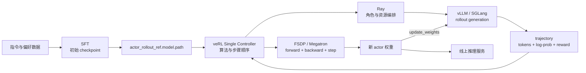
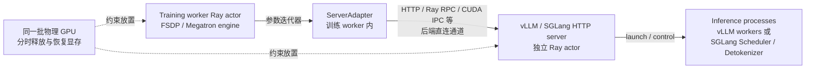
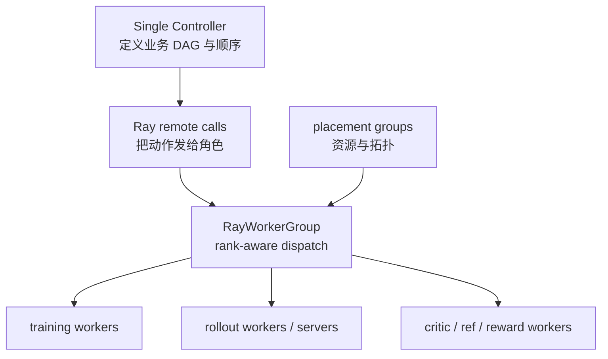
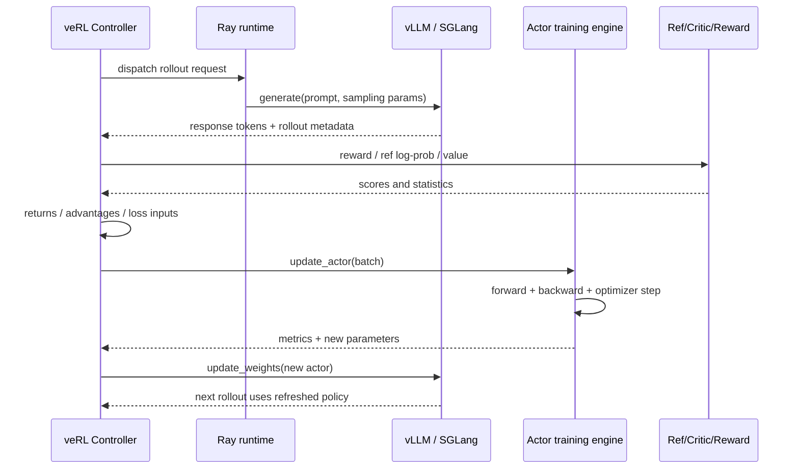

# veRL 怎样接入完整 LLM 系统

先直接回答：**veRL 不是另一个语言模型，也不是替代 vLLM、SGLang、FSDP 或 Megatron 的大一统后端。它位于 LLM 后训练的控制与数据编排层。**

它接收一个可加载的初始模型 checkpoint；让 vLLM 或 SGLang 按当前 actor 权重生成轨迹；组织 reward、old/reference log-prob、value 和 advantage；让 FSDP/FSDP2、Megatron 等训练引擎执行 forward、backward 与 optimizer step；最后把新 actor 权重同步回 rollout engine。Ray 负责把这些长期存活的角色放到正确节点和 GPU 上，并提供远程调用与资源编排。

本文绑定 veRL 提交 [`e5687fce`](https://github.com/verl-project/verl/tree/e5687fce0516d31e1fdc4580499074a9bd94c751)。以下结论都应能回到这个提交中的类、配置或方法，而不是从架构图猜出来。

## 先区分“接入”与“揉成一个框架”

完整系统有五个彼此独立的边界：

| 层 | 输入 | 主要职责 | 输出/契约 |
| --- | --- | --- | --- |
| SFT | 基座模型、指令数据、模板 | 得到能遵循任务格式的初始策略 | HF-compatible checkpoint、tokenizer、chat template |
| veRL 控制与算法 | prompts、rollout、reward、配置 | 决定何时采样、算什么统计量、更新哪个角色 | 带 `responses`、`old_log_probs`、`advantages` 等字段的 batch |
| rollout backend | prompt token、采样参数、当前 actor 权重 | 高吞吐自回归生成、KV Cache 与请求调度 | token ids、log-prob、stop reason |
| training backend | 轨迹张量、loss 函数、模型/优化器状态 | 分片训练、前后向、梯度同步、optimizer step | 新 actor 参数和训练指标 |
| Ray 运行时 | actor 类、资源声明、远程调用 | 进程生命周期、GPU 放置、跨节点调度与观测 | actor handles、ObjectRefs、placement groups |

这也是为什么“veRL 是否应该集成到 LLM 里”这个问题的准确答案是：

- **模型语义上已经集成**：LLM 同时是 actor policy、可选 reference、可选 critic/value 或 reward model 的主体；
- **系统上通过契约集成**：不会把 vLLM Scheduler 或 Megatron pipeline 复制进 trainer，而是调用稳定接口；
- **部署上可以共卡也可以分离**：是否共享 GPU 是运行模式，不是算法定义；
- **权重必须显式闭环**：训练 engine 更新参数，并不意味着 rollout engine 自动看到新参数。

## 一张图看清五门课怎样连接



这里有两个不同的闭环：

1. **算法闭环**：rollout → reward → advantage → update；
2. **模型状态闭环**：training weights → weight transfer → rollout weights。

只跑通第一个而漏掉第二个，会得到“日志显示 actor 在更新，但生成仍然使用旧策略”的隐蔽错误。

## 第 1 个连接点：SFT 交付的是 checkpoint 契约

veRL 不关心初始权重是由 TRL `SFTTrainer`、原生 Transformers Trainer，还是另一个训练框架产出的。它真正消费的是 `actor_rollout_ref.model.path` 指向的模型工件。

固定提交的 PPO 文档示例把模型放在 [`actor_rollout_ref.model.path`](https://github.com/verl-project/verl/blob/e5687fce0516d31e1fdc4580499074a9bd94c751/docs/algo/ppo.md#L80-L97)；V1 trainer 初始化时会用同一路径做本地化处理，见 [`trainer_base.py`](https://github.com/verl-project/verl/blob/e5687fce0516d31e1fdc4580499074a9bd94c751/verl/trainer/ppo/v1/trainer_base.py#L540-L550)。

因此，从本站 [SFT 路线](/sft/) 进入 veRL 前，至少验收四件事：

1. checkpoint 能由 `AutoConfig`、tokenizer 和目标模型类加载；
2. tokenizer、特殊 token 与 embedding 大小一致；
3. SFT 使用的 chat template 在 RL 数据准备时仍然一致；
4. 先用确定性或低温生成检查格式，再开始高成本 rollout。

::: warning veRL 不会替你修复 SFT 的语义错位
如果 SFT 训练时只对 assistant token 计算 loss，而 RL prompt 构造却把 assistant 前缀或特殊 token 改了，系统仍可能正常运行，但策略面对的状态分布已经变化。checkpoint “能加载”只是接口验收，不是训练语义验收。
:::

## 第 2 个连接点：配置选择两个彼此独立的后端

最小配置骨架中最重要的不是几十个 batch 参数，而是三个选择：

```text
actor_rollout_ref.model.path=/path/to/sft-checkpoint
actor_rollout_ref.actor.strategy=fsdp2      # 或 megatron 等
actor_rollout_ref.rollout.name=vllm         # 或 sglang
```

它们不是同一个“backend”开关：

- `actor.strategy` 决定**怎样训练** actor；
- `rollout.name` 决定**怎样生成**轨迹；
- `model.path` 决定两边最初加载哪份模型语义与权重。

所以 `strategy=megatron` 与 `rollout.name=vllm` 完全可以同时成立；`strategy=fsdp2` 与 `rollout.name=sglang` 也可以。训练并行方式和推理调度方式是正交维度，兼容性由模型实现、权重命名/转换、版本和同步路径共同约束。

### 训练后端怎样被选中

[`EngineRegistry`](https://github.com/verl-project/verl/blob/e5687fce0516d31e1fdc4580499074a9bd94c751/verl/workers/engine/base.py#L269-L375) 用 `model_type + backend + device/vendor` 找到具体 `BaseEngine` 子类。固定提交中可以直接看到：

- FSDP/FSDP2 language-model engine 的[注册位置](https://github.com/verl-project/verl/blob/e5687fce0516d31e1fdc4580499074a9bd94c751/verl/workers/engine/fsdp/transformer_impl.py#L955-L956)；
- Megatron language-model engine 的[注册位置](https://github.com/verl-project/verl/blob/e5687fce0516d31e1fdc4580499074a9bd94c751/verl/workers/engine/megatron/transformer_impl.py#L873-L874)；
- TorchTitan language-model engine 的[注册位置](https://github.com/verl-project/verl/blob/e5687fce0516d31e1fdc4580499074a9bd94c751/verl/workers/engine/torchtitan/transformer_impl.py#L598-L599)。

所有实现都要满足 [`BaseEngine`](https://github.com/verl-project/verl/blob/e5687fce0516d31e1fdc4580499074a9bd94c751/verl/workers/engine/base.py#L30-L228) 的共同语义，例如 `train_mode()`、`eval_mode()`、`forward_backward_batch()`、`optimizer_step()`、`get_per_tensor_param()` 和 checkpoint。控制器因而不必知道一次 backward 内部是 FSDP collective 还是 Megatron pipeline schedule。

`BaseEngine.train_batch()` 的默认顺序也值得直接读：先 `zero_grad`，再 `forward_backward_batch`，然后 `optimizer_step`，见 [`base.py` 113–132 行](https://github.com/verl-project/verl/blob/e5687fce0516d31e1fdc4580499074a9bd94c751/verl/workers/engine/base.py#L113-L132)。真正的分片和通信细节下沉到实现。

### rollout 后端怎样被选中

固定提交有两层 rollout registry，分别服务两种执行边界：

1. worker 进程内的 [`BaseRollout` registry](https://github.com/verl-project/verl/blob/e5687fce0516d31e1fdc4580499074a9bd94c751/verl/workers/rollout/base.py#L83-L104)，把 `("vllm", "async")` 和 `("sglang", "async")` 映射为各自 `ServerAdapter`；
2. server replica 层的 [`RolloutReplicaRegistry`](https://github.com/verl-project/verl/blob/e5687fce0516d31e1fdc4580499074a9bd94c751/verl/workers/rollout/replica.py#L302-L408)，把 `vllm`、`sglang`、`trtllm` 映射为可启动的 replica 类，并在开启 PD disaggregation 时切换到对应 PD replica。

这个设计的关键不是“用了 registry”这么简单，而是控制器只依赖共同动作：

- 生成 token；
- `sleep` / `wake_up` 或 release / resume 显存；
- 清理或恢复 KV Cache；
- 接收新权重；
- 暴露 server handle/address 与 profiling 控制。

真正的 continuous batching、Radix Cache、PagedAttention、prefill/decode 调度仍属于 [vLLM](/vllm/) 和 [SGLang](/sglang/) 自己的实现。

## 第 3 个连接点：`ActorRolloutRefWorker` 组合角色但不抹平边界

[`ActorRolloutRefWorker`](https://github.com/verl-project/verl/blob/e5687fce0516d31e1fdc4580499074a9bd94c751/verl/workers/engine_workers.py#L435-L459) 接受以下角色字符串：

```text
actor
rollout
ref
actor_rollout
actor_rollout_ref
```

构造函数据此推导 `_is_actor`、`_is_rollout`、`_is_ref`。随后 `init_model()` 分四段建立组件：

1. reference training worker；
2. actor training worker；
3. rollout device mesh 与 rollout adapter；
4. actor 所需的 checkpoint engine。

直接证据在 [`init_model()` 504–636 行](https://github.com/verl-project/verl/blob/e5687fce0516d31e1fdc4580499074a9bd94c751/verl/workers/engine_workers.py#L504-L636)。尤其要注意 rollout mesh 的 shape：

```text
(dp, infer_tp, infer_pp)
```

其中 `infer_tp = tensor_model_parallel_size × data_parallel_size`，`infer_pp = pipeline_model_parallel_size`，而外层 `dp = worker world size / infer world size`。这段计算说明“训练 world size”与“一个 rollout replica 的 world size”不是同一个量。

worker 对外暴露的方法也保持角色语义：

- `compute_ref_log_prob()` 走 reference engine；
- `compute_log_prob()` 走 actor infer；
- `update_actor()` 走 actor `train_mini_batch()`；
- `update_weights()` 把 training engine 参数送到 rollout。

见 [`engine_workers.py` 638–750 行](https://github.com/verl-project/verl/blob/e5687fce0516d31e1fdc4580499074a9bd94c751/verl/workers/engine_workers.py#L638-L750)。

## `HybridFlow`、`hybrid worker` 与 `RolloutMode.HYBRID` 不是同一个词

学习 veRL 时最容易把三个层级混在一起：

| 名称 | 所在层级 | 准确含义 |
| --- | --- | --- |
| Single Controller / HybridFlow | 编程模型与控制架构 | 一个中心控制流组合不同角色的计算与数据流，并允许角色映射到不同资源布局 |
| `ActorRolloutRefWorker` | worker 实现 | 一个 worker 类可以按 role 组合 actor、rollout、reference 能力 |
| `RolloutMode.HYBRID` | rollout 部署与同步模式 | manager 复用 training `WorkerGroup` 的 ranks 与 GPU 放置，训练 worker 内的 adapter 负责向 colocated native server 同步权重；不表示训练与推理服务只有一个 Python 进程 |

固定提交的 [`RolloutMode`](https://github.com/verl-project/verl/blob/e5687fce0516d31e1fdc4580499074a9bd94c751/verl/workers/rollout/replica.py#L54-L67) 注释和 `init_hybrid()` docstring 仍使用 “fused in same process”。这是旧 3D-HybridEngine 留下的**抽象/历史描述**，不能覆盖当前实现的物理边界：[`ActorRolloutRefWorker`](https://github.com/verl-project/verl/blob/e5687fce0516d31e1fdc4580499074a9bd94c751/verl/workers/engine_workers.py#L435-L440) 已明确声明只运行 native server mode；[`LLMServerManager`](https://github.com/verl-project/verl/blob/e5687fce0516d31e1fdc4580499074a9bd94c751/verl/workers/rollout/llm_server.py#L407-L470) 只是把 training `worker_group` 交给 replica，再由 replica 启动 server。

沿实际调用继续追：SGLang 将 [`SGLangHttpServer` 包成 Ray actor](https://github.com/verl-project/verl/blob/e5687fce0516d31e1fdc4580499074a9bd94c751/verl/workers/rollout/sglang_rollout/async_sglang_server.py#L720-L811)，actor 内又调用 [`Engine._launch_subprocesses()`](https://github.com/verl-project/verl/blob/e5687fce0516d31e1fdc4580499074a9bd94c751/verl/workers/rollout/sglang_rollout/async_sglang_server.py#L381-L405) 创建 Scheduler/Detokenizer 等进程；vLLM 也会[另建 `vLLMHttpServer` Ray actor](https://github.com/verl-project/verl/blob/e5687fce0516d31e1fdc4580499074a9bd94c751/verl/workers/rollout/vllm_rollout/vllm_async_server.py#L1145-L1223)。训练 worker 持有的是 [`ServerAdapter`](https://github.com/verl-project/verl/blob/e5687fce0516d31e1fdc4580499074a9bd94c751/verl/workers/rollout/sglang_rollout/sglang_rollout.py#L194-L249)，它查找 server actor 并建立控制/权重通道，不是把 inference engine 对象塞进训练进程。



这张图描述 HYBRID 的**控制与权重路径**；生成请求还可由 AgentLoop/load balancer 直接进入 server。共置的是 GPU 拓扑和生命周期，不是同一个 Python 进程，也不是同一个 `Parameter` 对象。

同一枚举中还定义了：

- `COLOCATED`：位于同一 Ray placement group、共享 GPU，但在不同进程；
- `STANDALONE`：rollout 使用独立 GPU resource pool，适合分离式架构。

因此，“veRL 是 hybrid”不能推出“所有任务都在同一 Python 进程”，也不能推出“rollout 与 trainer 永远共享显存”。必须继续检查 trainer mode、是否传入 worker group、resource pool 映射和 checkpoint engine。

## 第 4 个连接点：Ray 提供运行时，Single Controller 决定业务顺序

Ray 在这里不是 PPO 算法的一部分。它解决的是：

- `TaskRunnerV1` 这样的长期 actor 如何启动；
- worker actors 如何组成 `RayWorkerGroup`；
- 每个 rank 获得什么 `RANK`、`WORLD_SIZE`、设备可见性；
- placement group bundles 如何预留并共同放置 GPU/CPU；
- driver 如何拿 actor handle、发远程调用、等待 ObjectRef；
- 多节点失败和资源状态如何观测。

而“先 rollout，还是先算 reference log-prob”“何时更新 critic”“什么时候同步 actor 权重”由 veRL trainer 的普通 Python 控制流决定。完整入口请沿 [V1 逐源码主线](/verl/internals/v1-source-walkthrough) 阅读；Ray 原生概念与可观察实验见 [Ray 观测实验](/verl/practice/ray-observation-lab)。

这个分工可写成：



### rollout replica 数量不是手填的独立真相

[`LLMServerManager._initialize_llm_servers()`](https://github.com/verl-project/verl/blob/e5687fce0516d31e1fdc4580499074a9bd94c751/verl/workers/rollout/llm_server.py#L407-L470) 先算单个 replica 的 world size：

\[
W_{replica}=TP\times DP\times PP
\]

普通模式下：

\[
N_{replica}=\left\lfloor\frac{W_{available}}{W_{replica}}\right\rfloor
\]

开启 prefill/decode disaggregation 后，单 replica footprint 会改成：

\[
(TP_{prefill}N_{prefill}+TP_{decode}N_{decode})\times DP\times PP
\]

然后 manager 根据是否拿到 training `worker_group` 选择 `init_hybrid()` 或 `init_standalone()`，最后建立全局 load balancer。若只背 `tensor_model_parallel_size` 而不手算这个式子，很容易把一个 replica 的并行度、replica 数量和整个作业的 GPU 数混在一起。

## 第 5 个连接点：权重同步才真正闭合训练与推理

训练 actor 和 rollout model 即使初始加载同一个 checkpoint，运行后也是两份不同状态。每个 optimizer step 改的是 training engine 持有的参数；rollout backend 只有在同步后才会使用新权重。

同步训练器在两个时间点触发同步：

- checkpoint 恢复后的 `on_init_end()`；
- 每个训练 step 结束后的 `on_step_end()`。

采样结束时则让 replica sleep，释放权重/KV 占用，为训练阶段腾挪显存。源码只有十几行，见 [`PPOTrainerSync`](https://github.com/verl-project/verl/blob/e5687fce0516d31e1fdc4580499074a9bd94c751/verl/trainer/ppo/v1/trainer_sync.py#L24-L42)。

worker 的 [`update_weights()`](https://github.com/verl-project/verl/blob/e5687fce0516d31e1fdc4580499074a9bd94c751/verl/workers/engine_workers.py#L670-L750) 又分两条路径：

| 路径 | 条件 | 数据怎样走 |
| --- | --- | --- |
| naive / adapter-direct | 同步 trainer，`effective_mode == "naive"`，training worker 已持有 rollout adapter | training engine 产出逐 tensor 参数；adapter 通过 SGLang HTTP/tensor update 或 vLLM CUDA IPC、Ray RPC 等后端直连通道更新独立 inference server，不经过 checkpoint engine |
| checkpoint engine | 分离式或异步路径 | training engine 产出参数，checkpoint engine `send_weights()` 跨进程/节点传输 |

naive 路径的 “direct” 指跳过 checkpoint engine，而不是共享同一份 Python 参数。它仍包含明确的显存生命周期：恢复 weights → 获取参数 → 可选先同步 LoRA base → adapter 更新 server → 可选把 actor offload 到 CPU → 恢复 KV Cache。SGLang adapter 的实际落点见 [`update_weights()`](https://github.com/verl-project/verl/blob/e5687fce0516d31e1fdc4580499074a9bd94c751/verl/workers/rollout/sglang_rollout/sglang_rollout.py#L291-L356)，vLLM 则通过 [`update_weights()` 的 IPC/RPC 路径](https://github.com/verl-project/verl/blob/e5687fce0516d31e1fdc4580499074a9bd94c751/verl/workers/rollout/vllm_rollout/vllm_rollout.py#L263-L280) 更新推理 workers。

这说明所谓“hybrid 节省显存”不是免费共享一个 Python `Parameter` 对象，而是通过 sleep/resume、offload 和有顺序的状态切换复用同一批 GPU。

## 一次真实 step 怎样穿过所有框架

把算法细节暂时压缩后，主线是：



对应到学习路线：

- 不懂 prompt、mask、token-level loss：回到 [SFT](/sft/)；
- 不懂生成调度、KV Cache 和吞吐：看 [vLLM](/vllm/) 或 [SGLang](/sglang/)；
- 不懂 FSDP、TP/PP/CP/EP 和 collective：看 [分布式训练](/distributed/)；
- 不懂 reward、advantage、PPO/GRPO 和角色启动条件：继续 veRL 路线。

## 配置开关到运行对象的因果表

| 配置/条件 | 直接后果 | 不应该误解成 |
| --- | --- | --- |
| `actor_rollout_ref.model.path` | actor/ref/rollout 从指定模型工件建立语义起点 | 所有运行中权重永远自动一致 |
| `actor.strategy=fsdp/fsdp2/megatron/...` | `EngineRegistry` 选择 training engine | 同时选择 vLLM/SGLang |
| `rollout.name=vllm/sglang` | rollout adapter 与 replica class 改变 | PPO/GRPO 公式改变 |
| `algorithm.use_kl_in_reward` 或 `actor.use_kl_loss` | 需要 reference policy | 一定需要 critic |
| `critic.enable`；未显式配置时 GAE 会推导 critic | 创建 value/critic 角色 | GRPO 永远不能有 critic |
| trainer 拿到 rollout `worker_group` | manager 走 hybrid 初始化 | 所有 Ray actors 合成一个进程 |
| 没有 `worker_group` 且配置独立节点/GPU | rollout 建独立 resource pool | 不再需要权重同步 |
| checkpoint backend 非 `naive` | `update_weights()` 走 `send_weights()` | 自动保证任意异步陈旧度都正确 |

reference 与 critic 的精确条件可在 [V1 逐源码主线](/verl/internals/v1-source-walkthrough#第-1-段hydra-先决定版本和角色约束) 的真值表继续验证。

## 三个递进实验：不是“跑起来”就结束

### 实验 A：纯源码契约审计，不需要 GPU

目标：证明训练后端和 rollout 后端是两个独立选择。

```bash
git clone https://github.com/verl-project/verl.git
cd verl
git checkout e5687fce0516d31e1fdc4580499074a9bd94c751

sed -n '269,375p' verl/workers/engine/base.py
sed -n '83,104p' verl/workers/rollout/base.py
sed -n '302,408p' verl/workers/rollout/replica.py
sed -n '504,636p' verl/workers/engine_workers.py
```

产物：画一个 2×2 表，行是 `fsdp2/megatron`，列是 `vllm/sglang`；为每个组合写出 training class 的注册位置、rollout class 的加载位置和已知模型兼容性检查。不要因为 registry 中有名字就断言某个模型组合已经受支持。

### 实验 B：Ray 控制面观测，不需要 GPU

先完成 [Ray 观测实验](/verl/practice/ray-observation-lab)，保留以下证据：

- driver PID 与 actor PID；
- actor handle 调用返回的 ObjectRef；
- placement group bundle 状态；
- `ray list actors` 和 Dashboard 中同一 actor 的对应关系；
- 主动杀死一个 actor 后 driver 看到的异常。

产物：把原生 Ray 的 task、actor、placement group、ObjectRef 分别映射到 veRL 的 TaskRunner、WorkerGroup、ResourcePool 和远程方法结果。不能只写术语定义。

### 实验 C：同一训练配置切换 rollout backend

前提：准备受两个 backend 支持的同一 checkpoint 和可用 GPU 环境。保持数据、seed、算法、response length、采样温度、训练 backend 与 batch 参数不变，只切：

```text
actor_rollout_ref.rollout.name=vllm
# 对照
actor_rollout_ref.rollout.name=sglang
```

至少记录：

- 解析后的完整 Hydra config；
- Ray actor/placement group 数和每个 replica 的 GPU footprint；
- rollout tokens/s、平均 prompt/response 长度、生成耗时；
- reward 分布、KL、clip fraction、policy loss；
- 第 0 step 与第 1 step rollout 的权重版本或 global step；
- OOM/preemption/failed request 数；
- 原始日志与机器/软件版本。

验收不是“哪个更快”，而是回答：性能差异来自引擎调度、缓存、批形状还是资源布局？算法指标是否仍在容许误差内？若数值分布变化，是采样随机性、tokenization/template、backend log-prob 语义还是权重同步时序造成？

## 逐源码阅读顺序

不要按目录字母顺序浏览。按因果关系阅读：

1. [`main_ppo.py`](https://github.com/verl-project/verl/blob/e5687fce0516d31e1fdc4580499074a9bd94c751/verl/trainer/main_ppo.py)：driver、Ray init、TaskRunner；
2. [`trainer_base.py`](https://github.com/verl-project/verl/blob/e5687fce0516d31e1fdc4580499074a9bd94c751/verl/trainer/ppo/v1/trainer_base.py)：资源、角色、fit 与 step；
3. [`engine_workers.py`](https://github.com/verl-project/verl/blob/e5687fce0516d31e1fdc4580499074a9bd94c751/verl/workers/engine_workers.py)：actor/ref/rollout 组合与公开动作；
4. [`engine/base.py`](https://github.com/verl-project/verl/blob/e5687fce0516d31e1fdc4580499074a9bd94c751/verl/workers/engine/base.py)：训练后端契约；
5. [`rollout/base.py`](https://github.com/verl-project/verl/blob/e5687fce0516d31e1fdc4580499074a9bd94c751/verl/workers/rollout/base.py) 与 [`replica.py`](https://github.com/verl-project/verl/blob/e5687fce0516d31e1fdc4580499074a9bd94c751/verl/workers/rollout/replica.py)：推理后端契约和部署模式；
6. vLLM/SGLang adapter：框架契约怎样翻译成具体 engine API；
7. FSDP/Megatron engine：共同 `BaseEngine` 动作怎样落到实际并行实现；
8. `trainer_sync.py` 与 checkpoint engine：新权重怎样返回 rollout。

每读一层，记录四列：`输入契约`、`输出契约`、`资源所有者`、`状态失效条件`。这是从源码反推设计的最短证据链。

## 最终通关检查

不看页面，试着回答：

- 为什么 veRL 同时需要训练 engine 与 rollout engine，而不能只用 `model.generate()`？
- `actor.strategy` 和 `rollout.name` 分别在哪个 registry 中生效？
- `ActorRolloutRefWorker` 的 role 组合与 Ray actor/进程是什么关系？
- HybridFlow 与 `RolloutMode.HYBRID` 为什么不能画等号？
- 单个 rollout replica 的 world size 和整个 Ray 作业 world size 怎样换算？
- actor optimizer step 完成后，哪条调用使 vLLM/SGLang 真正看到新权重？
- naive sync 与 checkpoint-engine sync 的适用边界是什么？
- 从 TRL SFT checkpoint 进入 veRL 时，除了权重文件还必须验证哪些 tokenizer/template 契约？

若这些问题能用文件、类、配置与状态变化回答，而不是只说“Ray 负责分布式、vLLM 负责推理”，你才真正看懂 veRL 在完整 LLM 系统里的位置。
