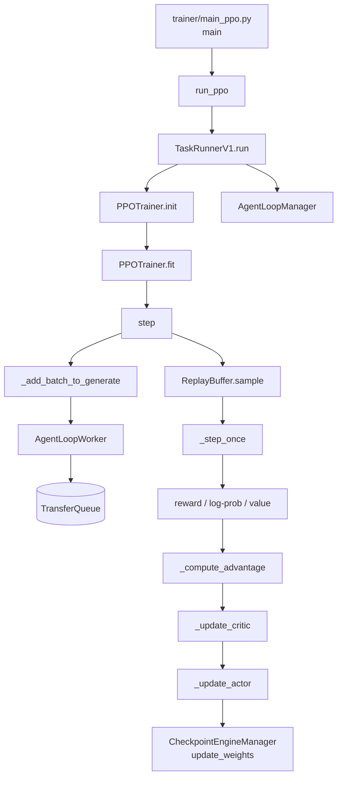

# 源码地图：别从目录第一页开始

下面是一条为学习设计的最短路径。链接都固定到本站对应的源码提交，避免 `main` 分支变化后文章与代码错位。

## 先用人话：第一次读只跟“快递单”

把一条 prompt 想成包裹。第一次只看它经过哪些站，不拆包；第二次打开包裹，记录每站新增了哪些字段；第三次才看车队如何调度到多机 GPU。一次同时研究算法、数据结构和 Ray 放置，任何一条线都会断。

## 目录不是阅读顺序

```text
verl/
├── trainer/
│   ├── main_ppo.py                 # Hydra 入口与 TaskRunner
│   ├── config/                     # 组合配置及 dataclass
│   └── ppo/
│       ├── core_algos.py           # 优势估计、策略损失等算法
│       ├── v1/                     # 当前默认训练主线
│       └── ray_trainer.py          # V0 旧训练器
├── experimental/
│   ├── agent_loop/                 # 单样本/多轮 rollout
│   └── reward_loop/                # 并发 reward manager
├── workers/                        # 训练、rollout、reward worker
├── protocol.py                     # DataProto（V0 主干，V1 边界仍用）
├── utils/dataset/rl_dataset.py     # 数据集读取与样本契约
└── single_controller/ray/          # Ray WorkerGroup 与资源池
```

## 一次训练的调用链



`step()` 是第一次通读时最有价值的锚点：它把生成、采样、奖励、优势与更新按执行顺序摆在一起。初始化细节只在你需要解释某个对象从哪里来时再向上追。

## 建议打开的文件

| 你要回答的问题 | 首要文件 | 再向哪里追 |
| --- | --- | --- |
| 程序从哪里启动？ | [`verl/trainer/main_ppo.py`](https://github.com/verl-project/verl/blob/e5687fce0516d31e1fdc4580499074a9bd94c751/verl/trainer/main_ppo.py) | `TaskRunnerV1.run` |
| 一次 step 做什么？ | [`trainer_base.py`](https://github.com/verl-project/verl/blob/e5687fce0516d31e1fdc4580499074a9bd94c751/verl/trainer/ppo/v1/trainer_base.py) | `step`、`_step_once` |
| rollout 如何并发？ | [`agent_loop_tq.py`](https://github.com/verl-project/verl/blob/e5687fce0516d31e1fdc4580499074a9bd94c751/verl/trainer/ppo/v1/agent_loop_tq.py) | `experimental/agent_loop` |
| 轨迹在哪里？ | [`replay_buffer.py`](https://github.com/verl-project/verl/blob/e5687fce0516d31e1fdc4580499074a9bd94c751/verl/trainer/ppo/v1/replay_buffer.py) | `transfer_queue` |
| 优势怎样算？ | [`core_algos.py`](https://github.com/verl-project/verl/blob/e5687fce0516d31e1fdc4580499074a9bd94c751/verl/trainer/ppo/core_algos.py) | `v1/utils.py` |
| 奖励函数收什么参数？ | [`naive.py`](https://github.com/verl-project/verl/blob/e5687fce0516d31e1fdc4580499074a9bd94c751/verl/experimental/reward_loop/reward_manager/naive.py) | `trainer/ppo/reward.py` |
| 数据行长什么样？ | [`rl_dataset.py`](https://github.com/verl-project/verl/blob/e5687fce0516d31e1fdc4580499074a9bd94c751/verl/utils/dataset/rl_dataset.py) | `examples/data_preprocess` |
| GPU 怎么分给角色？ | [`single_controller/ray/base.py`](https://github.com/verl-project/verl/blob/e5687fce0516d31e1fdc4580499074a9bd94c751/verl/single_controller/ray/base.py) | `engine_workers.py` |

## 三次通读法

第一次只记控制流：进入哪个函数、下一个函数是谁。第二次只追一条样本的字段和值域。第三次才看并发、资源放置和性能优化。混在一次阅读中，会把算法问题、数据问题与分布式问题搅在一起。

遇到文档与运行行为不一致时，先确认 Python 实际导入位置：

```bash
python - <<'PY'
import inspect
import verl
import verl.trainer.main_ppo as main_ppo

print("verl:", inspect.getfile(verl))
print("main_ppo:", inspect.getfile(main_ppo))
PY
```

这能区分“正在看的工作树”与“环境里实际安装的包”。

## 本课产出

不要抄上面的图。自己新建一张只含 12 个节点的调用链，必须包含 `main → TaskRunnerV1 → fit → step → ReplayBuffer → _step_once → update_actor → update_weights`，其余节点按你的问题选择。再选一个字段，写清首次出现与最后消费的位置。

下一步：[整体架构](/verl/internals/architecture)。
