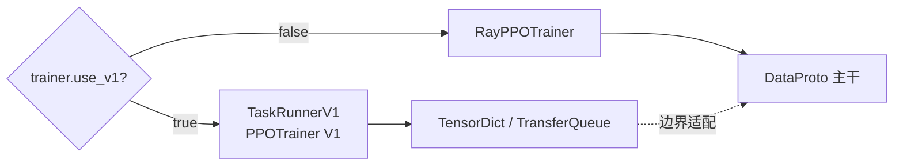

# 版本边界：先分清 V1 与旧训练器

本站源码中 `verl/trainer/config/ppo_trainer.yaml` 默认 `trainer.use_v1: true`。很多较早的文章围绕 `RayPPOTrainer` 与 `DataProto` 展开，概念仍有帮助，但不能直接当作当前主调用链。

## 先用人话：你可能拿着旧地铁图找新换乘站

站名“rollout、reward、actor update”还在，但线路已经改了：旧主线由 driver 直接传 DataProto；V1 让 AgentLoop 把轨迹写入 TransferQueue，trainer 通过 key/tag 取样。沿旧类名逐行读，会把正确概念接到错误时序上。

## 快速识别

| 观察点 | 当前 V1 | 旧 V0 |
| --- | --- | --- |
| 选择开关 | `trainer.use_v1=true`（默认） | `trainer.use_v1=false` |
| 训练器位置 | `verl/trainer/ppo/v1/` | `verl/trainer/ray_trainer.py` |
| 主数据通道 | TransferQueue + TensorDict | DataProto |
| 批次引用 | `KVBatchMeta` 保存 key/tag | `DataProto` 自带 tensor/non-tensor batch |
| rollout 调度 | AgentLoop 写入 TQ，ReplayBuffer 取样 | trainer 直接调用 rollout WorkerGroup |
| 模式 | `sync`、`colocate_async`、`separate_async` | 经典同步 driver 流程 |
| 状态 | 当前默认 | `main_ppo_v0.py` 已给出弃用提示 |



虚线很重要：V1 并没有让 `DataProto` 完全消失。例如 reward manager 的单样本接口、共享优势算法的适配处仍可能临时构造 DataProto。正确说法是“V1 的核心传输以 TQ/TensorDict/KVBatchMeta 为主”，而不是“V1 不再有 DataProto”。

## 阅读旧材料时怎样迁移

| 旧材料中的动作 | 在 V1 中寻找 |
| --- | --- |
| `DataProto` 在 driver 间传递 | TQ 中的 TensorDict 数据与 `KVBatchMeta.keys` |
| `gen_batch = actor_rollout_wg.generate_sequences(...)` | `_add_batch_to_generate` → AgentLoop → TQ |
| driver 立即拿到完整 rollout | ReplayBuffer 等待 prompt group 完成后采样 |
| 直接拼接/切分 DataProto | TQ 的字段选择、key/tag 与 worker API |
| rollout 后立刻更新同一套权重 | 查看 trainer mode 和参数同步时机 |

算法概念通常可以迁移，类名、数据所有权与时序则必须重新核对。

## 给学习笔记加版本锚点

每篇源码笔记至少记录：

```text
repository: https://github.com/verl-project/verl
commit: e5687fce0516d31e1fdc4580499074a9bd94c751
trainer.use_v1: true
trainer.v1.trainer_mode: sync
rollout backend: <你的实际值>
model engine: <dp / fsdp2 / megatron ...>
```

升级 veRL 时先做结构差异检查，再修改笔记：

```bash
git diff --stat OLD_COMMIT..NEW_COMMIT -- \
  verl/trainer/main_ppo.py \
  verl/trainer/ppo/v1 \
  verl/trainer/config \
  verl/experimental/agent_loop \
  verl/experimental/reward_loop
```

> [!TIP]
> 如果目的是理解当前程序，运行时导入路径、解析后的 Hydra 配置和当前提交，优先级高于搜索结果中没有版本号的教程。

## 通关检查

在你的笔记顶部写出 commit、`use_v1`、trainer mode 和 rollout backend；然后说明 V1 的主数据通道是什么、DataProto 还在哪类边界出现。答不出时不要继续搜索类名，先打印 resolved config 与实际导入路径。
