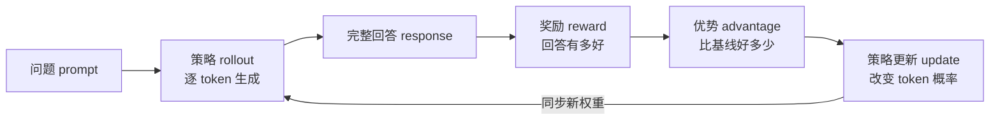

# 从这里开始：先找到你真正缺的那一块

如果你打开 veRL 后看到 Ray、rollout、actor、advantage、TransferQueue 一起出现，觉得每个词都认识、连起来却不知道系统在做什么，这是正常的。你缺的通常不是更多术语，而是一条能反复验证的主线。

本站只围绕一条主线展开：

> **一个问题怎样变成回答，回答怎样得到评价，评价怎样变成梯度，新参数又怎样回到下一轮生成？**

veRL 已经作为本站第五条主线接入完整 LLM 技术栈，而不是一个孤立附录。第一次阅读建议先打开[veRL 怎样接入完整 LLM 系统](./guide/llm-systems-integration)：它会从固定提交解释 SFT checkpoint 如何成为 actor、vLLM/SGLang 如何提供 rollout、FSDP/Megatron 如何执行更新、Ray 如何编排这些角色，以及新权重怎样回到推理引擎。

先用下面的诊断找到起点。不要因为某项不会就先去补一整本教材；只补足当前阶段需要的最小知识。

## 八分钟入场诊断

不查资料，试着口头回答。答案模糊也没关系，记录你在哪一列最常停顿。

| 你能解释的问题 | 如果答不上，真正缺的是什么 | 建议入口 |
| --- | --- | --- |
| 模型生成下一个 token 时，实际输出的是什么？ | 概率分布、采样与 log-prob | [LLM 如何成为策略](/verl/fundamentals/llm) |
| reward=1 为什么不能直接当作 loss 反向传播？ | 随机策略与策略梯度 | [策略梯度这座桥](/verl/algorithms/policy-gradient) |
| advantage 为正，究竟希望哪个概率变大？ | credit assignment 与目标函数 | [强化学习的完整闭环](/verl/fundamentals/rl) |
| old policy、current policy、rollout policy 有何区别？ | PPO 的数据时序 | [PPO 与 GAE](/verl/algorithms/ppo) |
| GRPO 为什么同一问题要生成多个回答？ | 组内相对基线 | [GRPO、Dr.GRPO 与 DAPO](/verl/algorithms/grpo-family) |
| 一次 rollout 与普通聊天推理有何异同？ | 训练所需的轨迹字段 | [第一次可验证实验](/verl/practice/first-run) |
| Ray actor、veRL Worker、GPU 进程是不是同一个概念？ | 控制面和计算面的边界 | [整体架构](/verl/internals/architecture) |
| 想换奖励或优势估计器时，应该改哪一层？ | 扩展边界 | [扩展点地图](/verl/customization/extension-map) |

判断方法：

- 前三题不稳，从第 01 站开始；这不是“基础差”，而是在避免后面只会抄配置。
- 前五题能答、但没跑过 veRL，直接去第 03 站完成 smoke run。
- 已经能训练，但看不懂数据在哪里，去第 04 站沿一个 `uid` 追踪。
- 已经改过奖励，准备改算法或吞吐，去第 05 站，同时回查你用到的算法章节。

## 先把全局闭环装进脑中

下面这张图现在只需看懂箭头，不必理解每个公式。



用人话说：模型先按当前习惯写几份答案；评分规则告诉它哪些更好；算法把“好多少”变成每个 token 的训练信号；优化器只做一小步，避免新习惯突然偏离太远；新权重再交给生成引擎继续收集经验。

专业地说：LLM 是参数化策略 \(\pi_\theta\)，rollout 产生由 token 动作组成的轨迹，奖励经过基线或价值函数构造优势估计 \(\hat A_t\)，策略梯度目标用 \(\log \pi_\theta(a_t\mid s_t)\hat A_t\) 调整参数，PPO/GRPO 等方法再处理更新幅度、基线和样本组织问题。

这两段说的是同一件事。课程中每个概念都会先给直觉，再给严格表达，最后落到源码字段。

## 这不是目录，而是六个通关站点

| 站点 | 核心任务 | 你要留下的证据 |
| --- | --- | --- |
| 00 定位 | 找到知识缺口，固定源码版本 | 一份自测结果和学习计划 |
| 01 地基 | 把语言生成映射成 RL | 手画状态、动作、奖励、策略关系图 |
| 02 算法 | 看懂 PPO/GRPO 输入与输出 | 从公式标出每个张量的 shape 和来源 |
| 03 实验 | 跑完首个训练 step | 命令、解析配置、日志、样本和指标 |
| 04 源码 | 沿一个 `uid` 跟完闭环 | 一张带函数名与字段名的时序图 |
| 05 改造 | 做一次可测的自定义改动 | 单元测试、A/B 基线与失败回退方案 |

完整的每日安排在[六周学习计划](./guide/learning-plan)。如果你只想解决眼前问题，可以按上表跳转；但自定义算法前至少应通过 01、02、04 三站。

## 每一课应该怎样读

页面会反复使用同一种节奏：

1. **问题**：先知道这一节在解决什么，不从名词定义开始。
2. **人话模型**：允许不精确，但必须能形成可操作直觉。
3. **专业模型**：用公式、shape、边界条件把直觉校准。
4. **源码落点**：找到文件、函数和真实字段，不停在架构图。
5. **误区与实验**：主动触发一次错误或反例。
6. **通关检查**：能解释、能定位、能留下可复现证据。

::: tip 学习时同时打开三个窗口
左边放课程，中间放固定提交的源码，右边放你自己的 `learning-log.md`。每遇到一个新字段，记录“谁写入、谁读取、shape、何时失效”，比抄类名有效得多。
:::

## 怎样判断自己不是“看懂了而已”

完成课程后，你应能在不看网页的情况下回答：

- rollout 为什么既是推理，又不是普通的线上推理；
- reward、token-level reward、advantage、return、loss 分别由谁产生；
- V1 训练器中一批数据什么时候只传 `KVBatchMeta`，什么时候真正读取 TensorDict；
- actor、reference、critic、reward、rollout 角色哪些必需、哪些取决于算法；
- 新 actor 权重何时进入推理引擎，过旧样本会造成什么问题；
- 换奖励、换组内基线、换 replay 采样和换推理后端，各自最小改动面在哪里；
- 优化吞吐前应采集什么证据，怎样避免“速度快了但算法语义变了”。

如果只能背调用链，却不能预测删掉一个字段后哪里先报错，还没真正掌握。反过来，如果你能先画出数据契约，再去源码确认细节，就已经具备改框架的能力。

## 现在做第一件事

在笔记里写下三行：

```text
我的目标：例如“给代码生成任务接入沙箱奖励”
我的当前证据：例如“跑过 GRPO，但解释不了 old_log_probs”
我的第一个里程碑：例如“本周追完一个 uid 的 rollout → update”
```

然后打开[六周学习计划](./guide/learning-plan)，把与你目标无关的选修项划掉。学习框架的目的不是遍历所有文件，而是建立足够准确的模型，支持下一次判断。
