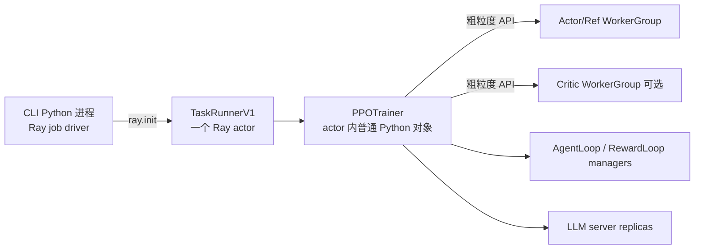
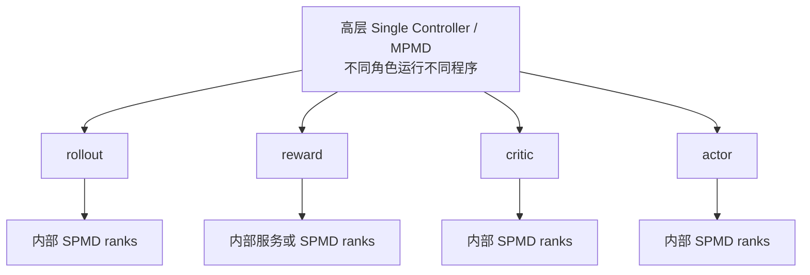
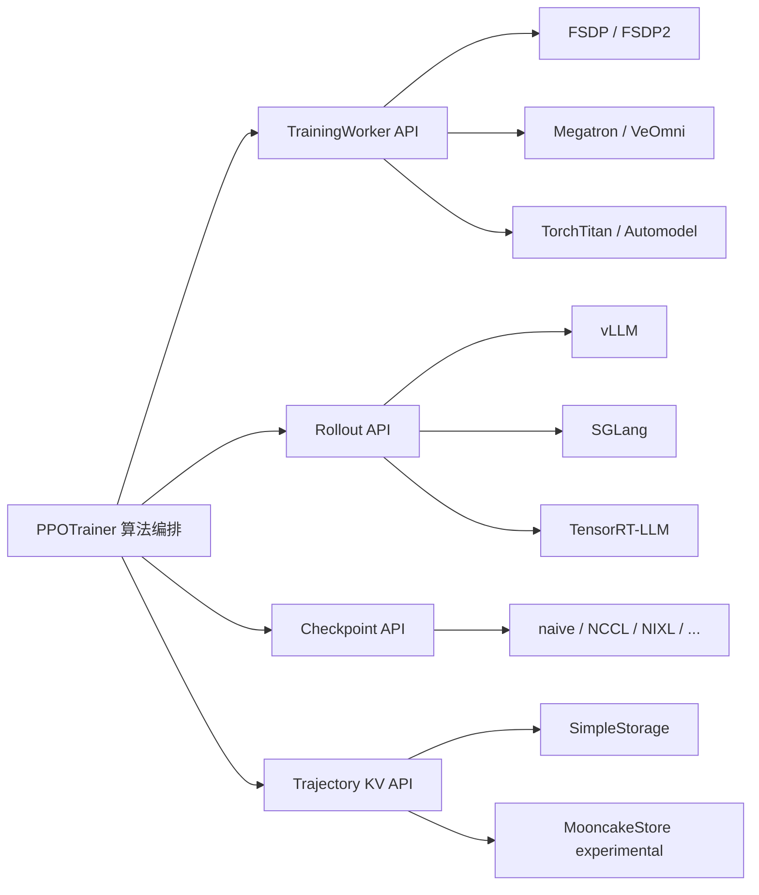

# 设计原则：Single Controller、HybridFlow 与模块化后端

veRL 的核心不是“用 Ray 启动很多进程”，而是把复杂 RL 训练拆成两层：**一个控制器表达全局算法，多组分布式 worker 高效执行局部重计算**。再用稳定接口隔开训练、推理、权重同步和轨迹存储后端。

## 先用人话：总导演不亲自演所有角色

- 总导演只有一个：决定先 rollout、再打分、再算 advantage、最后更新谁；
- 每个大型场景有自己的执行班组：FSDP、Megatron、vLLM 等在内部按多 rank 协同；
- 导演只说“计算 log-prob”或“更新 actor”，不指挥每一次 all-reduce；
- 道具和剧本分开运输：trajectory 走 TransferQueue，模型权重走 checkpoint engine；
- 换一个执行班组，不应重写整部戏的剧情。

这正是 Single Controller、HybridFlow 和模块化后端之间的关系。

## 四条设计原则

| 原则 | 解决的问题 | 固定提交中的落点 |
| --- | --- | --- |
| 高层单一控制器 | PPO/GRPO 是多模型、多阶段 DAG，需清楚表达条件、循环和中间数据 | `TaskRunnerV1` 内的 `PPOTrainer.fit()` / `_step_once()` |
| 内部 SPMD 执行 | 大模型训练不能由控制器逐 rank 微操 | `RayWorkerGroup` 调用 `TrainingWorker`，Engine 内部用 `torch.distributed` |
| 模块化后端 | 算法不应绑定 FSDP、Megatron、vLLM 或某种权重传输 | `EngineRegistry`、rollout registry、`CheckpointEngineRegistry`、TQ backend |
| 分离控制流、样本流和权重流 | 避免大对象全部经过 controller/Ray RPC，明确性能与故障边界 | Ray RPC、TransferQueue、CheckpointEngine 分别承担三种流 |

## Single Controller：到底“单”在哪里

官方的 [`verl.single_controller` 设计说明](https://verl.readthedocs.io/en/latest/single_controller.html) 给出的动机是：传统纯 SPMD 写法不容易表达 PPO 的多个计算 DAG，也不容易在 Python 控制流中检查中间 batch。veRL 因此保留一个接近单进程脚本的全局训练循环，再把粗粒度计算分发出去。

绑定提交中的真实对象关系是：

所以 Single Controller 不等于：

- 整个系统只有一个进程；
- 所有模型都放在一张 GPU；
- controller 亲自执行前向、反向或 collective；
- 所有数据都经过 Ray object store。

它表示**全局 RL 数据流只有一个逻辑编排者**。在 V1 中，这个编排者是运行在 `TaskRunnerV1` Ray actor 内的 `PPOTrainer`；入口见 [`main_ppo.py`](https://github.com/verl-project/verl/blob/e5687fce0516d31e1fdc4580499074a9bd94c751/verl/trainer/main_ppo.py)，step 编排见 [`trainer_base.py`](https://github.com/verl-project/verl/blob/e5687fce0516d31e1fdc4580499074a9bd94c751/verl/trainer/ppo/v1/trainer_base.py)。

### 为什么不把所有逻辑都写成 SPMD

PPO/GRPO 不只有一段“所有 rank 同时跑同一函数”的程序。rollout、reward、reference、critic 和 actor 可能拥有不同资源、并行策略、调用次数和启动条件；异步模式还要处理 staleness 与反压。高层 Python 控制流更适合描述这些变化。

### 为什么控制器又不会成为逐算子瓶颈

controller 发的是 `compute_log_prob`、`compute_values`、`update_actor` 这类粗粒度命令。一个命令进入 WorkerGroup 后，才由各 rank 的 model engine 执行大量 GPU 计算和 collective。控制器不对每个 layer 发 RPC。

## HybridFlow：两种编程模型接在一起

[HybridFlow 论文](https://arxiv.org/abs/2409.19256)和[官方架构说明](https://verl.readthedocs.io/en/latest/blog/v0.7.html)把它称为 Hybrid-Controller：

- **高层 MPMD**：actor、critic、rollout、reward 执行不同程序，controller 决定依赖关系；
- **内部 SPMD**：同一个角色的多个 rank 执行相同分布式程序，由 FSDP/Megatron/vLLM 等后端同步。

灵活性来自上层，吞吐来自下层。这才是 “hybrid” 最重要的含义。

## 三种容易混淆的 hybrid

| 说法 | 真正含义 | 当前 V1 里怎么看 |
| --- | --- | --- |
| HybridFlow / Hybrid-Controller | 高层单控制器 + 角色内部多控制器/SPMD | 整个框架的编程模型 |
| `ActorRolloutRefWorker` hybrid worker | 一个 worker API 可按 `role` 组装 actor、rollout、ref 子对象 | 见 [`engine_workers.py`](https://github.com/verl-project/verl/blob/e5687fce0516d31e1fdc4580499074a9bd94c751/verl/workers/engine_workers.py) |
| hybrid/colocate deployment | 训练与推理在相同 GPU 资源上分时或共享放置 | `LLMServerManager`、sleep/wake、权重同步 |

还要注意版本边界：原始论文中的 **3D-HybridEngine** 是训练/生成 reshard 的早期核心实现；绑定提交的 `ActorRolloutRefWorker` 已明确采用 native server mode，V1 通过 `LLMServerManager` 与 `CheckpointEngineManager` 管理推理副本和权重。学习设计思想可以读论文，追当前行为必须看固定源码。

## 模块化后端：算法层只依赖稳定契约

| 模块边界 | controller 依赖的接口 | 后端选择位置 |
| --- | --- | --- |
| 训练 Model Engine | initialize、infer batch、train mini-batch、checkpoint、并行信息 | [`EngineRegistry`](https://github.com/verl-project/verl/blob/e5687fce0516d31e1fdc4580499074a9bd94c751/verl/workers/engine/base.py)，`actor.strategy` / `critic.strategy` |
| Rollout Engine | resume、release、update weights、生成服务 | [`rollout/base.py`](https://github.com/verl-project/verl/blob/e5687fce0516d31e1fdc4580499074a9bd94c751/verl/workers/rollout/base.py)，`rollout.name` / `mode` |
| Checkpoint Engine | actor → rollout 权重准备、发送与接收 | [`checkpoint_engine/base.py`](https://github.com/verl-project/verl/blob/e5687fce0516d31e1fdc4580499074a9bd94c751/verl/checkpoint_engine/base.py) |
| TransferQueue | KV put/get、tag、partition、清理 | `transfer_queue.backend.storage_backend` |

“可插拔”不表示任意组合必然兼容。换 backend 时仍要校验模型支持、并行 size、dtype、权重格式、设备、rollout feature 和 checkpoint transport；但这些差异应收敛在 engine/adapter/registry，而不是散落为 trainer 中的大量 `if backend`。

## 三层与三条流

从进程职责看，可以继续用控制面、计算面和数据面：

- **控制面**：TaskRunner、PPOTrainer、各 manager；
- **计算面**：训练 WorkerGroup、rollout/reward/teacher servers；
- **数据面**：Dataset、TransferQueue、ReplayBuffer 元数据。

从传输对象看，又要区分三条流：

| 流 | 主要通道 | 典型内容 |
| --- | --- | --- |
| 控制流 | Ray actor RPC / futures | “开始 rollout”“计算 log-prob”“更新参数” |
| 样本流 | TransferQueue + `KVBatchMeta` | token、mask、reward、log-prob、advantage |
| 权重流 | CheckpointEngine + rollout adapter | actor 新权重与版本 |

Ray 负责调度与 RPC，但 V1 不把整批 trajectory 当作普通 Ray 返回值来回搬。trainer 常传递的是带 keys/tags 的 `KVBatchMeta`，计算 worker 再从 TQ 取所需字段。

## 三种 trainer mode 保留同一抽象

| 模式 | 资源关系 | 参数同步 | 额外语义 |
| --- | --- | --- | --- |
| `sync` | 训练与 rollout 共置 | 每个 step 后同步 | 最容易验证，先学它 |
| `colocate_async` | 共置并流水化 | 异步生命周期钩子控制 | 需理解缓存与 staleness |
| `separate_async` | 训练与 rollout 分池 | `parameter_sync_step` 控制 | 独立扩缩容，资源与反压更复杂 |

它们复用相同的核心组件契约；变化主要落在何时 wake/sleep、何时提交轨迹、何时同步权重，以及允许多旧的样本进入训练。

## 读源码时用这四个问题

遇到任何类或配置项，先问：

1. 它属于全局控制还是角色内部计算？
2. 它传的是命令、trajectory，还是模型权重？
3. 它是稳定接口，还是某个 backend 的实现？
4. 它说的 hybrid 是编程模型、混合角色，还是资源共置？

## 通关检查

不用看图，解释下面这句话：

> `PPOTrainer` 在一个 Ray actor 中按普通 Python 控制流编排 PPO；`RayWorkerGroup` 把粗粒度调用扇出到多 rank；各 model/rollout engine 在内部用 SPMD 高效执行；TQ 与 checkpoint engine 分别传 trajectory 和权重。

如果能同时说明“为什么单控制器不等于单进程”和“为什么 HybridFlow 不等于 actor/rollout 共置”，这一课才算通过。

下一步：[入口与初始化](./entry-and-init)，再到 [Ray 运行时、角色与资源编排](./workers)。
