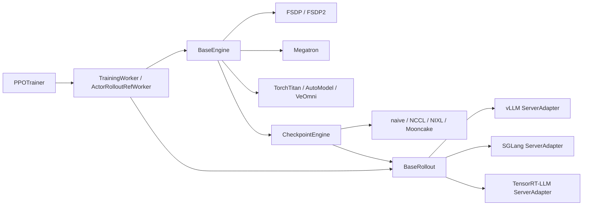
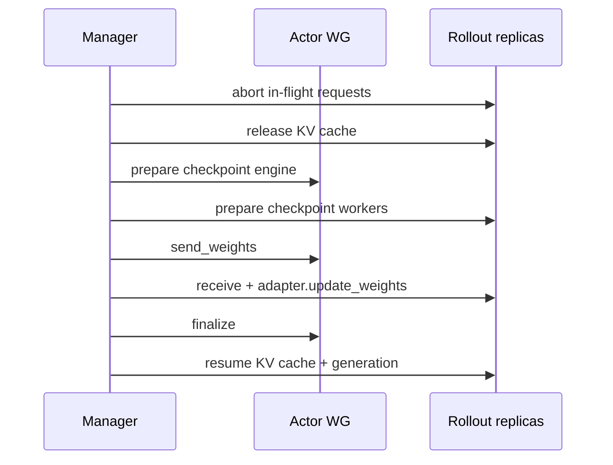

# 模块化后端逐源码：训练 Engine、Rollout 与权重同步契约

“模块化后端”只有落到接口、registry、选择条件和数据格式才有意义。本课绑定
[`e5687fce`](https://github.com/verl-project/verl/tree/e5687fce0516d31e1fdc4580499074a9bd94c751)，沿四层代码反推设计：



结论先写在前面：trainer 依赖的是粗粒度能力，不依赖某个框架类。训练后端负责“怎样分片和执行 forward/backward”，rollout 后端负责“怎样服务生成与接收权重”，checkpoint engine 负责“怎样把训练权重送过去”。

## 第一层：`BaseEngine` 定义训练能力

[`BaseEngine`](https://github.com/verl-project/verl/blob/e5687fce0516d31e1fdc4580499074a9bd94c751/verl/workers/engine/base.py#L30-L227) 的关键契约不是 `nn.Module.forward()`，而是：

| 能力 | 上层为什么需要 | 数据/状态边界 |
| --- | --- | --- |
| `initialize()` | 构造模型、optimizer、scheduler | 后端自行决定分片和进程组 |
| `train_mode()` / `eval_mode()` | 控制 offload 与训练状态 | context 退出时可回 CPU |
| `forward_backward_batch()` | 统一一次模型并行计算 | 输入 `TensorDict`，输出 loss/metrics/model output |
| `train_batch()` | zero grad → fwd/bwd → optimizer step | 通用模板在基类实现 |
| `infer_batch()` | no-grad forward | actor/ref/critic 推理复用 |
| `get_per_tensor_param()` | 导出可同步权重 | 名称、tensor 与可选 PEFT 配置 |
| `save/load_checkpoint()` | 恢复训练状态 | 后端负责 sharded/full 格式 |
| DP rank/group 查询 | 分发 batch、归并 metrics | 不能假设只有一种 process group |

[`train_batch()`](https://github.com/verl-project/verl/blob/e5687fce0516d31e1fdc4580499074a9bd94c751/verl/workers/engine/base.py#L113-L132) 把优化步骤固定成统一模板；真正的 microbatch、pipeline schedule、FSDP reshard 或 Megatron collective 藏在各自 `forward_backward_batch()` 中。

## 第二层：`EngineRegistry` 如何选择实现

[`EngineRegistry.register()`](https://github.com/verl-project/verl/blob/e5687fce0516d31e1fdc4580499074a9bd94c751/verl/workers/engine/base.py#L269-L327) 的 key 至少包含：

```text
model_type → backend → device / (device, vendor) → engine class
```

[`get_engine_cls()`](https://github.com/verl-project/verl/blob/e5687fce0516d31e1fdc4580499074a9bd94c751/verl/workers/engine/base.py#L328-L359) 的查找顺序是 vendor-specific、device-only，再对 CUDA-compatible vendor 尝试 NVIDIA fallback。找不到不是静默降级，而是抛出 `ValueError`。

固定提交中的主要注册点：

| model type | strategy | 注册实现 |
| --- | --- | --- |
| language model | `fsdp`, `fsdp2` | `workers/engine/fsdp/transformer_impl.py` |
| value model | `fsdp`, `fsdp2` | 同一文件的 value engine |
| language/value model | `megatron` | `workers/engine/megatron/transformer_impl.py` |
| language model | `torchtitan` | `workers/engine/torchtitan/transformer_impl.py` |
| language model | `automodel` | `workers/engine/automodel/transformer_impl.py` |
| language/value model | `veomni` | `workers/engine/veomni/transformer_impl.py` |

用源码验证，而不是抄表：

```bash
rg -n '@EngineRegistry.register' verl/workers/engine -g '*.py'
rg -n 'strategy:' verl/trainer/config/engine -g '*.yaml'
```

## 第三层：`TrainingWorker` 把 Ray rank 接到 Engine

[`TrainingWorker.__init__()`](https://github.com/verl-project/verl/blob/e5687fce0516d31e1fdc4580499074a9bd94c751/verl/workers/engine_workers.py#L76-L149) 完成五件事：

1. 用 Ray 注入的 rank/world/master 环境建立全局 process group；
2. 解出 model/engine/optimizer/checkpoint configs；
3. 用 `EngineRegistry.new(model_type, strategy, ...)` 实例化后端；
4. 注册 DP dispatch/collect 信息；
5. 等 controller 调用 `reset()` 才执行 engine `initialize()`。

它向 controller 暴露的不是后端细节，而是 `train_mini_batch`、`infer_batch`、checkpoint 和设备迁移等粗粒度 API。这样 `PPOTrainer._update_actor()` 不需要知道当前是 FSDP all-gather 还是 Megatron pipeline schedule。

## 第四层：hybrid worker 按 role 组装子对象

[`ActorRolloutRefWorker`](https://github.com/verl-project/verl/blob/e5687fce0516d31e1fdc4580499074a9bd94c751/verl/workers/engine_workers.py#L435-L460) 根据 role 字符串产生三个布尔值：

```text
_is_actor   ← actor / actor_rollout / actor_rollout_ref
_is_rollout ← rollout / actor_rollout / actor_rollout_ref
_is_ref     ← ref / actor_rollout_ref
```

随后 [`init_model()`](https://github.com/verl-project/verl/blob/e5687fce0516d31e1fdc4580499074a9bd94c751/verl/workers/engine_workers.py#L503-L636) 分四段装配：

1. role 含 ref：创建没有 optimizer 的 reference `TrainingWorker`；
2. role 含 actor：创建 actor `TrainingWorker` 并注入 PPO loss；
3. role 含 rollout：计算 `dp × infer_tp × infer_pp` device mesh，再从 rollout registry 创建 adapter；
4. role 含 actor：为权重发送端创建 checkpoint engine。

### LoRA 为什么会改变 role

在 [`_init_resource_pool_mgr()`](https://github.com/verl-project/verl/blob/e5687fce0516d31e1fdc4580499074a9bd94c751/verl/trainer/ppo/v1/trainer_base.py#L620-L633) 中：

- 若需要 reference 且 reference 不能从 actor adapter 推导，role 是 `ActorRolloutRef`；
- 若 LoRA rank > 0 或已有 adapter path，可在 actor 上禁用 adapter 获得 base reference，role 退化为 `ActorRollout`；
- critic 仍是独立的 `TrainingWorker` role。

因此“配置开启 reference”不必然等于额外加载第二份完整模型。

## Rollout registry：当前 V1 是 server mode

[`BaseRollout`](https://github.com/verl-project/verl/blob/e5687fce0516d31e1fdc4580499074a9bd94c751/verl/workers/rollout/base.py#L29-L80) 只要求：

- `resume(tags)`；
- `release()`；
- `update_weights(generator)`；
- 可选同步 `generate_sequences()`。

固定提交的 [`_ROLLOUT_REGISTRY`](https://github.com/verl-project/verl/blob/e5687fce0516d31e1fdc4580499074a9bd94c751/verl/workers/rollout/base.py#L83-L104) 明确只有 async server adapters：

| `rollout.name` | adapter |
| --- | --- |
| `vllm` | `vllm_rollout.ServerAdapter` |
| `sglang` | `sglang_rollout.ServerAdapter` |
| `trtllm` | `trtllm_rollout.ServerAdapter` |

这也是为什么旧教程里的 “SPMD rollout worker” 不能直接套到当前 V1。

## `LLMServerManager` 怎样计算 replicas

[`_initialize_llm_servers()`](https://github.com/verl-project/verl/blob/e5687fce0516d31e1fdc4580499074a9bd94c751/verl/workers/rollout/llm_server.py#L407-L470) 先计算单 replica footprint：

\[
W_{replica}=TP\times DP\times PP
\]

普通模式：

\[
N_{replica}=\frac{W_{worker\ group}}{W_{replica}}
\]

开启 PD disaggregation 时，prefill/decode replicas 和各自 TP 会共同扩大 footprint，不能继续套普通公式。若传入训练 worker group，则调用 hybrid init；没有 worker group 时创建 standalone replicas。

然后 manager 创建全局 Ray load balancer，AgentLoop 拿到的是 client，而不是直接持有每个 vLLM/SGLang process。

## 第五层：Checkpoint Engine 隔离权重传输

[`CheckpointEngine`](https://github.com/verl-project/verl/blob/e5687fce0516d31e1fdc4580499074a9bd94c751/verl/checkpoint_engine/base.py#L96-L200) 的稳定契约包括：

```text
prepare → build_topology → init_process_group
→ send_weights / receive_weights
→ finalize
```

`naive` 后端只在共置场景直接把 generator 交给 rollout；NCCL/NIXL/Mooncake 等后端需要建立跨 actor 与 rollout workers 的拓扑。

[`CheckpointEngineManager.update_weights()`](https://github.com/verl-project/verl/blob/e5687fce0516d31e1fdc4580499074a9bd94c751/verl/checkpoint_engine/base.py#L469-L514) 的非 naive 顺序是：



因此权重同步不仅是一次 tensor copy；它还定义请求中断、显存释放、通信拓扑、版本号和恢复时机。

## 组合兼容性不能只看 registry

registry 中存在两个名字，只证明“有实现”，不证明任意组合可运行。启动前至少检查：

| 维度 | 需要满足的不变量 | 首个可能失败点 |
| --- | --- | --- |
| world size | rollout TP×DP×PP 能整除可用 ranks | `ActorRolloutRefWorker.init_model` / `LLMServerManager` |
| model family | train engine 与 rollout 都支持架构和权重名 | engine initialize / adapter update |
| dtype/quant | actor 导出格式可被 rollout 接受 | `update_weights` |
| LoRA | base/adapter 合并策略与 rollout 支持一致 | `get_per_tensor_param` / adapter |
| async mode | separate async 不能使用 naive backend | `PPOTrainerSeparateAsync.__init__` |
| PD | prefill/decode footprint、地址与 replicas 配置一致 | server manager init |
| device/vendor | registry 有匹配实现 | `EngineRegistry.get_engine_cls` |

## 实践：从一个配置反推真实对象

选择你实际要跑的一条命令，保存 resolved config，然后填表：

```bash
python -m verl.trainer.main_ppo --cfg job \
  actor_rollout_ref.actor.strategy=fsdp2 \
  actor_rollout_ref.rollout.name=vllm \
  trainer.v1.trainer_mode=sync > resolved.yaml
```

| 问题 | 你的答案 | 源码证据 |
| --- | --- | --- |
| actor engine class 是谁？ |  | registration + registry lookup |
| critic 是否存在？ |  | `need_critic` |
| reference 是独立 engine 还是 actor base？ |  | role + LoRA 条件 |
| rollout replica 数量？ |  | TP/DP/PP 与 worker world size |
| checkpoint backend？ |  | resolved rollout config |
| 第一次同步发生何时？ |  | trainer mode hook |

再把 `rollout.name` 改为 `sglang`，只允许修改 rollout adapter 相关答案；如果 actor 算法或 `_step_once()` 也改变，说明你的分层理解有误。

## 通关检查

你应能不看页面解释：

1. `TrainingWorker`、`BaseEngine` 与 FSDP/Megatron engine 的层级；
2. `ActorRolloutRefWorker` 的 “hybrid” 与 HybridFlow 的区别；
3. 为什么 rollout registry 不能替代 checkpoint engine registry；
4. 为什么 `separate_async + naive` 必须拒绝启动；
5. 从 actor optimizer step 到 vLLM/SGLang 使用新权重之间的完整生命周期。

下一步：[Ray、角色与资源编排](./workers) 和 [Ray 观测实验](../practice/ray-observation-lab)。
