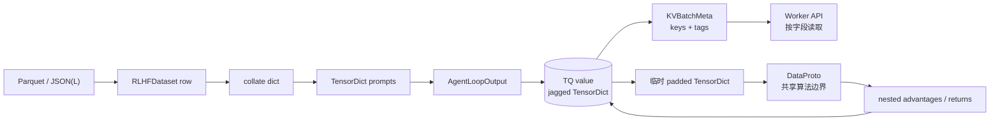

# 数据结构与组织：不要把“批次”当成一种对象

V1 的一条样本会经历 Python/Arrow 数据行、collated dict、TensorDict、TransferQueue value、KVBatchMeta，以及某些算法边界上的 DataProto。它们不是重复包装，而是服务于不同的数据所有权与传输需求。

## 先用人话：货物、货架与提货单不是同一件事

- 数据集行是带业务语义的原始货物；
- TensorDict 把同批字段按 batch 维组织；
- TransferQueue 是按 key 保存/运输字段的货架与通道；
- `KVBatchMeta` 是 partition + keys + tags 组成的提货单，本身不是所有 tensor；
- DataProto 是共享算法仍使用的临时工作箱。

遇到“batch”变量时先打印类型，再判断它拥有值还是只引用值。

## 生命周期



## 数据集行：保存语义，不预先补齐

`RLHFDataset` 支持 parquet、JSON、JSONL。典型行：

```python
{
    "data_source": "my/math",
    "prompt": [{"role": "user", "content": "1+1=?"}],
    "reward_model": {"style": "rule", "ground_truth": "2"},
    "extra_info": {"split": "train", "index": 42},
}
```

`prompt` 会成为 `raw_prompt`，reward manager 从 `reward_model.ground_truth` 取标准答案。`extra_info` 适合存可追踪但不参与模型前向的字段。不要在其中放无法序列化的临时对象，也不要假设所有 TQ backend 都能处理任意 Python 类型。

## TensorDict：批次字段与 batch size 对齐

TensorDict 把字段名、tensor/non-tensor 数据和 batch dimension 组织在一起。V1 用 `NonTensorData` / `NonTensorStack` 承载聊天消息、数据源等非张量字段；可变长 response 在 TQ 中可使用 nested/jagged 表示，进入模型计算时再按当前批次补齐。

常见字段可按阶段分组：

| 阶段 | 代表字段 | 所有者/来源 |
| --- | --- | --- |
| dataset | `raw_prompt`、`data_source`、`reward_model`、`extra_info` | RLHFDataset |
| rollout | `prompts`、`responses`、`response_mask`、`input_ids`、`position_ids` | AgentLoop |
| behavior | `rollout_log_probs`、权重版本 tag | LLM server / AgentLoop |
| scoring | `rm_scores`、reward extra fields | RewardLoopManager |
| training inference | `old_log_probs`、`entropy`、`ref_log_prob`、`values` | WorkerGroups |
| algorithm | `token_level_rewards`、`advantages`、`returns`、IS weights | trainer 算法层 |

字段是否存在由配置决定。使用 `select_fields` 的代码要允许可选字段缺失，不能用一张“全字段表”假设每个实验都拥有所有列。

## TransferQueue：tag 与 value 分离

TQ 为每个 trajectory 保存：

- **key**：`{uid}_{session_id}_{index}`，表示样本身份和多轮次序；
- **tag**：状态、prompt/response/sequence length、global step 与权重版本，适合调度；
- **value**：实际 TensorDict 字段，适合按需取回和写回；
- **partition**：当前代码使用 `train`、`val` 等逻辑分区。

prompt group 另有只含 tag 的 `{uid}` marker。ReplayBuffer 依据 marker 判断整组状态，而不是数一数某个前缀下有多少 value。

## `KVBatchMeta`：句柄，不是样本本体

它主要包含 `partition_id`、`keys`、`tags`，还可携带调用所需的 `extra_info`。trainer 把它传给 WorkerGroup；TQ 桥接装饰器或 worker 方法只取本次计算所需字段。

优势是 controller 不必反复搬运完整张量；代价是调试时打印 `batch` 看不到所有值。要检查数据，必须明确调用 `kv_batch_get(..., select_fields=[...])`，并避免在日志里 dump 大张量或敏感 prompt。

## DataProto：仍存在，但边界改变

DataProto 把 `batch: TensorDict`、`non_tensor_batch` 和 `meta_info` 放在一个协议对象中，是 V0 的主干抽象。V1 在以下场景仍会适配它：

- reward model 接口需要补齐后的 prompt/response；
- 共享的 KL、rollout correction 与 advantage 函数接收 DataProto；
- 指标函数复用既有实现。

以 `_compute_advantage` 为例：从 TQ 取 jagged 字段 → `to_padded_tensor()` → 建 DataProto → 算 advantage → 根据原始 `response_mask` 转回 nested tensor → 写回 TQ。padding 是局部计算形态，不是 TQ 中永久保存的真实长度。

## Shape 检查模板

对一个批次至少验证：

```text
len(keys) == len(tags) == B
responses.shape == response_mask.shape == [B, R]
old_log_probs.shape == advantages.shape == [B, R]
attention_mask.shape[-1] == prompt_width + response_width
sum(response_mask[i]) == tags[i].response_len（padding 样本除外）
```

再检查 dtype/device、每行 EOS 后 mask、padding side 和空 response。形状相等只能证明布局兼容，不能证明 uid/group 或 token 对齐正确。

## 通关检查

为 `responses`、`rm_scores`、`old_log_probs`、`advantages` 各写“首次写入者、存储位置、读取者、shape、何时清理”。再解释为什么 V1 可以说“TQ/TensorDict 为主”，却不能说“完全没有 DataProto”。

下一步：[Worker 与资源编排](./workers)。
