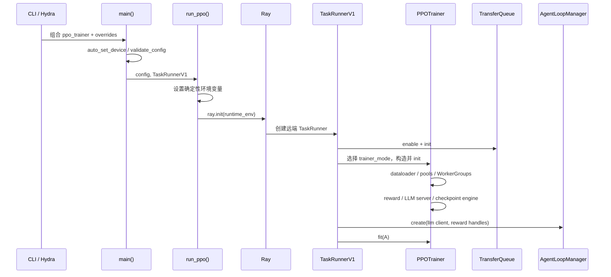
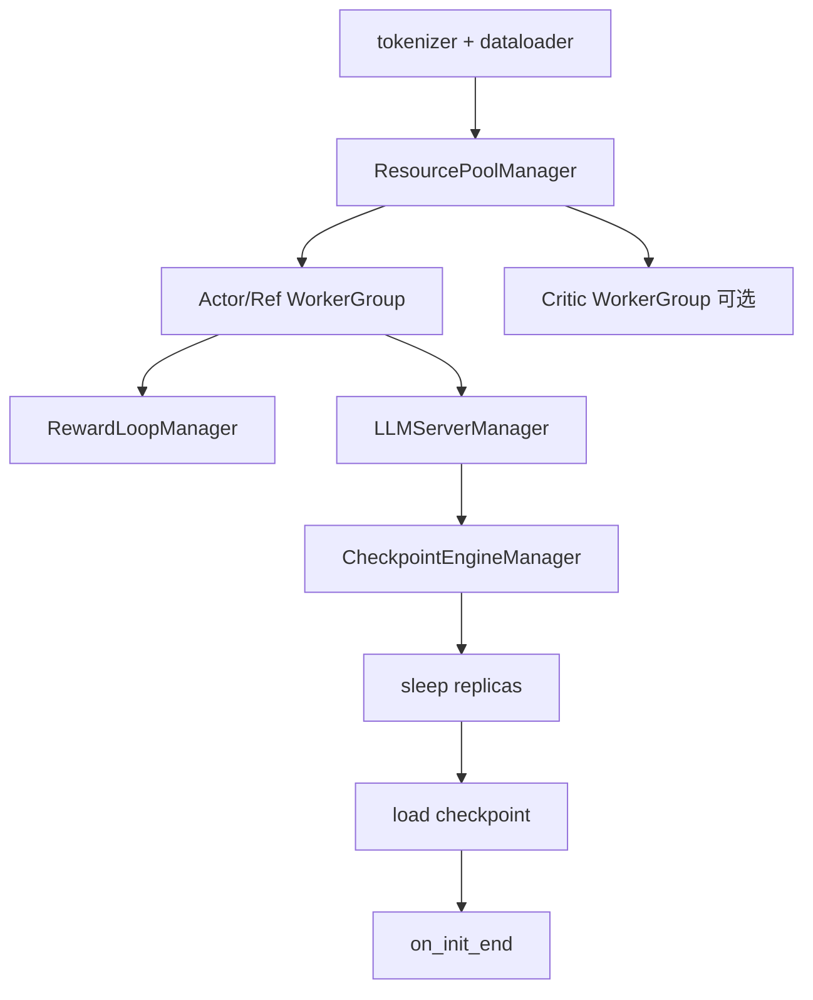

# 入口与初始化：对象在什么时候出现

入口阶段决定最终运行的并不是某个 YAML 文件，而是 Hydra defaults、命令行 override、环境变量和自动设备设置共同解析出的配置。

## 先用人话：启动不是“创建一个 Trainer”

它更像开工前装配工厂：先定最终订单（resolved config），再让 Ray 建控制进程，初始化共享数据通道，按算法需要创建 actor/reference/critic/reward 角色，启动 rollout server，建立权重同步连接，最后才把 AgentLoop 交给 `fit()`。任何前置对象未就绪，训练 step 都还没开始。

## 启动时序



## `main()`：先校验角色，再选版本

[`main_ppo.py`](https://github.com/verl-project/verl/blob/e5687fce0516d31e1fdc4580499074a9bd94c751/verl/trainer/main_ppo.py) 中 `main()` 做三件关键事：

1. 在 Ascend 环境自动设置 `trainer.device=npu`；
2. 根据配置推导是否需要 reference policy 和 critic，再调用 `validate_config`；
3. `trainer.use_v1=true` 时选择 `TaskRunnerV1`，否则进入有弃用提示的 V0。

因此“配置里 critic.enable=false”是否足够，要以 `need_critic(config)` 的推导和校验结果为准。算法选择与角色存在性是关联约束。

## `run_ppo()`：环境必须在 Ray actor 之前确定

若 rollout 或 reward-model rollout 开启 `full_determinism`，代码在 `ray.init()` 之前设置 `VERL_FULL_DETERMINISM`、`VLLM_BATCH_INVARIANT` 与 `PYTHONHASHSEED`，再由 Ray runtime env 传播到 actors。

这是分布式调试的通则：只在 driver shell 中晚设环境变量，不代表已经启动的 Ray worker 会收到它。多机变量也应在各节点加入集群前准备好。

`run_ppo()` 还会合并用户 `ray_kwargs.ray_init.runtime_env`；TQ 启用时添加 `TRANSFER_QUEUE_ENABLE=1`。若配置 nsys profiling steps，则给 TaskRunner 附加 Nsight runtime option。

## `TaskRunnerV1.run()`：建立 V1 边界

执行顺序是：

```text
get_trainer_cls(trainer_mode)
→ transfer_queue.enable = true
→ resolve/print config
→ tq.init(config.transfer_queue)
→ trainer.init()
→ AgentLoopManagerTQ.create(...)
→ trainer.fit(...)
→ finally: tq.close()
```

`finally` 关闭 TQ 意味着初始化后任何异常都应保留上游日志；不要只看最后的 close/connection error，就把它误判为根因。

## `PPOTrainer._setup()`：按依赖顺序装配



具体要点：

- actor role 根据映射选择 `ActorRolloutRef` 或 `ActorRollout`；
- critic 只在 `need_critic` 为真时创建并设置 value loss；
- LoRA 或 adapter 场景可以让 reference 复用 actor、通过关闭 adapter 计算；
- RewardLoopManager 可以有独立 RM 资源，也可以只执行规则奖励；
- LLMServerManager 从 actor worker 与 rollout resource pool 创建推理副本；
- CheckpointEngineManager 连接 actor WorkerGroup 与这些 replicas，承担权重同步。

同步 trainer 的 `on_init_end()` 会在 checkpoint 加载后先同步一次权重。之后每个 step 的同步时机见[从推理到训练](./rollout-to-update)。

## 初始化故障的定位顺序

1. 查看打印出来的 resolved config，确认 mode、后端、模型路径和资源数；
2. 找第一个 worker/actor 异常，而不是 Ray 汇总异常的最后一行；
3. 检查每个节点能否访问模型、数据、日志与 checkpoint 路径；
4. 对照 Ray resource demand 与集群实际 GPU/CPU 标签；
5. 确认运行时导入的是当前源码而非另一份 site-packages。

## 建议断点与通关检查

第一次只在 `main()`、`run_ppo()`、`TaskRunnerV1.run()`、trainer `init()` 后各停一次，记录：当前进程、config 中 mode、已创建的 role、TQ 是否初始化。能解释环境变量为何必须在 `ray.init()` 前传播，并说明 sync trainer 首次权重同步发生在训练前，才算通过。

下一步：[从推理到训练](./rollout-to-update)。
