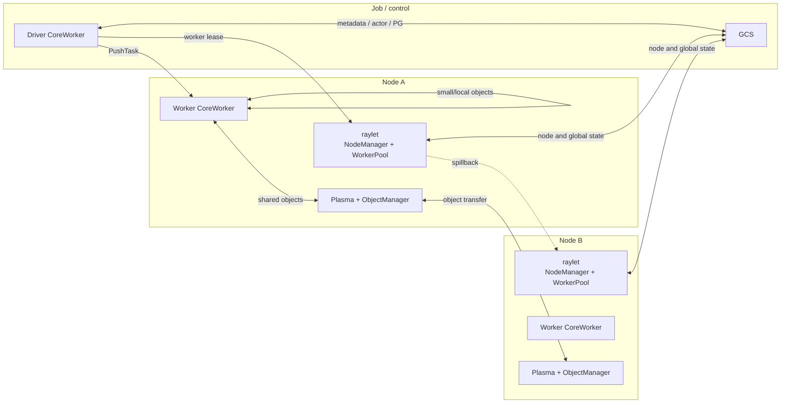
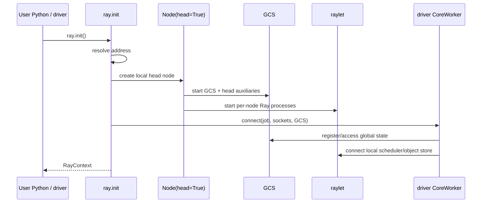
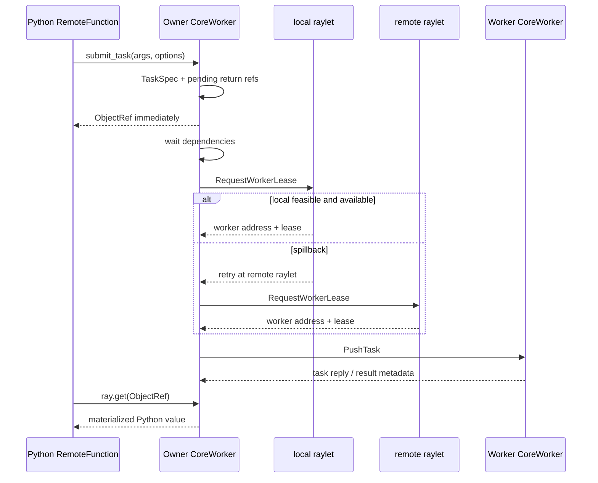
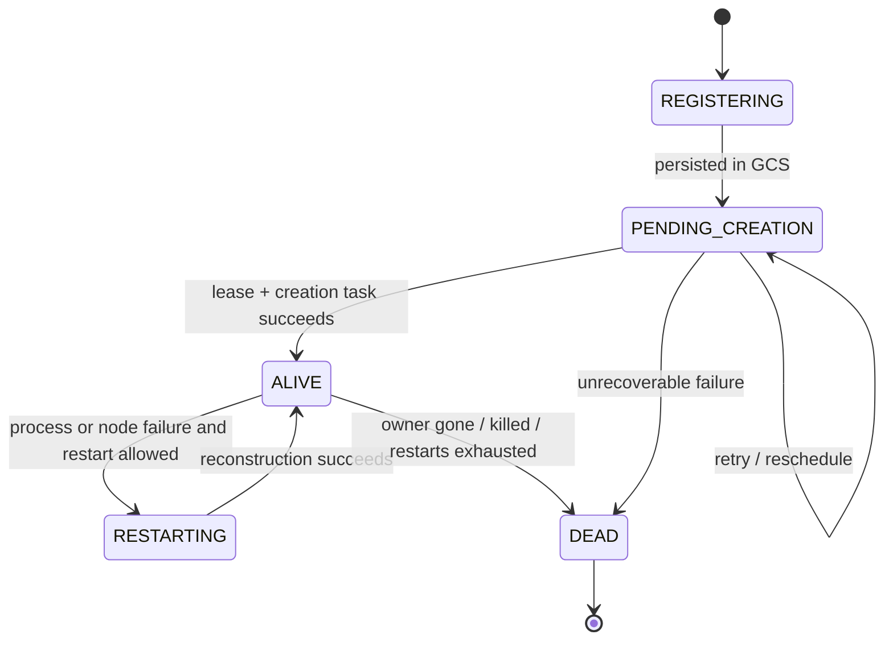
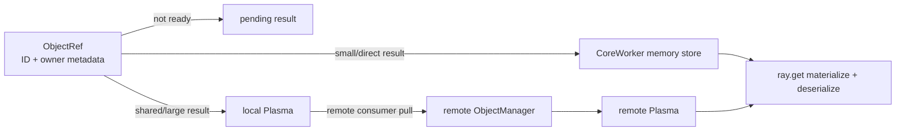
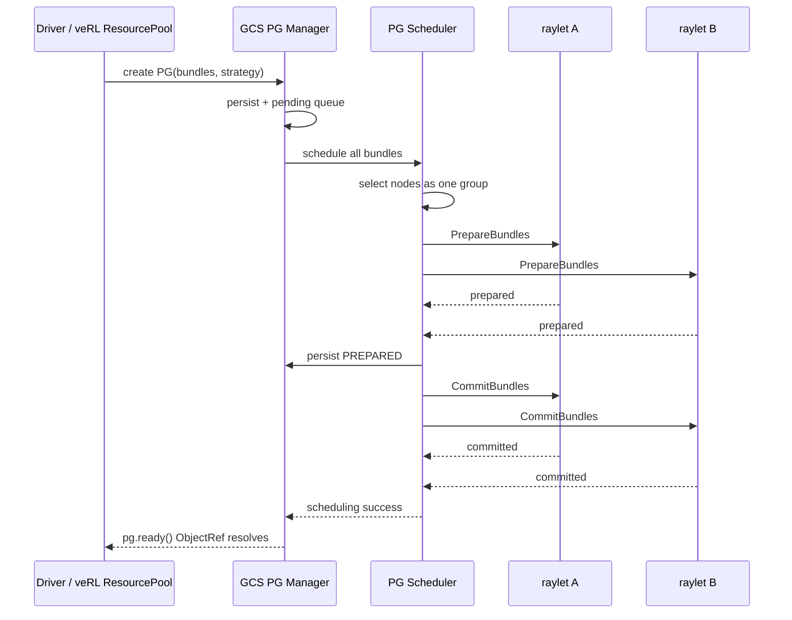
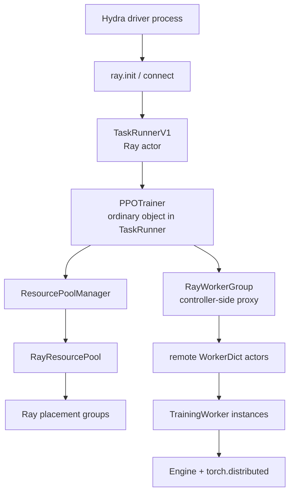
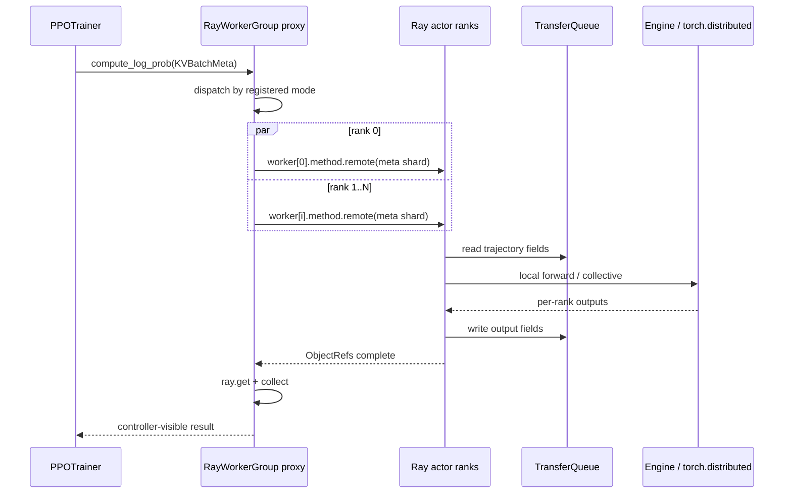
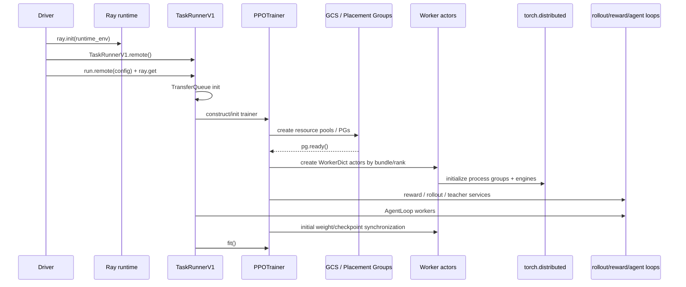

# Ray 源码运行时：从 `ray.init` 到 veRL Worker

这一课不把 Ray 简化成“一个分布式执行库”。我们固定源码版本，从 `ray.init()` 的入口一路追到任务提交、actor 创建、ObjectRef 物化和 placement group 预留，最后再把每个 Ray 对象映射回 veRL。

先记住最重要的边界：

> **Ray 负责进程生命周期、远程调用、逻辑资源和放置；veRL 的 Single Controller 决定 RL 阶段；`torch.distributed` 完成模型 ranks 之间的 collective；TransferQueue 搬 trajectory；CheckpointEngine 同步模型权重。**

它们协作，但不是同一层。

## 可复现的版本边界

本文所有 Ray 源码链接固定到：

```text
ray-project/ray
98c9eb75e44207266cc35f0cd94e1ecd58e3f77b
```

所有 veRL 源码链接固定到：

```text
verl-project/verl
e5687fce0516d31e1fdc4580499074a9bd94c751
```

建议先下载同一份源码；不要拿网页最新分支的行号解释本文：

```bash
git clone --filter=blob:none --no-checkout https://github.com/ray-project/ray.git
cd ray
git sparse-checkout init --cone
git sparse-checkout set \
  python/ray \
  src/ray/gcs \
  src/ray/raylet \
  src/ray/object_manager \
  src/ray/core_worker \
  src/ray/common \
  src/ray/protobuf \
  doc/source/ray-core \
  doc/source/ray-contribute
git checkout 98c9eb75e44207266cc35f0cd94e1ecd58e3f77b
git rev-parse HEAD
```

本文源码树已经按上述范围稀疏检出。它足以覆盖 Ray Core 的控制面、数据面和官方文档，同时避免下载与本课无关的完整 monorepo。

官方文档作为概念契约，源码作为当前固定提交的实现证据：

- [Ray Core Key Concepts](https://docs.ray.io/en/latest/ray-core/key-concepts.html)
- [Task lifecycle](https://docs.ray.io/en/latest/ray-core/internals/task-lifecycle.html)
- [Objects](https://docs.ray.io/en/latest/ray-core/objects.html)
- [Resources](https://docs.ray.io/en/latest/ray-core/scheduling/resources.html)
- [Placement Groups](https://docs.ray.io/en/latest/ray-core/scheduling/placement-group.html)
- [Fault tolerance](https://docs.ray.io/en/latest/ray-core/fault-tolerance.html)
- [Observability](https://docs.ray.io/en/latest/ray-observability/getting-started.html)

## 第一层结论：Ray 运行时是三个平面

| 平面 | 关键组件 | 核心职责 | veRL 最关心什么 |
| --- | --- | --- | --- |
| Job/控制平面 | driver、GCS | job、actor、placement group、节点元数据和全局状态 | TaskRunner 创建、PG 是否 ready、actor 是否重启 |
| 节点调度平面 | raylet / NodeManager、WorkerPool | 本地资源、worker lease、依赖等待、worker 进程池、spillback | rank 为什么 PENDING、落在哪个节点 |
| 执行/对象平面 | CoreWorker、worker process、memory store、Plasma、ObjectManager | 执行 task/actor method、引用计数、对象存取和跨节点传输 | RPC future、结果何时物化、对象是否跨节点 |

不要把 GCS 理解成“每次普通 task 都必须经过的中央 scheduler”。当前普通 task 的 worker lease 主要由 raylet 分布式调度；GCS 集中管理 actor 生命周期和 placement group 等全局协调状态。



## 进程拓扑：谁在什么条件下启动

| 组件 | 是独立 OS 进程吗 | 启动条件 | 长期状态 | 主要通信 |
| --- | --- | --- | --- | --- |
| driver | 是 | 用户运行 Python 入口 | job 的 ObjectRefs、actor handles、应用状态 | GCS、local raylet、workers |
| GCS server | 是 | 本地 head `ray.init()` 或 `ray start --head` | 节点、actor、PG 等全局元数据 | gRPC / internal RPC |
| raylet | 每节点一个独立进程 | 节点加入 Ray cluster | 本地资源、leases、worker pool | GCS、CoreWorkers、其他 raylets |
| Python worker | 是，按需或预启动 | task/actor 获得 worker | CoreWorker、运行时、函数/actor 实例 | raylet、owner CoreWorker、对象存储 |
| CoreWorker | 不是额外进程；嵌入 driver/worker | 进程连接 Ray runtime 时构造 | task manager、reference counter、submitters | raylet/GCS/其他 CoreWorkers |
| ObjectManager | 不是额外进程；位于 raylet 内 | raylet 启动 | shared-object locations、pull/push | local store、remote ObjectManagers |
| Plasma store runner | 当前源码中由 raylet 进程托管 | raylet 启动 | shared-memory objects | CoreWorker/ObjectManager |
| Dashboard / monitor | 独立辅助进程 | head 配置允许时 | 观测与 autoscaler 信息 | GCS/state APIs |

源码依据：`Node` 构造器决定是 head、connect-only 还是普通节点，并调用进程启动逻辑（[`node.py#L73-L118`](https://github.com/ray-project/ray/blob/98c9eb75e44207266cc35f0cd94e1ecd58e3f77b/python/ray/_private/node.py#L73-L118)、[`node.py#L395-L429`](https://github.com/ray-project/ray/blob/98c9eb75e44207266cc35f0cd94e1ecd58e3f77b/python/ray/_private/node.py#L395-L429)）；head 先启动 GCS（[`node.py#L1232-L1294`](https://github.com/ray-project/ray/blob/98c9eb75e44207266cc35f0cd94e1ecd58e3f77b/python/ray/_private/node.py#L1232-L1294)），每个节点再启动 raylet（[`node.py#L1296-L1412`](https://github.com/ray-project/ray/blob/98c9eb75e44207266cc35f0cd94e1ecd58e3f77b/python/ray/_private/node.py#L1296-L1412)）。

raylet 的 `main` 把 WorkerPool、ObjectDirectory、ObjectManager、local object manager、placement-group resource manager 和 NodeManager 装入同一进程（[`main.cc#L656-L736`](https://github.com/ray-project/ray/blob/98c9eb75e44207266cc35f0cd94e1ecd58e3f77b/src/ray/raylet/main.cc#L656-L736)、[`main.cc#L775-L867`](https://github.com/ray-project/ray/blob/98c9eb75e44207266cc35f0cd94e1ecd58e3f77b/src/ray/raylet/main.cc#L775-L867)、[`main.cc#L1014-L1052`](https://github.com/ray-project/ray/blob/98c9eb75e44207266cc35f0cd94e1ecd58e3f77b/src/ray/raylet/main.cc#L1014-L1052)）。因此“raylet、ObjectManager、Plasma 一定是三个独立进程”不符合这个固定提交。

## `ray.init()`：不是一句魔法

### 分支一：没有可连接的 cluster

`ray.init()` 先解析 `address`、环境变量和已存在的 bootstrap 地址（[`worker.py#L1678-L1726`](https://github.com/ray-project/ray/blob/98c9eb75e44207266cc35f0cd94e1ecd58e3f77b/python/ray/_private/worker.py#L1678-L1726)）。当没有 cluster 可连接时，它创建本地 head `Node`，并带着本次 `ray.init` 的资源和 dashboard 参数启动一套 runtime（[`worker.py#L1828-L1923`](https://github.com/ray-project/ray/blob/98c9eb75e44207266cc35f0cd94e1ecd58e3f77b/python/ray/_private/worker.py#L1828-L1923)）。

启动顺序可以压缩为：



### 分支二：连接已有 cluster

当 `address` 指向已有 cluster，`ray.init()` 构造 `Node(connect_only=True)`，不会再启动一套本地 head（[`worker.py#L1924-L1996`](https://github.com/ray-project/ray/blob/98c9eb75e44207266cc35f0cd94e1ecd58e3f77b/python/ray/_private/worker.py#L1924-L1996)）。

两条分支最后都进入 `connect()`（[`worker.py#L2026-L2059`](https://github.com/ray-project/ray/blob/98c9eb75e44207266cc35f0cd94e1ecd58e3f77b/python/ray/_private/worker.py#L2026-L2059)）：

1. 建立 GCS client，初始化 job/global state（[`worker.py#L2537-L2605`](https://github.com/ray-project/ray/blob/98c9eb75e44207266cc35f0cd94e1ecd58e3f77b/python/ray/_private/worker.py#L2537-L2605)）；
2. 在当前 Python 进程内构造 Cython `CoreWorker`（[`worker.py#L2696-L2723`](https://github.com/ray-project/ray/blob/98c9eb75e44207266cc35f0cd94e1ecd58e3f77b/python/ray/_private/worker.py#L2696-L2723)）；
3. 启动后台线程并把全局 worker 标成 connected（[`worker.py#L2740-L2781`](https://github.com/ray-project/ray/blob/98c9eb75e44207266cc35f0cd94e1ecd58e3f77b/python/ray/_private/worker.py#L2740-L2781)）。

所以 driver 不只是一个 HTTP 客户端。它本身包含 CoreWorker，持有 refs/actor handles，并参与任务提交和对象引用生命周期。

## 普通 Task：`.remote()` 后发生了什么

考虑：

```python
import ray

@ray.remote
def twice(value: int) -> int:
    return value * 2

result_ref = twice.remote(21)
result = ray.get(result_ref)
```

### 1. Python API 组装调用

`RemoteFunction._remote()` 处理 task options、resources、runtime env、placement group 和 scheduling strategy（[`remote_function.py#L345-L420`](https://github.com/ray-project/ray/blob/98c9eb75e44207266cc35f0cd94e1ecd58e3f77b/python/ray/remote_function.py#L345-L420)、[`remote_function.py#L425-L505`](https://github.com/ray-project/ray/blob/98c9eb75e44207266cc35f0cd94e1ecd58e3f77b/python/ray/remote_function.py#L425-L505)），随后调用 `core_worker.submit_task()`，把 native refs 包装成 Python `ObjectRef` 返回（[`remote_function.py#L516-L563`](https://github.com/ray-project/ray/blob/98c9eb75e44207266cc35f0cd94e1ecd58e3f77b/python/ray/remote_function.py#L516-L563)）。

### 2. CoreWorker 创建 TaskSpec 和 pending refs

C++ `CoreWorker::SubmitTask`：

- 构建 common task spec；
- 为返回值创建 object IDs；
- 在 task manager 中登记 pending task；
- 把 task 交给 normal task submitter；
- 在执行真正开始前就把 refs 返回给调用方。

对应源码见 [`core_worker.cc#L1893-L1975`](https://github.com/ray-project/ray/blob/98c9eb75e44207266cc35f0cd94e1ecd58e3f77b/src/ray/core_worker/core_worker.cc#L1893-L1975) 和 [`core_worker.cc#L1995-L2073`](https://github.com/ray-project/ray/blob/98c9eb75e44207266cc35f0cd94e1ecd58e3f77b/src/ray/core_worker/core_worker.cc#L1995-L2073)。

这就是 `.remote()` 能立即返回的源码原因：返回的是 future-like ID，不是函数结果。

### 3. 依赖就绪后申请 worker lease

NormalTaskSubmitter 先等待参数 ObjectRefs 可用，再把 task 加入调度队列（[`normal_task_submitter.cc#L34-L95`](https://github.com/ray-project/ray/blob/98c9eb75e44207266cc35f0cd94e1ecd58e3f77b/src/ray/core_worker/task_submission/normal_task_submitter.cc#L34-L95)）。随后向 local raylet 请求 worker lease（[`normal_task_submitter.cc#L270-L347`](https://github.com/ray-project/ray/blob/98c9eb75e44207266cc35f0cd94e1ecd58e3f77b/src/ray/core_worker/task_submission/normal_task_submitter.cc#L270-L347)）。

raylet 的 NodeManager 收到 lease request（[`node_manager.cc#L1890-L1970`](https://github.com/ray-project/ray/blob/98c9eb75e44207266cc35f0cd94e1ecd58e3f77b/src/ray/raylet/node_manager.cc#L1890-L1970)）。ClusterLeaseManager 判断哪些节点 feasible/available；本地不能运行时可以选择 remote node 并返回 spillback（[`cluster_lease_manager.cc#L194-L293`](https://github.com/ray-project/ray/blob/98c9eb75e44207266cc35f0cd94e1ecd58e3f77b/src/ray/raylet/scheduling/cluster_lease_manager.cc#L194-L293)）。

本地调度还要处理依赖等待（[`local_lease_manager.cc#L79-L124`](https://github.com/ray-project/ray/blob/98c9eb75e44207266cc35f0cd94e1ecd58e3f77b/src/ray/raylet/scheduling/local_lease_manager.cc#L79-L124)）、资源分配和 pop worker（[`local_lease_manager.cc#L356-L409`](https://github.com/ray-project/ray/blob/98c9eb75e44207266cc35f0cd94e1ecd58e3f77b/src/ray/raylet/scheduling/local_lease_manager.cc#L356-L409)）。

### 4. owner CoreWorker 直接把 task 推给 worker

lease 成功后，提交方 CoreWorker 建立/复用 worker client，直接发送 `PushTask` RPC（[`normal_task_submitter.cc#L515-L542`](https://github.com/ray-project/ray/blob/98c9eb75e44207266cc35f0cd94e1ecd58e3f77b/src/ray/core_worker/task_submission/normal_task_submitter.cc#L515-L542)）。



### Task 状态不能只看一列

| 现象 | 源码阶段 | 首要检查 |
| --- | --- | --- |
| ref 已返回、task 未执行 | pending 已登记，但依赖/lease 未完成 | `ray list tasks --detail`、依赖对象 |
| `PENDING_NODE_ASSIGNMENT` | 没有 feasible/available node | `ray status` 的 demands 与资源 labels |
| worker startup failed | runtime env、worker registration 或进程启动失败 | raylet 与 worker startup logs |
| task 被 spillback | local node 不合适，转交另一 raylet | task node、scheduling strategy |
| task error | worker 已执行但用户代码抛错 | 对应 worker 的第一条 traceback |

worker 启动和 runtime-env 失败在 local lease manager 有独立分支（[`local_lease_manager.cc#L609-L687`](https://github.com/ray-project/ray/blob/98c9eb75e44207266cc35f0cd94e1ecd58e3f77b/src/ray/raylet/scheduling/local_lease_manager.cc#L609-L687)），不能把它和“资源不足”混为一谈。

## Actor：创建一次，方法调用很多次

### Actor 创建为什么不同于普通 Task

Python `ActorClass._remote()` 解析 lifetime、namespace、restart、resources 和 scheduling options（[`actor.py#L1875-L1978`](https://github.com/ray-project/ray/blob/98c9eb75e44207266cc35f0cd94e1ecd58e3f77b/python/ray/actor.py#L1875-L1978)），最后调用 `core_worker.create_actor()`（[`actor.py#L2185-L2213`](https://github.com/ray-project/ray/blob/98c9eb75e44207266cc35f0cd94e1ecd58e3f77b/python/ray/actor.py#L2185-L2213)）。CoreWorker 会注册 actor 并把 creation task 交给 actor task submitter（[`core_worker.cc#L2247-L2283`](https://github.com/ray-project/ray/blob/98c9eb75e44207266cc35f0cd94e1ecd58e3f77b/src/ray/core_worker/core_worker.cc#L2247-L2283)）。

ActorTaskSubmitter 先处理 creation dependencies 并向 GCS 注册（[`actor_task_submitter.cc#L92-L164`](https://github.com/ray-project/ray/blob/98c9eb75e44207266cc35f0cd94e1ecd58e3f77b/src/ray/core_worker/task_submission/actor_task_submitter.cc#L92-L164)）。GCS ActorManager 持久化注册信息、跟踪 owner，再进入创建流程（[`gcs_actor_manager.cc#L660-L791`](https://github.com/ray-project/ray/blob/98c9eb75e44207266cc35f0cd94e1ecd58e3f77b/src/ray/gcs/actor/gcs_actor_manager.cc#L660-L791)、[`gcs_actor_manager.cc#L794-L850`](https://github.com/ray-project/ray/blob/98c9eb75e44207266cc35f0cd94e1ecd58e3f77b/src/ray/gcs/actor/gcs_actor_manager.cc#L794-L850)）。

GCS actor scheduler 向选中 raylet 请求专用 worker lease（[`gcs_actor_scheduler.cc#L235-L275`](https://github.com/ray-project/ray/blob/98c9eb75e44207266cc35f0cd94e1ecd58e3f77b/src/ray/gcs/actor/gcs_actor_scheduler.cc#L235-L275)），处理 lease granted、redirect、reject 与 retry（[`gcs_actor_scheduler.cc#L301-L368`](https://github.com/ray-project/ray/blob/98c9eb75e44207266cc35f0cd94e1ecd58e3f77b/src/ray/gcs/actor/gcs_actor_scheduler.cc#L301-L368)、[`gcs_actor_scheduler.cc#L524-L615`](https://github.com/ray-project/ray/blob/98c9eb75e44207266cc35f0cd94e1ecd58e3f77b/src/ray/gcs/actor/gcs_actor_scheduler.cc#L524-L615)）。创建成功后 ActorManager 将状态置为 `ALIVE`（[`gcs_actor_manager.cc#L1652-L1695`](https://github.com/ray-project/ray/blob/98c9eb75e44207266cc35f0cd94e1ecd58e3f77b/src/ray/gcs/actor/gcs_actor_manager.cc#L1652-L1695)）。

### Actor method 走 owner → actor 的长期连接

Python actor method 最终进入 `core_worker.submit_actor_task`（[`actor.py#L2570-L2587`](https://github.com/ray-project/ray/blob/98c9eb75e44207266cc35f0cd94e1ecd58e3f77b/python/ray/actor.py#L2570-L2587)）。CoreWorker 构造 actor task spec（[`core_worker.cc#L2415-L2512`](https://github.com/ray-project/ray/blob/98c9eb75e44207266cc35f0cd94e1ecd58e3f77b/src/ray/core_worker/core_worker.cc#L2415-L2512)），ActorTaskSubmitter 在知道 actor 地址后连接 actor、维护 pending queue，然后直接 `PushActorTask`（[`actor_task_submitter.cc#L297-L350`](https://github.com/ray-project/ray/blob/98c9eb75e44207266cc35f0cd94e1ecd58e3f77b/src/ray/core_worker/task_submission/actor_task_submitter.cc#L297-L350)、[`actor_task_submitter.cc#L534-L640`](https://github.com/ray-project/ray/blob/98c9eb75e44207266cc35f0cd94e1ecd58e3f77b/src/ray/core_worker/task_submission/actor_task_submitter.cc#L534-L640)）。

这解释了两件事：

1. GCS 协调 actor **创建和重建**，不是每个 actor method 都经 GCS 中转；
2. actor task 在同一 actor process 内访问同一实例状态，普通 task 没有这层常驻实例。



状态图是学习抽象；判断具体状态仍应以当前提交的 state API 和 GCS actor state 为准。

### Ray actor 与 RL actor 必须彻底分开

| 词 | 含义 | 例子 |
| --- | --- | --- |
| Ray actor | 有专用 worker process 和状态的执行单元 | `TaskRunnerV1` 的远程实例、每个 TrainingWorker rank |
| RL actor / policy | 被 PPO/GRPO 优化的策略模型角色 | policy network，可能跨 8 个 Ray actors |
| actor task | 对 Ray actor method 的一次调用 | `runner.run.remote(config)` |
| actor loss | 强化学习目标中的策略损失 | 在训练 engine 内计算，与 Ray actor API 无关 |

“actor 挂了”在日志里至少有两种完全不同的意思：Ray actor process 死亡，或策略模型训练数值异常。排障前先说清是哪一种。

### 重启不等于恢复训练状态

ActorTaskSubmitter 处理 actor 断连、死亡和 restart（[`actor_task_submitter.cc#L378-L470`](https://github.com/ray-project/ray/blob/98c9eb75e44207266cc35f0cd94e1ecd58e3f77b/src/ray/core_worker/task_submission/actor_task_submitter.cc#L378-L470)）。`max_restarts` 可以重建进程，但新进程里的 Python 对象不会自动恢复 optimizer、RNG、data iterator 和 step。veRL 要实现一致恢复，仍需要应用级 checkpoint 和重建协议。

## ObjectRef：句柄、所有权和字节不是一个东西

### `.remote()` 返回的是什么

ObjectRef 至少承载三层语义：

1. 唯一 object ID / future handle；
2. owner 与 distributed reference counting 所需元数据；
3. 指向结果值的逻辑引用，结果可能尚未产生，也不保证此刻位于本机。

CoreWorker 为 owned object 登记 owner、return ref 和 locality 信息（[`reference_counter.cc#L223-L244`](https://github.com/ray-project/ray/blob/98c9eb75e44207266cc35f0cd94e1ecd58e3f77b/src/ray/core_worker/reference_counter.cc#L223-L244)）。所以“ObjectRef 就是共享内存中的 bytes 地址”是错误心智模型。

### 小对象、共享对象和跨节点对象

`ray.put()` 先序列化，再进入 CoreWorker 的 put 路径（[`worker.py#L806-L897`](https://github.com/ray-project/ray/blob/98c9eb75e44207266cc35f0cd94e1ecd58e3f77b/python/ray/_private/worker.py#L806-L897)）。C++ `Put` 建立所有权并在需要时 pin Plasma 对象（[`core_worker.cc#L1055-L1119`](https://github.com/ray-project/ray/blob/98c9eb75e44207266cc35f0cd94e1ecd58e3f77b/src/ray/core_worker/core_worker.cc#L1055-L1119)）。

这个固定提交在 CoreWorker 中明确区分 in-process memory store 和 shared-memory Plasma 路径；`GetObjects` 也会按对象位置等待、取值（[`core_worker.cc#L1326-L1474`](https://github.com/ray-project/ray/blob/98c9eb75e44207266cc35f0cd94e1ecd58e3f77b/src/ray/core_worker/core_worker.cc#L1326-L1474)）。ObjectManager 监听 shared object add/delete，并根据 location 执行 pull（[`object_manager.cc#L178-L259`](https://github.com/ray-project/ray/blob/98c9eb75e44207266cc35f0cd94e1ecd58e3f77b/src/ray/object_manager/object_manager.cc#L178-L259)）。



不要把图理解成固定大小阈值承诺；阈值和 direct-call 细节可能变化。稳定的判断是：**ObjectRef 是逻辑引用；值可以未就绪、在 owner memory store、在共享对象存储或需要跨节点拉取。**

### `ray.get` 是同步边界

Python `ray.get` 规范化 refs 并调用 worker 的 `get_objects`（[`worker.py#L2871-L3019`](https://github.com/ray-project/ray/blob/98c9eb75e44207266cc35f0cd94e1ecd58e3f77b/python/ray/_private/worker.py#L2871-L3019)）；后者调用 CoreWorker、检查异常并反序列化（[`worker.py#L961-L1040`](https://github.com/ray-project/ray/blob/98c9eb75e44207266cc35f0cd94e1ecd58e3f77b/python/ray/_private/worker.py#L961-L1040)）。

在性能分析里，要把三段分开：

- task 是否已经执行完成；
- object 是否在 consumer 节点可用；
- Python 是否完成反序列化并继续运行。

### 为什么 veRL V1 不把 trajectory 全塞进 ObjectRef

veRL WorkerGroup 的 Ray RPC 仍返回 ObjectRefs，尤其适合完成信号和少量元数据。但 V1 的主要 trajectory 数据由 `KVBatchMeta` 指向 TransferQueue 中的 tensors/non-tensors；权重走 CheckpointEngine。否则 controller 和 Ray object path 会反复搬动完整 rollout batch，控制面和大对象数据面难以独立扩展。

因此：

```text
Ray ObjectRef      = 远程调用 future / 小结果或对象引用
TransferQueue key  = veRL trajectory 数据定位与生命周期
CheckpointEngine   = 模型权重版本同步
```

三者都可能出现在一次 step 中，但不可互换。

## Logical Resource：准入账本，不是物理隔离

Ray scheduler 按 task/actor 声明的 `CPU`、`GPU` 和 custom resources 判断 feasible/available。它们是逻辑数值：

- `num_gpus=1` 约束调度并影响设备可见性，不保证 kernel 正在运行；
- `num_gpus=0.25` 允许逻辑共置，不把显存硬切为四份；
- custom resource 是 label/capacity，不会替你安装软件或创建硬件；
- Ray 能成功调度，不等于 CUDA/NCCL/模型内存一定满足。

资源语义以 [Resources 官方文档](https://docs.ray.io/en/latest/ray-core/scheduling/resources.html) 为准；具体 request 进入 normal task options 和 task spec 的路径见前文源码。

## Placement Group：先整组预留，再创建 workers

### Python 层只提交 bundle 规格

`placement_group(bundles, strategy, ...)` 校验 bundle 和 strategy，再由 CoreWorker 向 GCS 注册（[`placement_group.py#L131-L227`](https://github.com/ray-project/ray/blob/98c9eb75e44207266cc35f0cd94e1ecd58e3f77b/python/ray/util/placement_group.py#L131-L227)）。`pg.ready()` 返回一个 ObjectRef，整组成功调度后才 resolve（[`placement_group.py#L25-L78`](https://github.com/ray-project/ray/blob/98c9eb75e44207266cc35f0cd94e1ecd58e3f77b/python/ray/util/placement_group.py#L25-L78)）。

Placement group 本身不会启动 Python worker，也不会创建 torch process group。它只保留资源并给后续 task/actor 提供 scheduling strategy。

### GCS 做 gang coordination

GCS PlacementGroupManager 注册并持久化 PG，放入 pending queue（[`gcs_placement_group_manager.cc#L113-L195`](https://github.com/ray-project/ray/blob/98c9eb75e44207266cc35f0cd94e1ecd58e3f77b/src/ray/gcs/gcs_placement_group_manager.cc#L113-L195)）。Scheduler 为整组 bundles 选择节点并先占用自己的资源视图（[`gcs_placement_group_scheduler.cc#L41-L169`](https://github.com/ray-project/ray/blob/98c9eb75e44207266cc35f0cd94e1ecd58e3f77b/src/ray/gcs/gcs_placement_group_scheduler.cc#L41-L169)），再向相关 raylets 发 prepare / commit RPC（[`gcs_placement_group_scheduler.cc#L196-L253`](https://github.com/ray-project/ray/blob/98c9eb75e44207266cc35f0cd94e1ecd58e3f77b/src/ray/gcs/gcs_placement_group_scheduler.cc#L196-L253)）。

local raylet 的 `PrepareBundles` 是“本节点所有目标 bundle 全部成功，否则释放已准备资源”（[`placement_group_resource_manager.cc#L43-L108`](https://github.com/ray-project/ray/blob/98c9eb75e44207266cc35f0cd94e1ecd58e3f77b/src/ray/raylet/placement_group_resource_manager.cc#L43-L108)）；commit 后创建 bundle-specific resource labels（[`placement_group_resource_manager.cc#L111-L155`](https://github.com/ray-project/ray/blob/98c9eb75e44207266cc35f0cd94e1ecd58e3f77b/src/ray/raylet/placement_group_resource_manager.cc#L111-L155)）。

GCS 收齐 prepare success 后持久化 `PREPARED` 并 commit（[`gcs_placement_group_scheduler.cc#L410-L457`](https://github.com/ray-project/ray/blob/98c9eb75e44207266cc35f0cd94e1ecd58e3f77b/src/ray/gcs/gcs_placement_group_scheduler.cc#L410-L457)）；成功后 PG 进入 `CREATED`，等待者被唤醒（[`gcs_placement_group_manager.cc#L252-L303`](https://github.com/ray-project/ray/blob/98c9eb75e44207266cc35f0cd94e1ecd58e3f77b/src/ray/gcs/gcs_placement_group_manager.cc#L252-L303)）。



这是“两阶段式 prepare/commit 协议”的源码描述，不应扩大成严格数据库 2PC 的全部保证。节点故障后 manager 会清理并重调度相关 bundles（[`gcs_placement_group_manager.cc#L690-L760`](https://github.com/ray-project/ray/blob/98c9eb75e44207266cc35f0cd94e1ecd58e3f77b/src/ray/gcs/gcs_placement_group_manager.cc#L690-L760)）。

### 为什么 veRL 先建 PG

多 rank 训练若逐个 actor 抢 GPU，可能出现 4 个 rank 已启动、另外 4 个永远没有资源，已启动 ranks 又卡在 collective 初始化。PG 先验证整个 bundle 集能放下，再让 `RayWorkerGroup` 把 ranks 绑定到对应 bundle，避免这种半启动资源死锁。

## 故障语义：先判断哪一层坏了

| 故障 | Ray 能感知什么 | Ray 自动做什么 | veRL 还必须做什么 |
| --- | --- | --- | --- |
| task 用户异常 | task reply 为 error | 按 `max_retries` 决定重试 | 判断操作是否幂等、避免重复副作用 |
| actor method 异常 | 当前 actor task failed | actor process 通常仍可存活 | 修复输入/代码，不误判为进程死亡 |
| actor process 退出 | actor disconnected/dead | 按 `max_restarts` 重建 | 从 checkpoint 恢复模型、optimizer、step |
| node 退出 | 节点/leases/objects/actors 丢失 | 重调度可恢复任务/actors/PG | 恢复跨 rank 一致状态与通信组 |
| object owner 退出 | ownership lineage/refs 失效 | 依对象容错与 lineage 尝试恢复 | 不把关键不可重建状态只留在临时对象 |
| GCS 故障 | 全局 control-plane 不可用 | 取决于 GCS fault-tolerance 配置 | 部署持久化/HA，并验证当前版本约束 |
| collective timeout | Ray actor 可能仍是 `ALIVE` | 不理解 NCCL collective 进度 | 查 rank/env/network/NCCL 与首个失败 worker |
| rollout HTTP 超时 | caller task 可能等待或失败 | 只呈现 RPC/task 状态 | 查 server ready、OOM、并发和超时 |

官方故障语义应逐项阅读：[Tasks](https://docs.ray.io/en/latest/ray-core/fault_tolerance/tasks.html)、[Actors](https://docs.ray.io/en/latest/ray-core/fault_tolerance/actors.html)、[Objects](https://docs.ray.io/en/latest/ray-core/fault_tolerance/objects.html)、[Nodes](https://docs.ray.io/en/latest/ray-core/fault_tolerance/nodes.html)、[GCS](https://docs.ray.io/en/latest/ray-core/fault_tolerance/gcs.html)。

## 可观测性：状态快照不是事实数据库

State API 的 `list_actors`、`list_placement_groups` 和 `list_tasks` 分别有明确的 filter/limit/timeout 接口（[`api.py#L793-L875`](https://github.com/ray-project/ray/blob/98c9eb75e44207266cc35f0cd94e1ecd58e3f77b/python/ray/util/state/api.py#L793-L875)、[`api.py#L1020-L1061`](https://github.com/ray-project/ray/blob/98c9eb75e44207266cc35f0cd94e1ecd58e3f77b/python/ray/util/state/api.py#L1020-L1061)）。聚合层从 GCS 取 actor/PG 信息（[`state_aggregator.py#L78-L164`](https://github.com/ray-project/ray/blob/98c9eb75e44207266cc35f0cd94e1ecd58e3f77b/python/ray/dashboard/state_aggregator.py#L78-L164)），task 结果还会报告 dropped events 和 truncation（[`state_aggregator.py#L312-L374`](https://github.com/ray-project/ray/blob/98c9eb75e44207266cc35f0cd94e1ecd58e3f77b/python/ray/dashboard/state_aggregator.py#L312-L374)）。

因此证据链应该是：

```text
Ray status/state snapshot
  → actor/task/PG identity and timestamps
  → exact node + PID
  → that worker's first traceback
  → subsystem evidence (NCCL / HTTP / TQ / CUDA)
```

而不是只截一张 dashboard 图就下结论。

最小采集命令：

```bash
ray status > ray-status.txt
ray list actors --detail --format yaml > ray-actors.yaml
ray list tasks --detail --format yaml > ray-tasks.yaml
ray list placement-groups --detail --format yaml > ray-pgs.yaml
```

CLI 与字段随 Ray 版本可能变化；保存 `ray --version` 和 job commit，才能让证据可复查。

## 映射到 veRL：入口不是 trainer 直接跑在 driver

veRL V1 入口做三件关键事：

1. 设置环境并调用 `ray.init(runtime_env=...)`；
2. 创建 `TaskRunnerV1` 这个 Ray actor；
3. driver 用 `ray.get(runner.run.remote(config))` 等待整次训练。

源码见 [`main_ppo.py#L42-L95`](https://github.com/verl-project/verl/blob/e5687fce0516d31e1fdc4580499074a9bd94c751/verl/trainer/main_ppo.py#L42-L95)。`TaskRunnerV1` 的 `run()` 在这个远程进程中初始化 TransferQueue、构造 trainer，并在 `finally` 清理（[`main_ppo.py#L98-L150`](https://github.com/verl-project/verl/blob/e5687fce0516d31e1fdc4580499074a9bd94c751/verl/trainer/main_ppo.py#L98-L150)）。



这里有四个常见误判：

- `PPOTrainer` 不是另一个 Ray actor，它是 TaskRunner 进程内的普通对象；
- `RayResourcePool` 是 veRL 对 Ray PG 的封装，不是 Ray 原生 class；
- `RayWorkerGroup` 是 controller 侧 actor handles、method binding 和 fan-out/fan-in，不是远程 worker 本身；
- `TrainingWorker` 只有经 `RayClassWithInitArgs`/`ray.remote` 包装并实例化后，才运行在 Ray actor process 中。

## veRL 的资源池如何变成 actors

### 1. 角色条件先决定 pool mapping

`PPOTrainer._init_resource_pool_mgr()` 根据 config 决定 actor/rollout/ref、critic、reward model、teacher 等角色是否存在，并映射到 global 或独立 pool（[`trainer_base.py#L613-L667`](https://github.com/verl-project/verl/blob/e5687fce0516d31e1fdc4580499074a9bd94c751/verl/trainer/ppo/v1/trainer_base.py#L613-L667)）。

| 角色 | 典型启动条件 | 物理形态 |
| --- | --- | --- |
| actor / policy | PPO/GRPO 训练必有 | 多个 TrainingWorker Ray actors/ranks |
| rollout | V1 RL 生成必有 | server/replica actors 或后端进程，受 rollout config 控制 |
| reference | reward KL 或 actor KL 需要；adapter 配置可能复用 actor | 独立/共置的 worker role view |
| critic | 显式开启，或未显式指定且 estimator 为 GAE | value-model TrainingWorkers |
| reward workers | reward manager 配置 | CPU Ray actors；模型式 reward 可另占 GPU pool |
| teacher | distillation enabled | 独立 teacher pool / servers |

“配置文件里出现某段”不等于创建对应 actor；应跟实际条件分支和 resolved config。

### 2. `RayResourcePool` 创建 PG

`RayResourcePool` 根据 `process_on_nodes` 生成 bundles，创建 placement groups，等待 ready 并排序（[`base.py#L113-L163`](https://github.com/verl-project/verl/blob/e5687fce0516d31e1fdc4580499074a9bd94c751/verl/single_controller/ray/base.py#L113-L163)）。`ResourcePoolManager` 管理 pool spec、role mapping 和构建时机（[`base.py#L184-L243`](https://github.com/verl-project/verl/blob/e5687fce0516d31e1fdc4580499074a9bd94c751/verl/single_controller/ray/base.py#L184-L243)）。

`ResourcePoolManager` 的默认 `max_colocate_count=3` 影响常见 V1 global pool：bundle 预留 GPU/CPU，worker actor 再申请 GPU fraction。它是允许共置的逻辑账本，不是显存隔离器。

### 3. `RayWorkerGroup` 把每个 rank 绑定到 bundle

WorkerGroup 遍历 placement groups 和 local ranks，计算 global rank/world size（[`base.py#L538-L581`](https://github.com/verl-project/verl/blob/e5687fce0516d31e1fdc4580499074a9bd94c751/verl/single_controller/ray/base.py#L538-L581)），创建 worker 时设置 PG scheduling strategy、GPU fraction 和 rank 环境（[`base.py#L623-L683`](https://github.com/verl-project/verl/blob/e5687fce0516d31e1fdc4580499074a9bd94c751/verl/single_controller/ray/base.py#L623-L683)）。

`TrainingWorker` 启动后调用 `initialize_global_process_group_ray()`，再按 EngineRegistry 创建后端（[`engine_workers.py#L76-L148`](https://github.com/verl-project/verl/blob/e5687fce0516d31e1fdc4580499074a9bd94c751/verl/workers/engine_workers.py#L76-L148)）。所以 PG 只解决“ranks 能一起拿到资源”，真正 collective 仍由 `torch.distributed` 和 FSDP/Megatron/TorchTitan 后端完成。

## veRL 的一次方法调用如何展开

worker 方法通过注册元数据声明 dispatch/collect 规则；base WorkerGroup 从 worker class 读取这些元数据并动态绑定方法（[`worker_group.py#L123-L255`](https://github.com/verl-project/verl/blob/e5687fce0516d31e1fdc4580499074a9bd94c751/verl/single_controller/base/worker_group.py#L123-L255)）。Ray backend 的生成函数负责 dispatch、逐 actor execute、`ray.get` 和 collect（[`base.py#L49-L67`](https://github.com/verl-project/verl/blob/e5687fce0516d31e1fdc4580499074a9bd94c751/verl/single_controller/ray/base.py#L49-L67)）；异步 fan-out 路径见 [`base.py#L866-L894`](https://github.com/verl-project/verl/blob/e5687fce0516d31e1fdc4580499074a9bd94c751/verl/single_controller/ray/base.py#L866-L894)。



Ray 的职责结束在 actor RPC、refs 和进程/资源管理；模型并行 collective 不会因为使用 Ray 而自动出现。

## 完整启动时序与阻塞点



| 卡住位置 | 可能还没发生什么 | 优先证据 |
| --- | --- | --- |
| `ray.init` | driver 尚未连上 runtime | GCS/raylet address、runtime-env、head logs |
| `TaskRunnerV1` PENDING | controller actor 尚未启动 | actor resource request 和 node availability |
| `pg.ready()` | training actors 尚未创建 | PG state、bundle demands、strategy |
| worker PENDING | PG 可能 ready，但 actor option/bundle index 不满足 | actor state + PG bundle mapping |
| process-group init | Ray actors 已 ALIVE | rank env、master addr/port、NIC、NCCL/Gloo logs |
| rollout HTTP ready | training workers 可能正常 | rollout server PID/log/port/GPU memory |
| TransferQueue wait | Ray actor 与 server 可能均存活 | producer tags、group completeness、queue state |

## 从源码反推时，不要跳过这五个问题

每追一条链都记录：

1. **入口是谁？** Python public API、veRL controller method 还是 worker method？
2. **状态归谁？** driver CoreWorker、raylet、GCS、remote actor，还是 TQ/engine？
3. **跨进程点在哪？** Python/Cython 边界、gRPC/worker RPC、HTTP，还是 collective？
4. **同步点在哪？** `.remote()`、`ray.get()`、`pg.ready()`、TQ wait 或 `dist.barrier()`？
5. **失败由谁恢复？** Ray retry/restart、veRL checkpoint、backend 重建，还是只能终止 job？

把答案写成证据表：

| 调用 | source:line | 进程 before → after | 状态 owner | 同步边界 | 故障策略 |
| --- | --- | --- | --- | --- | --- |
| `ray.init` | `worker.py` | driver → GCS/raylet/CoreWorker | Node/GCS/driver | connect complete | connect/start error |
| normal `.remote` | `remote_function.py` → `core_worker.cc` | owner → worker | owner CoreWorker/raylet | `ray.get` | task retries |
| actor create | `actor.py` → GCS scheduler | owner → GCS → raylet → actor | GCS ActorManager | actor ready / first call | actor restarts |
| PG create | `placement_group.py` → GCS PG scheduler | driver → GCS → raylets | GCS PGManager | `pg.ready` | reschedule |
| WorkerGroup call | veRL `base.py` | TaskRunner → N worker actors | veRL proxy + Ray actors | `ray.get`/collect | caller/actor/checkpoint |

## 实践闭环

接下来不要直接上多卡。先完成 CPU-only 的[Ray 观测与故障实验](../practice/ray-observation-lab)，它提供可下载脚本、四种模式、状态采集和验收产物。再按[21 天 Ray 源码学习计划](../guide/ray-source-study-plan)逐段复查本文每条链。

完成后你应能回答：

1. `ray.init()` 在“本地新建”和“连接已有 cluster”时分别启动什么？
2. 普通 task 为什么不需要 GCS 逐次中央调度，actor 创建为什么需要 GCS？
3. `.remote()` 返回 ref 到 `ray.get()` 物化，中间至少有哪些状态和进程？
4. PG 为什么能降低多 rank 半启动风险，但不能解决 NCCL 初始化？
5. `TaskRunnerV1`、`PPOTrainer`、`RayWorkerGroup`、`TrainingWorker` 分别是不是 Ray actor？
6. veRL 的 trajectory、RPC 完成信号和权重各走哪条通道？

能用固定提交的源码行号回答，而不是只背概念，才算真正掌握这条运行时主线。
