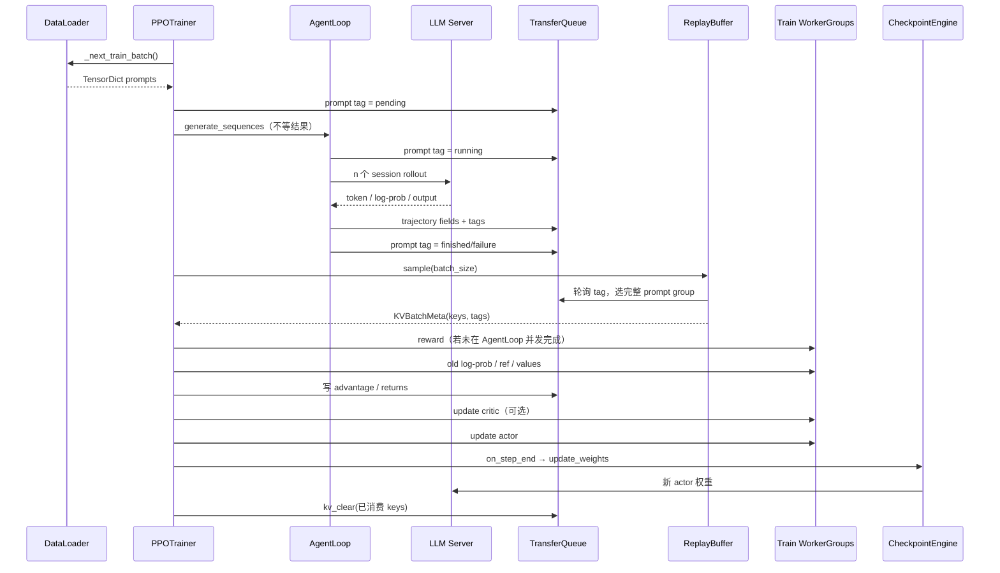
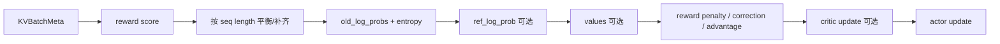

# 从推理到训练：跟完一次 `step()`

当前 V1 最值得逐行读的是 `PPOTrainer.step()` 与 `_step_once()`。前者提交生成并按参数同步频率组织本地更新，后者补齐训练字段并更新模型。

## 先用人话：两条流水线在这里咬合

生成流水线不断把 prompt 变成轨迹并写入仓库；训练流水线从仓库挑完整组，依次补 reward、概率、value、advantage，再更新参数。同步模式下一步结束后把新权重送回生成端。关键不是函数数量，而是**每一步需要哪些字段已经存在**。

## 完整时序



## 1. 提交生成，不等待完整回答

`_add_batch_to_generate()` 从 dataloader 取一批，为每条原始 prompt 生成 UUID，转换为 TensorDict，附加 `global_steps`。`_submit_batch_to_rollout()` 先在 TQ 注册 tag-only prompt marker：

```text
key = <uid>
tag = {is_prompt: true, status: pending, global_steps: N}
```

然后 `AgentLoopManagerTQ.generate_sequences()` 把批次切给多个 worker。worker 内部用 asyncio 创建后台任务，因此 controller 提交完成不等于 rollout 已完成。

## 2. AgentLoop 写入轨迹

每个 prompt 按 `rollout.n` 建立 session。单轮场景通常每个 session 只有一个 output；多轮 agent 可以有多个 output。轨迹 key 为：

```text
{uid}_{session_id}_{index}
```

value 包含 prompt/response IDs、mask、input/position IDs、数据集元信息、多模态输入（原始图像/视频不会直接存入）及 reward 扩展字段；tag 包含长度、状态以及生成开始/结束的权重版本。

若 reward loop workers 已提供，AgentLoop postprocess 可以在写 TQ 前并发计算分数；若没有，trainer 在 `_compute_reward_colocate()` 中取必要字段、临时构造 reward 输入，再写回 `rm_scores`。

## 3. ReplayBuffer 等完整组

ReplayBuffer 轮询 TQ metadata，只有 prompt marker 到达 `finished` 或 `failure` 才能采样。内置策略优先选择 `global_steps` 更小的 prompt，以减少陈旧轨迹堆积。

返回的不是完整大张量，而是 `KVBatchMeta(partition_id, keys, tags)`。若 staleness 超过阈值：

- `drop`：删除过旧 trajectory，并记录 dropped/staleness 指标；
- `wait`：达到阈值的在途 prompt 未完成时暂停采样，以保持 dropless。

`failure` 组当前仍可能被选中，源码留有是否整组过滤的 TODO；自定义 agent 应明确失败输出和 reward 的约定。

## 4. `_step_once()` 按顺序补字段



顺序有依赖：

1. `_balance_batch` 根据 actor DP size 与 mini-batch 约束做 padding、按序列 workload 重排；
2. `_compute_old_log_prob` 通常由训练 actor 重算；rollout correction 的 bypass mode 会直接复用 `rollout_log_probs`；
3. reference 仅在 KL 配方需要时存在；critic 仅在 GAE 等配置需要时存在；
4. `_compute_advantage` 把 TQ 的 jagged 字段补齐为 DataProto，应用 reward KL / correction / estimator，再把结果还原成 nested tensor 写回；
5. critic 与 actor worker 按各自 PPO epochs/mini-batch 配置读取所需字段并训练。

## 5. 更新后的权重何时进入 rollout

同步 trainer 的 `on_step_end()` 调用 `checkpoint_manager.update_weights(global_steps)`，唤醒 replicas 并同步新版本；`on_sample_end()` 会让 replicas 休眠并释放/丢弃相应权重与 KV cache。这解释了共置场景中显存为什么在 rollout 与训练阶段变化。

`separate_async` 不会照搬这个每步时序，它用 `parameter_sync_step` 控制同步频率。比较同步/异步实验时必须记录每条轨迹的生成版本跨度，而不只记录吞吐。

## 6. step 结束并不只有训练

`fit()` 还会在配置的频率上保存 checkpoint、验证、聚合 timing/训练指标、可选 dump rollout，最后 `tq.kv_clear` 清理已消费 keys。若进程在 clear 之前失败，重启语义取决于 TQ backend 和 checkpoint/replay 状态，不能假设像纯 dataloader 一样无状态重放。

## 本课实作：追一个 uid

选一个 prompt uid，记录五个时刻：注册 pending marker、session key 写入、ReplayBuffer 选中、advantage 写回、消费后 clear。每个时刻写“只拿 key/tag 还是读取 value”。最后把 `_step_once()` 九个阶段的输入字段列出来；这是以后插入自定义算法最重要的契约表。

下一步：[数据结构与组织](./data-structures)。
