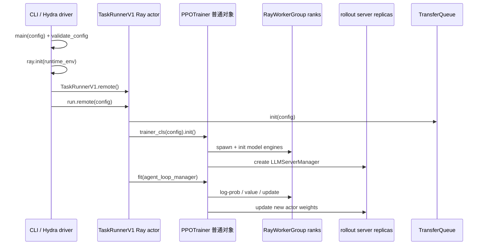
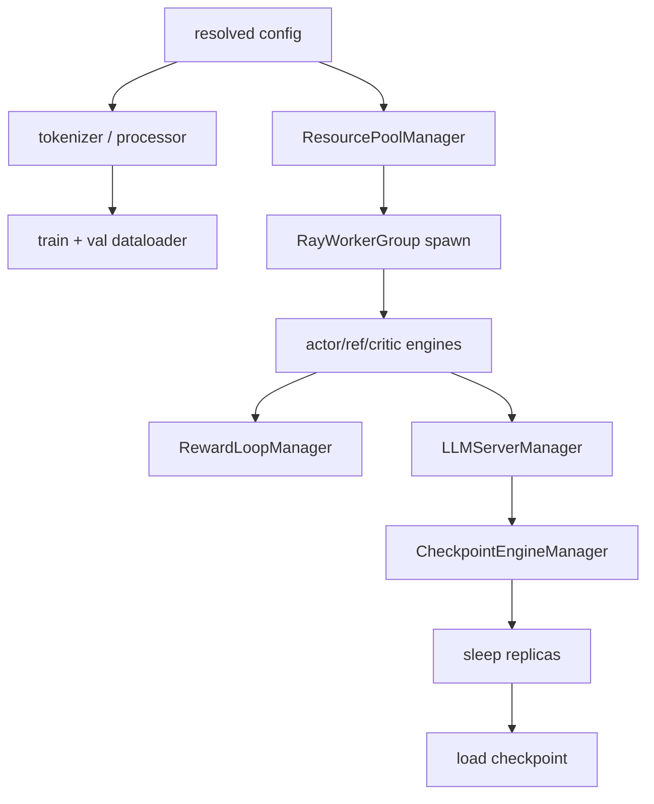

# V1 逐源码主线：从 Hydra 入口到一次参数更新

这一课不从架构名词开始，而是把 veRL 固定在提交
[`e5687fce`](https://github.com/verl-project/verl/tree/e5687fce0516d31e1fdc4580499074a9bd94c751)，沿实际执行顺序回答四个问题：

1. CLI 进程、`TaskRunnerV1` 和 `PPOTrainer` 分别住在哪里？
2. 哪些角色一定启动，哪些由配置推导？
3. 一次 `_step_once()` 给 batch 增加了哪些字段？
4. actor 更新后，新权重何时才进入 rollout engine？

先打开本地源码，不要只看本文：

```bash
cd /path/to/verl
git checkout e5687fce0516d31e1fdc4580499074a9bd94c751
git status --short

sed -n '153,179p' verl/trainer/main_ppo.py
sed -n '308,495p' verl/trainer/ppo/v1/trainer_base.py
sed -n '24,42p' verl/trainer/ppo/v1/trainer_sync.py
```

## 先画出进程边界



最容易犯的错误，是把 `PPOTrainer` 也画成独立 Ray actor。源码不是这样：

- [`TaskRunnerV1` 被 `@ray.remote` 装饰](https://github.com/verl-project/verl/blob/e5687fce0516d31e1fdc4580499074a9bd94c751/verl/trainer/main_ppo.py#L98-L100)；
- [`TaskRunnerV1.run()` 直接构造 trainer](https://github.com/verl-project/verl/blob/e5687fce0516d31e1fdc4580499074a9bd94c751/verl/trainer/main_ppo.py#L129-L150)；
- 所以 `PPOTrainer` 是 TaskRunner actor 进程内的普通 Python 对象；
- 真正的多 rank 计算由 `RayWorkerGroup` 扇出到训练 workers。

## 第 1 段：Hydra 先决定版本和角色约束

入口是 [`main()`](https://github.com/verl-project/verl/blob/e5687fce0516d31e1fdc4580499074a9bd94c751/verl/trainer/main_ppo.py#L153-L179)：

1. `auto_set_device(config)` 校准设备；
2. `validate_config()` 接收推导后的 `use_reference_policy` 与 `use_critic`；
3. `trainer.use_v1=true` 才选择 `TaskRunnerV1`，否则进入带弃用警告的 V0。

两个关键条件不能凭角色名猜：

| 角色 | 固定提交中的布尔条件 | 直接证据 |
| --- | --- | --- |
| reference policy | `algorithm.use_kl_in_reward or actor.use_kl_loss` | [`need_reference_policy()`](https://github.com/verl-project/verl/blob/e5687fce0516d31e1fdc4580499074a9bd94c751/verl/trainer/ppo/utils.py#L75-L80) |
| critic | `critic.enable` 非空时服从显式值；否则仅 GAE 自动开启 | [`need_critic()`](https://github.com/verl-project/verl/blob/e5687fce0516d31e1fdc4580499074a9bd94c751/verl/trainer/ppo/utils.py#L96-L107) |
| teacher | distillation 配置启用 | [`need_teacher_policy()`](https://github.com/verl-project/verl/blob/e5687fce0516d31e1fdc4580499074a9bd94c751/verl/trainer/ppo/utils.py#L82-L87) |
| reward model GPU pool | `reward.reward_model.enable_resource_pool=true` | [`_init_resource_pool_mgr()`](https://github.com/verl-project/verl/blob/e5687fce0516d31e1fdc4580499074a9bd94c751/verl/trainer/ppo/v1/trainer_base.py#L641-L655) |

这意味着 GRPO 不使用 GAE 且没有显式打开 critic 时，critic 可以不启动；但若 actor loss 或 reward 中使用 KL，reference 仍然需要存在。

### 角色真值表练习

不用启动 GPU，先手算：

| 配置 | ref | critic | 解释 |
| --- | --- | --- | --- |
| `adv_estimator=gae`, KL 全关 | 否 | 是 | GAE 需要 value |
| `adv_estimator=grpo`, `use_kl_loss=true` | 是 | 否 | actor loss 要 frozen log-prob |
| `adv_estimator=grpo`, `critic.enable=true` | 取决于 KL | 是 | 显式值覆盖自动推导 |
| `use_kl_in_reward=true` | 是 | 取决于 critic 条件 | reward 中需要 KL |

通关标准：能从配置独立推导角色，而不是看日志后反推。

## 第 2 段：`run_ppo()` 建立 Ray 作业

[`run_ppo()`](https://github.com/verl-project/verl/blob/e5687fce0516d31e1fdc4580499074a9bd94c751/verl/trainer/main_ppo.py#L33-L95) 的顺序有因果关系：

1. 在 `ray.init()` **之前**设置确定性环境变量；
2. 合并框架默认 runtime env 与用户 `ray_kwargs.ray_init.runtime_env`；
3. 创建一个 `TaskRunnerV1` actor；
4. 对 `runner.run.remote(config)` 做 `ray.get()`，让 CLI driver 等待训练完成；
5. 可选导出 Ray timeline。

环境变量必须在 `ray.init()` 前准备，是因为 runtime env 会被复制到后续 actor；在 worker 已启动后修改 driver 的 `os.environ`，不会倒流到现有远程进程。

## 第 3 段：`TaskRunnerV1.run()` 建立 V1 数据边界

[`TaskRunnerV1.run()`](https://github.com/verl-project/verl/blob/e5687fce0516d31e1fdc4580499074a9bd94c751/verl/trainer/main_ppo.py#L129-L150) 只有二十多行，却定义了 V1 的边界：

- 根据 `trainer.v1.trainer_mode` 从 registry 选择 `sync`、`colocate_async` 或 `separate_async`；
- 将 `config.transfer_queue.enable` 强制设为 `True`；
- `tq.init()` 后才构造 trainer；
- trainer 完成 `init()` 后，AgentLoop manager 才能拿到 LLM client、teacher client 和 reward handles；
- `finally` 保证 `tq.close()`。

这里也解释了为什么只看 YAML 中 `transfer_queue.enable: false` 会得出错误结论：V1 在运行时覆盖它。

## 第 4 段：`PPOTrainer._setup()` 按依赖拓扑装配

[`_setup()`](https://github.com/verl-project/verl/blob/e5687fce0516d31e1fdc4580499074a9bd94c751/verl/trainer/ppo/v1/trainer_base.py#L159-L290) 不是任意顺序。把它重写成依赖图：



关键源码节点：

- [`resource_pool_to_cls` 把一个 pool 映射到多个角色 class](https://github.com/verl-project/verl/blob/e5687fce0516d31e1fdc4580499074a9bd94c751/verl/trainer/ppo/v1/trainer_base.py#L163-L176)；
- critic 仅在 `self.use_critic` 时加入映射；
- [`create_colocated_worker_cls()` + `RayWorkerGroup.spawn()`](https://github.com/verl-project/verl/blob/e5687fce0516d31e1fdc4580499074a9bd94c751/verl/trainer/ppo/v1/trainer_base.py#L194-L222) 把角色变成多 rank worker group；
- actor/ref engine 初始化完成后，才创建 reward、teacher、LLM server 和 checkpoint managers；
- checkpoint manager 先让 replicas sleep，再恢复训练 checkpoint。

## 第 5 段：`fit()` 是全局控制流

[`fit()`](https://github.com/verl-project/verl/blob/e5687fce0516d31e1fdc4580499074a9bd94c751/verl/trainer/ppo/v1/trainer_base.py#L308-L416) 证明 Single Controller 不是宣传语：验证、step、保存、再验证、指标、清理 TQ 都写成普通 Python 顺序。

每个 global step：

```text
on_step_begin
  → step
  → optional save checkpoint
on_step_end
  → optional validation
  → aggregate/log metrics
  → optional dump rollout
  → tq.kv_clear(batch.keys)
```

注意 `on_step_end()` 是抽象 hook。权重同步不在 `_step_once()` 的最后一行硬编码，而由具体 trainer mode 决定。

## 第 6 段：`step()` 与 `parameter_sync_step`

[`step()`](https://github.com/verl-project/verl/blob/e5687fce0516d31e1fdc4580499074a9bd94c751/verl/trainer/ppo/v1/trainer_base.py#L418-L443) 先要求：

\[
\text{sample\_batch\_size}=
\frac{\text{train\_batch\_size}}{\text{parameter\_sync\_step}}
\]

然后循环执行多次 `_step_once()`，合并 keys/tags，最后才由 `on_step_end()` 同步参数。这不是普通 gradient accumulation 的同义词：每次 `_step_once()` 都会采样、补齐训练字段并执行 actor/critic update；`parameter_sync_step` 控制多少次本地更新后向 rollout 发布一次新权重。

## 第 7 段：九阶段 `_step_once()`

真实顺序见 [`_step_once()`](https://github.com/verl-project/verl/blob/e5687fce0516d31e1fdc4580499074a9bd94c751/verl/trainer/ppo/v1/trainer_base.py#L445-L495)：

| 阶段 | 调用 | 必需条件 | batch 新增/变化 |
| --- | --- | --- | --- |
| 1 | `replay_buffer.sample` | 总是 | 选择 keys/tags，写 temperature |
| 2 | `_compute_reward_colocate` | 没有异步 reward handles | reward score/extra info |
| 3 | `_balance_batch` | 总是 | 调整 DP rank 的 token 负载，不改算法样本集合 |
| 4 | `_compute_old_log_prob` | 总是 | `old_log_probs` |
| 5 | `_compute_ref_log_prob` | `use_reference_policy` | `ref_log_prob` |
| 6 | `_compute_values` | `use_critic` | `values` |
| 7 | `_compute_advantage` | 总是 | `token_level_rewards`、`advantages`、`returns` 等 |
| 8 | `_update_critic` | `use_critic` | critic metrics / 新 critic 参数 |
| 9 | `_update_actor` | warmup 已结束 | actor metrics / 新 actor 参数 |

`KVBatchMeta` 只携带 `partition_id`、keys 和 tags；真正 tensor 字段在 TransferQueue。判断某个函数是否搬运了大 tensor，不能只看 Python 参数名，要继续查看该函数从 TQ 读取哪些列。

## 第 8 段：新权重何时进入 rollout

同步 trainer 的代码只有三个 hook：

- [`on_init_end()`](https://github.com/verl-project/verl/blob/e5687fce0516d31e1fdc4580499074a9bd94c751/verl/trainer/ppo/v1/trainer_sync.py#L31-L33)：恢复 checkpoint 后先同步一次；
- [`on_sample_end()`](https://github.com/verl-project/verl/blob/e5687fce0516d31e1fdc4580499074a9bd94c751/verl/trainer/ppo/v1/trainer_sync.py#L40-L42)：采样结束让 rollout replicas sleep；
- [`on_step_end()`](https://github.com/verl-project/verl/blob/e5687fce0516d31e1fdc4580499074a9bd94c751/verl/trainer/ppo/v1/trainer_sync.py#L35-L38)：本轮全部本地更新完成后发布新权重。

`colocate_async` 还会 abort 未完成请求并恢复 generation；`separate_async` 则要求非 naive checkpoint backend，并维护独立 rollout replicas。三种模式复用 `_step_once()`，差异集中在生命周期 hooks。

## 实验：用断点验证对象住在哪里

不要一开始在所有 worker 上下断点。按下面顺序，每次只验证一个假设：

1. `main_ppo.py:154`：打印 PID、Ray 是否初始化、resolved `trainer_mode`；
2. `TaskRunnerV1.run:129`：打印 PID 与 runtime context，证明它不同于 CLI driver；
3. `PPOTrainer._setup:159`：再次打印 PID，证明 trainer 与 TaskRunner 同进程；
4. `ActorRolloutRefWorker.init_model:504`：打印 rank、local rank、可见 GPU；
5. `_step_once:445`：逐阶段记录 `KVBatchMeta.keys` 与 TQ 字段。

官方 veRL 的 [Ray 调试指南](https://verl.readthedocs.io/en/latest/start/ray_debug_tutorial.html) 建议在 remote 函数中使用 Ray Distributed Debugger；更轻量时也可以先用结构化日志记录 PID/rank/actor id。

## 通关任务

提交一张自己画的时序图，至少包含：

```text
main → run_ppo → TaskRunnerV1.run → PPOTrainer.init
→ AgentLoop → ReplayBuffer.sample → _step_once
→ update_actor → on_step_end → update_weights
```

并回答：

1. 为什么 `PPOTrainer` 不是 Ray actor？
2. 为什么 YAML 中 TQ 为 false，V1 仍会启用？
3. GRPO 在什么条件下仍会启动 reference？
4. `parameter_sync_step=4` 表示哪四次操作之间共用 rollout 权重？
5. `sync` 与 `separate_async` 的算法主链相同，系统语义差在哪里？

下一步阅读：[模块化后端契约](./backend-contracts)；若 Ray 概念仍不稳，先做 [Ray 观测实验](../practice/ray-observation-lab)。
