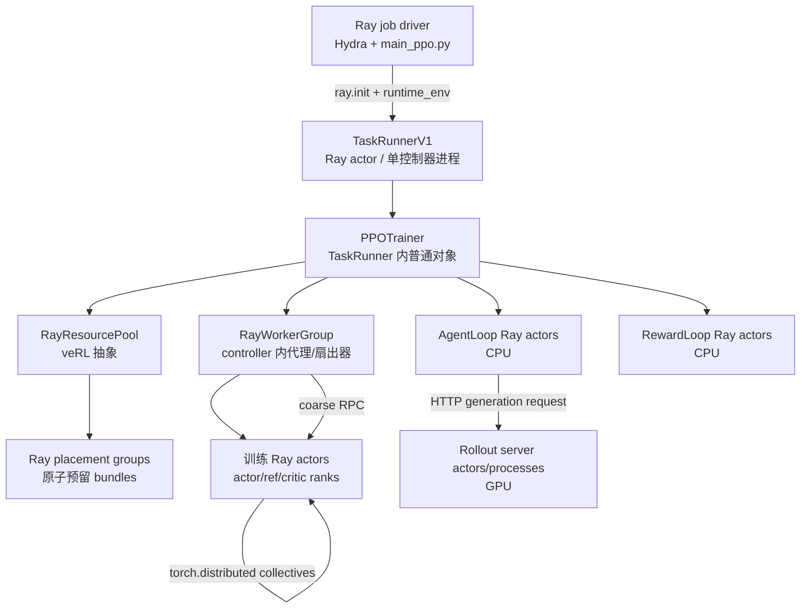
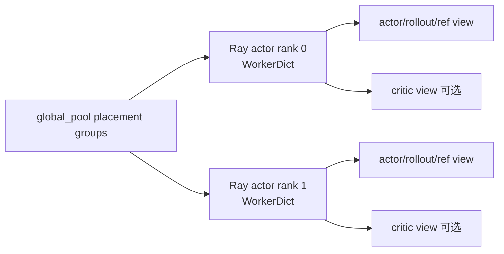
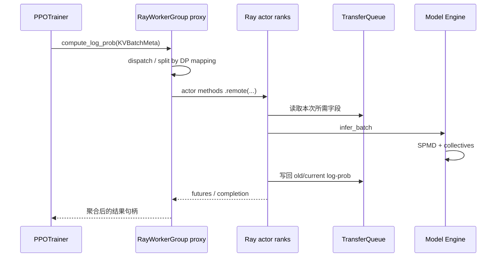
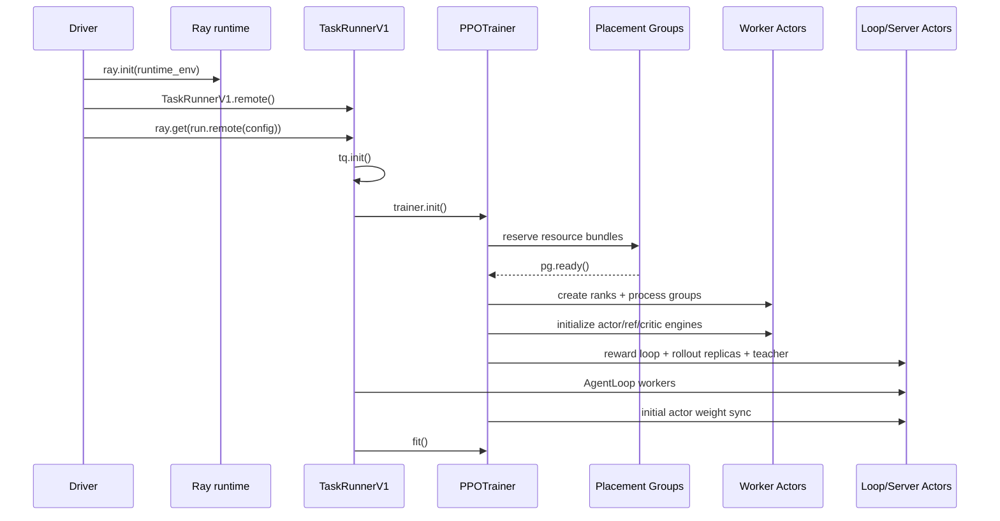

# Ray 运行时、角色与资源编排

先给结论：**Ray 在 veRL 中负责进程生命周期、RPC、资源预留和放置；训练/推理后端负责 GPU 内部并行；TransferQueue 负责主要 trajectory 数据；CheckpointEngine 负责权重。** 把四者混成“Ray 在训练模型”，后面的进程、显存和卡死问题都会判断错。

::: tip 本页定位与源码版本
本页是角色/资源速查，结论已按 Ray `98c9eb75e44207266cc35f0cd94e1ecd58e3f77b` 与 veRL `e5687fce0516d31e1fdc4580499074a9bd94c751` 复核。要逐行追 `ray.init → task/actor/ObjectRef/PG → veRL WorkerGroup`，进入[Ray 源码运行时主线](./ray-source-runtime)；要按天学习和运行 CPU 故障实验，使用[21 天 Ray 源码学习计划](../guide/ray-source-study-plan)。
:::

## 先用人话：园区、员工、会议室和工单

- Ray cluster 是园区，包含一台 head node 和若干 worker node；
- driver 是发起这次训练 job 的办公室；
- Ray actor 是有自己状态和固定办公室的长期员工进程；
- Ray task 是临时工单，任意可用 worker 执行后结束；
- ObjectRef 是取结果的凭证，不一定包含结果本身；
- logical resource 是预订规则，不是 `nvidia-smi` 的实时利用率；
- placement group 是一次性预订一组工位，保证分布式班组能一起开工。

veRL 再在这些原语之上提供 ResourcePool 和 WorkerGroup，避免 trainer 手写每个 rank 的 Ray RPC。

## Ray 最小心智模型

[Ray 官方 Key Concepts](https://docs.ray.io/en/latest/ray-core/key-concepts.html)中最重要的六个对象如下。

| Ray 概念 | 精确定义 | veRL 中的例子 |
| --- | --- | --- |
| Job / driver | 一次应用及发起它的 Python 进程 | 执行 `python -m verl.trainer.main_ppo` 的进程 |
| Task | 远程函数的一次异步执行 | `get_master_addr_port.remote()` 等少量辅助任务 |
| Actor | 有状态的专用远程 worker 进程 | `TaskRunnerV1`、训练 workers、AgentLoop/RewardLoop workers |
| ObjectRef | 远程结果句柄；`ray.get` 才等待/取值 | `runner.run.remote(config)` 的返回值 |
| Logical resource | scheduler 用于准入和放置的 CPU/GPU/custom resource 数量 | 每个训练 actor 的 GPU fraction、CPU request |
| Placement group | 多个 resource bundle 的原子预留 | `RayResourcePool` 为一个多 rank WorkerGroup 预留 GPUs |

最小 Ray 代码只有这样：

```python
import ray

ray.init()

@ray.remote
class Counter:
    def __init__(self):
        self.value = 0

    def inc(self):
        self.value += 1
        return self.value

counter = Counter.remote()          # 创建一个 actor 进程
result_ref = counter.inc.remote()   # 异步提交 actor method
assert ray.get(result_ref) == 1     # 等待结果
```

veRL 的 `TaskRunnerV1.remote()` 与 `runner.run.remote(config)` 使用同一语义，只是 actor 内又创建了更多角色和资源组。

### 这些概念在源码中的真正入口

| 问题 | Python 入口 | C++ / control-plane 落点 | 关键结论 |
| --- | --- | --- | --- |
| `ray.init()` 启动还是连接？ | [`worker.py#L1678-L1996`](https://github.com/ray-project/ray/blob/98c9eb75e44207266cc35f0cd94e1ecd58e3f77b/python/ray/_private/worker.py#L1678-L1996) | [`node.py#L1232-L1412`](https://github.com/ray-project/ray/blob/98c9eb75e44207266cc35f0cd94e1ecd58e3f77b/python/ray/_private/node.py#L1232-L1412) | 无 cluster 时创建 local head；已有地址时 connect-only |
| task 怎样获得 worker？ | [`remote_function.py#L516-L563`](https://github.com/ray-project/ray/blob/98c9eb75e44207266cc35f0cd94e1ecd58e3f77b/python/ray/remote_function.py#L516-L563) | [`normal_task_submitter.cc#L270-L542`](https://github.com/ray-project/ray/blob/98c9eb75e44207266cc35f0cd94e1ecd58e3f77b/src/ray/core_worker/task_submission/normal_task_submitter.cc#L270-L542) | owner 向 raylet 申请 lease，再直推 worker；不是 GCS 转发每个普通 task |
| actor 为什么长期有状态？ | [`actor.py#L2185-L2213`](https://github.com/ray-project/ray/blob/98c9eb75e44207266cc35f0cd94e1ecd58e3f77b/python/ray/actor.py#L2185-L2213) | [`gcs_actor_manager.cc#L660-L850`](https://github.com/ray-project/ray/blob/98c9eb75e44207266cc35f0cd94e1ecd58e3f77b/src/ray/gcs/actor/gcs_actor_manager.cc#L660-L850) | GCS 协调创建/重建；method 之后由 owner CoreWorker 直连 actor |
| ObjectRef 是否就是数据？ | [`worker.py#L961-L1040`](https://github.com/ray-project/ray/blob/98c9eb75e44207266cc35f0cd94e1ecd58e3f77b/python/ray/_private/worker.py#L961-L1040) | [`core_worker.cc#L1326-L1474`](https://github.com/ray-project/ray/blob/98c9eb75e44207266cc35f0cd94e1ecd58e3f77b/src/ray/core_worker/core_worker.cc#L1326-L1474) | ref 是 ID/owner/future；值可未就绪、在 memory store、Plasma 或远端 |
| PG 何时 ready？ | [`placement_group.py#L25-L78`](https://github.com/ray-project/ray/blob/98c9eb75e44207266cc35f0cd94e1ecd58e3f77b/python/ray/util/placement_group.py#L25-L78) | [`gcs_placement_group_scheduler.cc#L410-L507`](https://github.com/ray-project/ray/blob/98c9eb75e44207266cc35f0cd94e1ecd58e3f77b/src/ray/gcs/gcs_placement_group_scheduler.cc#L410-L507) | 全组 bundles prepare/commit 成功后 ready；PG 不创建 worker/process group |

这张表只用于定位；完整的状态机、时序图、失败分支和对象数据面都在[源码运行时主线](./ray-source-runtime)。

### Actor 不等于 RL actor

- **RL actor / policy**：要优化的策略模型角色；
- **Ray actor**：一个有状态 Python 远程进程。

一个 RL actor 通常跨多个 Ray actor/rank；一个 Ray actor 也可能通过 veRL 的 colocated worker 同时承载 actor、critic 等逻辑角色。

### Resource 不等于真实占用

Ray 的 `num_gpus=1` 表示调度约束并控制可见设备，不表示程序此刻一定进行 GPU 计算。反过来，声明错误也可能让 Ray 以为资源足够，实际启动后 OOM。资源调度问题看 `ray status`；显存问题看进程日志和设备工具，两者不能互相替代。

### Placement group 为什么关键

分布式训练需要所有 rank 同时拿到资源。若先零散启动一半 actors，剩余 actors 无卡可用，已启动的一半也无法组成 process group。Ray placement group 用 bundle 做 gang scheduling：整组能放下才创建。官方说明见 [Placement Groups](https://docs.ray.io/en/latest/ray-core/scheduling/placement-group.html)。

## 一张图映射 Ray 与 veRL



三个最容易误认的对象：

1. `PPOTrainer` 不是独立 Ray actor，它是 `TaskRunnerV1` actor 内的普通 Python 对象；
2. `RayWorkerGroup` 不是远程计算进程，它是 controller 侧的一组 actor handles 和分发方法；
3. `RayResourcePool` 不是 Ray 原生 pool，它是 veRL 对 placement groups、role mapping 和 GPU 拓扑的封装。

## Ray、torch.distributed、HTTP、TQ 各做什么

| 通道 | 负责 | 不负责 |
| --- | --- | --- |
| Ray | 启动 actor/task、RPC、logical resources、placement、故障状态 | 不实现 FSDP/Megatron collective |
| `torch.distributed` | 同一模型角色内部的 all-reduce/all-gather、并行组通信 | 不决定 PPO 下一阶段运行谁 |
| HTTP/async client | AgentLoop 向 vLLM/SGLang/TRT-LLM server 请求生成 | 不传训练 batch 的全部中间 tensor |
| TransferQueue | 存取 trajectory tensor/non-tensor 字段与 tags | 不同步模型权重 |
| CheckpointEngine | actor → rollout 的权重与版本同步 | 不选择训练样本 |

Ray ObjectRef 仍用于 actor 调用的完成信号和返回值，但绑定提交的 V1 主数据路径通过 `KVBatchMeta` + TransferQueue 避免让 controller/Ray object store 反复搬完整 trajectory。

## 所有角色、代码位置与启动条件

以下条件以绑定提交 `e5687fce` 的 resolved config 为准。

| 角色/组件 | 职责 | 对应代码 | 启动条件与物理形态 |
| --- | --- | --- | --- |
| Job driver | Hydra 组装配置、`ray.init()`、创建 controller | [`main_ppo.py`](https://github.com/verl-project/verl/blob/e5687fce0516d31e1fdc4580499074a9bd94c751/verl/trainer/main_ppo.py) | 每次命令一个 driver；已有 Ray context 时复用 |
| `TaskRunnerV1` | 单一控制器进程的外壳，管理 TQ/trainer/AgentLoop 生命周期 | 同上 | `trainer.use_v1=true`；一个 Ray actor |
| `PPOTrainer` | 全局 step/DAG 编排、资源和 manager 装配 | [`trainer_base.py`](https://github.com/verl-project/verl/blob/e5687fce0516d31e1fdc4580499074a9bd94c751/verl/trainer/ppo/v1/trainer_base.py) | V1 必有；TaskRunner 进程内普通对象 |
| Actor | current log-prob、policy loss、optimizer step、checkpoint | [`TrainingWorker`](https://github.com/verl-project/verl/blob/e5687fce0516d31e1fdc4580499074a9bd94c751/verl/workers/engine_workers.py) | PPO/GRPO 训练必有；`ActorRolloutRefWorker.self.actor`，跨多个 Ray ranks |
| Rollout | 按 actor 权重生成 response/trajectory | [`ActorRolloutRefWorker`](https://github.com/verl-project/verl/blob/e5687fce0516d31e1fdc4580499074a9bd94c751/verl/workers/engine_workers.py)、[`llm_server.py`](https://github.com/verl-project/verl/blob/e5687fce0516d31e1fdc4580499074a9bd94c751/verl/workers/rollout/llm_server.py) | V1 RL 必有；role 总含 `rollout`，server backend 由 `rollout.name/mode` 决定 |
| Reference policy | 提供冻结 log-prob，计算 reward KL 或 actor KL | [`need_reference_policy`](https://github.com/verl-project/verl/blob/e5687fce0516d31e1fdc4580499074a9bd94c751/verl/trainer/ppo/utils.py) | `algorithm.use_kl_in_reward=true` **或** `actor.use_kl_loss=true`；LoRA/adapter 时可复用 actor 并关闭 adapter，否则构造 `self.ref` |
| Critic | 预测 values、训练 value loss，供 GAE 等使用 | `TrainingWorker(model_type="value_model")`，装配见 [`trainer_base.py`](https://github.com/verl-project/verl/blob/e5687fce0516d31e1fdc4580499074a9bd94c751/verl/trainer/ppo/v1/trainer_base.py) | `critic.enable` 非空时服从显式值；否则仅 `adv_estimator=gae` 自动启用 |
| RewardLoop workers | 执行规则/custom reward，或请求 reward model | [`reward_loop.py`](https://github.com/verl-project/verl/blob/e5687fce0516d31e1fdc4580499074a9bd94c751/verl/experimental/reward_loop/reward_loop.py) | manager 总会构造，并启动 `reward.num_workers` 个 CPU Ray actors（默认 8） |
| Reward model | 模型式评分服务 | 同上 | 仅 `reward.reward_model.enable=true`；`enable_resource_pool=true` 时独立 GPU pool，否则映射到 global pool |
| AgentLoop workers | prompt、多轮工具调用、生成请求、可并发 reward | [`agent_loop.py`](https://github.com/verl-project/verl/blob/e5687fce0516d31e1fdc4580499074a9bd94c751/verl/experimental/agent_loop/agent_loop.py)、[`agent_loop_tq.py`](https://github.com/verl-project/verl/blob/e5687fce0516d31e1fdc4580499074a9bd94c751/verl/trainer/ppo/v1/agent_loop_tq.py) | V1 rollout 必有；默认启动 `rollout.agent.num_workers` 个 CPU Ray actors |
| Teacher servers | on-policy distillation 信号/logits | [`teacher_model.py`](https://github.com/verl-project/verl/blob/e5687fce0516d31e1fdc4580499074a9bd94c751/verl/experimental/teacher_loop/teacher_model.py) | `distillation.enabled=true`；使用独立 teacher resource pool |
| Checkpoint manager | 训练 actor 与 rollout replicas 间同步权重、sleep/wake | [`checkpoint_engine/base.py`](https://github.com/verl-project/verl/blob/e5687fce0516d31e1fdc4580499074a9bd94c751/verl/checkpoint_engine/base.py) | actor/rollout 边界必有；backend/config 决定传输实现 |
| TransferQueue | trajectory KV、状态、版本和清理 | V1 调用位于 `TaskRunnerV1.run()` | V1 会强制 `enable=true`，即使命令配置初始为 false |

### 两个角色判断函数必须记住

```python
need_reference = (
    config.algorithm.use_kl_in_reward
    or config.actor_rollout_ref.actor.use_kl_loss
)

need_critic = (
    bool(config.critic.enable)
    if config.critic.enable is not None
    else config.algorithm.adv_estimator == "gae"
)
```

这比“GRPO 没有 critic”“配置里有 ref 段所以会启动 ref”更准确。Hydra 配置段存在不等于对应进程一定创建。

## 逻辑角色不等于独立进程

V1 `_init_resource_pool_mgr()` 先把 actor/rollout/ref 和可选 critic 映射到 `global_pool`，再由 `create_colocated_worker_cls()` 把同一 pool 的多个 worker class 包装进一个远程 `WorkerDict`。`spawn()` 返回的 role-specific WorkerGroup 更像同一组 actors 的不同调用视图。



因此看到 `actor_rollout_wg` 和 `critic_wg` 两个 Python 对象，不代表一定有两套独立 Ray actor 进程或两倍 GPU。

## ResourcePool 到 GPU 的实际映射

`RayResourcePool(process_on_nodes=[gpus_per_node] * nnodes)` 会按列表中的每个 process count 建立一个 placement group；常见配置期望每个 group 严格打包到一台节点，每张设备对应一个 bundle。当前 `ResourcePoolManager.max_colocate_count` 默认是 3：bundle 预留一张 GPU 与相应 CPU，具体 worker actor 申请 `1 / max_colocate_count` GPU，从而允许训练、rollout、reward 等进程按设计共置在同一可见设备上。

`RayWorkerGroup` 随后为每个 rank 注入：

- `WORLD_SIZE`、`RANK`、`RAY_LOCAL_WORLD_SIZE`；
- `MASTER_ADDR`、`MASTER_PORT`；
- `WG_PREFIX`、`WG_BACKEND=ray`；
- Ray 分配后的设备可见性。

这些变量让 Ray 创建的独立 Python actors 再组成 `torch.distributed` process group。相关实现集中在 [`single_controller/ray/base.py`](https://github.com/verl-project/verl/blob/e5687fce0516d31e1fdc4580499074a9bd94c751/verl/single_controller/ray/base.py)。

## 一次 WorkerGroup 调用怎样穿过 Ray

以 controller 调用 `actor_rollout_wg.compute_log_prob(batch_meta)` 为例：



Worker 方法上的 `@register(dispatch_mode=...)` 声明怎样切分与收集；`WorkerGroup` 在 controller 侧动态绑定同名方法；Ray 负责把调用送到各 actor；Engine 再处理模型并行。这条链解释了为什么一个看似普通的 Python 方法调用能触发整个多卡计算。

## 从命令到首个 step 的完整启动顺序



典型阻塞点也因此很清楚：

- 卡在 `pg.ready()`：资源 bundle 无法整体放置；
- actor `PENDING`：resource request、placement strategy 或节点标签不满足；
- actor `DEAD`：进入对应 worker 的第一条异常，而不是只看 driver 的 `RayTaskError`；
- process group timeout：actors 已启动，但 rank、网络接口、端口或 collective 环境有问题；
- rollout HTTP timeout：Ray actor 可能仍是 ALIVE，推理 server 本身未 ready 或已 OOM；
- trainer 等 TQ：控制进程活着，但样本生产、存储或完整 group 条件未满足。

更细的对象装配见[入口与初始化](./entry-and-init)。

## Ray 运行时排障的最小命令

```bash
ray status
ray list actors --detail
ray list placement-groups --detail
ray list tasks --detail
```

再打开 [Ray Dashboard](https://docs.ray.io/en/latest/ray-observability/getting-started.html)，按顺序检查：

1. placement group 是 `CREATED` 还是 `PENDING`；
2. 哪个 actor 最先进入 `DEAD`；
3. actor 的 node、PID、资源和 restart 次数；
4. 对应 PID 的第一段 traceback；
5. 之后才看 GPU/NCCL/TQ/HTTP 子系统日志。

不要用 `ray status` 判断 GPU kernel 为什么慢；也不要只用 `nvidia-smi` 判断 actor 为什么始终 pending。

## 多机时 Ray 不会替你解决什么

- 模型、数据、checkpoint 与输出路径必须在目标 actor 所在节点可访问；
- Python 包和源码版本必须通过预装或 `runtime_env` 保持一致；
- NCCL/Gloo/设备环境要在 actor 创建前传播；
- 节点 IP、网卡、防火墙和端口仍需正确；
- Ray 默认 actor 故障恢复语义不等于训练可从一致 checkpoint 自动恢复；
- head node 能调度 actor，不代表它适合承载训练 rank。

## 通关检查

拿你的 resolved config 画一张表：

```text
role → 是否启动 → Ray actor 名称/PID → placement group/bundle
     → node/GPU → engine backend → process-group rank
```

然后回答四个问题：

1. `PPOTrainer` 是 Ray actor 吗？它实际住在哪里？
2. GRPO 配方下 critic 为什么可能完全不创建？
3. actor WorkerGroup 的一次方法调用，Ray 和 `torch.distributed` 分别做哪一段？
4. trajectory、actor RPC 返回值和新模型权重分别走什么通道？

能不含糊地回答，才算真正具备修改资源编排和新增 backend 的基础。

源码主线到此闭环。下一步进入[扩展点地图](/verl/customization/extension-map)。
