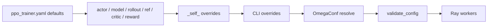
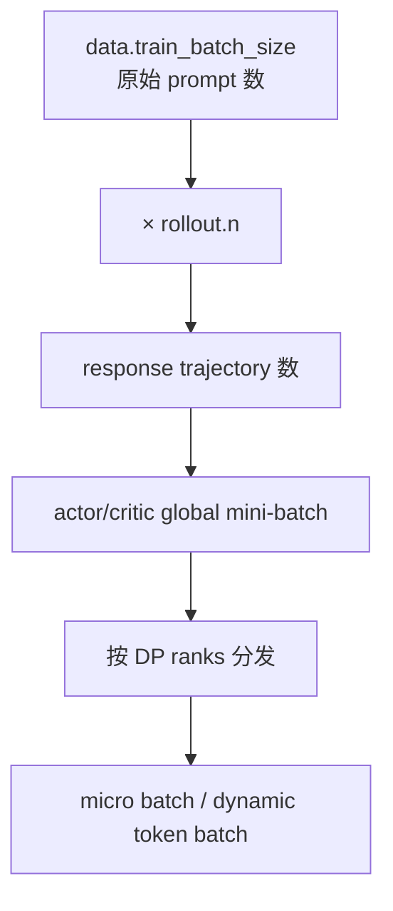

# 读懂 Hydra 配置：从“我传了什么”到“程序收到什么”

veRL 使用 Hydra 组合组件配置。命令行上的 `a.b.c=value` 不是普通 argparse 参数，而是在 defaults 组合完成后修改配置树。可靠做法是先证明最终配置是什么，再启动昂贵训练。

## 先用人话：配置像一份层层修订的装配单

把根 YAML 想成装配单：它先引用 actor、rollout、critic、reward 等分单；分单内部还引用 model/engine/optimizer；最后命令行像在装配前用红笔改几个格子。程序看到的是**合并并解析插值后的最终装配单**，不是你手里的任意一层。

所以每次改参数先问：

1. 这个键在最终树中是否存在？
2. 它是覆盖已有值，还是我正在新增一个键？
3. 哪些其他字段通过 `${...}` 跟着它变化？
4. 哪个进程/角色最终读取它？

## 配置怎样形成



根配置中的 defaults 用 `actor@actor_rollout_ref.actor` 这类语法把组件挂到目标路径；插值 `${...}` 让 critic batch、profiler 等字段跟随其他组件。修改一个上游值可能改变多个角色，必须查看 resolved config。

## 第一步：只解析，不训练

从仓库根目录运行：

```bash
python3 -m verl.trainer.main_ppo \
  --cfg job \
  --resolve \
  algorithm.adv_estimator=grpo \
  actor_rollout_ref.model.path=/models/your-model \
  data.train_files=/data/train.parquet \
  data.val_files=/data/val.parquet \
  trainer.logger='["console"]' \
  > resolved-config.yaml
```

这一步仍会导入程序及配置依赖，但不会进入 `main()` 的训练逻辑。检查 `???`、错误路径、角色 enable、模型 engine、rollout backend、batch、长度和资源拓扑。

> [!WARNING]
> 示例中的路径、显存参数和 batch 不是硬件承诺。先从仓库内与你的模型/设备/后端最接近的 `examples/*/run_*.sh` 复制完整基线，再做少量 override。

## 一个可读的 GRPO 启动模板

下面沿用当前仓库 `examples/grpo_trainer/run_qwen3_4b_fsdp.sh` 的字段，但刻意把值缩小用于 smoke test。是否能装入 GPU 取决于模型、后端版本和硬件。

```bash
set -euo pipefail

MODEL_PATH=${MODEL_PATH:?set MODEL_PATH}
TRAIN_FILE=${TRAIN_FILE:?set TRAIN_FILE}
VAL_FILE=${VAL_FILE:?set VAL_FILE}

python3 -m verl.trainer.main_ppo \
  algorithm.adv_estimator=grpo \
  algorithm.norm_adv_by_std_in_grpo=true \
  algorithm.use_kl_in_reward=false \
  data.train_files="$TRAIN_FILE" \
  data.val_files="$VAL_FILE" \
  data.train_batch_size=8 \
  data.max_prompt_length=512 \
  data.max_response_length=512 \
  data.filter_overlong_prompts=true \
  data.truncation=error \
  actor_rollout_ref.model.path="$MODEL_PATH" \
  actor_rollout_ref.model.enable_gradient_checkpointing=true \
  actor_rollout_ref.actor.ppo_mini_batch_size=4 \
  actor_rollout_ref.actor.ppo_micro_batch_size_per_gpu=1 \
  actor_rollout_ref.actor.use_kl_loss=true \
  actor_rollout_ref.actor.kl_loss_coef=0.001 \
  actor_rollout_ref.actor.kl_loss_type=low_var_kl \
  actor_rollout_ref.rollout.name=vllm \
  actor_rollout_ref.rollout.n=4 \
  actor_rollout_ref.rollout.tensor_model_parallel_size=1 \
  actor_rollout_ref.rollout.gpu_memory_utilization=0.5 \
  actor_rollout_ref.rollout.log_prob_micro_batch_size_per_gpu=1 \
  critic.enable=false \
  trainer.use_v1=true \
  trainer.v1.trainer_mode=sync \
  trainer.nnodes=1 \
  trainer.n_gpus_per_node=1 \
  trainer.total_training_steps=2 \
  trainer.val_before_train=false \
  trainer.save_freq=-1 \
  trainer.test_freq=-1 \
  trainer.logger='["console"]' \
  trainer.project_name=verl-learning \
  trainer.experiment_name=smoke-grpo
```

先保留 `data.truncation=error`，让过长样本显式失败；无声截断可能同时改变题意、答案格式与 reward。

## Batch 关系



当前 V1 中 actor/critic `ppo_mini_batch_size` 在进入更新函数时会乘 `rollout.n`。另外还要求样本能按 DP size 与 mini-batch 的最小公倍数补齐；`separate_async` 又要求 `train_batch_size % parameter_sync_step == 0`。

配置检查至少回答：

- 每 step 有多少原始 prompt、多少 response、多少有效 token？
- `ppo_mini_batch_size` 的口径是 prompt 还是展开后的 response？源码在哪里乘 `n`？
- DP/TP/PP/EP 各是多少，一个 rollout replica 用几张卡？
- 使用固定 micro-batch 还是 `use_dynamic_bsz` + max token length？
- padding 样本是否从指标和 loss 中排除？

## 算法与角色联动

| 意图 | 关键配置 | 结果 |
| --- | --- | --- |
| PPO + GAE | `adv_estimator=gae`、`critic.enable=null/true` | `need_critic` 通常启用 critic |
| GRPO | `adv_estimator=grpo`、`rollout.n>1` | critic 默认关闭 |
| reward KL | `algorithm.use_kl_in_reward=true` | 需要 reference，KL 进入 reward |
| actor KL | `actor.use_kl_loss=true` | 需要 reference，KL 进入 actor loss |
| bypass correction | `algorithm.rollout_correction.bypass_mode=true` | old log-prob 复用 rollout log-prob |
| async separation | `trainer.v1.trainer_mode=separate_async` | 引入同步频率与 staleness |

不要只改 estimator 名称。GRPO 但 `rollout.n=1`、GAE 却强制关 critic、启用 KL 却没有 reference，都会失去算法意图或在校验阶段失败。

## 建议保存的实验清单

每次运行把以下内容放到同一目录：

```text
command.sh
resolved-config.yaml
environment.txt        # Python/CUDA/NPU/Ray/torch/verl/rollout backend versions
git-revision.txt       # commit + git status
train.log
metrics.*
checkpoints/（如需要）
profiles/（只在选定 step 采集）
```

日志和 artifact 路径应是所有相关节点可写且容量足够的位置。

## 通关检查

拿你的 `resolved-config.yaml`，不看启动脚本回答：每 step 有多少 prompt/response；critic 与 reference 为什么启用或关闭；rollout 后端和 TP 占多少设备；actor mini/micro batch 各是什么口径；KL 在 reward 还是 loss。若任何一项只能回到 shell 脚本猜，就还没通过。

下一步：[写一个可靠奖励函数](./reward-function)。
