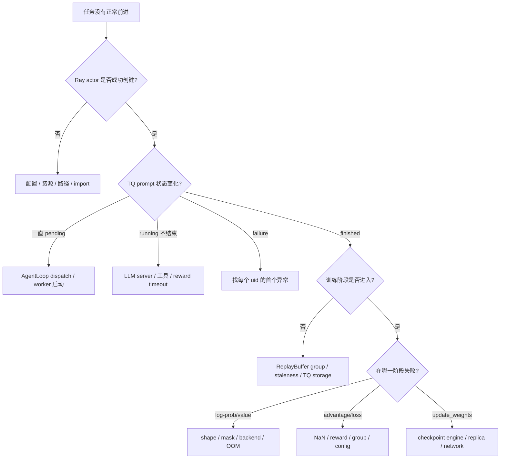
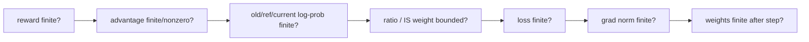

# 从现象定位故障：先找最后一个成功阶段

分布式 RL 的最终异常经常只是级联结果：reward worker 先报错，AgentLoop 标记 failure，ReplayBuffer 等不到足够组，最后 controller 看起来“卡住”。第一原则是找时间线上最早、最具体的异常。

## 先用人话：把训练看成有九个闸门的流水线

不要问“veRL 为什么坏了”，要问“最后一个明确成功的闸门是什么”。配置解析成功不等于 worker 建立；server ready 不等于生成返回；reward 有值不等于 advantage 有信号；actor update 完成不等于新权重已进入 rollout。

每次只增加一条能区分两种假设的证据。例如“GPU 满了”不能区分 KV cache 与 backward activation；“OOM 发生在 `update_actor` 的首个 backward”才开始指向后者。

## 决策树



## 按阶段建立最小证据

| 阶段 | 代表症状 | 首要证据 |
| --- | --- | --- |
| Hydra/导入 | unknown key、`???`、类找不到 | resolved config、`module.__file__` |
| Ray 放置 | actor pending、资源需求不满足 | `ray status`、dashboard、GPU labels |
| 模型初始化 | load timeout/OOM/权重不匹配 | 每 rank 第一条异常、模型 config/dtype |
| rollout | server ready 但无返回、长尾 | server logs/metrics、请求状态、长度 |
| TQ/replay | pending/running/finished 数不动 | TQ tag、storage 容量、staleness 指标 |
| reward | 全 0/1、worker exception | 原 response、ground truth、parser 分解项 |
| log-prob/value | shape 或 device mismatch | uid、字段 shape/dtype/mask（小样本） |
| advantage/update | NaN、zero grad、loss 爆炸 | reward/adv/KL/ratio/grad norm 分布 |
| 权重同步 | 下一轮仍旧版本、replica timeout | min/max version、checkpoint engine logs |
| 保存/退出 | 磁盘满、任务完成却挂起 | `df -h`、异步 executor/Ray actors |

## 先证明运行的是哪份代码

源码仓库、editable install、容器内 wheel 和 Ray runtime env 可能指向不同位置：

```bash
python - <<'PY'
import inspect
import ray
import torch
import verl
import verl.trainer.main_ppo as entry

print("verl", inspect.getfile(verl))
print("entry", inspect.getfile(entry))
print("ray", ray.__version__)
print("torch", torch.__version__)
PY

git rev-parse HEAD
git status --short
```

还应在远端 Ray actor 内打印一次相同信息；driver 正确不代表 worker runtime env 正确。

## 从一个 prompt/uid 追数据

遇到数值或卡住问题时，不要打印全 batch。选一个 uid，按下面的检查表追踪：

```text
dataset: raw_prompt / ground_truth / index
submit: uid / global_steps / pending
rollout: session_id / output index / lengths / weight versions
reward: decoded suffix / component scores / final score
train: response_mask sum / old-ref-rollout log-prob stats
algorithm: token reward / advantage / return / IS weight
result: actor metrics / synced model version
```

对 prompt 和回答做脱敏；只记录必要片段、hash 或长度，避免把训练数据复制进公共日志。

## NaN/Inf 的二分法



在最早变坏的边界加断言和分布统计，不要等 optimizer 之后才发现 NaN。统计时应用 response mask，并报告 count/min/max/mean 与非有限数量；均值可能掩盖单个极值。

## OOM 不等于只调一个比例

先判断发生在模型加载、rollout prefill/decode、log-prob、actor backward、critic 还是权重同步。对应旋钮不同：长度和并发、TP、KV cache、micro-batch/dynamic token budget、activation checkpoint/offload、checkpoint bucket 都可能相关。

降低 rollout `gpu_memory_utilization` 只缩小 KV cache 预算，不会修复训练 backward OOM，也可能把问题变成吞吐骤降。先用阶段日志和显存快照证明所有者。

## 多机网络与路径

- 在每节点启动 Ray 之前设置 collective/debug/设备环境；
- 每节点使用自己的对外 IP，避免 Gloo/NCCL/rollout server 绑定 `127.0.0.1`；
- 从 worker 节点实际测试模型、数据、reward 脚本与 checkpoint 路径；
- 确保 Ray temp、模型 cache、TQ backend 和日志盘有容量；
- 比较节点的驱动、Python 包和容器镜像，不只比较 `pip freeze` 的 head 节点。

确定性设置也要传播给 Ray actors。当前入口在 `ray.init()` 前处理 `full_determinism`，自定义启动器若绕开入口，应保留相同时序。

## 残留进程与显存

上次失败的 Ray、LLM server 或训练进程可能仍占端口/显存。先列出 PID、启动时间、命令、用户和 Ray job，确认所有权后只终止本次实验创建的资源。不要在共享机器用模糊 `pkill -f python` 或清空别人的 Ray session。

```bash
ray status
ps -eo user,pid,lstart,cmd --sort=-lstart | head -n 40
nvidia-smi
```

若由调度系统启动，优先用调度器/Ray job API 取消；再验证 GPU memory、端口和 child processes 是否释放。

## 分布式断点

当前 veRL 文档推荐 Ray Distributed Debugger + VS Code。设置 `RAY_DEBUG_POST_MORTEM=1`，在 `@ray.remote` 函数内放 `breakpoint()`，从 Ray dashboard 连接。断点会暂停 worker 并可能让其他 collective timeout，所以只用于最小资源、放宽超时的复现，不在生产多机任务中随意停 rank。

## 来自工程案例库的可迁移经验

[agent-evolutionism](https://github.com/lchany/agent-evolutionism)强调的几条经验很适合 veRL：核对实际 runtime source、环境变量在 Ray 启动前传播、保留完整 artifact、同 step 做对比，以及先清理自己拥有的残留任务。其部分 runbook 面向特定旧版本/特定基础设施（例如 Yuanrong 路径），不能直接当作当前提交的配置说明；本站当前源码的 TQ 配置列出的是 `SimpleStorage` 和实验性的 `MooncakeStore`。

## 提交问题前

准备最小可复现命令、resolved config、commit/dirty status、完整首错日志、硬件/节点拓扑、Python/torch/Ray/推理后端版本、数据 schema/长度统计，以及是否能在单机/单 step/更小模型复现。删去 token、凭据、私有路径与业务数据。

## 通关检查

任选一次过去的失败，重写成四行：现象、最后成功阶段、区分假设的最小证据、最早根因。若“修复”部分列出五个同时改动的参数，这次记录还不能支持因果结论。

下一站开始读源码：[源码地图](/verl/guide/source-map)。
