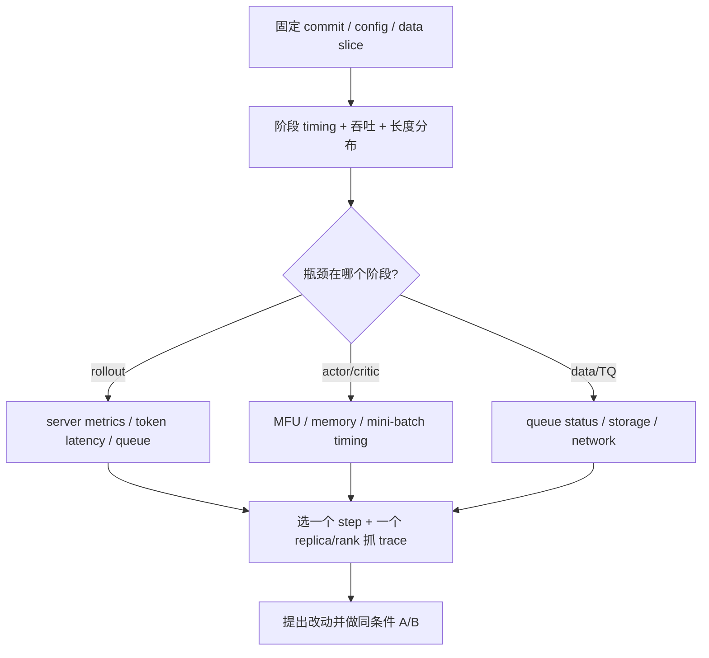

# 性能采集：先定位等待，再打开 profiler

性能分析的目标是回答具体问题，例如“step 慢在生成还是训练”“rollout 长尾来自排队还是 decode”“显存峰值发生在哪个 role”。一上来抓所有 rank、所有 step、所有 stack，通常只会制造巨大 trace。

## 先用人话：优化的是一段等待，不是一个参数

GPU 利用率低只是现象。它可能在等数据、最后一条长回答、权重同步、collective、CPU tokenizer，或被显存限制成很小的 batch。先把一步训练分段，找最大且可重复的等待，再用 profiler 放大那一段。

## 证据阶梯



短跑可用于发现数量级问题，但缓存预热、编译、首轮权重同步和数据长度波动会让一两个 step 很嘈杂。比较改动时使用相同 step 区间、相同样本/seed、相同集群占用，并报告中位数与尾部。

## 第一层：已有日志

`PPOTrainer.fit()` 已给 `gen`、`reward`、`old_log_prob`、`ref`、`values`、`adv`、`update_critic`、`update_actor`、`update_weights`、checkpoint/validation 等阶段计时。结合：

- reward/score、advantage、actor/critic loss、entropy、KL、clip fraction；
- prompt/response 长度分布与有效 token 数；
- actor/critic MFU、吞吐与显存；
- rollout-vs-actor log-prob 差异；
- off-policy dropped/staleness、版本跨度；
- sequence balance 和 MoE load balance（适用时）。

只看 `step_time` 无法决定优化对象。把时间换算成有效 response tokens/s，并同时记录长度分布，才能区分“系统退化”与“这批样本更长”。

## 第二层：PyTorch Profiler

先只抓 actor rank 0 的一个非首轮 step：

```bash
python3 -m verl.trainer.main_ppo \
  global_profiler.tool=torch \
  global_profiler.steps='[2]' \
  global_profiler.save_path=outputs/profile \
  actor_rollout_ref.actor.profiler.enable=true \
  actor_rollout_ref.actor.profiler.all_ranks=false \
  actor_rollout_ref.actor.profiler.ranks='[0]' \
  actor_rollout_ref.actor.profiler.tool_config.torch.contents='[cpu,cuda,memory,shapes]' \
  ...
```

需要 rollout 的 AgentLoop trace 时，当前官方文档要求 discrete mode：

```bash
global_profiler.tool=torch \
global_profiler.steps='[2]' \
actor_rollout_ref.rollout.profiler.enable=true \
actor_rollout_ref.rollout.profiler.ranks='[0]' \
actor_rollout_ref.rollout.profiler.tool_config.torch.discrete=true
```

rollout 的 `ranks` 指 replica rank，不是训练 global rank。可用 `profile_token_start/end` 限定 decode token 窗口。trace 通常是 JSON/JSON.GZ，可用 Perfetto 或 Chrome tracing 查看。

`stack` 和 `shapes` 会显著增加开销与文件体积；先用 CPU/CUDA timeline，只有需要定位算子调用点时再开。

## 第三层：Nsight Systems（NVIDIA）

根配置已给 controller/worker 的 nsys options。最小 override：

```bash
python3 -m verl.trainer.main_ppo \
  global_profiler.tool=nsys \
  global_profiler.steps='[2]' \
  global_profiler.profile_continuous_steps=false \
  actor_rollout_ref.actor.profiler.enable=true \
  actor_rollout_ref.actor.profiler.ranks='[0]' \
  ...
```

代码会检查 NVTX 可用性，并把 controller 选项传给 Ray TaskRunner、worker 选项传给 WorkerGroup。不要改 worker 的 `capture-range=cudaProfilerApi`；它是 veRL 控制 start/stop 的契约。

Ray 启动的 nsys 报告默认位于每个节点 `/tmp/ray/session_latest/logs/nsight/`。多机结束后按 hostname/PID/rank 收集，避免各节点同名覆盖。重点看 CUDA kernel 空洞、CPU-GPU sync、collective、memcpy、NVTX 阶段与跨进程时间对齐。

## NPU、显存与精度工具

`global_profiler.tool` 当前还接受 `npu`、`torch_memory`、`precision_debugger`：

- **npu**：在 role 的 `tool_config.npu.contents` 选择 npu/cpu/memory/shapes/module/stack，并选择采集 level；
- **torch_memory**：记录 allocation/state 与 Python/C++ stack，适合定位峰值和泄漏，但 `trace_alloc_max_entries` 会影响内存开销；
- **precision_debugger**：指定 `actor_update`、`actor_compute_log_prob`、`ref_compute_log_prob`、`compute_values`、`critic_update`、`compute_rm_score` 等阶段，依赖相应工具环境。

只在已复现问题的短窗口启用。profile run 的吞吐不能直接当作未采集时的性能数字。

## Rollout 在线观测

异步 rollout 可以让 vLLM/SGLang 暴露 Prometheus metrics，再接 Ray/Prometheus/Grafana。常见开关包括 rollout async mode、`disable_log_stats=false` 与 `prometheus.enable=true`。先直接访问每个 server 的 `/metrics` 验证采集，再排查 Prometheus discovery 和 dashboard。

关注 arrival rate、running/waiting requests、prompt/decode token throughput、KV cache utilization、time-to-first-token 和 inter-token latency。平均吞吐不错但 p99 长尾很高时，trainer 仍可能在等最后一组完整 prompt。

## A/B 结论模板

```text
hypothesis: rollout TP 过大导致单副本吞吐下降
constant: commit/config/data/seed/nodes/GPU type/step 10-30
change: tensor_model_parallel_size 2 -> 1
primary: valid response tokens/s
guardrails: reward, response length, OOM, staleness, p95 step time
evidence: resolved configs + logs + selected trace
result: ...
```

只改一个主要变量。若必须联动 batch 才能运行，把联动项也写入结论，避免把复合变化归因给一个参数。

## 通关检查

一项性能结论必须同时有：固定 workload、预热后区间、阶段 timing、有效 token 吞吐、p50/p95、算法 guardrail、改动前后 resolved config。profile trace 只负责解释机制，不能替代无 profiler 开销下的最终 A/B 数字。

课程主线到此结束，可回到[优化方法论](/verl/customization/optimization-playbook)选择下一项实验。
