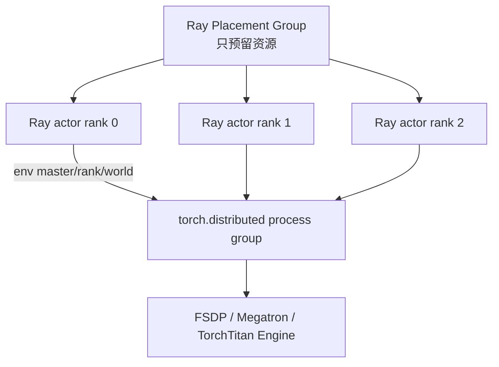

<script setup>
import rayRuntimeProbeUrl from './code/ray_runtime_probe.py?url'
</script>

# Ray 观测实验：从 Task、Actor、ObjectRef 到 veRL WorkerGroup

不要从 veRL 日志猜 Ray。先完成一组 CPU-only、可保留证据的 Ray 实验，观察进程、状态、故障和 placement group，再把每个对象映射回 veRL。

本课只使用 Ray 官方概念与 veRL 固定提交：

- [Ray Core Key Concepts](https://docs.ray.io/en/latest/ray-core/key-concepts.html)
- [Ray Actors](https://docs.ray.io/en/latest/ray-core/actors.html)
- [Placement Groups](https://docs.ray.io/en/latest/ray-core/scheduling/placement-group.html)
- [Dashboard](https://docs.ray.io/en/latest/ray-observability/getting-started.html)
- [State CLI](https://docs.ray.io/en/latest/ray-observability/reference/cli.html)
- [veRL `e5687fce`](https://github.com/verl-project/verl/tree/e5687fce0516d31e1fdc4580499074a9bd94c751)

Ray 源码解释固定到 `98c9eb75e44207266cc35f0cd94e1ecd58e3f77b`。完整的调用链、状态机与行号证据见[Ray 源码运行时主线](../internals/ray-source-runtime)，循序学习见[21 天 Ray 源码学习计划](../guide/ray-source-study-plan)。

::: warning 实测边界
编写本课的构建机没有安装 Ray，因此发布前只对脚本做 Python 语法编译和静态审查，没有伪造任何 PID、时序、状态或性能数字。下面“应验证的语义”来自固定源码和官方文档；你机器上的 JSON/YAML 才是实测结果。Ray 版本不同，CLI 字段和异常类型可能不同，请把 `ray.__version__` 一起保存。
:::

## 推荐路线：直接下载完整脚本

下载 <a v-bind="{ href: rayRuntimeProbeUrl, download: 'ray_runtime_probe.py' }"><code>ray_runtime_probe.py</code></a>。

脚本包含四种独立模式：

| mode | 正常/故障 | 要观察的事实 | 主要产物 |
| --- | --- | --- | --- |
| `baseline` | 正常 | task 与 actor process、ObjectRef、actor 状态连续性 | `baseline.json` + actors/tasks |
| `placement-group` | 正常 | 两个 bundles、`pg.ready()`、actors 绑定 bundle | `placement-group.json` + PG state |
| `unschedulable` | 故障注入 | 不存在 custom resource 导致 request 无法准入 | `unschedulable.json` + `ray status` |
| `actor-crash` | 故障注入 | actor process 退出与一次重建机会 | `actor-crash.json` + actor state/log |

脚本显式把 actor handles 和 PG handles 保留到 `--hold-seconds` 结束，避免实验对象在另一个终端观测前因引用释放而消失；最后统一清理并 `ray.shutdown()`。

### 1. 建隔离环境

```bash
python -m venv .venv-ray-course
source .venv-ray-course/bin/activate
python -m pip install --upgrade pip
python -m pip install 'ray[default]'
python -c 'import ray; print(ray.__version__)'
python -m py_compile ray_runtime_probe.py
```

若脚本从网页下载到当前目录，以上命令可直接执行；若从课程仓库运行，先进入 `practice/code` 或传入正确路径。实验不需要安装 veRL、PyTorch 或 CUDA。

### 2. 每个模式使用独立目录

不要在四个模式之间共用一套未清理的 local cluster。最稳妥的做法是一条命令完成一个模式，脚本退出后再运行下一个。

```bash
mkdir -p ray-evidence/baseline ray-evidence/placement-group
mkdir -p ray-evidence/unschedulable ray-evidence/actor-crash

python ray_runtime_probe.py \
  --mode baseline \
  --hold-seconds 120 \
  --output-dir ray-evidence/baseline
```

在 120 秒观测窗口内，另开终端。若使用同一 venv，先激活它：

```bash
source .venv-ray-course/bin/activate
ray status > ray-evidence/baseline/ray-status.txt
ray list actors --detail --format yaml \
  > ray-evidence/baseline/actors.yaml
ray list tasks --detail --format yaml \
  > ray-evidence/baseline/tasks.yaml
ray list objects --limit 100 \
  > ray-evidence/baseline/objects.txt
```

脚本会先写 JSON，再进入 hold，所以第一个终端即使仍在等待，你也可以检查 `baseline.json`。

### 3. Baseline：证明 ref、task 与 actor 是三件事

JSON 中应查这些字段，但不要预设具体 PID/ID：

```text
driver_pid
result.task_ref_before_get.{repr,hex}
result.task_result.{pid,node_id,task_id,value}
result.actor_refs_before_get[*]
result.actor_results[*].{pid,node_id,actor_id,task_id,value}
```

应由你的数据验证：

- `task_ref_before_get` 是引用身份；`task_result` 是 `ray.get` 后的 Python 值；
- 三次 `Counter.increment` 保持同一 actor identity 和 process，`value` 连续增长；
- task PID、actor PID、driver PID 的实际关系以输出为准，不写死某个数字；
- `ray list actors` 能把名字 `course-counter`、PID、node 和 state 对起来。

源码回查：Python `.remote()` 调用 `core_worker.submit_task` 并先返回 refs（[`remote_function.py#L516-L563`](https://github.com/ray-project/ray/blob/98c9eb75e44207266cc35f0cd94e1ecd58e3f77b/python/ray/remote_function.py#L516-L563)）；C++ 在 task 真正运行前登记 pending return refs（[`core_worker.cc#L1995-L2073`](https://github.com/ray-project/ray/blob/98c9eb75e44207266cc35f0cd94e1ecd58e3f77b/src/ray/core_worker/core_worker.cc#L1995-L2073)）。

### 4. Placement Group：证明预留不等于启动

```bash
python ray_runtime_probe.py \
  --mode placement-group \
  --hold-seconds 120 \
  --output-dir ray-evidence/placement-group
```

观测窗口内：

```bash
ray status > ray-evidence/placement-group/ray-status.txt
ray list placement-groups --detail --format yaml \
  > ray-evidence/placement-group/placement-groups.yaml
ray list actors --detail --format yaml \
  > ray-evidence/placement-group/actors.yaml
```

把 `placement-group.json` 中的 `placement_group_id`、`bundle_specs`、两个 actor identity 与 YAML 交叉核对。实验使用两个 `{"CPU": 0.5}` bundles、`STRICT_PACK` 和显式 bundle index；`pg.ready()` resolve 后才创建 actors。

应验证的是因果顺序，不是性能：

```text
create PG → pg.ready resolves → create actors with PG strategy
```

源码回查：`pg.ready()` 返回等待整组调度的 ObjectRef（[`placement_group.py#L25-L78`](https://github.com/ray-project/ray/blob/98c9eb75e44207266cc35f0cd94e1ecd58e3f77b/python/ray/util/placement_group.py#L25-L78)）；GCS 选择整组 bundles 并向 raylets 发 prepare/commit（[`gcs_placement_group_scheduler.cc#L41-L253`](https://github.com/ray-project/ray/blob/98c9eb75e44207266cc35f0cd94e1ecd58e3f77b/src/ray/gcs/gcs_placement_group_scheduler.cc#L41-L253)）。

### 5. Unschedulable：故意请求不存在的资源

```bash
python ray_runtime_probe.py \
  --mode unschedulable \
  --wait-timeout 5 \
  --hold-seconds 120 \
  --output-dir ray-evidence/unschedulable
```

另一个终端：

```bash
ray status > ray-evidence/unschedulable/ray-status.txt
ray list tasks --detail --format yaml \
  > ray-evidence/unschedulable/tasks.yaml
```

脚本请求 `course_missing_resource: 1`，local cluster 没有声明这个 custom resource。它用 `ray.wait(..., timeout=...)` 先确认观察窗口内是否完成；未完成的 ref 会保持 pending 直到 `--hold-seconds` 结束，让第二个终端看到 unsatisfied demand，随后脚本才取消它并关闭 Ray，避免实验永久挂住。

若 JSON 的 `remaining_count=1`，只能证明该请求在观察窗口内未完成；具体是不是资源原因，要再用 `ray status` 的 unsatisfied demand 和 task state 佐证。这个措辞刻意避免把短暂 scheduling latency 错写成永久 infeasible。

### 6. Actor crash：进程重建不等于状态恢复

```bash
python ray_runtime_probe.py \
  --mode actor-crash \
  --hold-seconds 120 \
  --output-dir ray-evidence/actor-crash
```

另一个终端连续保存两次 actor state 更有价值：

```bash
ray list actors --detail --format yaml \
  > ray-evidence/actor-crash/actors-after-crash.yaml
sleep 5
ray list actors --detail --format yaml \
  > ray-evidence/actor-crash/actors-after-retry.yaml
```

`CrashOnce` 配置 `max_restarts=1`、`max_task_retries=0`，方法内部 `os._exit(23)`。JSON 同时记录：

- crash 前的 actor ID、PID、node；
- crashing call 的实际异常类和消息；
- 重建后 `identity()` 的结果，或重建失败的实际异常。

不要预写“必然换 PID”或“必然成功”。调度与重建时序由实际环境决定。即使 actor 被重建，`self`、optimizer、RNG 与训练 step 也没有自动恢复；veRL 仍需要 checkpoint/recovery 逻辑。ActorTaskSubmitter 的断连/重建分支见 [`actor_task_submitter.cc#L378-L470`](https://github.com/ray-project/ray/blob/98c9eb75e44207266cc35f0cd94e1ecd58e3f77b/src/ray/core_worker/task_submission/actor_task_submitter.cc#L378-L470)。

### 7. 可选 Dashboard，不要暴露公网

脚本默认不开 Dashboard。确实需要时加 `--dashboard`：

```bash
python ray_runtime_probe.py \
  --mode baseline \
  --dashboard \
  --hold-seconds 300 \
  --output-dir ray-evidence/dashboard
```

远端服务器用 SSH tunnel：

```bash
ssh -L 8265:127.0.0.1:8265 user@head-node
```

然后在本机打开 `http://127.0.0.1:8265`。不要将 8265 直接开放到公网。

### 8. 一份合格实验报告长什么样

每个 mode 至少填写：

| 字段 | 你的记录 |
| --- | --- |
| Ray/Python/OS 版本 | 不省略 |
| 完整命令 | 包含 mode、timeout、hold |
| JSON artifact | 路径 + hash |
| state snapshots | actor/task/PG/status 路径 |
| 实测事实 | 只写输出直接支持的内容 |
| 源码解释 | 固定 commit 的 source:line |
| 未确认推断 | 明确标“推断”，列验证办法 |
| veRL 对应物 | TaskRunner/ResourcePool/WorkerGroup/TrainingWorker |

可以生成校验和：

```bash
find ray-evidence -type f -print0 \
  | sort -z \
  | xargs -0 sha256sum \
  > ray-evidence/SHA256SUMS
```

State API 会受 limit、timeout、dropped events 和 truncation 影响；相关聚合路径见 [`state_aggregator.py#L312-L374`](https://github.com/ray-project/ray/blob/98c9eb75e44207266cc35f0cd94e1ecd58e3f77b/python/ray/dashboard/state_aggregator.py#L312-L374)。所以 JSON、state snapshot 和 worker log 应互相佐证。

## 手动最小版：自己重写一次

完成完整脚本后，再手写下面的最小代码。目的不是重复跑，而是确认你能脱离工具脚本复现核心原语。

## 先区分六个对象

| 名称 | Ray 中的含义 | veRL 中的实例 |
| --- | --- | --- |
| Driver / Job | 提交远程调用、持有 refs 的入口进程 | Hydra CLI 进程 |
| Task | 无持久状态的 remote function invocation | 少量工具性 remote 调用 |
| Actor | 一个有状态、专用的远程 worker 进程 | `TaskRunnerV1`、训练 rank、Reward/AgentLoop worker |
| Actor task | 对 actor method 的一次异步调用 | `runner.run.remote()`、worker method RPC |
| ObjectRef | 远程结果的引用；`ray.get` 物化 | Ray RPC future，不等于 V1 trajectory storage |
| Placement Group | 原子预留的一组 resource bundles | `RayResourcePool` 为多 rank WorkerGroup 预留资源 |

Ray actor 与 veRL role 不是同义词。role 是算法职责；一个 role 可以展开成多个 Ray actors，一个 colocated Ray actor 也可以暴露多个 role API。

## 实验 0：确认版本和安装形态

State CLI 和 Dashboard 需要完整安装：

```bash
python - <<'PY'
import ray
print(ray.__version__)
PY

# 若 ray list 不存在，再安装 dashboard 组件
python -m pip install -U 'ray[default]'
```

不要为了这个实验安装 veRL 的 GPU 依赖；Ray CPU 环境足够验证控制面。

## 实验 1：一个 Task 和一个 Actor

保存为 `ray_probe.py`：

```python
import os
import time

import ray


@ray.remote(num_cpus=1)
def stateless_task(x: int) -> dict:
    return {
        "kind": "task",
        "pid": os.getpid(),
        "value": x * 2,
        "node": ray.get_runtime_context().get_node_id(),
    }


@ray.remote(num_cpus=1)
class Counter:
    def __init__(self):
        self.value = 0

    def increment(self) -> dict:
        self.value += 1
        return {
            "kind": "actor",
            "pid": os.getpid(),
            "value": self.value,
            "actor": ray.get_runtime_context().get_actor_id(),
        }


context = ray.init(include_dashboard=True)
print("dashboard:", context.dashboard_url)
print("driver pid:", os.getpid())

task_ref = stateless_task.remote(21)
counter = Counter.options(name="course-counter").remote()
actor_refs = [counter.increment.remote() for _ in range(3)]

print("task ref:", task_ref)
print("task result:", ray.get(task_ref))
print("actor results:", ray.get(actor_refs))
print("cluster resources:", ray.cluster_resources())

time.sleep(120)  # 留时间给另一个终端观察
ray.shutdown()
```

运行：

```bash
python ray_probe.py
```

必须观察到：

1. driver PID、task PID、actor PID 不相同；
2. 三个 actor method 的 PID 与 actor id 相同；
3. actor 的 `value` 是 1、2、3，说明状态留在专用进程；
4. `remote()` 立即返回 ObjectRef，`ray.get()` 才等待结果。

如果把 `Counter` 改成 remote function，每次调用就没有共享的 `self.value`。这就是 veRL 为什么用 actor 承载长期模型和控制器状态。

## 实验 2：用 State CLI 看真实状态

在程序 sleep 的 120 秒内打开另一个终端：

```bash
ray status
ray summary tasks
ray list actors --detail
ray list tasks --limit 50
ray list objects --limit 50
```

保存输出：

```bash
ray list actors --format yaml > actors.yaml
ray list tasks --format yaml > tasks.yaml
```

验收点：

- `course-counter` 的 state 是 `ALIVE`；
- actor 有独立 PID；
- `Counter.increment` 出现在 actor tasks 中；
- CLI 输出是状态快照，可能截断或稍有延迟，不能当作强一致事务记录。

## 实验 3：Placement Group 不是进程池

在另一个文件运行：

```python
import ray
from ray.util.placement_group import placement_group
from ray.util.scheduling_strategies import PlacementGroupSchedulingStrategy

ray.init()

pg = placement_group(
    bundles=[{"CPU": 1}, {"CPU": 1}],
    strategy="STRICT_PACK",
    name="course-pg",
)
ray.get(pg.ready())


@ray.remote(num_cpus=1)
class Rank:
    def where(self):
        ctx = ray.get_runtime_context()
        return str(ctx.get_node_id()), str(ctx.get_actor_id())


workers = [
    Rank.options(
        name=f"course-rank-{rank}",
        scheduling_strategy=PlacementGroupSchedulingStrategy(
            placement_group=pg,
            placement_group_bundle_index=rank,
        ),
    ).remote()
    for rank in range(2)
]

print(ray.get([worker.where.remote() for worker in workers]))
input("inspect with: ray list placement-groups --detail\n")
```

Placement Group 做的是“先原子预留两个 bundle，再把 actors 指到对应 bundle”，它不会替你创建 torch process group，也不会自动设置 `RANK`、`MASTER_ADDR`。

## 映射回 `RayResourcePool`

veRL 的 [`RayResourcePool.get_placement_groups()`](https://github.com/verl-project/verl/blob/e5687fce0516d31e1fdc4580499074a9bd94c751/verl/single_controller/ray/base.py#L131-L163)：

1. 为每张设备生成一个 bundle；
2. 默认 `STRICT_PACK`；
3. 等待所有 placement groups ready；
4. 按节点 IP 排序。

[`ResourcePoolManager`](https://github.com/verl-project/verl/blob/e5687fce0516d31e1fdc4580499074a9bd94c751/verl/single_controller/ray/base.py#L184-L243) 默认 `max_colocate_count=3`。每个 GPU bundle 预留一张 GPU 和三份 CPU slot；真正创建 worker 时，每个 actor 申请 `1 / max_colocate_count` GPU 资源份额。

这是一种 Ray **逻辑资源声明**，不表示 GPU 显存被硬切成三等份。是否能安全共置仍取决于 sleep/offload、模型大小和各进程的真实峰值。

## 映射回 `RayWorkerGroup`

[`RayWorkerGroup._init_with_resource_pool()`](https://github.com/verl-project/verl/blob/e5687fce0516d31e1fdc4580499074a9bd94c751/verl/single_controller/ray/base.py#L538-L581) 遍历 PG 与 local rank；
[`_create_worker()`](https://github.com/verl-project/verl/blob/e5687fce0516d31e1fdc4580499074a9bd94c751/verl/single_controller/ray/base.py#L623-L683) 给每个 actor 注入：

```text
WORLD_SIZE
RANK
RAY_LOCAL_WORLD_SIZE
MASTER_ADDR
MASTER_PORT
WG_PREFIX
WG_BACKEND=ray
```

随后 `TrainingWorker` 在每个 Ray actor 内调用 `initialize_global_process_group_ray()`，这些独立 Python actors 才组成 torch distributed ranks。



## 为什么 veRL 还需要 WorkerGroup

原生 Ray 一次 actor method 调用只面向一个 actor。分布式模型的 `compute_log_prob` 必须：

1. 按 data parallel mesh 切输入；
2. 对所有相关 ranks 发远程调用；
3. 等 collective 和 forward 完成；
4. 只从指定 ranks 收集结果；
5. 按原 batch 语义合并输出。

veRL 用 `@register(dispatch_mode=...)` 给 worker method 加分发元数据，再由 WorkerGroup 绑定出一个看似单进程的方法。Single Controller 调用一次，WorkerGroup 负责多 actor fan-out/fan-in。

## Dashboard 观测清单

打开 `http://127.0.0.1:8265`（远端机器用 SSH tunnel，不要直接暴露公网）：

```bash
ssh -L 8265:127.0.0.1:8265 user@head-node
```

依次确认：

| 页面 | 观察什么 | 对 veRL 的意义 |
| --- | --- | --- |
| Jobs | driver、tasks、actor tasks 的父子关系 | 找到卡在哪个 controller/role 调用 |
| Actors | class、PID、node、state、restart | 区分 TaskRunner 与 worker actors |
| Placement Groups | bundles、strategy、state | 发现资源请求无法满足 |
| Cluster | 节点和逻辑 CPU/GPU 使用 | 确认 actors 实际落点 |
| Logs | worker stdout/stderr | 不要只看 driver 汇总异常 |
| Timeline | scheduling/serialization/execution | 区分排队、传输和计算瓶颈 |

## 将观测命令用于真实 veRL 作业

训练启动后先保存四份证据：

```bash
ray status > ray-status.txt
ray list actors --detail --format yaml > ray-actors.yaml
ray list placement-groups --detail --format yaml > ray-pgs.yaml
ray summary tasks > ray-tasks.txt
```

然后回答：

1. `TaskRunnerV1` 在哪台节点、哪个 PID？
2. actor/critic/reward/agent-loop 各有多少 actors？
3. 哪些 actors 共用同一个 PG bundle？
4. pending actor 请求缺的是 CPU、GPU 还是自定义资源？
5. torch rank 环境与 Ray actor identity 能否一一对应？

## 三个故障注入

只在测试集群做：

### 1. 请求不存在的资源

把 toy actor 改成 `@ray.remote(num_cpus=999)`。预期 actor 保持 pending，`ray status` 显示 unsatisfied demand。目的是学会识别资源死锁，不是等待它自己恢复。

### 2. actor 内抛异常

在 `increment()` 的第二次调用抛 `RuntimeError`。观察 actor task failure 与 actor 本身是否仍 ALIVE；不要把一次 method error 当成 actor 进程死亡。

### 3. 杀死 actor 进程

在 toy actor 中调用 `os._exit(1)`。默认 actor 不自动重启；若配置 `max_restarts`，再观察 actor id/PID 和状态变化。真实训练是否可恢复还取决于模型状态与 checkpoint，不是 Ray 重启一个空进程就结束。

## 通关标准

不用看页面，解释下面四组区别：

- task vs actor vs actor task；
- ObjectRef vs TransferQueue key；
- Placement Group vs torch process group；
- Ray actor vs veRL role vs GPU rank。

并提交 `actors.yaml`、`ray-pgs.yaml` 和一张你自己的 “driver → TaskRunner → WorkerGroup → ranks” 图。下一步回到 [V1 逐源码主线](../internals/v1-source-walkthrough)。
