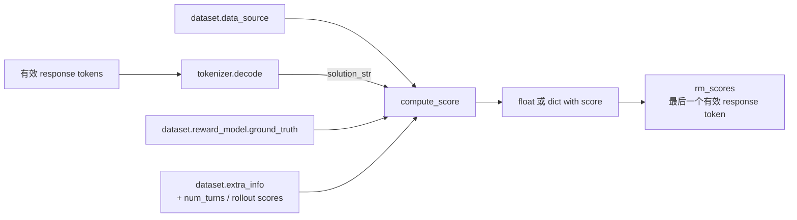

# 写一个可靠奖励函数：先当审稿人，再当优化目标

当前 V1 的 `naive` reward manager 会把有效 response 解码成字符串，再调用自定义函数。最稳妥的奖励函数是确定、限时、无副作用、对异常输入给出可观测结果的纯函数。

## 先用人话：reward 既是裁判，也是模型会研究的规则

普通评测只要大体区分好坏；RL reward 会被模型反复优化。任何可利用的漏洞——宽松正则、答案泄漏、长度奖励、异常默认高分——最终都可能成为模型的新策略。

因此写 reward 的顺序应是：先定义“什么算对、什么明确不算对、异常怎样处理”，用反例测试它；最后才接入训练。reward 上升只证明模型更会满足这段程序，不自动证明真实质量提高。

## 当前函数契约

```python
def compute_score(
    data_source: str,
    solution_str: str,
    ground_truth,
    extra_info: dict,
    **kwargs,
):
    ...
```

参数来自：



函数可返回 `float`，也可返回含必需键 `score` 的 dict；其他键会成为 reward extra info/指标候选。同步函数在线程执行器中运行，`async def` 也受支持。保留 `**kwargs`，可兼容 reward router 等额外参数。

## 一个安全的数学答案示例

把下面内容保存为所有 Ray 节点都能访问的 `rewards/math_reward.py`：

```python
from __future__ import annotations

import re
from decimal import Decimal, InvalidOperation
from typing import Any

FINAL_RE = re.compile(r"(?:^|\n)\s*####\s*([^\n]{1,200})\s*$")


def canonical_number(value: Any) -> Decimal | None:
    text = str(value).strip().replace(",", "")
    if not text or len(text) > 200:
        return None
    try:
        number = Decimal(text)
    except InvalidOperation:
        return None
    return number if number.is_finite() else None


def compute_score(
    data_source: str,
    solution_str: str,
    ground_truth: Any,
    extra_info: dict | None = None,
    **_: Any,
) -> dict[str, float]:
    # 限制解析范围，避免异常超长输出拖慢正则处理。
    response = str(solution_str)[-10_000:]
    match = FINAL_RE.search(response)
    predicted = canonical_number(match.group(1)) if match else None
    expected = canonical_number(ground_truth)

    format_ok = float(match is not None)
    accurate = float(predicted is not None and expected is not None and predicted == expected)
    score = accurate  # 在一个地方明确最终优化目标

    return {
        "score": score,
        "acc": accurate,
        "format_reward": format_ok,
    }
```

这个示例没有使用 `eval`、`exec`、shell 或不受限的网络请求；Decimal 只接受数值文本且拒绝 NaN/Infinity。它只是一个明确契约，不适合分数、代数等值或形式化证明任务——这些任务应使用专门 parser/verifier，并给 verifier 设置资源和超时边界。

> [!CAUTION]
> 模型输出是不可信输入。不要直接执行它生成的代码、SQL、shell 或 Python 表达式。代码任务应交给隔离 sandbox，限制 CPU、内存、文件、网络与执行时间。

## 先在训练外测试

```python
from rewards.math_reward import compute_score


def test_reward():
    assert compute_score("math", "work\n#### 2", "2")["score"] == 1.0
    assert compute_score("math", "#### 2.0", "2")["score"] == 1.0
    assert compute_score("math", "answer is 2", "2")["format_reward"] == 0.0
    assert compute_score("math", "#### NaN", "NaN")["score"] == 0.0
    assert compute_score("math", "#### __import__('os')", "0")["score"] == 0.0
```

再做三层验证：

1. **函数层**：正常、错误、空、极长、Unicode、恶意与异常 ground truth；
2. **数据层**：随机抽取 parquet 行，确认 `ground_truth` 类型和 prompt 格式；
3. **小 rollout 层**：dump 少量 response、reward extra fields 和长度，人工复核。

## 配置加载

```bash
python3 -m verl.trainer.main_ppo \
  reward.custom_reward_function.path=/shared/project/rewards/math_reward.py \
  reward.custom_reward_function.name=compute_score \
  reward.reward_manager.source=register \
  reward.reward_manager.name=naive \
  reward.num_workers=8 \
  ...
```

`get_custom_reward_fn()` 会动态加载 path/name，并把可选 `reward_kwargs` 合并进调用参数。多机时不要使用只存在于 head 节点的本地路径；容器、Ray runtime env 或共享存储必须让 reward workers 看到同一文件版本。

## 标量最后放在哪里

基础 reward manager 的 `assemble_rm_scores` 创建与 `responses` 同形状的零张量，把每条标量分数放在最后一个有效 response token。随后 advantage 递推或 outcome reward 求和把它转为训练信号。

边界检查：有效 response 长度必须大于 0，否则 `valid_response_length - 1` 会指向错误位置。数据/rollout 层应阻止空 trajectory，奖励函数本身也应对空字符串返回稳定的低分而不是抛出随机异常。

## 奖励设计的常见失败

| 现象 | 可能原因 | 先验证什么 |
| --- | --- | --- |
| reward 很快全为 1 | verifier 太宽松、答案泄漏、格式可钻空子 | 人工抽样 false positive |
| reward 全为 0 | parser 与模型输出格式不匹配 | `solution_str` 原文和 match 结果 |
| GRPO advantage 全 0 | 同 prompt 组内 reward 无差异 | 每组 reward 分布/std |
| reward worker 很慢 | 阻塞 I/O、重 verifier、无限重试 | 单调用 p50/p95/p99 和超时 |
| 训练偶发崩溃 | 未处理 None/类型/超长输入 | property/fuzz 样例与异常计数 |
| reward 上升但质量下降 | reward hacking 或单指标替代真实目标 | 独立验证集与人工/第二 verifier |

奖励输出建议包含可分解的 `acc`、`format_reward` 等，但 `score` 的组合必须唯一、可审计。不要把日志指标不小心重复加进最终 score。

## 通关检查

在接训练前，至少证明：空/错/对/超长/恶意/异常 ground truth 六类输入都有确定结果；`score` 的组成唯一；每个额外指标不被重复计分；单次调用有超时边界；所有 Ray 节点加载同一文件；人工复核能发现 false positive 与 false negative。

然后故意让模型输出一个格式正确但答案错误的样本，确认 `format_reward` 与 `score` 没被混为一谈。

下一步：[从现象定位故障](./debugging)。
