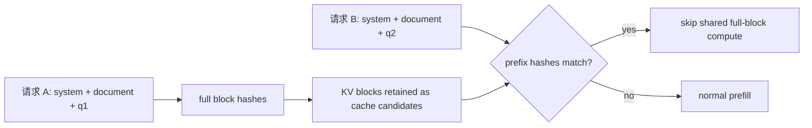
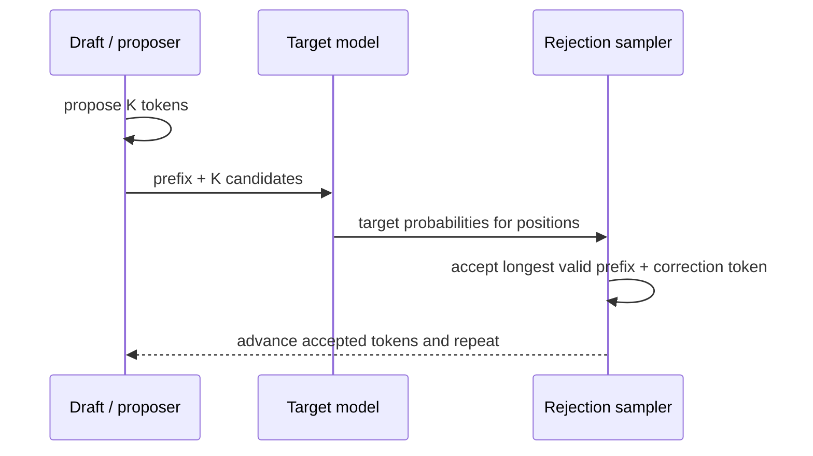

# Prefix、Chunked Prefill 与 Speculative Decoding

三项优化瞄准不同浪费：prefix caching 避免重复 prompt 计算；chunked prefill 重排大段 prefill 与 decode 的混合方式；speculative decoding 尝试用一次 target forward 接受多个输出 token。先识别瓶颈，再选择工具。

## 一张问题—机制表

| 机制 | 主要减少/改变 | 最可能改善 | 对什么通常无能为力 |
| --- | --- | --- | --- |
| Automatic Prefix Caching | 重复前缀的 prefill FLOPs | 重复长文档/多轮对话的 TTFT、prefill throughput | 长答案的逐 token decode |
| Chunked Prefill | 长 prefill 的调度粒度与混批 | decode ITL、GPU 利用、队首阻塞 | 不减少总 prompt 计算量 |
| Speculative Decoding | target model 的串行 decode steps | 低/中 QPS memory-bound decode 的 ITL | target 已饱和的高 QPS、低接受率任务 |

它们可以组合，但“都打开”不自动叠加收益。每项都会改变 batch 形状、KV 占用或调度数据，组合需要重新测。

## 1. Automatic Prefix Caching

### 命中的必要条件

新请求必须在 token 层拥有完全一致的前缀，并匹配影响 KV 的额外身份：模型/adapter、多模态内容、cache salt 等。看起来一样的文本也可能因 chat template、空格、时间戳、工具列表顺序或 tokenizer 版本不同而 token 不同。



固定提交的 cache config 默认开启 prefix caching，但模型/feature 约束可能关闭或改变行为。以启动时打印的最终配置和 `vllm:prefix_cache_*` 指标为准，不要仅凭默认值假设。

### 合理使用模式

- 把稳定 system prompt 和共享文档放在前面，用户特有内容放后面；
- 不要在前缀开头注入每请求 UUID、当前时间或随机 tracing 文本；
- 多租户场景按信任域使用 `cache_salt` 隔离复用，防止通过时延探测他人缓存；
- DP 路由尽量让同一会话/相似前缀落到同一 rank；
- 监控 query tokens、hit tokens 与按命中长度分桶的 TTFT，而不是只看 hit ratio。

### 一个不会被平均值欺骗的实验

准备 8K-token 固定文档和 100 个不同问题：

1. 冷启动后发第一个请求，记录 TTFT；
2. 同一前缀发后续请求，记录 hit tokens 与 TTFT；
3. 在前缀第一个 block 内加入随机 request id，再跑一次；
4. 保持前缀但生成 1K 输出 token，比较总 E2E。

预期：第 2 组 prefill/TTFT 受益；第 3 组命中坍塌；第 4 组总耗时中 decode 占比高，APC 的相对收益被稀释。

### 常见错觉

“第二次更快”也可能来自 compile/cache warmup、权重页缓存或网络连接复用。必须同时观察 prefix query/hit 指标，并交错运行 cacheable/non-cacheable 对照。

## 2. Chunked Prefill

长 prompt 若一次性占满大 batch，正在 decode 的请求可能长时间等下一 token。Chunking 把它分段，让 decode 与一部分 context work 同 step：

```mermaid
gantt
    title 调度直觉（示意，不代表固定时长）
    dateFormat X
    axisFormat %s
    section 无 chunk
    Long prefill       :0, 6
    Waiting decodes    :crit, 0, 6
    Decode             :6, 8
    section chunked
    Prefill chunk 1    :0, 2
    Decode + chunk 2   :2, 4
    Decode + chunk 3   :4, 6
    Decode             :6, 8
```



固定提交的 V1 在兼容时默认开启 chunked prefill，并优先安排已有 decode，再用剩余 token budget 接纳 prefill；超出预算的 prefill 自动切 chunk。

### 关键旋钮是 token budget

`--max-num-batched-tokens` 影响每 step 的总 scheduled tokens：

- 小：单 step context 干扰较少，常有利于 ITL；但长 prompt 要更多 steps，TTFT/吞吐可能变差；
- 大：prefill 推进快、批可能更高效；但一次 context work 可能拖慢同批 decode；
- 太大还会增加激活/临时内存与 graph shape 压力。

这不是单调关系。用 prompt 长度 × 到达率矩阵扫描，而不是从别人的 H100 配置复制一个值。

### 它没有减少 FLOPs

一个 16K prompt 没有 prefix hit 时仍要完成约 16K token 的上下文计算。Chunking 改变服务顺序与混合形态，价值来自更好的延迟公平性和算力/带宽工作混合，不是跳过模型层。

### 公平性问题

若永远优先 decode，高 decode 负载可能让新长 prompt 的 TTFT 变差；若允许大 prefill chunk，又可能损害交互式 decode ITL。生产调优应同时报告：

- prompt 长度分桶的 TTFT p95/p99；
- output 长度分桶的 ITL；
- waiting queue age，而不只看长度；
- context/generation scheduled tokens 比例。

## 3. Speculative Decoding

普通自回归每次 target forward 通常只接受一个新 token。Speculation 先提出 `K` 个候选，再让 target 并行验证：



如果平均一次 target step 接受多个 token，串行 steps 减少；但每 step 计算更多 positions，还支付 proposer 与 rejection 成本。收益近似受以下量共同决定：

$$
speedup \sim \frac{accepted\ tokens/step}{target\ verification\ cost + proposal\ cost + overhead}
$$

不是只看 acceptance rate。

### 方法选择

| 方法 | 额外模型 | 优点 | 适用起点 |
| --- | --- | --- | --- |
| n-gram / suffix | 无 | 配置轻、额外显存小 | 代码、重复文本或可预测局部模式 |
| draft model | 小模型 | 通用，候选质量可高 | 有兼容 tokenizer/模型且显存允许 |
| EAGLE / MLP | 辅助 head/model | 可利用 target hidden state | 有匹配 checkpoint 的模型族 |
| native MTP | 模型自带多 token 头 | 集成紧密 | target checkpoint 明确支持 |

固定提交还支持更多方法；接口变化快，应以[该提交的 speculative 配置文档](https://github.com/vllm-project/vllm/blob/61141ed265bfef41a0ca19e992567ea980919b96/docs/features/speculative_decoding/README.md)与安装版本 `--help` 为准。

### 最轻量的 n-gram 实验

```bash
vllm serve "$MODEL" \
  --speculative-config '{
    "method": "ngram",
    "num_speculative_tokens": 4,
    "prompt_lookup_min": 2,
    "prompt_lookup_max": 5
  }'
```

然后用同一请求集比较 baseline。必须记录：

- mean accepted tokens / target step 或 acceptance 指标；
- ITL p50/p99、output throughput、goodput；
- QPS/并发；
- GPU 利用与额外 KV/显存；
- 输出一致性条件（greedy 或采样 seed/数值差异）。

### 为什么高 QPS 可能没有收益

普通 continuous batching 已让 target GPU 饱和时，speculation 会增加每 step 验证 token 和 proposer 工作；减少串行轮数未必增加总吞吐。Spec decode 的典型目标是低到中 QPS、memory-bound decode 的单请求 ITL。要分别跑低并发 latency test 和饱和 throughput test。

### `K` 不是越大越好

候选越深，后部全部依赖前部正确，接受概率通常递减；被拒绝 token 仍消耗验证算力与 lookahead KV slots。扫描 `K=1,2,4,8`，画 accepted tokens/step 与 ITL/吞吐，而不是只选最大。

## 三项功能怎样相互作用

```text
prefix caching → 让请求从更靠后的 computed position 起步
chunked prefill → 决定剩余 prompt 每轮推进多少
speculative → prompt 完成后（以及统一调度模型中）增加待验证 token 差额
三者共同竞争 token budget 与 KV blocks
```

| 组合 | 可能收益 | 新风险 |
| --- | --- | --- |
| Prefix + chunk | 重复部分跳过，未命中长尾分块 | 命中统计与 chunk TTFT 归因混杂 |
| Chunk + spec | 保护 decode 同时每步接受更多 token | token budget 和 batch shape 更复杂 |
| Prefix + DP | 每 rank 内收益 | 随机路由稀释命中 |
| Spec + TP | target/draft 都可能需并行 | proposer 通信与显存开销 |
| Spec + PP | 依版本/方法存在兼容约束 | 多 stage cadence 与验证路径复杂 |

固定源码甚至对某些 dynamic speculation + DP 组合做保护性降级，以避免不同 rank 选不同 K 后 collective 分歧。功能矩阵必须以实际版本为准。

## 一套最小实验矩阵

不要跑 2³ 全组合起步。按瓶颈逐层：

```text
Baseline
├── workload 有重复长前缀 → +Prefix
├── 长 prompt 干扰 decode → 扫 batch token / chunk 行为
└── 低 QPS decode ITL 高 → +一种 Spec 方法，扫 K
```

选出单项收益后才测试组合，并保留无功能 baseline。每次同时报告质量/成功率；性能优化不能通过错误 stop、截断或不同输出长度“获胜”。

## 通关标准

面对“8K 共享文档 + 32-token 答案”“无重复 32K prompt + 交互 decode”“低 QPS 2K-token 长答案”三种负载，你应能分别提出优先实验的机制、预测受益指标和可能无效原因。最后进入[生产诊断与容量规划](./production)。
