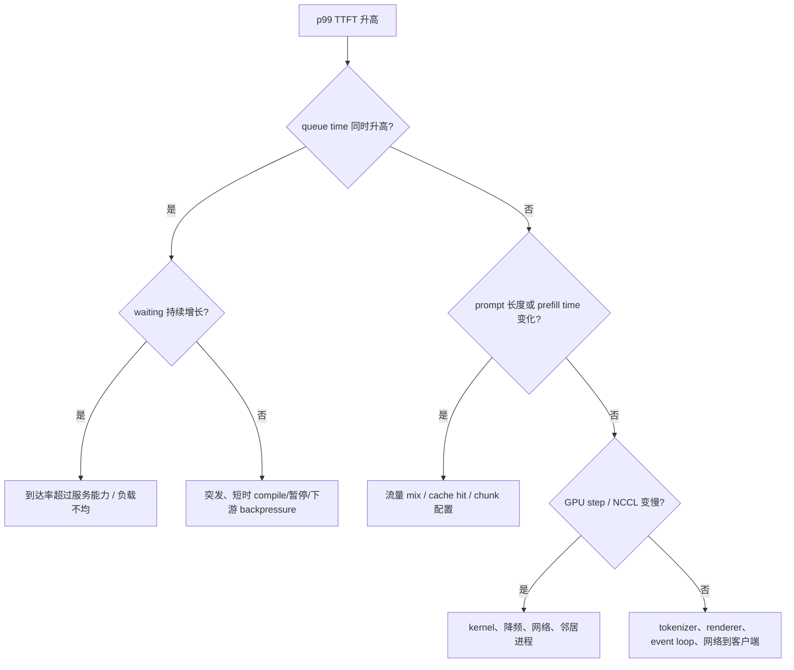

# vLLM 生产诊断与容量规划

生产容量不是“GPU 能跑多少 tok/s”，而是**在给定输入/输出分布、到达过程和质量约束下，多少请求能持续满足 SLO。**稳定区要留出故障、突发、长尾和版本漂移的余量。

## 先定义四类目标

| 目标 | 示例 | 为什么单独定义 |
| --- | --- | --- |
| 可用性 | 成功率、超时率、取消率 | 快速错误不算好服务 |
| 交互延迟 | TTFT p95/p99、ITL p95/p99 | 首 token 与持续阅读体验不同 |
| 批任务延迟 | E2E、deadline completion | 长输出更关心完成时间 |
| 效率 | goodput/GPU、成本/合格请求 | 避免用不合格吞吐“刷高”利用率 |

SLO 必须按 workload class 分开。例如 200-token chat 与 32K document QA 共用一个 TTFT histogram，平均结果无法指导容量。

## 两本容量账

### 1. KV 驻留账

对普通 decoder-only 模型，一个粗略并发上限：

$$
C_{KV}\approx\frac{available\ KV\ tokens}{P_q(context+generated\ tokens)}
$$

分母应选符合风险目标的高分位，而不是均值。启动日志会给 GPU KV cache token capacity 和按 `max_model_len` 推算的理论 concurrency；后者只是“每请求都占最大长度”的参考，不等于你的真实并发。

prefix hit 可能少算 prompt compute，但命中的 block 仍在缓存池中占物理空间；chunk/speculative 也会改变在途和 lookahead slots。最终以压力下 `kv_cache_usage_perc`、preemption 和长度分布校准。

### 2. 服务速率账

粗略 token demand：

$$
demand_{tok/s}=\lambda\times(E[input\ computed]+E[output])
$$

prefix cached input 不应全部算作本次 computed；prefill 和 decode 每 token 成本也不同，不能只用 total tok/s 精确换算。这个式子用于初筛，最终用开放到达 rate sweep 找到 SLO goodput 的稳定拐点。

Little 定律可做一致性检查：

$$
L=\lambda W
$$

若每秒 10 请求、平均系统时间 4 秒，则系统内约 40 个请求。仪表盘显示 running+waiting 长期 5 时，说明口径、采样或流量统计至少有一个不一致。

## 最小生产仪表盘

固定提交的 V1 指标由 `/metrics` 暴露。指标会演进，上线前应保存实际 exposition 并固定 dashboard 版本。

### 用户结果

- `vllm:request_success_total{finished_reason=...}` 与网关 4xx/5xx/timeout；
- `vllm:time_to_first_token_seconds`；
- `vllm:inter_token_latency_seconds`；
- `vllm:e2e_request_latency_seconds`；
- `vllm:request_prompt_tokens`、`request_generation_tokens`。

### 排队与引擎

- `vllm:num_requests_running`；
- `vllm:num_requests_waiting` 与 `...waiting_by_reason`；
- `vllm:request_queue_time_seconds`；
- `vllm:kv_cache_usage_perc`；
- `vllm:num_preemptions_total`；
- prompt/generation token rate 与 iteration token histogram。

### 优化是否有效

- `vllm:prefix_cache_queries_total` / `prefix_cache_hits_total`；
- `vllm:prompt_tokens_cached_total`；
- speculative acceptance/efficiency 指标（仅启用时）；
- GPU utilization、HBM、power，以及 NCCL/network 独立基础设施指标。

一个 p99 TTFT PromQL 形态如下，实际要保留 model/engine/workload labels：

```promql
histogram_quantile(
  0.99,
  sum by (le) (rate(vllm:time_to_first_token_seconds_bucket[5m]))
)
```

不要把所有 replicas 的 histogram quantile 先各自计算再平均；先聚合 buckets 再求 quantile。

## 诊断 p99 TTFT 的证据树



每个节点都要求一个对照指标。不要因为 KV usage 高就直接认定 OOM：高 usage 且无 preemption、queue 稳定可能是正常有效利用。

## 六类常见症状

### 1. waiting 单调增长

这是容量不足或流量不均的直接信号。先比较 arrival rate 与完成 rate，再按 DP rank 看 running/waiting/KV。若总容量够但单 rank 堆积，修路由；若所有 rank 同步增长，限流、排队或扩容。

### 2. preemption 突增

同时看 KV usage 与请求长度：

- 降低 `max-num-seqs` / batch token，测试是否减少抖动；
- 过滤/限制异常超长请求；
- 调高可给 KV 的显存前先确认没有共存进程和 graph OOM；
- 模型因 TP 增大释放权重显存时，要计算 collective 代价；
- 不要只看服务仍返回 200，recompute 会吞噬 goodput。

### 3. TTFT 好、ITL 坏

常见于 decode batch 过重、长 prefill 混批、TP/NCCL 变慢、spec 低接受率或 GPU 降频。对照 context/generation tokens per step、默认与 eager/无 spec、collective profile。

### 4. GPU 利用低但 queue 高

这不是自动证明“batch 太小”。可能是 tokenizer/media CPU、Ray actor pending/IPC、NCCL hang、结构化输出 CPU、网络或某 rank 已崩。先看 step 是否持续发生、CPU 与各 rank 日志。

### 5. 只有 p99 坏

按 prompt/output 长度、feature、tenant、DP rank、cache hit 分桶。长尾往往由少数超长 prompt、冷 prefix、特定 LoRA/多模态或单个坏节点造成；整体平均不能识别。

### 6. 重启后性能突变

比较版本、完整 server args、model revision、attention backend、compile cache hit、driver/PyTorch/CUDA、GPU clocks 和启动日志中的 KV capacity。可复现配置应包含环境，不只是命令行。

## Admission control 比无限排队更诚实

当到达率超过服务速率，无界 queue 只会把失败延迟到网关超时，并让已经过期的请求继续占 GPU。入口需要：

- 按请求估算 prompt token，限制最大上下文与最大输出；
- 设置并发/队列上限，超限快速返回可重试状态；
- tenant quota 与公平调度；
- 取消/断连必须传播到 vLLM abort；
- 重试使用指数退避与 jitter，避免同步重试风暴；
- batch 和交互流量必要时分池。

最大输出是容量承诺。允许每个请求 `max_tokens=32768`，即使大多提前 EOS，也会扩大最坏场景和调度风险。

## 扩缩容看什么

GPU utilization 是滞后且不区分合格工作的信号。更好的组合：

```text
scale out if:
  waiting/queue-age 持续超过阈值
  AND arrival/completion 失衡
  OR SLO goodput 下降

scale in only if:
  有足够容量冗余
  AND 能先从路由摘除、drain in-flight streams
```

模型实例启动可能需要下载权重、profile、compile 和 graph capture，分钟级冷启动无法追逐秒级突发。需要预热容量、预测扩容或小而可用的 fallback，而不是仅调 HPA 阈值。

DP 扩容还会冷启动 prefix cache；短时间内 cache hit 与 TTFT 可能先变差。路由必须知道新 replica 尚未温热。

## 健康、就绪与安全

- liveness 只回答进程是否应重启；
- readiness 回答是否应该接新流量；加载权重、compile 或 drain 时应为 false；
- 业务 probe 应做低频、短输出的真实生成，但不能用它制造额外大负载；
- `/health` 成功不证明模型质量、SLO 或所有 Ray/NCCL rank 的长期健康。

不要把 vLLM 内部开发/管理端点直接暴露。当前安全文档列出的某些 endpoint 可暂停、abort 或修改服务状态；公网只通过受控网关暴露需要的 OpenAI API，配 TLS、认证、授权、body/token limits 和审计。

## 发布与回滚清单

```text
[ ] image digest + vLLM/PyTorch/CUDA/driver/model revision fixed
[ ] cold start and warm start both measured
[ ] deterministic smoke + stream + cancellation + over-limit tests pass
[ ] baseline workload and production-like rate sweep pass
[ ] TTFT/ITL/E2E/success/goodput compared with previous version
[ ] KV capacity, preemption, prefix hit and per-rank balance checked
[ ] canary has representative long prompts and features
[ ] readiness prevents traffic before warmup; termination drains
[ ] rollback image/model/config is still available and tested
```

只做功能 smoke 的 canary 很容易漏掉 compile/backend 性能回归；只看性能又会漏 chat template、stop 或 tool parser 语义变化。两类门禁都需要。

## 事故处置顺序

1. **保护用户**：停止继续放大流量，限流/摘除坏 replica/切 fallback；
2. **保存证据**：版本、配置、启动日志、5–15 分钟关键指标、代表 request ids；
3. **定层**：入口、API CPU、Scheduler/KV、Worker/kernel、Ray/NCCL、下游网络；
4. **一次一项缓解**：回滚、降并发、禁用单 feature 或隔离坏节点；
5. **复现与根因**：在同版本/负载下最小化，不把临时 `--enforce-eager` 当根治；
6. **补门禁**：让该故障能在发布或容量测试中更早出现。

## 最终练习

给定：TTFT p99 从 0.8s 升到 8s；ITL 不变；GPU 92%；waiting 从 2 升到 80；KV usage 0.65；preemption=0。最强假设是到达/服务速率失衡导致 queue，而不是 KV 不足。你应先核对 arrival/completion、queue time 和各 rank 分布，再决定限流/扩容或修路由。

把 KV usage 从 0.65 提高到 0.9 并不能直接消掉排队：当前证据没有显示 block allocation 是瓶颈。

## 通关标准

你应该能从 SLO → workload → 两本容量账 → rate sweep → dashboard → 告警形成闭环；面对 TTFT、ITL、OOM、hang 和低利用五类问题，先提出可证伪假设与所需指标，而不是列一串参数。课程最后一页整理[源码、论文与术语](../appendix/references)。
