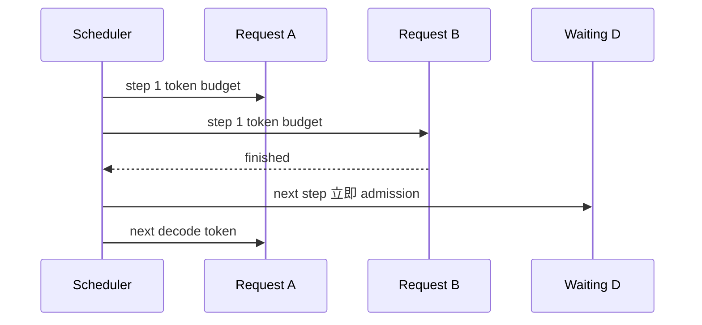

# 一次生成到底做什么：Prefill、Decode 与自回归循环

语言模型对序列 (x_1,ldots,x_T) 给出下一个 token 的条件分布：

$$
p(x_{T+1}\mid x_{1:T}) = \operatorname{softmax}(W h_T)
$$

采样出 (x_{T+1}) 后，它又成为下一轮输入的一部分。要生成 (K) 个 token，就至少存在 (K) 次数据依赖：第 (k+1) 个输出依赖第 (k) 个已经选定的结果。vLLM 优化每轮怎样组织计算，但不能删除这条因果依赖。

## 两个阶段

### Prefill：一次建立 prompt 的状态

给定 1000-token prompt，因果 mask 允许一次前向计算全部位置。每层 attention 为每个位置产生 key 和 value，并将它们保存到 KV Cache。

```text
输入:  x1 x2 x3 ... x1000
计算:  1000 个位置并行进入各层
保留:  每层每个位置的 K、V
输出:  最后位置的 logits，可采样第一个新 token
```

prefill 的矩阵较大，通常更容易利用 GPU 算力；长 prompt 的首 token 延迟主要在这里产生。

### Decode：复用历史，每轮追加一个位置

采样出新 token 后，只需要为新位置计算新的 Q/K/V。它的 query 仍要关注所有历史 key/value，所以必须读取不断增长的 KV Cache。

```text
step 1: prompt KV + token_1
step 2: prompt KV + token_1 KV + token_2
step 3: prompt KV + token_1..2 KV + token_3
```

每轮只处理少量新 token，矩阵乘法形状较窄；模型权重和历史 KV 的读取成本更突出。于是 decode 常表现为 memory-bandwidth-bound，而不是纯算力不足。

## 不使用 KV Cache 会怎样

如果第 1001 个位置到来时重新计算前 1000 个位置，第 1002 个位置又重算前 1001 个位置，总工作量会重复增长。KV Cache 让历史 K/V 成为可复用状态：

| 方法 | 新 token 到来时重算历史层输出？ | 保存的状态 |
| --- | --- | --- |
| 无 cache | 是 | 几乎无 |
| KV Cache | 否 | 每层历史 K/V |

代价是显存随活跃 token 总数线性增长。推理系统的核心矛盾由此出现：**缓存越多，并发潜力越大；但缓存本身占掉可用于并发的显存。**

## 从单请求到连续批处理

假设三条请求同时服务：

```text
A: prompt 800，预计输出 80
B: prompt 40，预计输出 10
C: prompt 200，预计输出 30
```

静态 batch 会让 B 完成后占着空槽，直到 A 也结束。continuous batching 在每个 step 重新决定参与者：B 完成后，等待队列中的 D 可以立刻加入。



因此 vLLM 的 batch 不是固定 `batch_size × sequence_length`。它更像一份每轮重写的施工单：哪些请求、各算几个位置、对应哪些物理 KV block。

## 当前 V1 的统一 token 模型

固定提交的 [`Scheduler.schedule()`](https://github.com/vllm-project/vllm/blob/61141ed265bfef41a0ca19e992567ea980919b96/vllm/v1/core/sched/scheduler.py#L417) 明确说明：调度器内部没有必须分开的“prefill phase”和“decode phase”。每条请求主要用两个计数表示差距：

```text
num_computed_tokens   已完成模型计算的位置数
num_tokens_with_spec  prompt + 已生成输出 + speculative token
待计算量              num_tokens_with_spec - num_computed_tokens
```

每个 step 让 `num_computed_tokens` 追赶目标。这个抽象同时覆盖：

- 普通 prefill：差距很大；
- chunked prefill：一次只追一段；
- decode：通常差一个新位置；
- speculative decoding：暂时多出几个候选位置；
- prefix caching：一部分 prompt 已被视为计算完成。

这是读 Scheduler 最重要的钥匙。

## Sampling 在哪里

模型 forward 产生 logits。sampling 根据 temperature、top-k、top-p、随机种子等规则选 token：

$$
p_i = \frac{\exp(z_i / \tau)}{\sum_j \exp(z_j / \tau)}
$$

temperature (	au\) 改变分布锐度，不改变 Scheduler 的资源预算单位。采样结果回到调度状态，满足 EOS、stop、长度等条件时结束，否则创建下一轮的待计算位置。

结构化输出和 speculative decoding 会影响允许选择的 token 或一次提出的候选数，但仍落回“执行 → 接受 token → 更新请求”的闭环。

## 一个手算练习

请求有 6 个 prompt token，目标生成 3 个 token，暂不考虑 chunk、prefix 与 speculation。

| 时刻 | 已知 token | 本轮新增计算位置 | KV 中有效位置 | 结果 |
| --- | ---: | ---: | ---: | --- |
| prefill 前 | 6 | 6 | 0 | 无 |
| prefill 后 | 6 | 6 | 6 | 采样 `y1` |
| decode 1 后 | 7 | 1 | 7 | 采样 `y2` |
| decode 2 后 | 8 | 1 | 8 | 采样 `y3`，结束 |

注意：采样出的 `y1` 在 prefill 后已经知道，但它对应的 K/V 要在下一轮执行模型时写入。区分“token 已被选中”和“该 token 的 KV 已计算”能解释 Scheduler 中多个计数为何不总相等。

## 常见误区

### “decode 每轮只算一个 token，所以很便宜”

每个请求只新增一个位置，但模型权重仍要经过各层，attention 还要读取历史 KV。并发足够大时可以把许多请求的新位置合并，提高硬件利用率。

### “prefill 越大越好”

超长 prefill 可以占据一次 step 很久，推高其他请求的 inter-token latency。chunked prefill 用时间切片换公平性和尾延迟控制。

### “batch size 就是同时在线请求数”

在线请求可能处于 waiting、running、preempted、等待远端 KV 等状态；本轮实际执行的序列和 token 数才决定 kernel 形状。

## 通关检查

1. 为什么 1000-token prompt 不等于 1000 次独立 decode？
2. 为什么生成 100 个 token 又不能压成一次普通 forward？
3. KV Cache 节省了什么计算，增加了什么资源？
4. `num_computed_tokens` 与“已经生成的 token 数”为什么不是同一概念？
5. continuous batching 与静态 batch 的补位时机有何不同？

答稳后进入[KV Cache 与 PagedAttention](./kv-cache)。
