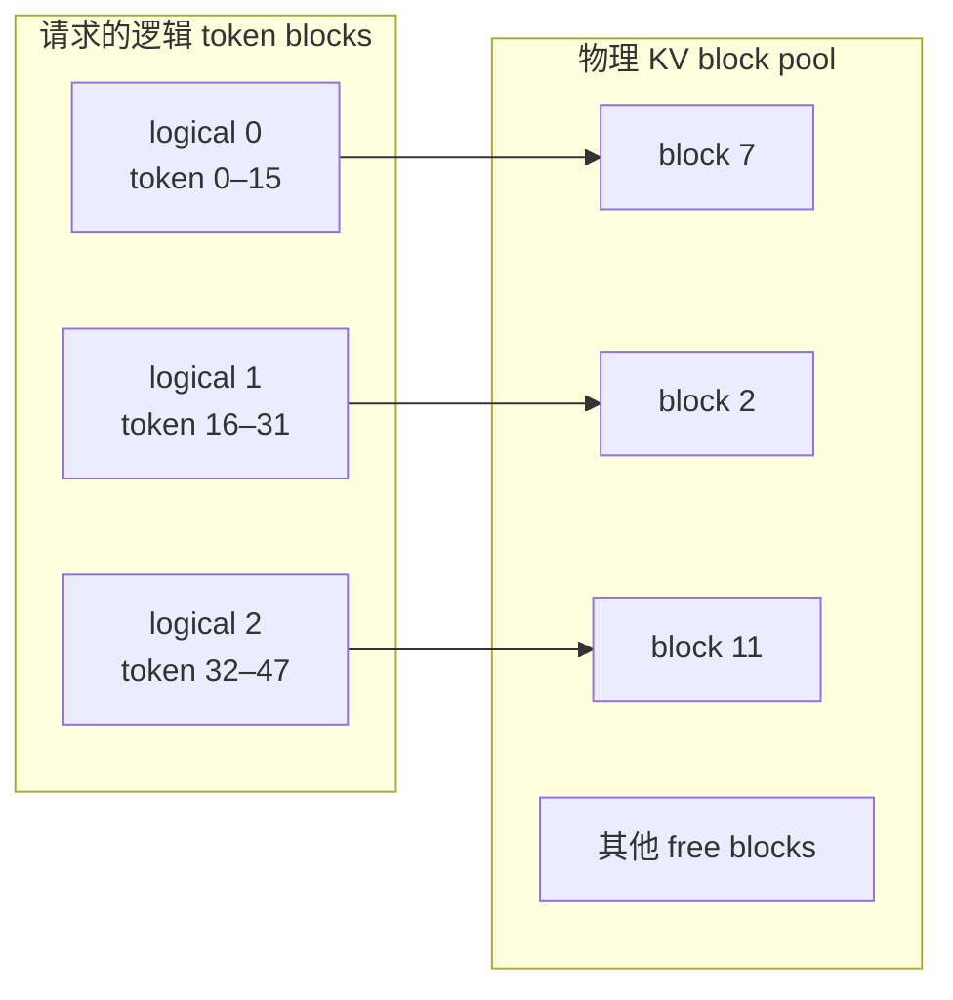
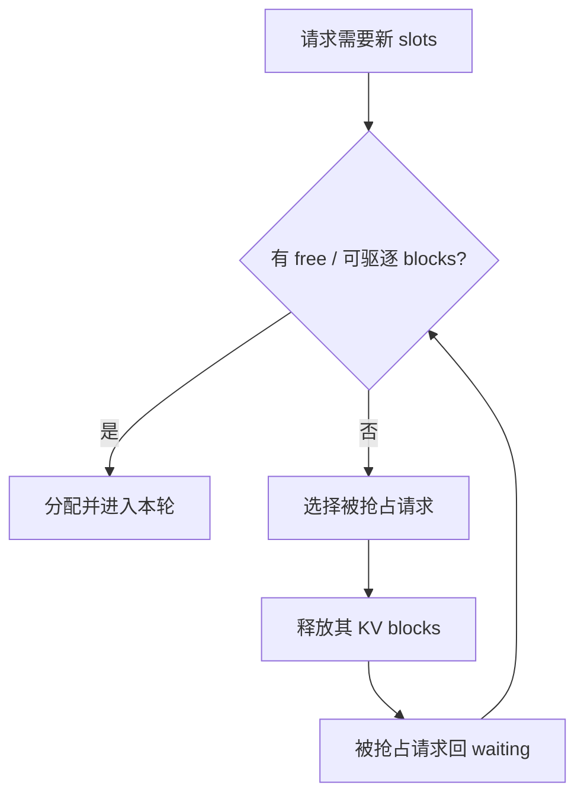

# KV Cache 与 PagedAttention：先算清显存，再理解分页

::: tip 共同基础
如果还不能解释“为什么只缓存 K/V、为什么 decode 每步仍读取全部历史”，先完成 [Transformer 与 KV Cache 共同基础](../../foundations/)；本页专注服务系统中的分页、复用和抢占。
:::

PagedAttention 常被概括为“像操作系统虚拟内存一样管理 KV Cache”。真正要掌握的不是比喻，而是三件事：一个 token 占多少 KV、为什么连续序列不必占连续物理内存、缓存 block 的所有权怎样随请求和共享前缀变化。

## 先算每个 token 的 KV

对 decoder-only Transformer，忽略对齐和 backend 差异，每个 token 的 KV 字节近似为：

$$
B_{token}=2\times L\times H_{kv}\times D_h\times B_{dtype}
$$

- (2\)：K 和 V；
- (L\)：层数；
- (H_{kv}\)：KV heads 数；
- (D_h\)：head dimension；
- (B_{dtype}\)：每元素字节数。

例如 32 层、8 个 KV heads、head dim 128、BF16：

$$
2\times32\times8\times128\times2=131072\text{ bytes}=128\text{ KiB/token}
$$

一条 8K-token 序列约需 1 GiB KV；100 条并发不可能都按 8K 完整预留。GQA/MQA 通过减少 (H_{kv}\) 显著降低缓存，而 query heads 数并不直接代入这条公式。

::: tip 先看模型 config
不要用“7B 模型每 token 固定多少 KB”这种经验值。层数、KV heads、head dim、KV dtype 和混合 attention 结构都会改变结果。
:::

## 连续预留为什么浪费

传统做法若为每个请求预留 `max_model_len`：

- 实际输出远短于上限时产生内部浪费；
- 不同长度请求结束和加入后留下外部碎片；
- 为了保持地址连续，扩容和搬移复杂；
- beam、parallel sampling、共享前缀难以复用相同物理 KV。

分页把序列按固定 token 数切成逻辑 block，再从全局空闲池分配任意物理 block。逻辑上相邻的两段可以位于完全不同的物理地址。



block table 保存这种映射；attention backend 根据 slot/block 信息找到历史 K/V。代价是多一层间接寻址，收益是按需增长、快速回收和可共享。

## block size 的含义

若 token block size 为 16，一条 35-token 序列需要 3 个 block。前两个满，最后一个只有 3 个有效 token。浪费上界被限制在末尾不到一个 block，而不是整个 `max_model_len`。

block 太大：

- 尾部浪费变大；
- prefix 命中与复用粒度变粗。

block 太小：

- block table 和管理元数据变多；
- kernel 地址处理和调度开销可能增加。

它是系统粒度，不是越小越先进。

## 当前 V1 的两层职责

[`KVCacheManager`](https://github.com/vllm-project/vllm/blob/61141ed265bfef41a0ca19e992567ea980919b96/vllm/v1/core/kv_cache_manager.py#L114) 站在请求视角：

- 找到可复用的 computed blocks；
- 为新 token 分配 slots；
- 在请求结束时释放；
- 将完成的 full blocks 注册为可缓存前缀。

[`BlockPool`](https://github.com/vllm-project/vllm/blob/61141ed265bfef41a0ca19e992567ea980919b96/vllm/v1/core/block_pool.py#L143) 站在物理池视角：

- 管理 free queue；
- 维护 block hash、引用计数与使用时间；
- touch、evict、free 物理 block。

模型侧还有真正的 KV tensor。不要把 EngineCore 中的 block 元数据当成 GPU KV 内容本身；前者负责“哪一格属于谁”，后者保存数值。

## Prefix Caching 怎样复用

自动前缀缓存为完整 token blocks 计算链式 hash。新请求到来时，从开头查找连续命中的 block：

```text
旧请求: [system 16][manual 16][question A ...]
新请求: [system 16][manual 16][question B ...]
命中:   block 0 + block 1
结果:   新请求从共享前缀之后继续 prefill
```

hash 必须包含足以区分缓存语义的信息，例如前一个 block hash、当前 token ids，以及可能影响计算的额外键。只凭文本字符串或单个 block 内容，无法安全表达顺序和配置上下文。

共享 block 使用引用计数。一个请求结束不代表物理 block 立即可驱逐；其他活跃请求仍引用它时必须保留。引用归零后，它可以留在 cache 中等待复用，也可以在内存压力下被回收。

### Prefix cache 不会做什么

- 不减少新输出 token 的 decode 次数；
- 不让两个“语义相似但 token 不同”的前缀命中；
- 不保证在低复用率负载上有显著收益；
- 权重或影响 KV 的配置变化后，旧 cache 不能被无条件沿用。

## 分配失败与 Preemption

Scheduler 为 running request 调用 [`allocate_slots()`](https://github.com/vllm-project/vllm/blob/61141ed265bfef41a0ca19e992567ea980919b96/vllm/v1/core/kv_cache_manager.py#L283)。若没有足够 block，它可能抢占低优先级或队尾请求，释放其 KV，之后再重算。



preemption 不是免费换内存：被释放的上下文未来要 recompute，会浪费算力并抬高延迟。频繁 preemption 说明并发、token budget、上下文长度或 KV 容量与负载不匹配。

## PagedAttention 的两个层次

“PagedAttention”在讨论中常混合：

1. **内存管理思想**：KV 按 block 分配、映射与共享；
2. **attention 执行**：kernel/backend 按 block table 从非连续 KV 中取数。

官方当前 [`paged_attention.md`](https://github.com/vllm-project/vllm/blob/61141ed265bfef41a0ca19e992567ea980919b96/docs/design/paged_attention.md) 已明确标注为历史 kernel 文档，不再代表所有今天的实际 backend。学习管理思想时可读论文；判断当前执行路径时必须看所选 attention backend 和模型配置。

## 实验：算出并发上限的第一版

假设：

```text
KV 可用显存: 40 GiB
KV bytes/token: 128 KiB
平均活跃上下文: 4096 tokens/request
```

理想化容量：

$$
\frac{40\times 2^{30}}{128\times 2^{10}}=327680\text{ tokens}
$$

$$
\frac{327680}{4096}\approx80\text{ requests}
$$

这只是上界。实际还要考虑 block 尾部、混合 KV groups、CUDA Graph、workspace、暂态峰值、调度限制和长度分布。容量规划应该用真实分布和压测校准，而不是把 80 当承诺值。

## 通关检查

1. MHA 换成 GQA 时，公式中哪个量变化？
2. 35 tokens、block size 16 至少占几个 block？
3. 逻辑相邻 block 为什么可以物理不连续？
4. prefix cache 命中为什么通常要求从序列开头连续？
5. free、evict、ref count 归零是同一件事吗？
6. 高频 preemption 为什么可能同时伤害吞吐和尾延迟？

下一课把缓存放回调度队列，理解[批处理、延迟与吞吐](./performance)。
