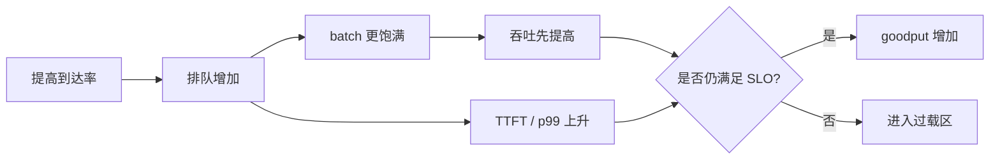

# 批处理、延迟与吞吐：推理服务的性能坐标系

“每秒多少 token”不能单独描述在线服务。把大量请求塞进 batch 往往提高设备利用率和总吞吐，却可能让每条请求排队更久、首 token 更慢、相邻 token 间隔更大。性能优化首先要选择坐标系。

## 五个核心指标

| 指标 | 定义 | 主要受什么影响 |
| --- | --- | --- |
| TTFT | 到达至首 token | 排队、tokenize、prefill、调度公平性 |
| ITL / TPOT | 相邻输出 token 的时间 | decode batch、权重/KV 带宽、通信、长 prefill 干扰 |
| E2E latency | 到达至完成 | TTFT + 所有 decode 间隔 + 输出处理 |
| request throughput | 每秒完成请求数 | 长度分布、并发、总 token 能力 |
| token throughput | 每秒处理的 input/output token | batch、模型、硬件、并行与 kernel |

对 (N\) 个输出 token，可近似：

$$
T_{e2e}\approx T_{TTFT}+(N-1)\times T_{ITL}
$$

所以长输出场景即使 TTFT 很好，ITL 略差也会累计成明显 E2E 延迟。

## Goodput：满足 SLO 的吞吐

若 100 req/s 中只有 60 req/s 满足 `TTFT < 1s` 且 `ITL < 50ms`，业务真正可用的不是 100，而是 60 req/s goodput。容量边界通常出现在尾延迟快速上升的位置，而不是服务器终于报错的位置。



压测必须扫描到达率或并发，而不是只测一个“最大吞吐”点。

## Continuous batching 做了什么

传统静态 batch 在开始后成员固定，短请求完成也要等长请求。continuous batching 每个调度 step 重组工作：

- running 请求继续 decode；
- waiting 请求在有预算和 KV slots 时加入；
- 长 prefill 可被切成 chunk；
- 完成、停止或被抢占的请求离开；
- 新请求补位。

这提高了利用率，但 Scheduler 必须在**吞吐、延迟、公平性和显存**之间做持续选择。

## Token budget 比 batch size 更准确

当前 Scheduler 用 `max_num_batched_tokens` 一类预算限制一次 step 的新计算 token 总量，用 `max_num_seqs` 限制序列数。两个 step 都有 16 条请求，工作量可能完全不同：

```text
step A: 16 条 decode，各 1 token → 16 scheduled tokens
step B: 15 条 decode + 1 条 4096 prefill → 4111 scheduled tokens
```

只看“batch=16”无法解释 kernel 时间和 ITL 抖动。

### 增大 token budget 的常见方向

- 更大的 prefill/chunk 能进入一次执行，可能提高吞吐；
- 单 step 变长，decode 请求等待更久，ITL 可能变差；
- 中间张量和执行空间需求可能上升；
- 具体收益受模型、backend、硬件和长度分布限制。

### 增大 max sequences 的常见方向

- decode batch 更宽，可能提高权重读取摊销；
- 活跃 KV 增多，显存压力和 preemption 风险上升；
- CPU 调度、采样和输出处理开销也会上升。

“增大并发”不是无条件加速，而是把更多独立工作放进系统，直到某个资源先饱和。

## Prefill 与 Decode 的资源形态

粗略地说：

- **prefill**：token 维度大，矩阵乘法更饱满，常偏 compute-bound；
- **decode**：每请求新增位置少，反复读取权重和 KV，常偏 bandwidth-bound。

但不要把它当定律。短 prompt、极大 batch、MoE、量化、长上下文、不同 attention backend 和跨 GPU 通信都会改变瓶颈。判断要靠 profiler 和指标。

## 排队为什么会突然恶化

当平均到达工作量接近服务能力，少量随机波动就会累积队列。请求的 token 长度不是常数，长尾输出尤其容易造成 head-of-line pressure。过载保护应考虑：

- 限制并发/队列长度；
- 设置超时和取消；
- 按预测 token 成本或优先级 admission；
- 扩 replica（DP）或路由不同模型；
- 在 SLO 边界前触发 autoscaling。

## 三种负载的预测

### 长输入、短输出

主要关注 TTFT、prefill throughput、chunked prefill 和 prefix reuse。若共享前缀高，APC 可能显著减少 prefill。

### 短输入、长输出

主要关注 ITL、decode token throughput、并发 decode 数、权重/KV 带宽。prefix cache 影响较小。

### 长输入、长输出

权重、KV 容量、prefill 干扰和 decode 总时长都重要。单一参数通常无法同时优化 TTFT 与 ITL，需要明确业务优先级。

## 最小性能实验表

每轮只改一个服务参数或负载维度：

| run | request rate | input/output 分布 | concurrency | TTFT p50/p99 | ITL p50/p99 | output tok/s | preemption |
| --- | ---: | --- | ---: | ---: | ---: | ---: | ---: |
| baseline | 1 | fixed 512/128 | 1 |  |  |  |  |
| load-1 | 4 | same |  |  |  |  |  |
| load-2 | 8 | same |  |  |  |  |  |

同时保存完整服务命令、commit、模型 revision、GPU、driver、并行布局和随机种子。没有这些，结果无法解释，更无法比较。

## 症状到假设

| 症状 | 第一批可验证假设 |
| --- | --- |
| TTFT 高、ITL 正常 | 排队；长 prefill；tokenize/模板；prefix miss |
| TTFT 正常、ITL 高 | decode batch/通信；KV 读取；CPU output；过多同步 |
| 两者都高、GPU 低 | 请求供给不足；CPU 瓶颈；同步/网络；配置导致小 batch |
| 吞吐高、p99 崩坏 | 进入过载；长尾长度；调度不公平；频繁 preemption |
| OOM 但 KV 利用看似不满 | graph/workspace/activation 峰值；其他进程；并行布局 |

这些是实验起点，不是看到症状就直接改参数的处方。

## 通关检查

1. token throughput 提高为何不保证 TTFT 降低？
2. `max_num_batched_tokens` 和 `max_num_seqs` 各限制什么？
3. 为什么要同时报告 p50 和 p99？
4. 哪类负载最可能从 prefix caching 获益？
5. 什么是 goodput，它为什么比最大吞吐更接近容量？

接下来用这些指标跑[第一台服务](../practice/first-server)，让心智模型接受真实日志校验。
