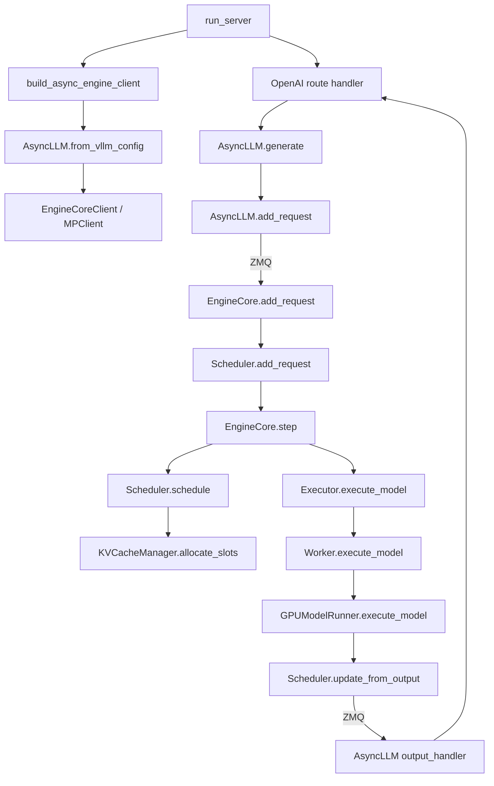

# vLLM V1 源码地图

第一遍读 vLLM 只需要一条竖切面：**一个文本请求怎样被转换、入队、调度、执行、采样并流回客户端。**模型适配、量化、几十种 attention backend 都先挂在地图边缘，等主线需要时再展开。

## 八层地图

| 层 | 固定提交中的代码 | 第一遍只问什么 |
| --- | --- | --- |
| CLI | [`vllm/entrypoints/cli/`](https://github.com/vllm-project/vllm/tree/61141ed265bfef41a0ca19e992567ea980919b96/vllm/entrypoints/cli) | `vllm serve` 如何形成参数对象？ |
| HTTP | [`api_server.py`](https://github.com/vllm-project/vllm/blob/61141ed265bfef41a0ca19e992567ea980919b96/vllm/entrypoints/openai/api_server.py#L117) | 谁创建 engine client 和 FastAPI app？ |
| 前端引擎 | [`async_llm.py`](https://github.com/vllm-project/vllm/blob/61141ed265bfef41a0ca19e992567ea980919b96/vllm/v1/engine/async_llm.py#L70) | 输入怎样成为 EngineCoreRequest，输出怎样回到请求队列？ |
| 跨进程客户端 | [`core_client.py`](https://github.com/vllm-project/vllm/blob/61141ed265bfef41a0ca19e992567ea980919b96/vllm/v1/engine/core_client.py#L467) | 前端如何通过 ZMQ 与核心通信？ |
| 核心循环 | [`core.py`](https://github.com/vllm-project/vllm/blob/61141ed265bfef41a0ca19e992567ea980919b96/vllm/v1/engine/core.py#L97) | 一轮 schedule → execute → update 在哪里？ |
| 调度与缓存 | [`scheduler.py`](https://github.com/vllm-project/vllm/blob/61141ed265bfef41a0ca19e992567ea980919b96/vllm/v1/core/sched/scheduler.py#L417)、[`kv_cache_manager.py`](https://github.com/vllm-project/vllm/blob/61141ed265bfef41a0ca19e992567ea980919b96/vllm/v1/core/kv_cache_manager.py#L114) | 本轮 token 与 block 如何决定？ |
| 执行层 | [`vllm/v1/executor/`](https://github.com/vllm-project/vllm/tree/61141ed265bfef41a0ca19e992567ea980919b96/vllm/v1/executor) | 单进程、多进程、Ray 如何统一成调用接口？ |
| 设备执行 | [`gpu_worker.py`](https://github.com/vllm-project/vllm/blob/61141ed265bfef41a0ca19e992567ea980919b96/vllm/v1/worker/gpu_worker.py#L130)、[Runner V1](https://github.com/vllm-project/vllm/blob/61141ed265bfef41a0ca19e992567ea980919b96/vllm/v1/worker/gpu_model_runner.py#L446)、[Runner V2](https://github.com/vllm-project/vllm/blob/61141ed265bfef41a0ca19e992567ea980919b96/vllm/v1/worker/gpu/model_runner.py#L120) | 这一版实际选哪个 Runner，输入张量、KV 和采样如何落到 GPU？ |

## 最短调用脊柱



当前提交中的关键锚点：

- `AsyncLLM.generate()`：[`async_llm.py:524`](https://github.com/vllm-project/vllm/blob/61141ed265bfef41a0ca19e992567ea980919b96/vllm/v1/engine/async_llm.py#L524)
- `EngineCore.add_request()`：[`core.py:430`](https://github.com/vllm-project/vllm/blob/61141ed265bfef41a0ca19e992567ea980919b96/vllm/v1/engine/core.py#L430)
- `EngineCore.step()`：[`core.py:546`](https://github.com/vllm-project/vllm/blob/61141ed265bfef41a0ca19e992567ea980919b96/vllm/v1/engine/core.py#L546)
- `Scheduler.schedule()`：[`scheduler.py:417`](https://github.com/vllm-project/vllm/blob/61141ed265bfef41a0ca19e992567ea980919b96/vllm/v1/core/sched/scheduler.py#L417)
- `KVCacheManager.allocate_slots()`：[`kv_cache_manager.py:283`](https://github.com/vllm-project/vllm/blob/61141ed265bfef41a0ca19e992567ea980919b96/vllm/v1/core/kv_cache_manager.py#L283)
- `Scheduler.update_from_output()`：[`scheduler.py:1533`](https://github.com/vllm-project/vllm/blob/61141ed265bfef41a0ca19e992567ea980919b96/vllm/v1/core/sched/scheduler.py#L1533)

## 五种不要混淆的“block”

| 名称 | 所在层 | 含义 |
| --- | --- | --- |
| token block | 调度/缓存 | 固定数量 token 的 KV 分配单位 |
| logical block | 请求视角 | 序列第 0、1、2…段 |
| physical block | 缓存池 | 真正占用设备 KV 存储的 block id |
| CUDA thread block | kernel | 一组共享 shared memory 的 GPU threads |
| Transformer block | 模型 | attention + MLP 等组成的一层 |

看到 `block_size` 时先确定语境。把 token block 和 thread block 混在一起，会让 PagedAttention 的解释完全失真。

## 三轮阅读法

### 第一轮：只看接口与所有权

每个类只读构造函数、公开方法和字段类型。记录：

```text
对象：Scheduler
所属进程：EngineCore
持有：running / waiting / requests / KVCacheManager
输入：Request、ModelRunnerOutput
输出：SchedulerOutput、EngineCoreOutputs
```

遇到 backend 分支先跳过。第一轮的目标是知道“状态归谁管”。

### 第二轮：只追一个请求

选择 `max_tokens=3`、无 LoRA、无 multimodal、无 speculative、DP=TP=PP=1 的路径。对每个 step 记录：

```text
num_prompt_tokens
num_computed_tokens
num_tokens_with_spec
num_scheduled_tokens
allocated block ids
sampled token id
request status
```

这些字段能解释主循环，等主线稳定后再逐个打开 feature branch。

### 第三轮：主动加入一个复杂因素

按兴趣只选一个：prefix caching、chunked prefill、speculative decoding、TP 或 disaggregated prefill。比较它改变了哪个数据契约，而不是重新读全仓库。

## 本地检索命令

```bash
cd /path/to/vllm

rg -n 'class (AsyncLLM|EngineCore|Scheduler|KVCacheManager)' vllm/v1
rg -n 'def (generate|add_request|step|schedule|allocate_slots|execute_model)' vllm/v1
rg -n 'EngineCoreRequest|SchedulerOutput|ModelRunnerOutput|EngineCoreOutput' vllm/v1
```

当你准备改一个函数时，先找所有调用者：

```bash
rg -n 'allocate_slots\(' vllm tests
```

Scheduler 与缓存状态互相约束，局部看起来合理的改动可能破坏 preemption、prefix ref count 或异步执行路径。

## 哪些目录第一遍先不读

- `csrc/`：除非目标是 kernel；
- 所有模型实现：先只选一个熟悉的 decoder-only 模型；
- 所有量化 backend：先理解加载与执行接口；
- multimodal、pooling、speech：先走纯文本 generate；
- 各种 KV connector：先掌握本地 KV block 生命周期；
- legacy `vllm/engine/`：除非在迁移旧资料或定位兼容行为。

这不是说它们不重要，而是主线还没建立时，同时展开只会让目录结构替代系统理解。

## 通关检查

关闭本页，尝试从记忆写出十个箭头：

```text
HTTP → ? → ? → Scheduler → ? → Executor → ? → ModelRunner → ? → stream
```

再给每个箭头标注是否跨进程、传递什么对象。先读[一条请求的生命周期](../internals/request-lifecycle)建立阶段感，再用[固定提交完整调用链](../internals/full-code-path)逐站核对调用条件、输入输出、状态变化和源码行号。
