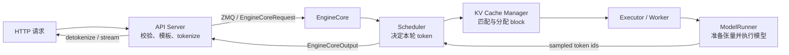

# 从这里开始：把 vLLM 看成一台持续运转的 token 工厂

如果把 vLLM 理解成“一个更快的 `model.generate()`”，后面会被 `Scheduler`、block table、EngineCore、Worker、CUDA Graph 和各种并行参数淹没。更准确的起点是：**vLLM 是一台长期运行的 token 工厂，它每个调度步都从所有活跃请求中挑选一批 token 位置，共享一次模型执行。**

本站绑定 vLLM 提交 [`61141ed`](https://github.com/vllm-project/vllm/tree/61141ed265bfef41a0ca19e992567ea980919b96)，以 **V1 online serving** 为主线。历史 V0 资料只用于比较，不拿来解释当前进程结构。

## 先回答四个问题

不查资料，试着口头回答：

| 问题 | 真正考察的概念 | 答不上从哪里开始 |
| --- | --- | --- |
| 为什么 prompt 的 1000 个 token 通常一次前向，而生成的 100 个 token 要约 100 次？ | prefill 与 decode | [一次生成到底做什么](./fundamentals/inference-loop) |
| 两条长度不同的请求为什么还能放进同一次模型执行？ | continuous batching 与 token budget | [批处理、延迟与吞吐](./fundamentals/performance) |
| KV Cache 为什么不能简单地给每个请求预留 `max_model_len`？ | 动态长度、碎片与分页 | [KV Cache 与 PagedAttention](./fundamentals/kv-cache) |
| HTTP 服务、Scheduler 和执行模型的代码为什么不在同一进程？ | 前端、控制面与计算面解耦 | [V1 多进程架构](./internals/architecture) |

如果四题都模糊，不要先看 CUDA kernel。kernel 是最后执行“怎么算”的地方，而初学者最容易缺的是“这一轮为什么算这些 token、它们的缓存在哪里”。

## 一条请求的全局闭环

这张图里有两条循环：

- **控制循环**：`Scheduler → allocate slots → execute → update`，决定下一步谁能继续算。
- **请求循环**：输出 token 回到前端，解码成文本并流式发送，未结束的请求留在控制循环中。

一次请求不是“被某个 Worker 从头处理到尾”。它会在许多个 step 中反复进入动态 batch；同一 step 的邻居请求也会不断变化。

## vLLM 真正优化了什么

vLLM 不改变语言模型的概率定义。给定相同模型、输入和采样条件，它仍然做自回归生成。它主要优化系统执行：

1. **分页管理 KV Cache**：按固定 token block 分配物理缓存，不按最大长度整段预留。
2. **连续批处理**：请求完成后立即让新请求补位，不等待整批一起结束。
3. **token 级调度**：prefill、decode、chunked prefill 和 speculative token 都统一成“本 step 计算多少个尚未计算的位置”。
4. **高效模型执行**：attention backend、融合 kernel、`torch.compile`、CUDA Graph、量化与并行执行。
5. **前后端解耦**：API Server 处理 HTTP 和输入输出；EngineCore 专注调度与缓存；Worker 专注设备执行。

::: warning 不要把 PagedAttention 当成全部答案
PagedAttention 解决的是 KV Cache 的地址和分配问题。吞吐还受模型权重读带宽、batch 形状、调度预算、采样、CPU 前后处理、网络和并行通信影响。
:::

## 五个通关站点

| 站点 | 学习任务 | 必须留下的证据 |
| --- | --- | --- |
| 00 定位 | 固定版本，建立全局闭环 | 一张手画请求路径 |
| 01 地基 | 理解 prefill/decode、KV Cache 和 batch | 能手算一条请求的 KV 占用 |
| 02 实验 | 启服务、发请求、采指标、做基线 | 命令、请求数据、原始结果 JSON |
| 03 源码 | 沿一个 request id 追完 V1 | 文件、函数、跨进程消息和状态变化 |
| 04 生产 | 根据 TTFT/ITL/吞吐定位瓶颈 | 一份负载假设、容量边界与回退方案 |

完整安排见[学习地图与版本边界](./guide/learning-path)。如果你已经在线上使用 vLLM，可先跑[基准测试](./practice/benchmark)，再按暴露出的瓶颈回补课程。

## 读源码时只追五个对象

第一遍不要遍历类层次。只记录：

- `EngineCoreRequest`：前端交给核心的请求契约；
- `Request`：调度器维护的请求状态；
- `SchedulerOutput`：本轮“算谁、算多少、用哪些 block”；
- `ModelRunnerOutput`：设备执行和采样的结果；
- `EngineCoreOutput`：回给前端的增量 token 与结束信息。

对每个对象问四件事：谁创建、谁修改、在哪个进程、何时失效。能够回答这些问题，比记住几十个配置项更接近“会改框架”。

## 通关检查

学完整站后，你应能不看网页解释：

- prefill 和 decode 的计算形态为何不同；
- Scheduler 为什么按 token budget 而不是静态 batch size 工作；
- block table 如何让逻辑连续序列映射到离散物理 KV block；
- API Server、EngineCore、Worker 的数量怎样由 DP/TP/PP 决定；
- prefix caching 为什么只省 prefill，不会自动降低长输出的 decode 时间；
- TTFT 高、ITL 高、吞吐低分别先查什么；
- OOM、preemption 和低 GPU 利用率可能分别由哪条资源链触发。

现在先打开[一次生成到底做什么](./fundamentals/inference-loop)，把模型推理的时间轴装进脑中。
