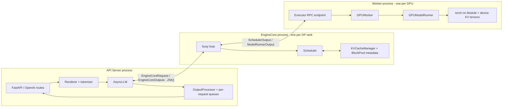
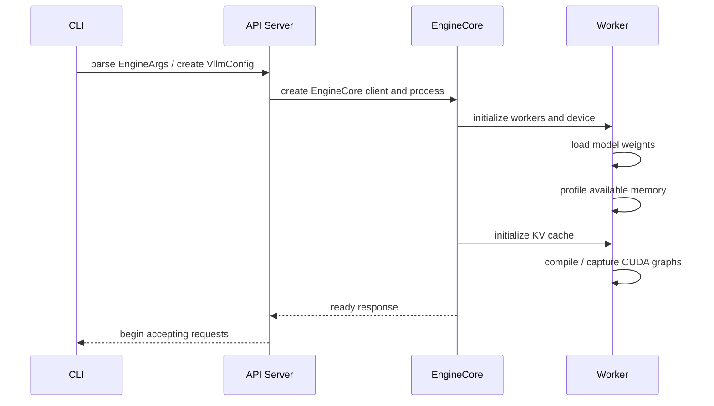

# vLLM V1 多进程架构

理解 vLLM 的关键不是记住类图，而是给每份可变状态找唯一主人。V1 把 HTTP 与输入输出处理放在前端进程，把调度与 KV 元数据放在 EngineCore，把权重和设备执行放在 GPU Worker。这样慢客户端、tokenization 和网络流式输出不会直接占住核心调度循环。

## 一张所有权图



注意 KV Cache 有两种“所有权”：EngineCore 管 block 分配、引用和请求到 block 的映射；Worker 持有真正的设备 tensor 并按 block id 读写。把元数据与显存实体区分开，很多源码字段会突然清晰。

## 五个角色，不是五个同义词

| 角色 | 拥有什么 | 不负责什么 | 固定源码入口 |
| --- | --- | --- | --- |
| API Server | HTTP 生命周期、输入渲染、tokenization、流式响应 | 决定本轮 GPU batch | [`api_server.py`](https://github.com/vllm-project/vllm/blob/61141ed265bfef41a0ca19e992567ea980919b96/vllm/entrypoints/openai/api_server.py#L746) |
| `AsyncLLM` | 每请求输出队列、前端 OutputProcessor、Core client | 模型 forward | [`async_llm.py`](https://github.com/vllm-project/vllm/blob/61141ed265bfef41a0ca19e992567ea980919b96/vllm/v1/engine/async_llm.py#L70) |
| EngineCore | Scheduler、KV 元数据、核心 busy loop | detokenize 和 HTTP backpressure | [`core.py`](https://github.com/vllm-project/vllm/blob/61141ed265bfef41a0ca19e992567ea980919b96/vllm/v1/engine/core.py#L97) |
| Executor | 把同一逻辑操作分发到一个或多个 worker | 调度请求优先级 | [`abstract.py`](https://github.com/vllm-project/vllm/blob/61141ed265bfef41a0ca19e992567ea980919b96/vllm/v1/executor/abstract.py#L70) |
| GPU Worker / Runner | 设备、权重、KV tensor、输入 batch、forward 与采样 | HTTP schema | [`gpu_worker.py`](https://github.com/vllm-project/vllm/blob/61141ed265bfef41a0ca19e992567ea980919b96/vllm/v1/worker/gpu_worker.py#L130) |

### “单一控制器”要精确表述

对一个 DP rank，EngineCore 中的 Scheduler 是请求状态与 KV 分配的集中控制点；Worker 执行它产出的 `SchedulerOutput`，不会各自挑请求。但 `DP > 1` 时，每个 rank 都有自己的 EngineCore、Scheduler 和独立 KV cache，所以整个部署并不是一个全局 Scheduler。API 层或外部路由器还要决定请求落到哪个 rank。

这项边界解释了一个生产现象：相同 system prompt 的请求若被随机分散到四个 DP rank，四份独立 prefix cache 的命中率可能都不高。

## 进程数怎么算

定义：

- `A`：API server count，默认随 DP 扩展；
- `D`：data parallel size；
- `T`：tensor parallel size；
- `P`：pipeline parallel size；
- GPU worker 数 `N = D × T × P`。

则官方 V1 架构给出的总数是：

$$
N_{proc} = A + D + DTP + \mathbb{1}[D>1]
$$

最后一项是 DP Coordinator。例子：

| 配置 | API | Core | Worker | Coordinator | 合计 |
| --- | ---: | ---: | ---: | ---: | ---: |
| TP=1, PP=1, DP=1 | 1 | 1 | 1 | 0 | 3 |
| TP=4, DP=1 | 1 | 1 | 4 | 0 | 6 |
| TP=2, DP=4，默认 A=4 | 4 | 4 | 8 | 1 | 17 |

这不是纯理论：容器的 PID limit、CPU 核数、tokenizer/media 线程和共享内存都要按实际进程拓扑规划。

## 模块化后端发生在哪一层

EngineCore 依赖抽象 `Executor`，而不是把 multiprocessing 或 Ray 写进 Scheduler：

```text
Executor interface
├── UniProcExecutor       单 worker / 本地直接调用
├── MultiprocExecutor     本机多进程
└── RayDistributedExecutor Ray actors / 跨节点资源编排
```

三个后端都要提供初始化、内存探测、KV 初始化、模型执行等统一操作。Scheduler 仍输出同一种 `SchedulerOutput`。这就是可用的模块化边界：**控制面语义稳定，执行面的传输机制可替换。**

不要据此推断后端性能完全等价。Ray 会改变 actor 创建、资源放置、序列化与故障边界；multiprocessing 依赖本机进程与 IPC。接口统一只意味着上层不用复制调度算法。

## 启动阶段为什么比请求阶段复杂

服务 ready 之前大致经过：



`GPUWorker.determine_available_memory()` 通过 profile 估算可给 KV cache 的空间；因此同一张 GPU 上的其他进程、模型配置和 graph capture 都可能改变缓存容量。当前优化文档允许把日志给出的 `--kv-cache-memory` 回填以跳过重复 profile，但这个数只对相同硬件与初始空闲显存有意义。

源码锚点：[`load_model()`](https://github.com/vllm-project/vllm/blob/61141ed265bfef41a0ca19e992567ea980919b96/vllm/v1/worker/gpu_worker.py#L424)、[`determine_available_memory()`](https://github.com/vllm-project/vllm/blob/61141ed265bfef41a0ca19e992567ea980919b96/vllm/v1/worker/gpu_worker.py#L448)。

## 通信契约比调用栈更重要

跨 API/Core 的主要数据对象是：

| 方向 | 数据 | 为什么不直接传 Python 生成器 |
| --- | --- | --- |
| 前端 → Core | `EngineCoreRequest` | 是可序列化的数据契约，含 token ids、采样参数、到达时间、LoRA/多模态元数据等 |
| Core → 前端 | `EngineCoreOutputs` | 一轮可包含多个请求的增量 token、结束原因和调度统计 |
| Core → Worker | `SchedulerOutput` | 描述本轮新增/运行请求、scheduled token 数、block id 与 feature metadata |
| Worker → Core | `ModelRunnerOutput` | sampled token、logprob、事件与可选 draft 数据 |

ZMQ 把 API event loop 与 Core busy loop 解耦。前端慢并不意味着 GPU 必须跟着一个 HTTP coroutine 同步执行；输出处理器把 Core 输出再路由到每请求 queue。

## 故障定位按边界切

| 现象 | 最可能先看哪层 |
| --- | --- |
| 422 / chat schema 错误 | API route / renderer |
| tokenization CPU 满 | API process 与 tokenizer 线程 |
| waiting 持续增加 | 路由容量、Scheduler 或服务已饱和 |
| preemption / KV usage 逼近 1 | Core 的 KV 预算和长度/并发分布 |
| NCCL hang | Executor / Worker 并行 group |
| kernel illegal access | ModelRunner / attention backend / custom op |
| 客户端断开后仍占资源 | cancellation → abort 跨前端/Core 链路 |

## 源码练习

1. 从 [`build_async_engine_client()`](https://github.com/vllm-project/vllm/blob/61141ed265bfef41a0ca19e992567ea980919b96/vllm/entrypoints/openai/api_server.py#L117) 找到 `AsyncEngineArgs → VllmConfig → AsyncLLM`。
2. 在 [`EngineCoreProc.run_busy_loop()`](https://github.com/vllm-project/vllm/blob/61141ed265bfef41a0ca19e992567ea980919b96/vllm/v1/engine/core.py#L1326) 标出“收输入”和“执行 step”两段。
3. 对比 [`UniProcExecutor`](https://github.com/vllm-project/vllm/blob/61141ed265bfef41a0ca19e992567ea980919b96/vllm/v1/executor/uniproc_executor.py#L45)、[`MultiprocExecutor`](https://github.com/vllm-project/vllm/blob/61141ed265bfef41a0ca19e992567ea980919b96/vllm/v1/executor/multiproc_executor.py#L103) 与 [`RayDistributedExecutor`](https://github.com/vllm-project/vllm/blob/61141ed265bfef41a0ca19e992567ea980919b96/vllm/v1/executor/ray_executor.py#L64) 的 `execute_model()`，只记录调用如何到 worker，不展开 kernel。

## 通关标准

不用看图，画出 API、Core 和 Worker 三个进程框，并把 tokenizer、Scheduler、KV block metadata、真实 KV tensor、权重和 detokenizer 放到正确框里。再解释 DP=4 为什么有四个 Scheduler。下一节沿[一条请求的生命周期](./request-lifecycle)把这些边界连起来。
