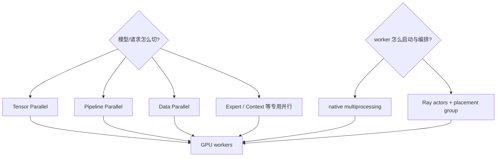
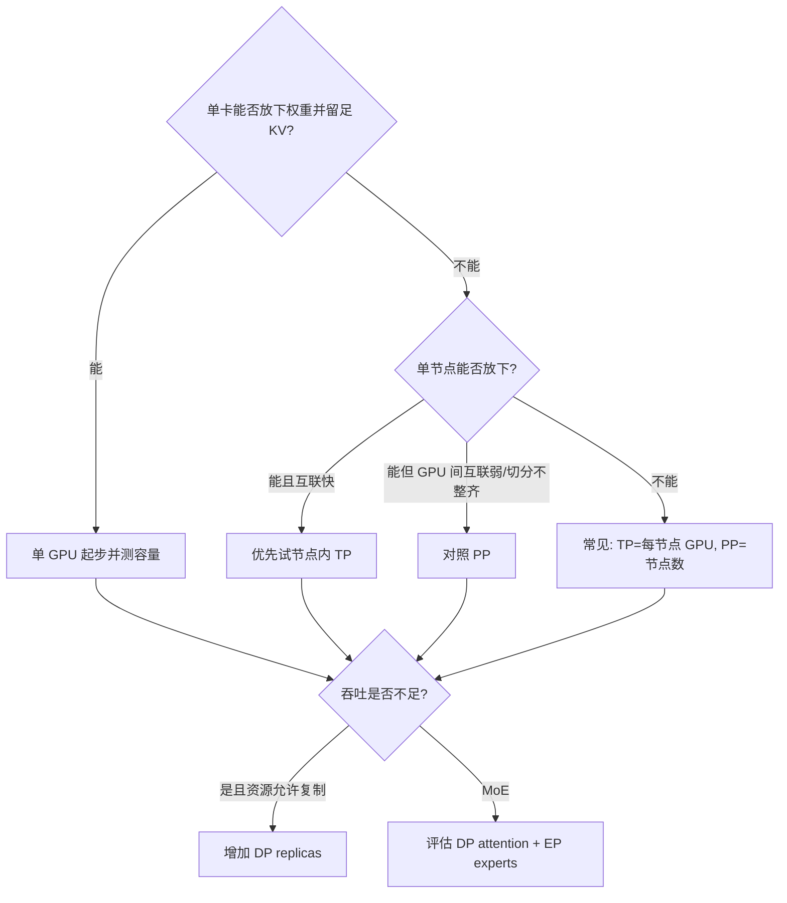
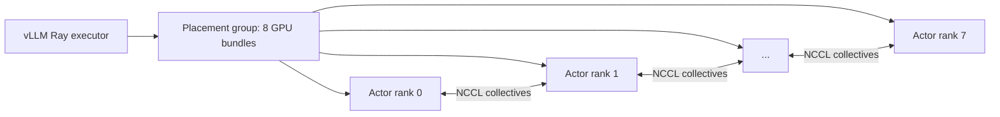
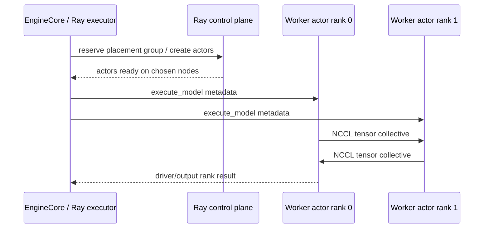

# TP、PP、DP、Ray 与多节点 vLLM

先给结论：**Ray 主要解决跨节点的进程资源编排和远程调用，不替你选择并行算法，也不替 NCCL 搬运每层 tensor。**TP、PP、DP/EP 决定模型和请求怎样切；Ray 或 multiprocessing 决定这些 worker 进程怎样被创建、放置和调用。

## 两个正交问题



因此“用了 Ray”不能回答模型是否被 TP 切开；“TP=8”也不能回答 worker 是本机进程还是 Ray actor。

## 四种并行各在解决什么

| 策略 | 切分/复制对象 | 主要通信 | 主要收益 | 典型代价 |
| --- | --- | --- | --- | --- |
| TP | 每层权重和中间张量 | 每层 collective | 单卡放不下；降低每卡权重占用 | 高频通信，对互联敏感 |
| PP | 按层切成 stages | stage 间激活传输 | 跨节点容纳更大模型；可不均匀切层 | pipeline bubble、单请求延迟/调度复杂度 |
| DP | 完整模型副本/一组 TP×PP replica | dense 模型请求可独立；MoE 可能需同步 | 增加请求吞吐和隔离 | 权重复制、独立 KV cache、路由问题 |
| EP | MoE experts | token dispatch / combine collective | 利用稀疏专家结构 | 负载不均与 all-to-all 成本 |

总 GPU 数通常满足：

$$
N_{GPU}=DP\times PP\times TP
$$

EP 的 group 可能与 DP×TP 组合，不能再简单当作额外相乘的独立维度。

## 最小决策树



这是起点，不是定律。TP 是否能整除 attention heads、网络拓扑、量化 backend、上下文长度和 batch 形状都会改变最优解。最终必须用真实负载比较 TTFT、ITL、goodput 与成本。

## TP：一个模型副本内的层内协作

命令示例：

```bash
vllm serve /models/my-model \
  --tensor-parallel-size 4
```

同一逻辑 forward 的四个 worker 按 rank 运行模型分片。线性层与 attention 的具体切法依模型实现，层间常发生 all-reduce、all-gather 或 reduce-scatter。TP 增加可能：

- 让模型权重终于放得下；
- 每卡释放空间给 KV cache；
- 也可能因 collective 开销让小模型或小 batch 更慢。

节点内 NVLink/NVSwitch 通常比跨节点网络更适合高频 TP collective。若跨节点直接 TP=16，先证明网络、GPUDirect RDMA 和 NCCL 拓扑真的能支撑，而不是因为“GPU 总数刚好 16”。

## PP：按层切，降低跨节点通信频率

两节点、每节点 8 GPU 的常见起点：

```bash
vllm serve /models/large-model \
  --tensor-parallel-size 8 \
  --pipeline-parallel-size 2 \
  --distributed-executor-backend ray
```

每个 stage 内做节点内 TP，stage 之间传 activation。相较跨节点 TP，这通常减少跨节点每层 collective，但引入 pipeline stage 等待和调度约束。官方当前指南也建议模型跨节点时从“TP=每节点 GPU、PP=节点数”起步。

PP 还适合 GPU 之间缺少高速互联或层数不能均匀适配 TP 的情况；但对低并发、强延迟目标，要实际测 bubble 与 stage 不均衡。

## DP：复制引擎，而不是切一条请求

```bash
vllm serve /models/my-model \
  --data-parallel-size 4 \
  --tensor-parallel-size 2
```

这会形成四个 engine core，每个 core 驱动两个 TP worker。`--max-num-seqs` 等容量参数通常按 DP rank 生效。每个 rank 有独立 Scheduler 与 KV cache；API 层进行内部负载均衡。

DP 的路由目标不能只看 request count：

- 长 prompt 与短 prompt 成本不同；
- rank 的 running/waiting 和 KV occupancy 不同；
- prefix 相似性影响缓存命中；
- MoE 时空闲 rank 也可能为 collective 做 dummy forward。

大规模部署可采用内部、每节点 hybrid 或外部 load balancing。当前固定源码的详细模式见[官方 DP 部署文档](https://github.com/vllm-project/vllm/blob/61141ed265bfef41a0ca19e992567ea980919b96/docs/serving/data_parallel_deployment.md)。

## Ray 的最小心智模型

Ray Core 有四个与 vLLM 最相关的概念：

| Ray 概念 | 含义 | 在 vLLM 中的直觉映射 |
| --- | --- | --- |
| logical resources | 节点声明的 CPU/GPU/custom resource 数量 | 判断 worker 能放在哪个节点/GPU |
| actor | 有状态、专属 Python worker process；方法在同一进程执行 | 包装一个长期存活的 vLLM GPU Worker |
| placement group | 原子预留一组 resource bundles，可 PACK/SPREAD | 一次为整组 TP×PP workers 做 gang reservation |
| driver | 连接集群并创建 actors/placement group 的程序 | 启动 vLLM executor 的进程一侧 |

Ray head node 运行集群控制组件，worker nodes 承载任务/actors。Ray 的 `GPU: 1` 是调度资源标签，不是性能隔离或显存配额；actor 内仍由 CUDA/vLLM 绑定实际设备。

官方进一步阅读：[Ray Key Concepts](https://docs.ray.io/en/latest/ray-core/key-concepts.html)、[Actors](https://docs.ray.io/en/latest/ray-core/actors.html)、[Placement Groups](https://docs.ray.io/en/latest/ray-core/scheduling/placement-group.html)。

### 为什么需要 placement group

假设 TP=8，只陆续创建八个普通 GPU actor。集群可能先放下 6 个，剩余 2 个永远等资源；已占的 6 张卡也无法完成一次 TP forward，形成资源碎片。

Placement group 把多个 bundle 原子预留：全部可放置才 ready。随后每个 worker actor 被约束到指定 bundle。这是分布式模型常说的 gang scheduling。



Ray 决定 actors 在哪里、何时创建，并传递远程方法调用；图底部的模型 tensor collective 仍主要由 PyTorch distributed/NCCL 执行。

## vLLM 怎样使用 Ray

固定源码的 [`RayDistributedExecutor`](https://github.com/vllm-project/vllm/blob/61141ed265bfef41a0ca19e992567ea980919b96/vllm/v1/executor/ray_executor.py#L64) 在初始化时：

1. 连接/初始化 Ray cluster；
2. 获取或创建 placement group；
3. 按 bundle 创建 `RayWorkerWrapper` actors；
4. 取得各 actor 的 IP，重新确定 global/local rank；
5. 建立 distributed init method；
6. 组织 `pp_tp_workers[pp_rank][tp_rank]`；
7. 对 worker 广播初始化、load、KV 与 execute 等调用。

当前实现还可用 Ray Compiled Graph/DAG 优化反复的 worker 调用路径。这个优化减少控制调用开销，但不改变 Scheduler 的 token 计划，也不取代模型 kernel。

### 两个很容易混淆的参数

| 参数 | 控制范围 |
| --- | --- |
| `--distributed-executor-backend ray` | 一个 engine replica 内 TP/PP workers 的执行后端 |
| `--data-parallel-backend ray` | 多个 DP engine rank 的创建/编排方式 |

它们可以出现在不同拓扑中。看到“Ray backend”时先问是哪一层，不能互换解释。

## 什么时候启动 Ray

### 单节点

vLLM 默认倾向原生 multiprocessing；它少一层集群运维，通常是基线。只有已经统一使用 Ray、需要它的资源放置/观测能力，或特定后端功能时才显式切换：

```bash
vllm serve /models/my-model \
  --tensor-parallel-size 4 \
  --distributed-executor-backend ray
```

### 多节点

多节点默认使用 Ray 是常见路径。官方容器 helper 之外，概念上的集群步骤是：

```bash
# head node private IP
ray start --head --node-ip-address "$HEAD_IP" --port 6379

# every worker node
ray start --address "$HEAD_IP:6379" --node-ip-address "$WORKER_IP"

# verify from a connected environment
ray status
ray list nodes
```

再从一个节点执行 vLLM 命令。生产中应使用版本固定的容器/KubeRay/集群配置，而不是把上面三行当完整安全部署脚本。

::: danger 网络边界
Ray 集群、vLLM worker 通信和 NCCL 网络必须位于可信私网。各节点的 `VLLM_HOST_IP` 应是彼此可达的私网地址。不要把 Ray head/GCS、Dashboard 或内部 ZMQ/RPC 端口直接暴露到互联网；官方 vLLM 多节点说明明确警告内部数据可被恶意利用且传输未必加密。
:::

## 多节点启动前的四道门

### 1. 环境一致

每个 actor 所在节点都需要相同的 vLLM/PyTorch/CUDA/NCCL、模型文件路径或可访问的远端仓库、custom model code 和环境变量。Ray 能调度 Python，不会自动让本地 `/models/foo` 出现在另一台机器。

### 2. Ray 看到正确资源

```bash
ray status
ray list nodes --detail
ray list placement-groups --detail
ray list actors --detail
```

“集群总共有 16 GPU”不保证某个 bundle 能放下，也不保证 placement 满足期望拓扑。检查 pending/infeasible demands、bundle 到节点的映射和 actor rank。

### 3. GPU collective 独立通过

先用 NCCL tests 或项目提供的通信检查验证节点内/节点间带宽与正确性，再启动大模型。Ray nodes 全部 `ALIVE` 只证明控制面连接，不证明 GPU all-reduce 可用。

### 4. 网络接口一致

多网卡机器常见 Ray 选一张 IP、vLLM/NCCL 选另一张。显式核对 `VLLM_HOST_IP`、`NCCL_SOCKET_IFNAME`、InfiniBand HCA 与防火墙。环境变量应在 actor 创建前传播到所有节点；只在 driver shell 临时 export，远端 actor 未必继承。

## 一次 Ray 执行的控制与数据面



排错时据此分层：actor 一直 pending 是 Ray resource/placement；actor 已运行但 collective hang 是 rank/network/NCCL；所有 forward 完成但 API waiting 高则回到调度/容量。

## 常见错误的证据链

| 症状 | 先看 | 常见原因 |
| --- | --- | --- |
| `No available node types can fulfill resource request` | placement group bundles、Ray node resource 与 IP | bundle 单节点不可容纳、GPU 被占、Ray/vLLM IP 不一致 |
| actors pending | `ray list actors/placement-groups` | 逻辑资源不足或 placement policy 不可行 |
| 初始化卡在 distributed init | rank/IP/端口与防火墙 | 节点间不可达、地址选错 |
| 首个 forward hang | NCCL debug / collective 顺序 | 网卡、IB、rank 不一致、某 worker 先报错 |
| 单节点 Ray 比 mp 慢 | executor/serialization 控制开销 | 没有换来必要的跨节点能力 |
| 跨节点 TP 性能很差 | collective profile、链路带宽 | 高频 all-reduce 跨慢网，拓扑不匹配 |
| DP 总吞吐没线性增长 | API、模型下载/CPU、路由与 KV hit | 前端瓶颈或负载不均 |

## 实验：把三层分别测出来

对同一模型与负载做：

1. 单 GPU baseline；
2. 单节点 TP=2，默认 mp；
3. 单节点 TP=2，Ray；
4. 若有两节点，TP=节点内 GPU、PP=2 的 Ray；
5. 能复制模型时，再比较 DP=2。

每次记录：ready time、每卡权重/KV 容量、placement/rank、TTFT/ITL/goodput、NCCL 时间占比、CPU 与网络。这样才能区分“并行算法收益”和“执行后端开销”。

## 通关标准

你需要能回答：TP/PP/DP 分别切什么；Ray actor 与 vLLM worker 的关系；placement group 为什么必要；Ray 与 NCCL 各负责哪段；两个 Ray backend 参数的范围；以及一个 pending actor 和一个 NCCL hang 应该看不同证据。

概念通过后，用[分布式实战](../practice/distributed-lab)从单卡、TP/mp、TP/Ray 一直验收到 PP、DP 与多节点；每一层都保留 rank、placement、NCCL 和性能证据。完成实验后再进入[高级优化特性](../advanced/features)。
