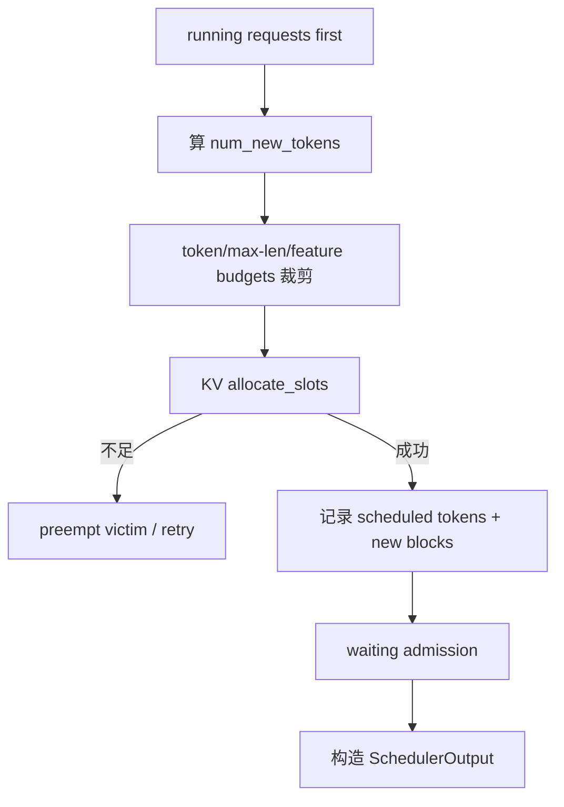

# 从 OpenAI API 到下一 token：固定提交完整调用链

本课只追一条主线：单个 `stream=true` 的 decoder-only chat 请求，V1 Engine，普通采样，无多模态、LoRA、speculative decoding 和 KV connector。先把共同骨架走通，再在每一站标出功能分支。

所有源码结论绑定：

```text
vLLM 61141ed265bfef41a0ca19e992567ea980919b96
```

当前提交默认可能选择 ModelRunner V2；是否选择由 [`VllmConfig.use_v2_model_runner`](https://github.com/vllm-project/vllm/blob/61141ed265bfef41a0ca19e992567ea980919b96/vllm/config/vllm.py#L530-L572)决定。本文 GPU 细节以 V2 路径为主，同时标明共同契约。若启动日志没有 `Using V2 Model Runner`，应转读 `vllm/v1/worker/gpu_model_runner.py`，不能把两代实现拼接成一次真实运行。

## 先看全链，而不是先陷入类图


每条箭头不是同一种调用：有 FastAPI coroutine、Python generator、ZMQ/queue 跨进程、Executor RPC、GPU kernel 和前端 detokenize。排错前先确定问题位于哪一种边界。

## 0. 启动时先决定谁会存在

入口 [`ServeSubcommand.cmd()`](https://github.com/vllm-project/vllm/blob/61141ed265bfef41a0ca19e992567ea980919b96/vllm/entrypoints/cli/serve.py#L44-L148) 并非永远只跑一个 Uvicorn：

| 条件 | 分支 | 状态变化 | 怎样验证 |
| --- | --- | --- | --- |
| `--grpc` | `serve_grpc()` | 不进入本文 HTTP route | 启动日志与监听协议 |
| `--headless` / API 数为 0 | `run_headless()` | 只建后端，不暴露 API | 无 HTTP listener；Core/Worker 存活 |
| API 数大于 1 / Rust frontend | `run_multi_api_server()` | 多前端共享后端 | 进程树与 API rank 日志 |
| 默认单 API | `run_server()` | 当前进程运行 API server | 一个 APIServer 进程 |

单 API 分支在 [`run_server_worker()`](https://github.com/vllm-project/vllm/blob/61141ed265bfef41a0ca19e992567ea980919b96/vllm/entrypoints/openai/api_server.py#L762-L784) 进入 `build_async_engine_client()`，再由 [`build_async_engine_client_from_engine_args()`](https://github.com/vllm-project/vllm/blob/61141ed265bfef41a0ca19e992567ea980919b96/vllm/entrypoints/openai/api_server.py#L147-L193) 完成：

```text
AsyncEngineArgs → VllmConfig → AsyncLLM.from_vllm_config()
```

- 调用条件：API server 启动且参数校验已通过。
- 输入：CLI namespace，最终转成完整 `VllmConfig`。
- 输出：实现 `EngineClient` 接口的 `AsyncLLM`。
- 状态变化：创建前端处理器、Core client；Core/Executor/Worker 在相应后端路径初始化。
- 验证：保存完整启动配置；不要只保存 shell 中显式参数，因为 post-init 会选择 backend、Runner、attention 与 compile 模式。

## 1. HTTP route 只负责选 handler 和响应形态

FastAPI route 是 [`create_chat_completion()`](https://github.com/vllm-project/vllm/blob/61141ed265bfef41a0ca19e992567ea980919b96/vllm/entrypoints/openai/chat_completion/api_router.py#L53-L74)：

```text
ChatCompletionRequest
  → handler.create_chat_completion(...)
  → ErrorResponse | ChatCompletionResponse | async generator
  → JSONResponse | StreamingResponse(text/event-stream)
```

- 调用条件：`POST /v1/chat/completions` 通过 JSON/request dependency 校验。
- 输入：Pydantic `ChatCompletionRequest` 与原始 Starlette `Request`。
- 输出：错误 JSON、完整 JSON 或消费异步 generator 的 SSE response。
- 状态变化：此函数本身不创建 KV block，也不决定 batch。
- 验证：错误模型名在这里/serving 层即可返回；若还没有 Core request id，问题不在 Scheduler。

## 2. Serving 层把“聊天语义”变成“模型输入”

[`OpenAIServingChat._create_chat_completion()`](https://github.com/vllm-project/vllm/blob/61141ed265bfef41a0ca19e992567ea980919b96/vllm/entrypoints/openai/chat_completion/serving.py#L249-L321) 做三次关键变形：

1. `render_chat_request()`：messages、chat template、tools、多模态等 → conversation + engine inputs；
2. `get_max_tokens()` 与 `to_sampling_params()`：OpenAI 参数 → 内部 `SamplingParams`；
3. [`engine_client.generate()` 调用](https://github.com/vllm-project/vllm/blob/61141ed265bfef41a0ca19e992567ea980919b96/vllm/entrypoints/openai/chat_completion/serving.py#L336-L371)：传入 engine input、sampling params、request id、priority、DP rank 等。

随后 [`request.stream` 分支](https://github.com/vllm-project/vllm/blob/61141ed265bfef41a0ca19e992567ea980919b96/vllm/entrypoints/openai/chat_completion/serving.py#L375-L401) 只决定怎样消费同一个 result generator；它不会切换另一套模型执行逻辑。

| 项目 | 普通主线 | 分支条件 |
| --- | --- | --- |
| 输入 | `messages` | 也可带 tools/images/audio/LoRA |
| 渲染结果 | token ids/engine input | template 不同会改变 token 和 prefix hit |
| 参数 | `SamplingParams` | beam search 走 `BeamSearchParams` |
| 输出 | `AsyncGenerator[RequestOutput]` | `stream=false` 聚合后才回 JSON |

验证方法：把模板渲染后的 prompt/token ids 与模型官方 template 对照。角色错位、特殊 token 泄漏、工具 JSON 错误通常在此层已经产生，改 `max-num-batched-tokens` 不会修好它。

## 3. `AsyncLLM` 同时建立前端状态与 Core 请求

[`AsyncLLM.generate()`](https://github.com/vllm-project/vllm/blob/61141ed265bfef41a0ca19e992567ea980919b96/vllm/v1/engine/async_llm.py#L524-L635) 是 API server 消费的异步 generator。它先 `add_request()`，再循环从 per-request collector 取 `RequestOutput` 并 yield。

真正重要的顺序在 [`AsyncLLM._add_request()`](https://github.com/vllm-project/vllm/blob/61141ed265bfef41a0ca19e992567ea980919b96/vllm/v1/engine/async_llm.py#L400-L415)：

```python
self.output_processor.add_request(...)
await self.engine_core.add_request_async(request)
```

先登记输出接收者，再向 Core 发请求，避免极快输出返回时找不到对应 collector。

[`AsyncLLM.add_request()`](https://github.com/vllm-project/vllm/blob/61141ed265bfef41a0ca19e992567ea980919b96/vllm/v1/engine/async_llm.py#L280-L398) 的主线契约：

| 条件 | 输入 | 输出 | 状态变化 |
| --- | --- | --- | --- |
| 普通 generate、`n=1` | EngineInput + SamplingParams | `RequestOutputCollector` | InputProcessor 生成 `EngineCoreRequest`；OutputProcessor 注册前端状态；启动 output handler |
| `n>1` | 同上 | 共用 parent collector | fan-out 多个 child request，各自 sampling seed/ID |
| streaming input | async prompt generator | collector | 走 `_add_streaming_input_request()` |
| engine 已出错 | 任意 | 抛 `EngineDeadError` | 不入 Core |

断连也在这一层闭环：[`generate()` 捕获取消](https://github.com/vllm-project/vllm/blob/61141ed265bfef41a0ca19e992567ea980919b96/vllm/v1/engine/async_llm.py#L588-L635) 后调用 `abort()`；[`abort()`](https://github.com/vllm-project/vllm/blob/61141ed265bfef41a0ca19e992567ea980919b96/vllm/v1/engine/async_llm.py#L709-L718) 同时清前端状态并通知 Core。

验证方法：启动一个长输出流，中途 `Ctrl-C` 客户端；检查 Core 的 running/KV 指标回落。只看到 curl 退出不能证明 abort 传播成功。

## 4. API → Core 是明确的进程契约

[`EngineCoreClient.make_client()`](https://github.com/vllm-project/vllm/blob/61141ed265bfef41a0ca19e992567ea980919b96/vllm/v1/engine/core_client.py#L83-L111) 按 multiprocessing/async/DP 选择 client：

```text
InprocClient | SyncMPClient | AsyncMPClient | DP-aware client
```

在线 `AsyncLLM` 的常见主线是 async multiprocess client，序列化 `EngineCoreRequest` 送到 Core。这里跨过第一个关键进程边界：

| API process 拥有 | Core process 拥有 |
| --- | --- |
| HTTP body、renderer/tokenizer、OutputProcessor、detokenized text、SSE stream | Scheduler、Core Request、KV block metadata、Executor |

`EngineCoreRequest` 是传输对象；它不是 Scheduler 内部 `Request`。Core 的 [`preprocess_add_request()`](https://github.com/vllm-project/vllm/blob/61141ed265bfef41a0ca19e992567ea980919b96/vllm/v1/engine/core.py#L922-L944) 调用 `Request.from_engine_core_request()`，并在需要时启动 grammar compilation。

- 输入：可序列化 `EngineCoreRequest`。
- 输出：Core-local `Request` 与 request wave。
- 状态变化：计算/挂接 block hash、structured-output 状态等 Core 所需字段。
- 调用条件：ADD 请求完成传输与预处理。
- 验证：在 API 与 Core 日志同时使用 request id；不要依赖 Python object identity。

## 5. Core busy loop 把控制面压成一个稳定 step

[`EngineCoreProc.run_busy_loop()`](https://github.com/vllm-project/vllm/blob/61141ed265bfef41a0ca19e992567ea980919b96/vllm/v1/engine/core.py#L1326-L1384) 反复做两件事：收输入、做 engine step。ADD 消息在 [`_handle_client_request()`](https://github.com/vllm-project/vllm/blob/61141ed265bfef41a0ca19e992567ea980919b96/vllm/v1/engine/core.py#L1439-L1468) 进入 `add_request()`，后者最终调用 [`Scheduler.add_request()`](https://github.com/vllm-project/vllm/blob/61141ed265bfef41a0ca19e992567ea980919b96/vllm/v1/core/sched/scheduler.py#L2051-L2073)：

```text
status: new → WAITING
queue:  waiting append
map:    requests[request_id] = request
event:  QUEUED（开启统计时）
```

`EngineCore.step()` 的真实骨架见 [`core.py:546–575`](https://github.com/vllm-project/vllm/blob/61141ed265bfef41a0ca19e992567ea980919b96/vllm/v1/engine/core.py#L546-L575)：

```text
scheduler_output = Scheduler.schedule()
  → future = Executor.execute_model(non_block=True)
  → grammar_output = Scheduler.get_grammar_bitmask(scheduler_output)
  → model_output = future.result()
  → if model_output is None: Executor.sample_tokens(grammar_output)
  → process queued aborts
  → Scheduler.update_from_output(scheduler_output, model_output)
```

注意：在固定提交的某些 Executor/Runner 组合中，`execute_model()` 只完成 forward 并返回 `None`，采样由后续 `sample_tokens()` 完成。把旧版“Runner.execute_model 内必然 forward+sample”当真，会读错控制流。

## 6. Scheduler 不是两个 phase 状态机

[`Scheduler.schedule()`](https://github.com/vllm-project/vllm/blob/61141ed265bfef41a0ca19e992567ea980919b96/vllm/v1/core/sched/scheduler.py#L417-L510) 的源码注释直接给出设计：没有固定的 prefill/decode phase；每个请求追赶

```text
num_tokens_with_spec - num_computed_tokens
```

本轮状态变化可压缩成：



普通请求的主要输入/输出：

| 输入状态 | `schedule()` 读什么 | `SchedulerOutput` 写给 Worker 什么 |
| --- | --- | --- |
| Request | prompt/output/spec token、computed、status、priority | new/cached request data |
| 全局 budget | max scheduled tokens、max seqs、encoder budget | per-request scheduled token count |
| KV manager | prefix hits、owned/free blocks | new block ids、copy/zero 信息 |
| feature state | grammar、connector、LoRA、multimodal | 对应 metadata |

验证方法：开启 iteration detail logging 或调试单测，比较 `num_scheduled_tokens` 总和与本轮 budget；不要从 prompt 长度直接推断一次 prefill 完成。

## 7. KV manager 先查询复用，再原子式接纳

新/恢复请求先走 [`get_computed_blocks()`](https://github.com/vllm-project/vllm/blob/61141ed265bfef41a0ca19e992567ea980919b96/vllm/v1/core/kv_cache_manager.py#L207-L281)：

- 条件：prefix caching 开启，且请求没有因 prompt logprobs/pooling 等跳过读取；
- 输入：请求 block hashes 与当前 cache map；
- 输出：命中的 `KVCacheBlocks`、computed token 数、特殊共享边界；
- 状态：查询本身主要统计 hit；真正增加引用发生在分配路径；
- 边界：即使 prompt 全命中，也要为 logits 重算末端，源码把最大 hit 限为 `num_tokens - 1`。

随后 [`allocate_slots()`](https://github.com/vllm-project/vllm/blob/61141ed265bfef41a0ca19e992567ea980919b96/vllm/v1/core/kv_cache_manager.py#L283-L378) 同时考虑本地命中、外部 KV、本轮 token、lookahead、encoder cache group 与预留空间。关键安全顺序见 [`kv_cache_manager.py:379–504`](https://github.com/vllm-project/vllm/blob/61141ed265bfef41a0ca19e992567ea980919b96/vllm/v1/core/kv_cache_manager.py#L379-L504)：

1. 计算需要的 blocks；
2. 若超过 `free - reserved - watermark`，返回 `None`；
3. 只有能接纳后才附加 computed blocks、分配新 blocks；
4. 只 cache 已 finalized、不会被 speculative rejection 推翻的 token。

因此 `None` 是调度信号，不是 CUDA OOM。Scheduler 可以 preempt/requeue；Worker 此时还未收到一个半成品 block table。

物理池由 [`BlockPool`](https://github.com/vllm-project/vllm/blob/61141ed265bfef41a0ca19e992567ea980919b96/vllm/v1/core/block_pool.py#L143-L196) 维护：预创建 block objects、双向 free queue、hash → block 映射。它操作的是 metadata；真正 KV tensor 在 Worker。

## 8. Executor 把同一逻辑调用送到一个或多个 Worker

后端选择在 [`Executor.get_class()`](https://github.com/vllm-project/vllm/blob/61141ed265bfef41a0ca19e992567ea980919b96/vllm/v1/executor/abstract.py#L47-L92)：

| backend | 实现 | 典型条件 |
| --- | --- | --- |
| `uni` | `UniProcExecutor` | world size 1 |
| `mp` | `MultiprocExecutor` | 单节点多 GPU或显式多节点 mp |
| `ray` | Ray executor | 显式 Ray/placement group |
| `external_launcher` | external wrapper | 外部进程系统提供 ranks |

共同接口 [`Executor.execute_model()`](https://github.com/vllm-project/vllm/blob/61141ed265bfef41a0ca19e992567ea980919b96/vllm/v1/executor/abstract.py#L209-L247) 以 `SchedulerOutput` 调用所有相关 worker，只取 output rank 的逻辑结果或聚合 connector 输出。

单卡 [`UniProcExecutor.execute_model()`](https://github.com/vllm-project/vllm/blob/61141ed265bfef41a0ca19e992567ea980919b96/vllm/v1/executor/uniproc_executor.py#L108-L131) 仍遵守同一接口，所以单卡和分布式的 Core 主循环不需要两套 Scheduler。

## 9. Worker 拥有设备与分布式边界

[`Worker.init_device()`](https://github.com/vllm-project/vllm/blob/61141ed265bfef41a0ca19e992567ea980919b96/vllm/v1/worker/gpu_worker.py#L297-L420) 完成：

1. 解析 rank/local rank 与可见设备；
2. 在内存快照前初始化 distributed/NCCL；
3. 设置随机种子并记录显存初始状态；
4. 按配置创建 V1 或 V2 `GPUModelRunner`。

调用条件是 Executor 初始化 worker；不是收到第一条请求时才建 NCCL。这样显存 profile 会包含通信缓冲区。

[`Worker.execute_model()`](https://github.com/vllm-project/vllm/blob/61141ed265bfef41a0ca19e992567ea980919b96/vllm/v1/worker/gpu_worker.py#L1002-L1090) 在 PP 下还负责：等待上次异步 send、非首 stage 接收 intermediate tensors、调用 Runner、非末 stage 发送 intermediate tensors。

输入是 `SchedulerOutput`；输出可能是 `ModelRunnerOutput`、异步包装、PP 的 `IntermediateTensors` 或 `None`。判断 `None` 必须结合 PP rank 与 forward/sample 分离，不能直接解释成“没有结果”。

## 10. V2 Runner 把逻辑计划变成 GPU batch

[`GPUModelRunner.execute_model()`](https://github.com/vllm-project/vllm/blob/61141ed265bfef41a0ca19e992567ea980919b96/vllm/v1/worker/gpu/model_runner.py#L1133-L1373) 的顺序是可验证的：

```text
finish/remove → add new → update cached → apply block-table writes
→ prepare inputs → prepare block tables/slot mappings/attention metadata
→ graph replay or model(**model_inputs)
→ save hidden states in execute_model_state
```

新请求状态写入见 [`add_requests()`](https://github.com/vllm-project/vllm/blob/61141ed265bfef41a0ca19e992567ea980919b96/vllm/v1/worker/gpu/model_runner.py#L777-L823)：request id、token buffer、computed count、block ids、sampling/LoRA state 都进入 persistent structures。

已有请求更新见 [`update_requests()`](https://github.com/vllm-project/vllm/blob/61141ed265bfef41a0ca19e992567ea980919b96/vllm/v1/worker/gpu/model_runner.py#L824-L858)：追加新 block ids，并在 forward 前 zero 新块、执行必要的 copy-on-write。

[`prepare_inputs()`](https://github.com/vllm-project/vllm/blob/61141ed265bfef41a0ca19e992567ea980919b96/vllm/v1/worker/gpu/model_runner.py#L860-L1038) 输出 `InputBatch`：

| 字段 | 来源 | 作用 |
| --- | --- | --- |
| `input_ids` | 本轮每请求待算位置 | embedding/model input |
| `positions` | computed offset | RoPE/位置逻辑 |
| `query_start_loc` | per-request scheduled counts 前缀和 | ragged batch 边界 |
| `block_tables` | Scheduler 分配同步到 Runner | attention 读取历史 KV |
| `slot_mappings` | logical position + physical block | 新 K/V 写入位置 |
| `logits_indices` | 每请求要取 logits 的位置 | 避免为无用位置做完整 vocab projection |

关键不变量：Scheduler 只持 block id metadata，Runner 才把它变成设备 tensor 和 backend attention metadata。

## 11. graph/eager 分支最终都进入同一个模型语义

固定提交的 V2 Runner 在 [`model_runner.py:1305–1343`](https://github.com/vllm-project/vllm/blob/61141ed265bfef41a0ca19e992567ea980919b96/vllm/v1/worker/gpu/model_runner.py#L1305-L1343) 选择：

- FULL CUDA Graph：复用完整捕获图；
- PIECEWISE：通过 graph manager 运行编译/分段图；
- NONE/eager：直接 `self.model(**model_inputs)`。

这是执行机制分支，不是三种模型数学。若 eager 正确而 graph 错，问题范围缩到 capture/compile/backend/shape；若 eager 也错，应继续查输入、模型或 kernel。

Runner 把最后 stage 的 hidden states 存入 `execute_model_state`，随后 `sample_tokens()` 消费并清空它。这一“单次消费”状态防止拿上一轮 hidden states 重复采样。

## 12. 以 Llama 为例走进模型 forward

具体模型由 registry/loader 选择；这里只用 Llama 展示共同形态，不声称所有模型都同构。

[`LlamaForCausalLM.forward()`](https://github.com/vllm-project/vllm/blob/61141ed265bfef41a0ca19e992567ea980919b96/vllm/model_executor/models/llama.py#L516-L533)：

```text
input ids / embeds + positions + optional PP intermediates
→ LlamaModel.forward()
→ hidden states
```

`forward()` 在末 PP stage 到 hidden states 就返回；[`compute_logits()`](https://github.com/vllm-project/vllm/blob/61141ed265bfef41a0ca19e992567ea980919b96/vllm/model_executor/models/llama.py#L528-L533) 是同一模型类上的**独立方法**，不是 `LlamaForCausalLM.forward()` 的内部一步。V2 Runner 后续在 `sample()` 中选择 `logits_indices`，再调用它完成词表投影。

[`LlamaModel.forward()`](https://github.com/vllm-project/vllm/blob/61141ed265bfef41a0ca19e992567ea980919b96/vllm/model_executor/models/llama.py#L400-L439) 在首 PP stage 做 embedding，在本 stage 范围循环 decoder layers；非末 stage 返回 `IntermediateTensors`，末 stage 做 norm 后返回 hidden states。

单层 [`LlamaDecoderLayer.forward()`](https://github.com/vllm-project/vllm/blob/61141ed265bfef41a0ca19e992567ea980919b96/vllm/model_executor/models/llama.py#L310-L327) 是 norm/residual → self attention → norm/residual → MLP。attention 的 [`LlamaAttention.forward()`](https://github.com/vllm-project/vllm/blob/61141ed265bfef41a0ca19e992567ea980919b96/vllm/model_executor/models/llama.py#L221-L231) 做 QKV projection、RoPE、`self.attn(q,k,v)` 和 output projection。

`self.attn` 再从 forward context 取得 block table/slot mapping/attention metadata，选择的 backend 才真正读写 paged KV。因 backend、模型、平台会变化，不能把某个历史 PagedAttention CUDA kernel 当成这条 Python 链的固定下一站。

## 13. hidden states → logits → token

V2 Runner 的 [`sample()`](https://github.com/vllm-project/vllm/blob/61141ed265bfef41a0ca19e992567ea980919b96/vllm/v1/worker/gpu/model_runner.py#L1067-L1099) 先取 `hidden_states[logits_indices]`，调用模型 `compute_logits()`，应用 grammar bitmask，再进入普通 sampler或 speculative rejection sampler。

普通 [`Sampler.forward()`](https://github.com/vllm-project/vllm/blob/61141ed265bfef41a0ca19e992567ea980919b96/vllm/v1/sample/sampler.py#L72-L149) 的可观察顺序：

```text
raw logits
→ float32
→ logits processors / penalties
→ greedy or random sampling
→ optional logprobs/ranks
→ int32 sampled_token_ids [num_requests, 1]
```

[`Sampler.sample()`](https://github.com/vllm-project/vllm/blob/61141ed265bfef41a0ca19e992567ea980919b96/vllm/v1/sample/sampler.py#L243-L303) 的条件：

- 全 greedy：直接 argmax；
- 全 random：temperature → argmax-invariant processors → top-k/top-p sampler；
- 混合 batch：两者都算后按每请求 temperature mask 合并。

采样不是 `softmax` 的同义词，也不总生成随机数。确定性实验应明确 `temperature=0`、seed、模型 revision 与数值 backend。

## 14. Worker 输出回写 Scheduler 状态

末 PP rank 的 [`sample_tokens()`](https://github.com/vllm-project/vllm/blob/61141ed265bfef41a0ca19e992567ea980919b96/vllm/v1/worker/gpu/model_runner.py#L1375-L1435) 采样，并在 PP 下把 token 广播给其他 stages；随后构造 `ModelRunnerOutput`。

Core 侧 [`Scheduler.update_from_output()`](https://github.com/vllm-project/vllm/blob/61141ed265bfef41a0ca19e992567ea980919b96/vllm/v1/core/sched/scheduler.py#L1533-L1669) 对每个 scheduled request：

1. 取本轮 sampled token ids；
2. 处理 speculative acceptance/rejection 并修正 computed count；
3. 更新 output tokens；
4. 检查 token 级 EOS、max tokens、stop token；
5. 生成 `EngineCoreOutput`；
6. 对完成请求释放/延迟释放 blocks。

客户端 abort 的外部完成路径见 [`finish_requests()`](https://github.com/vllm-project/vllm/blob/61141ed265bfef41a0ca19e992567ea980919b96/vllm/v1/core/sched/scheduler.py#L2075-L2169)：从 waiting/running 移除、设置 finished status、调用 connector hook、释放 encoder/KV 状态。

## 15. Core 输出回 API，再变成 SSE

Core process 把 outputs 放入输出队列；API process 的 [`AsyncLLM.output_handler()`](https://github.com/vllm-project/vllm/blob/61141ed265bfef41a0ca19e992567ea980919b96/vllm/v1/engine/async_llm.py#L656-L707)：

- 拉取 `EngineCoreOutputs`；
- `OutputProcessor.process_outputs()` 做 detokenize、文本级 stop 等；
- 把 `RequestOutput` 推进对应 collector；
- 若 stop **字符串**触发，反向 abort Core；
- 更新 scheduler stats/metrics。

最后 serving 层的 [`chat_completion_stream_generator()`](https://github.com/vllm-project/vllm/blob/61141ed265bfef41a0ca19e992567ea980919b96/vllm/entrypoints/openai/chat_completion/serving.py#L408-L470) 消费 `RequestOutput`，编码 `ChatCompletionChunk` 与 `data: ...\n\n`。

这解释了为什么停止职责被拆开：Core 直接拥有 token ids，适合 token/EOS/长度判断；API 前端拥有 detokenized text，适合 stop string 与 parser。寻找“唯一 stop 函数”会得到错误架构图。

## 一张逐站证据表

| 站点 | 调用条件 | 输入 → 输出 | 关键状态变化 | 最小验证 |
| --- | --- | --- | --- | --- |
| route | HTTP 校验后 | schema → response/generator | 无 GPU 状态 | 错误/流式响应类型 |
| renderer | chat request | messages → engine input | template/token ids | 保存渲染结果 |
| AsyncLLM | generate | engine input → Core request/collector | 前端 request state | request id + abort |
| Core client | async MP | serialized request → Core queue | 跨进程 | API/Core 双侧日志 |
| Scheduler | 有 waiting/running | Request → SchedulerOutput | queue/status/budget | scheduled tokens |
| KV manager | request 接纳 | hashes/tokens → block ids/None | ref/free/cache metadata | prefix/preemption test |
| Executor | 有计划 | SchedulerOutput → worker calls | backend RPC state | rank/process log |
| Worker | forward step | plan → runner call | device/PP comm | per-rank trace |
| Runner | scheduled tokens > 0 | plan → InputBatch/hidden | persistent batch/block table | input/shape trace |
| Model | eager/graph dispatch | ids/positions → hidden | KV tensor writes | profiler/kernel trace |
| Sampler | last PP rank | hidden → token ids | sampling/penalty state | greedy fixed output |
| Scheduler update | worker output ready | token ids → Core output | output/status/free | finish reason/KV 回落 |
| OutputProcessor | Core output 到达 | token ids → text delta | detokenizer/stop text | SSE 与 abort |

## 自己重走一次：只用仓库搜索

在固定源码根目录执行：

```bash
rg -n 'def create_chat_completion' vllm/entrypoints/openai
rg -n 'def generate|def add_request' vllm/v1/engine/async_llm.py
rg -n 'def run_busy_loop|def step\(' vllm/v1/engine/core.py
rg -n 'def schedule|def update_from_output' vllm/v1/core/sched/scheduler.py
rg -n 'def get_computed_blocks|def allocate_slots' vllm/v1/core/kv_cache_manager.py
rg -n 'def execute_model|def sample_tokens' vllm/v1/{executor,worker}
rg -n 'class LlamaForCausalLM|def compute_logits' vllm/model_executor/models/llama.py
rg -n 'class Sampler|def sample' vllm/v1/sample/sampler.py
```

每找到一站，只记五项：call condition、input type、output type、mutated state、next consumer。遇到 adapter/protocol 先回到数据类型，不要顺着 import 把整个仓库展开。

## 通关标准

不用看本页，能从 `ChatCompletionRequest` 口述并画到 `SamplerOutput` 再回 SSE；每一跳至少指出一个固定源码符号、一个调用条件、一个状态变化和一个验证方法。还要能解释：

1. 为什么 prefix 全命中仍可能重算末端；
2. 为什么 `allocate_slots() is None` 不是 CUDA OOM；
3. 为什么 `execute_model()` 返回 `None` 不一定失败；
4. 为什么 stop token 与 stop string 分层；
5. 为什么 Ray/MP 不改变 Scheduler 的数据契约。

上一课是[一条请求的生命周期](./request-lifecycle)；下一课先深入[Scheduler 与 KV Cache](./scheduler-kv)，再进入[模型 forward 与采样](./model-forward-sampling)。
