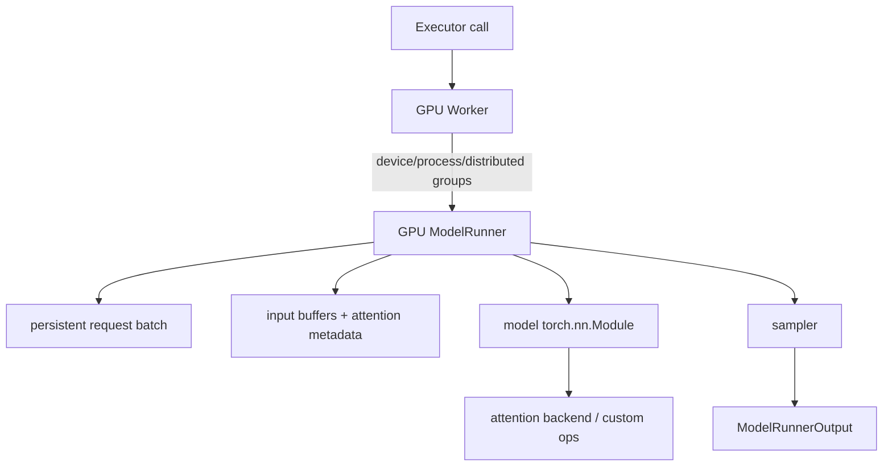
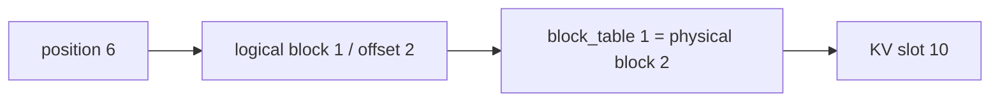
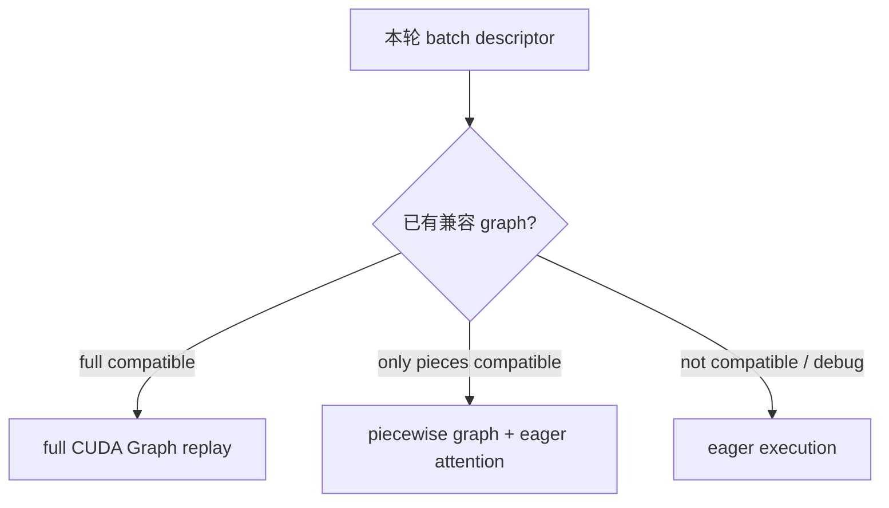

# Worker、ModelRunner 与模型执行

Scheduler 只给出计划；Worker 才拥有 CUDA device，ModelRunner 才把计划变成 tensor。读这一层时始终分开三件事：**状态同步、输入准备、设备执行。**很多看似是“模型 forward 慢”的问题，其实发生在 CPU 构批、host-to-device copy 或 graph dispatch。

## Worker 与 Runner 的边界



| 对象 | 主要职责 |
| --- | --- |
| GPU Worker | 绑定 rank/device、初始化 distributed、加载 Runner、profile 显存、初始化 KV、处理 PP 通信 |
| ModelRunner | 持有模型与输入状态，应用 `SchedulerOutput`，准备 tensor/attention metadata，dispatch forward 与 sampling |
| Model | 统一构造的 `torch.nn.Module`，定义网络层与权重映射 |
| Attention backend | 按平台、head/KV layout、dtype、功能约束实现具体 attention 与 KV 读写 |

源码入口：[`GPU Worker`](https://github.com/vllm-project/vllm/blob/61141ed265bfef41a0ca19e992567ea980919b96/vllm/v1/worker/gpu_worker.py#L130)。

## 先厘清两个“V1 / V2”

课程讨论的是 vLLM **Engine V1**。固定提交在这个 Engine 内又同时存在两代 GPU ModelRunner：

- [`vllm/v1/worker/gpu_model_runner.py`](https://github.com/vllm-project/vllm/blob/61141ed265bfef41a0ca19e992567ea980919b96/vllm/v1/worker/gpu_model_runner.py#L446)：ModelRunner V1；
- [`vllm/v1/worker/gpu/model_runner.py`](https://github.com/vllm-project/vllm/blob/61141ed265bfef41a0ca19e992567ea980919b96/vllm/v1/worker/gpu/model_runner.py#L120)：ModelRunner V2。

`VllmConfig.use_v2_model_runner` 会根据环境变量、模型类型、Triton 与 feature 支持选择；许多支持的 dense generate 模型默认可走 V2，不支持的组合回退到 V1。不要看到文件名就误判正在运行哪一条路径：先读启动日志和配置判断。课程讲两者共同的数据流，调具体问题时再进入实际选择的实现。

## 启动：先做显存账本

Worker 初始化时记录设备初始快照，加载权重，再用 profile run 估计非 KV 峰值。简化账本：

$$
M_{budget}=M_{total}\times utilization
$$

$$
M_{KV}=M_{budget}-M_{weights}-M_{peak\ activation}-M_{non\ torch}-M_{graph\ reserve}
$$

真实实现还处理 allocator、共享/多进程和平台差异，但这个式子能解释大多数启动现象：

- TP 增大通常降低每卡权重，却增加 collective；
- `max_model_len` 本身不改变权重，却会影响可支持的缓存/并发约束；
- CUDA Graph 多占静态内存，可能换来更低 launch overhead；
- 其他进程在 profile 期间改变显存，会使测量不稳定甚至触发保护性断言。

关键源码：[`Worker.load_model()`](https://github.com/vllm-project/vllm/blob/61141ed265bfef41a0ca19e992567ea980919b96/vllm/v1/worker/gpu_worker.py#L424) 与 [`determine_available_memory()`](https://github.com/vllm-project/vllm/blob/61141ed265bfef41a0ca19e992567ea980919b96/vllm/v1/worker/gpu_worker.py#L448)。

### `--kv-cache-memory` 不是通用常数

当前版本可用手工 KV bytes 跳过一部分内存测量，但该值绑定到模型配置、GPU 和启动时空闲显存。把 A100 上测出的数直接复制到另一台有监控 sidecar 的机器，可能在分配或 graph capture 时 OOM。

## 每 step 的第一件事：同步持久状态

服务不是把每轮请求重新 tokenization 再堆成 batch。Runner 保存跨 step 状态：request id 到 batch index、完整 token buffer、computed length、block tables、sampling/LoRA 状态等。

收到 `SchedulerOutput` 后大致进行：

```text
1. finish / remove 不再驻留的请求
2. add new or resumed requests
3. update running requests 的 token、computed count、block ids
4. compact 或重排 batch slots
5. 只为本轮 scheduled tokens 准备输入
```

这样 decode step 无需复制每条长历史序列；设备只需要当前 query token 与能定位历史 KV 的 block table。

ModelRunner V2 的 [`execute_model()`](https://github.com/vllm-project/vllm/blob/61141ed265bfef41a0ca19e992567ea980919b96/vllm/v1/worker/gpu/model_runner.py#L1133) 会显式执行 `finish_requests`、`add_requests`、`update_requests` 和 staged block-table writes。V1 Runner 组织方式不同，但所有权相同。

## 从 logical token 到 KV slot

对某个 query position，需要知道它新产生的 K/V 写到物理 KV tensor 哪个 slot：

$$
logical\ block=\left\lfloor position/block\ size\right\rfloor
$$

$$
slot=block\_table[logical\ block]\times block\ size+(position\bmod block\ size)
$$

例如 block size=4，请求 block table `[7, 2, 9]`，position=6：logical block=1，offset=2，slot=`2×4+2=10`。历史在物理 block 7、2 中不连续，但 attention metadata 能按表定位。



`slot_mapping` 解决“新 KV 写哪里”，`block_table` 解决“attention 去哪里读历史”。两个名字相似但用途不同。

## 输入准备的产物

一次 forward 常需要：

| 数据 | 来源 | 用途 |
| --- | --- | --- |
| `input_ids` / embeds | 本轮 scheduled token positions | embedding / 模型输入 |
| positions | 每请求 computed offsets | RoPE 等位置编码 |
| query start locations / lengths | 本轮各请求 token 数 | ragged batch 边界 |
| block tables | Scheduler 分配状态 | 间接寻址历史 KV |
| slot mappings | logical position + block ids | 写入新 K/V |
| attention metadata | backend builder | kernel 所需形状、因果/窗口等信息 |
| sampling metadata | request params | temperature/top-p/penalty/grammar |

模型看到的“batch size”不是简单的请求数。混合 chunked prefill 与 decode 时，每个请求本轮 token 数不同，核心工作量更接近 total scheduled tokens 与 attention context 分布。

## Attention backend 是执行插件，不是 Scheduler 分支

vLLM 需要适配不同 GPU、dtype、head layout、MLA、sliding window、quantized KV 和 CUDA Graph 能力。Runner/attention layer 构造统一 metadata，具体 backend 负责 kernel 与 KV layout。

选择 backend 时不能只看“某库 benchmark 最快”：

- 模型结构是否支持；
- GPU compute capability 与已安装 wheel 是否匹配；
- prefix/chunk/speculative/cascade 等 feature 是否兼容；
- CUDA Graph 模式是否能捕获；
- 长度与批形状是否处在它擅长的区间。

遇到 backend 相关错误，先记录 vLLM 自动选择结果；强制另一个 backend 是定位对照，不应未经基准就成为永久配置。

## `torch.compile` 与 CUDA Graph 解决不同成本

| 机制 | 主要减少什么 | 主要代价 |
| --- | --- | --- |
| `torch.compile` / Inductor | Python/PyTorch 图优化、融合与 kernel 生成 | 首次编译时间、缓存与图兼容性 |
| CUDA Graph replay | 每 step 大量 CUDA launch 的 CPU overhead | 捕获时间、固定缓冲/显存、形状与功能约束 |

当前 V1 默认优化级别为 O2；具体 CUDAGraph 模式会按平台和 backend 能力选择/降级。固定源码的设计允许 full 与 piecewise 模式按 batch descriptor dispatch：uniform decode 可能适合 full graph，动态 context batch 则可能走 piecewise/eager 路径。



`--enforce-eager` 同时关掉 compile/graph，是很有价值的故障隔离开关：若 eager 正确而默认失败，范围缩到 compile/capture/backend 交互。但 eager 更慢并不说明默认有 bug，也不应只因启动快就长期使用。

## Forward 后为什么还要 sampling

模型 forward 产生 logits，生成系统还要按每请求参数执行：

- repetition/presence/frequency penalties；
- bad words、allowed tokens 或 grammar mask；
- temperature、top-k、top-p；
- greedy/multinomial sampling；
- logprobs；
- speculative rejection sampling。

sampling 可能成为小模型、高并发或大词表场景的可见成本。看到 GPU model forward 很快却 ITL 没同步下降，应把 input prep、sampling、D2H 与前端输出处理一起 profile。

## TP / PP 时 Worker 还多做什么

- TP：模型层内部做 all-reduce/all-gather/reduce-scatter 等 collective；每个 rank 必须以一致顺序进入。
- PP：非首 stage 接收 intermediate tensors，非末 stage 发送；只有末 stage 完成 logits/sampling 所需路径。
- DP+MoE：即使某 rank 没用户 token，也可能需要 dummy forward 对齐 expert collective。

因此 `num_scheduled_tokens=0` 不总等于“进程什么都不做”；分布式 group 的 collective 顺序优先于单 rank 的局部空闲判断。

## Profile 的正确切片

```text
engine step
├── scheduler CPU
├── executor dispatch / IPC
├── runner state update
├── input prep + H2D
├── collective / PP recv
├── model forward
│   ├── attention + KV read/write
│   └── MLP / MoE / norms
├── sampling
├── D2H / output packaging
└── scheduler update + frontend output
```

只看一个总 `execute_model` duration，无法判断 batch 构造、collective 还是 kernel。先用粗粒度 trace 切层，再对最贵的一层启用昂贵 profiler；不要一开始在生产流量上全量采集逐 kernel trace。

## 源码练习

1. 在 `gpu_worker.py` 找 Runner V1/V2 的选择条件，并从实际启动配置判断走哪条。
2. 在对应 Runner 的 `execute_model()` 中给“更新状态、准备输入、forward、sample”各画一个框。
3. 任选一个请求的 position 与 block table，手算 slot mapping。
4. 用同一负载比较默认与 `--enforce-eager`：记录启动 ready time、稳态 ITL、吞吐和显存，而不是只看其中一个。

## 通关标准

你应能解释：Worker 与 Runner 分别拥有什么；为何 decode 不需要重传完整历史 token；block table 和 slot mapping 的区别；compile 与 CUDA Graph 各省什么；以及为什么 eager 是诊断开关而非默认优化答案。下一节把 Worker 放进 [TP、PP、DP 与多节点](./distributed)。
