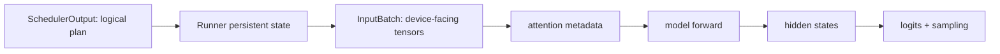

# 模型 forward、Paged KV 与采样：逐行走进 GPU 路径

这页回答两个常被一句“Runner 执行模型”略过的问题：

1. Scheduler 的 token 数和 block id 怎样变成 GPU 上的输入与 KV 寻址？
2. 模型最后一层 hidden states 怎样经过 logits、约束和采样变成下一 token？

源码固定在 `61141ed265bfef41a0ca19e992567ea980919b96`。示例使用 Engine V1 + GPU ModelRunner V2 + Llama dense generate。其他模型、Runner V1、MLA/Mamba/encoder-decoder 和不同 attention backend 会替换局部实现，但不改变 SchedulerOutput → device batch → model result → Core output 的契约。

## 0. 先证明实际走 V2，而不是猜

[`VllmConfig.use_v2_model_runner`](https://github.com/vllm-project/vllm/blob/61141ed265bfef41a0ca19e992567ea980919b96/vllm/config/vllm.py#L530-L572) 的选择顺序是：

1. `VLLM_USE_V2_MODEL_RUNNER` 若显式设置，直接采用；
2. DSpark、特定 DFlash、多数 diffusion 强制 V2；
3. 非默认 V2 模型返回 V1；
4. 缺 Triton 返回 V1；
5. 有 V2 不支持的 feature 返回 V1；
6. 否则 V2。

Worker 的实际构造分支在 [`gpu_worker.py:401–416`](https://github.com/vllm-project/vllm/blob/61141ed265bfef41a0ca19e992567ea980919b96/vllm/v1/worker/gpu_worker.py#L401-L416)，V2 会打印 `Using V2 Model Runner`。课程后面的行号只有满足这条分支才是本次运行的直接证据。

验证命令：

```bash
vllm serve "$MODEL" 2>&1 | tee vllm-startup.log
rg 'Using V2 Model Runner|model runner instead|VLLM_USE_V2' vllm-startup.log
```

若回退 V1，保留日志给出的 unsupported 原因，不要为了跟课程行号一致就强开 V2。

## 1. `SchedulerOutput` 是 CPU 控制计划，不是模型输入 tensor

Core 的 `SchedulerOutput` 至少包含：

```text
scheduled_new_reqs / scheduled_cached_reqs
num_scheduled_tokens: request_id → count
new block ids / finished / preempted ids
speculative / encoder / grammar / connector metadata
```

Worker 收到它时尚未拥有当前 step 的 `input_ids`、`positions` 和 attention metadata。这是分层的关键：



如果 Scheduler 已经计划对而 kernel 输入错，修复点在 Runner/metadata/backend；如果 Scheduler 分配的 token/block 就错，改 kernel 只会掩盖问题。

## 2. persistent state：为什么 decode 不复制全部历史 token

V2 Runner 收到新计划后按 [`execute_model()`](https://github.com/vllm-project/vllm/blob/61141ed265bfef41a0ca19e992567ea980919b96/vllm/v1/worker/gpu/model_runner.py#L1133-L1165) 依次：

```text
update PP decode state
finish/remove
free encoder states
add new requests
update existing requests
apply staged block table writes
```

新请求的 [`add_requests()`](https://github.com/vllm-project/vllm/blob/61141ed265bfef41a0ca19e992567ea980919b96/vllm/v1/worker/gpu/model_runner.py#L777-L823) 写入：

| 状态 | 作用 |
| --- | --- |
| request id → slot index | 稳定定位 persistent batch 行 |
| prompt length / all token ids | 本轮挑选要计算的 token |
| num computed tokens | 决定下一个 logical position |
| block ids | 构造 block table 与 slot mapping |
| sampling params | 最后 PP rank 的 sampler state |
| LoRA/encoder state | 可选 feature 路径 |

已有请求的 [`update_requests()`](https://github.com/vllm-project/vllm/blob/61141ed265bfef41a0ca19e992567ea980919b96/vllm/v1/worker/gpu/model_runner.py#L824-L858) 更新 computed count、追加 block ids；新分配 block 在 forward 前 zero，必要时完成 partial hit 的 copy-on-write。

因此 decode 只需准备刚采样的 token 和它的位置；历史 token 的 K/V 已在 paged cache，block table 告诉 attention 去哪里读。

## 3. `prepare_inputs()` 把 ragged requests 压成一条 token 轴

[`prepare_inputs()`](https://github.com/vllm-project/vllm/blob/61141ed265bfef41a0ca19e992567ea980919b96/vllm/v1/worker/gpu/model_runner.py#L860-L1038) 的输入是 `SchedulerOutput` 与 batch execution descriptor，输出 `InputBatch`。

假设本轮：

```text
A: chunked prefill 3 tokens
B: decode 1 token
C: decode 1 token
```

逻辑请求数是 3，总 query token 是 5；tensor 可以压成：

```text
input_ids       = [A0, A1, A2, B_next, C_next]
query_start_loc = [0, 3, 4, 5]
positions       = [a, a+1, a+2, b, c]
```

`query_start_loc` 是每请求 token 数的前缀和，帮助 backend 解释 ragged batch。CUDA Graph 可能再 padding，但 `num_tokens` 与 `num_tokens_after_padding` 必须分开。

源码中的关键变形：

- [`query_start_loc` 前缀和](https://github.com/vllm-project/vllm/blob/61141ed265bfef41a0ca19e992567ea980919b96/vllm/v1/worker/gpu/model_runner.py#L920-L935)；
- [prefill token 准备与 positions/seq lens](https://github.com/vllm-project/vllm/blob/61141ed265bfef41a0ca19e992567ea980919b96/vllm/v1/worker/gpu/model_runner.py#L937-L970)；
- [采样/draft token 合并与 logits indices](https://github.com/vllm-project/vllm/blob/61141ed265bfef41a0ca19e992567ea980919b96/vllm/v1/worker/gpu/model_runner.py#L972-L985)；
- [`InputBatch` 返回字段](https://github.com/vllm-project/vllm/blob/61141ed265bfef41a0ca19e992567ea980919b96/vllm/v1/worker/gpu/model_runner.py#L1007-L1038)。

### 为什么 `logits_indices` 很重要

prefill 的大多数中间位置只需写 KV，不需要为整个词表计算下一 token logits。Runner 只选择真正要采样或做 prompt logprobs 的 hidden positions，减少大词表 projection 工作。

验证：profile 时分别看 scheduled tokens 与 logits rows；二者通常不相等。若把 total scheduled tokens 当成 sampler batch size，会误算成本。

## 4. block table 与 slot mapping：读和写不是一张表

V2 Runner 的 [`prepare_attn()`](https://github.com/vllm-project/vllm/blob/61141ed265bfef41a0ca19e992567ea980919b96/vllm/v1/worker/gpu/model_runner.py#L1040-L1056) 产生：

- `block_tables[group, request, logical_block]`：历史逻辑 block 映射到物理 block，供 attention 读取；
- `slot_mappings[group, token]`：本轮每个新 K/V 写到哪个物理 slot。

对 block size `B`、position `p`：

$$
logical\_block=\left\lfloor p/B\right\rfloor
$$

$$
slot=block\_table[logical\_block]\times B+(p\bmod B)
$$

例：`B=4`、block table `[7,2,9]`、`p=6`，则 logical block=1、物理 block=2、slot=10。历史 block 7 与 2 在显存中不连续不影响逻辑连续序列。

状态边界：Core 的 `KVCacheManager` 只拥有这些 block ids 与引用计数；Worker/attention layer 拥有真实 KV tensors。Core 不会把一段 K/V 数值经 ZMQ 发给 Worker。

## 5. attention metadata 是 backend 与 Runner 的契约

Runner 在 forward 前用 block tables、slot mappings、lengths、causal/window/feature 状态构造 backend metadata，然后把它放进 `set_forward_context()`。固定源码的模型 attention 层明确从 forward context 取 metadata：[`Attention.forward()` 注释](https://github.com/vllm-project/vllm/blob/61141ed265bfef41a0ca19e992567ea980919b96/vllm/model_executor/layers/attention/attention.py#L486-L505)。

这避免给每个模型层显式传几十个 serving 参数；代价是读源码时必须把两个位置连起来：

```text
Runner set_forward_context(attn_metadata, slot_mapping, ...)
→ model layer calls Attention(q,k,v)
→ Attention/backend reads current forward context
```

验证：出现 shape/layout 错误时同时记录 backend 名、block size、KV dtype、head layout、graph mode 和 batch shape。只说“FlashAttention 报错”信息不足。

## 6. graph、compile 与 eager 最终执行相同模型语义

[`GPUModelRunner.execute_model()` 的 dispatch](https://github.com/vllm-project/vllm/blob/61141ed265bfef41a0ca19e992567ea980919b96/vllm/v1/worker/gpu/model_runner.py#L1305-L1343)：

| 模式 | 实际调用 | 主要收益 | 主要限制 |
| --- | --- | --- | --- |
| FULL | full graph replay | 降低 Python/launch overhead | 形状与 feature 兼容 |
| PIECEWISE | graph manager 分段执行 | compile/fusion 与动态 attention 折中 | graph break/缓存/启动成本 |
| NONE | `self.model(**model_inputs)` | 最容易调试 | launch/Python overhead 较高 |

`--enforce-eager` 是定位对照：若 eager 正确、默认失败，优先查 compile/capture/backend；若两者都错，回到 input/model/kernel。不能因为 eager 启动快就直接把它当生产优化。

## 7. 用 Llama 看模型层怎样接住 serving metadata

### 顶层模型

[`LlamaForCausalLM.forward()`](https://github.com/vllm-project/vllm/blob/61141ed265bfef41a0ca19e992567ea980919b96/vllm/model_executor/models/llama.py#L516-L533) 只把 input ids/positions/PP intermediates/embeds 交给 `LlamaModel`，并单独提供 `compute_logits()`。

这说明模型 forward 的直接输出是 hidden states，而非每次都返回完整 vocab logits。Runner 决定哪些 hidden rows 值得做 logits projection。

### Pipeline stage

[`LlamaModel.forward()`](https://github.com/vllm-project/vllm/blob/61141ed265bfef41a0ca19e992567ea980919b96/vllm/model_executor/models/llama.py#L400-L439)：

- 首 PP rank：input ids → embedding；
- 中间/末 rank：从 `IntermediateTensors` 取 hidden/residual；
- 只遍历 `start_layer:end_layer`；
- 非末 rank 返回 intermediate；末 rank norm 后返回 hidden。

所以 PP 不是每张卡都跑全模型再合并。每个 stage 只构造/加载自己的层范围，activation 在 stages 之间传递。

### Decoder layer

[`LlamaDecoderLayer.forward()`](https://github.com/vllm-project/vllm/blob/61141ed265bfef41a0ca19e992567ea980919b96/vllm/model_executor/models/llama.py#L310-L327) 的数据流：

```text
hidden/residual
→ input RMSNorm
→ self attention
→ post-attention RMSNorm
→ MLP
→ hidden/residual
```

### Attention

[`LlamaAttention.forward()`](https://github.com/vllm-project/vllm/blob/61141ed265bfef41a0ca19e992567ea980919b96/vllm/model_executor/models/llama.py#L221-L231)：

```text
hidden → QKVParallelLinear → split Q/K/V → RoPE(Q,K)
→ Attention(q,k,v) → RowParallel output projection
```

通用 [`Attention`](https://github.com/vllm-project/vllm/blob/61141ed265bfef41a0ca19e992567ea980919b96/vllm/model_executor/layers/attention/attention.py#L221-L255) 的职责被源码写得很清楚：存新 K/V、执行 MHA/MQA/GQA attention、返回输出。

真正 dispatch 在 [`Attention.forward(): KV update + unified attention`](https://github.com/vllm-project/vllm/blob/61141ed265bfef41a0ca19e992567ea980919b96/vllm/model_executor/layers/attention/attention.py#L540-L580)。某些 backend 自己包含 KV update；否则先调用 unified KV update，再 unified attention。具体实现由构造时选择的 backend 决定。

## 8. TP 在模型层内部发生，不在 Scheduler 投票

vLLM 的线性层直接编码 Megatron 风格 TP：

- [`ColumnParallelLinear`](https://github.com/vllm-project/vllm/blob/61141ed265bfef41a0ca19e992567ea980919b96/vllm/model_executor/layers/linear.py#L395-L419)：沿权重输出维切分，默认各 rank 保留本地输出，必要时 all-gather；
- [`ColumnParallelLinear.forward()`](https://github.com/vllm-project/vllm/blob/61141ed265bfef41a0ca19e992567ea980919b96/vllm/model_executor/layers/linear.py#L551-L569)：本地 matmul 后按 `gather_output` 决定 all-gather；
- [`RowParallelLinear`](https://github.com/vllm-project/vllm/blob/61141ed265bfef41a0ca19e992567ea980919b96/vllm/model_executor/layers/linear.py#L1537-L1567)：沿输入维切权重/输入；
- [`RowParallelLinear.forward()`](https://github.com/vllm-project/vllm/blob/61141ed265bfef41a0ca19e992567ea980919b96/vllm/model_executor/layers/linear.py#L1672-L1698)：本地 matmul 后通常 all-reduce。

因此 TP=4 是四个 rank 协作完成同一个 layer/同一组 token，不是四个独立 token 候选再投票。collective 顺序不一致会 hang，而不是产生四个不同答案。

## 9. 最后只对需要的位置算 logits

V2 Runner 的 [`sample()`](https://github.com/vllm-project/vllm/blob/61141ed265bfef41a0ca19e992567ea980919b96/vllm/v1/worker/gpu/model_runner.py#L1067-L1099)：

```python
sample_hidden_states = hidden_states[input_batch.logits_indices]
logits = self.model.compute_logits(sample_hidden_states)
```

然后：

- structured output 请求先应用 grammar bitmask；
- 无 draft tokens 走普通 sampler；
- 有 draft 且配置 rejection sampler 时，验证 target/draft logits。

输入是 `[num_selected_positions, hidden]`，输出 logits 一般是 `[num_selected_positions, vocab_shard-or-vocab]`；具体 TP logits processor 可能先分片再汇聚/采样。

## 10. Sampler 的顺序影响语义

[`Sampler.forward()`](https://github.com/vllm-project/vllm/blob/61141ed265bfef41a0ca19e992567ea980919b96/vllm/v1/sample/sampler.py#L72-L149) 先保存需要的 raw logprob 口径，再把 logits 转 float32、应用 processors，最后采样。

[`Sampler.sample()`](https://github.com/vllm-project/vllm/blob/61141ed265bfef41a0ca19e992567ea980919b96/vllm/v1/sample/sampler.py#L243-L303) 的顺序是：

```text
greedy candidates（若 batch 中需要）
→ temperature
→ 只影响 random 的 processors
→ top-k / top-p random sample
→ 按每请求 greedy/random mask 合并
```

这带来三个实践结论：

1. `temperature=0` 请求走 greedy，不需要随机分布；
2. penalty/grammar/logits processor 在采样前改变允许集合或相对分数；
3. raw logprobs 与 processed logprobs 是不同口径，调 API 时必须明确。

采样结果转为 int32 `[num_requests, 1]`，减少传输；Runner 再把它放进 `ModelRunnerOutput`。

## 11. PP 下为什么只有最后 stage 采样

Worker 的 [`execute_model()`](https://github.com/vllm-project/vllm/blob/61141ed265bfef41a0ca19e992567ea980919b96/vllm/v1/worker/gpu_worker.py#L1002-L1090) 在非首 stage 接收 intermediate，在非末 stage异步发送 intermediate。

V2 Runner 的 [`sample_tokens()`](https://github.com/vllm-project/vllm/blob/61141ed265bfef41a0ca19e992567ea980919b96/vllm/v1/worker/gpu/model_runner.py#L1375-L1422)：

- 非末 rank：没有最终 hidden，接收末 rank 广播的 sampled tokens并更新本地状态；
- 末 rank：算 logits/采样，再向其他 stages 广播 token。

每个 stage 都要知道已采样 token，才能在下一次该请求进入本 stage 时保持 token/computed/slot 状态一致；但 vocab logits 没必要在每个 stage 计算。

## 12. forward 后的三类状态不要混

| 状态 | 所在层 | 何时更新 | 若错了会怎样 |
| --- | --- | --- | --- |
| Runner GPU/local request state | Worker | forward/sample 前后 | 下轮 input、block table 或 penalty 错 |
| Scheduler Core `Request` | Core | `update_from_output()` | queue、stop、computed/free 错 |
| OutputProcessor detokenizer state | API | Core output 到达 | 文本 delta/stop string/parser 错 |

一次 token 要在三个所有权域同步推进。看到“输出多一个 token”必须先判断是模型采样、Scheduler 接受，还是前端增量拼接的问题。

## 13. 三个最小验证实验

### 实验 A：eager 对照

```bash
# baseline
vllm serve "$MODEL" --host 127.0.0.1 --port 8000

# isolated eager comparison
vllm serve "$MODEL" --host 127.0.0.1 --port 8001 --enforce-eager
```

固定同一确定性请求、模型 revision 与环境。记录 ready time、首轮/稳态输出一致性、TTFT/ITL、显存、吞吐。

预期：语义一致；性能/启动/显存可不同。若仅 graph 路径错误，保存完整配置与失败 batch shape。

### 实验 B：slot mapping 手算

给 block size、request position、block table，手算每个新 token 的 slot；再在 Runner 单测/调试日志中对比。不要在生产打印完整 token/KV 数据。

验收：所有 positions 均落在已分配 block 范围，padding 使用专用无效 slot，不覆盖有效 KV。

### 实验 C：采样语义

对同一 prompt 跑：

```text
temperature=0
temperature=1, top_p=1, fixed seed
temperature=1, top_p=0.8, fixed seed
```

记录 token ids、logprobs 口径与重复性。预期 greedy 可复现；随机路径固定 seed 仍可能受并行/数值 backend 影响，不能用文本“差不多”替代 token 对照。

## 14. 失败模式 → 最短证据

| 症状 | 更可能的层 | 第一份证据 |
| --- | --- | --- |
| wrong role/tool JSON | renderer/parser | rendered prompt + parser log |
| eager 对、graph 错 | compile/cudagraph/backend | graph mode + exact batch descriptor |
| prefix hit 后才错 | block/slot/KV backend | block ids、hit boundary、slot mapping |
| TP=1 对、TP>1 错 | sharding/collective/weight loader | per-rank shapes + collective trace |
| logits 正常、token 不符 | sampler/grammar/penalty | pre/post-processor logits、sampling params |
| token ids 对、文本错 | OutputProcessor/tokenizer | ids + incremental detokenize state |
| PP 首轮 hang | recv/send/rank mapping | 每 rank 最后进入的 collective/PP op |

## 通关标准

给出一个混合 batch 的 `num_scheduled_tokens`、computed positions、block tables 与 sampling params，你能：

1. 构造 `query_start_loc` 与本轮 token 轴；
2. 手算至少一个 KV write slot；
3. 指出 attention 从哪里拿 metadata；
4. 沿 Llama layer 走到 hidden states；
5. 解释 `logits_indices` 为什么少于 scheduled tokens；
6. 按真实顺序说明 grammar/penalty/temperature/top-k/top-p/greedy；
7. 说明 TP collective 与 PP activation/token 广播分别发生在哪层。

上一课是[完整 API—Core—Worker 调用链](./full-code-path)，下一课把这条 GPU 路径放进[TP、PP、DP、Ray 与多节点](./distributed)。
